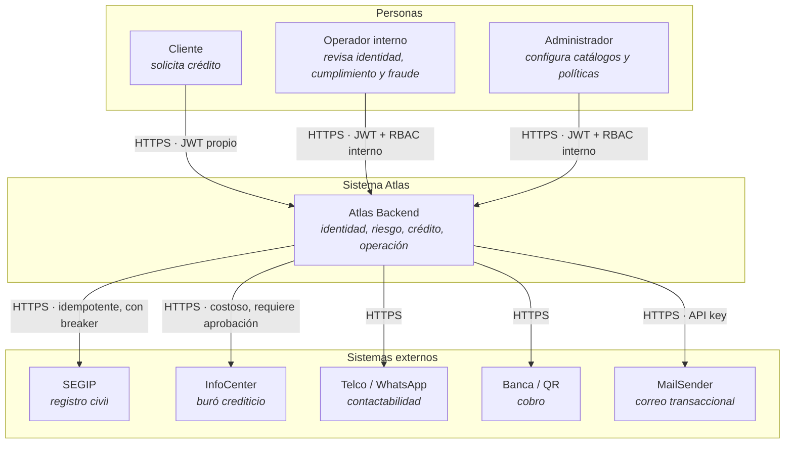
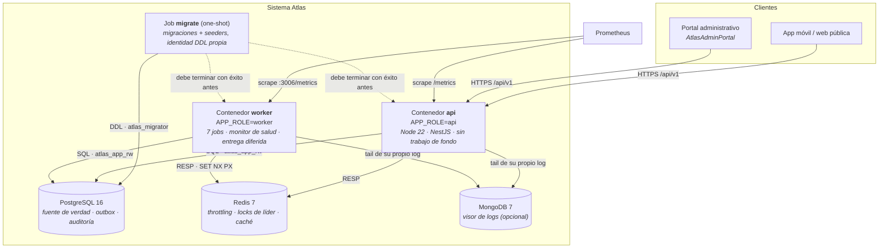
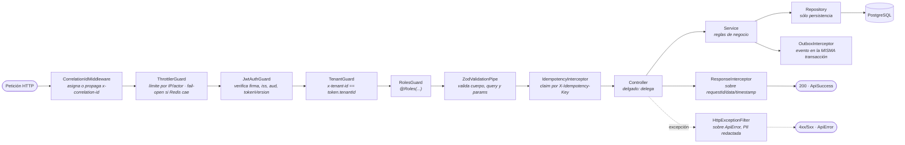
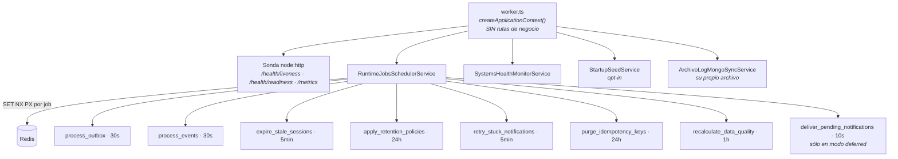
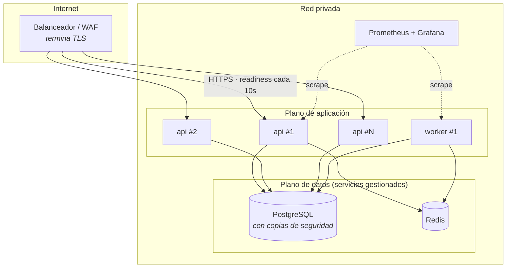

# Arquitectura C4

> Los cuatro niveles del modelo C4 aplicados al sistema **real**. Cada elemento tiene nombre,
> responsabilidad y un archivo del repositorio detrás; los límites de confianza y los protocolos son
> explícitos.
>
> Fuente de verdad de la estructura: [workspace.dsl](../../structurizr/workspace.dsl) (Structurizr).
> Los diagramas de esta página son Mermaid, que es lo que se renderiza dentro del portal.

---

## Nivel 1 · Contexto del sistema

Quién usa Atlas y con qué habla.

**Límite de confianza.** Todo lo que entra por HTTPS desde una persona es no confiable: se valida con
Zod, se autentica con JWT (`iss`/`aud` verificados) y se autoriza por rol **y** por tenant
(`TenantGuard` cruza `x-tenant-id` contra el token). Todo lo que sale hacia un proveedor externo pasa
por circuit breaker, idempotencia y auditoría, y en producción un proveedor en modo simulado queda
bloqueado en vez de devolver datos fabricados.

---

## Nivel 2 · Contenedores

Qué unidades desplegables componen el sistema y cómo se comunican.

| Contenedor | Responsabilidad | Entrypoint | Puerto |
|---|---|---|---|
| `api` | Atender HTTP de negocio. **No** ejecuta trabajo de fondo | `node dist/src/main.js` | `APP_PORT` (público) |
| `worker` | Ejecutar el trabajo de fondo. **No** monta rutas de negocio | `node dist/src/worker.js` | `WORKER_PROBE_PORT` (interno) |
| `migrate` | Aplicar migraciones y seeders. Corre y sale | `node dist/src/database/migrate.js up` | — |

Los tres salen de **la misma imagen**: comparten el árbol de dependencias completo, así que dos
imágenes serían dos builds, dos escaneos y dos oportunidades de divergir. Ver
[ADR-0006](../adr/0006-separacion-de-roles-api-worker.md).

**Nota sobre `log-sync`.** Corre en `api` **y** en `worker`, no sólo en el worker: sincroniza el
archivo que escribe **su propio** proceso. Moverlo al worker dejaría los logs de la API sin
sincronizar. Es la excepción deliberada al reparto de roles.

---

## Nivel 3 · Componentes del contenedor `api`

El recorrido de una petición dentro del proceso.

El orden importa y es el que impone `app.module.ts`: primero se decide **si la petición entra**
(throttling, autenticación, tenant, rol), después **si los datos son válidos** (Zod), después **si ya
se ejecutó** (idempotencia), y sólo entonces se toca el dominio. Un fallo en cualquier punto sale por
el mismo filtro global con el mismo sobre.

---

## Nivel 3-bis · Componentes del contenedor `worker`

Cada tanda toma un lock de líder en Redis antes de ejecutarse: con N réplicas, sólo una corre. El
lock **no se libera al terminar** — expira solo, así que su TTL define además la cadencia mínima real
aunque la instancia líder muera a mitad de job.

---

## Nivel 4 · Despliegue

Reglas de despliegue que el diagrama hace visibles:

- El worker **no** cuelga del balanceador. Su puerto vive sólo en la red privada porque expone
  `/metrics` sin autenticación.
- `SHUTDOWN_DRAIN_MS` debe superar el intervalo del readiness probe del balanceador: durante el
  drenado, readiness responde 503 y el balanceador retira la instancia **antes** de que se cierre.
- PostgreSQL y Redis son servicios gestionados, no contenedores efímeros. `docker-compose.prod.yml`
  no los declara a propósito.

---

## Consistencia con Graphify

Los diagramas de esta página y el grafo describen el mismo sistema. Las dos diferencias conocidas,
declaradas en vez de tapadas:

1. **El trabajo de fondo no aparece en el grafo** con la conectividad que muestra el nivel 3-bis: el
   planificador llama a sus jobs a través de un array de closures, que el análisis AST no resuelve.
2. **Los contenedores no existen en el grafo**, que es un grafo de código. La correspondencia
   rol ↔ proceso está en [background-processing.md](background-processing.md).

Detalle completo del contraste en [graphify-audit.md](../reports/graphify-audit.md) §6.
