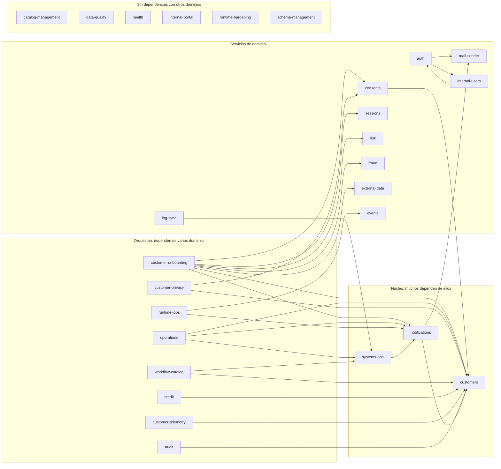

# Mapa de dependencias entre módulos

> Derivado del grafo real (`graphify-out/graph.json`, commit `c518697`), no de la intención de
> diseño. Metodología y cifras completas en
> [graphify-audit.md](../reports/graphify-audit.md).

Una arista `A → B` significa que algún archivo de `src/modules/A/` importa o llama a algo de
`src/modules/B/`. **32 aristas dirigidas entre 27 módulos.**

---

## 1. Grafo

---

## 2. Acoplamiento por módulo

`fan-in` = cuántos módulos dependen de él (**impacto** de cambiarlo).
`fan-out` = de cuántos módulos depende (**fragilidad** ante cambios ajenos).

| Módulo | fan-in | fan-out | Perfil |
|---|---:|---:|---|
| `customers` | 12 | 0 | **Eje del dominio.** Máximo impacto, cero fragilidad |
| `notifications` | 5 | 2 | Núcleo con dependencias propias |
| `systems-ops` | 3 | 1 | Catálogo y salud del propio backend |
| `auth` | 2 | 2 | Equilibrado |
| `consents` | 2 | 1 | |
| `mail-sender` | 2 | 1 | Adaptador de correo |
| `events`, `fraud`, `internal-users`, `risk`, `sessions` | 1 | 1 | |
| `external-data` | 1 | 0 | Frontera con proveedores externos |
| `customer-onboarding` | 0 | 7 | **Máximo orquestador.** Cero impacto, máxima fragilidad |
| `operations` | 0 | 3 | |
| `customer-privacy`, `runtime-jobs`, `workflow-catalog` | 0 | 2 | |
| `audit`, `credit`, `customer-telemetry`, `log-sync` | 0 | 1 | |
| `catalog-management`, `data-quality`, `health`, `internal-portal`, `runtime-hardening`, `schema-management` | 0 | 0 | Autónomos |

### Cómo leer los extremos

**`customers` (12 / 0).** Es el punto donde un cambio incompatible se propaga más lejos. Sus tipos
públicos y su repositorio deben tratarse como un contrato interno: cambiarlos es un cambio de API,
aunque no se note en ninguna ruta HTTP.

**`customer-onboarding` (0 / 7).** Es el módulo que más se rompe cuando algo ajeno cambia, y a la vez
el que nadie más consume. La forma correcta de protegerlo no es reducir su fan-out —orquestar es
literalmente su trabajo— sino que el recorrido que orquesta esté fijado como dato verificable, que es
lo que hace [workflow-catalog](../endpoints/workflow-catalog.md) con su endpoint de consistencia.

**Los seis autónomos.** No están aislados: todos dependen de `src/common/` y `src/database/` y todos
exponen endpoints montados en `app.module.ts`. Lo que dice la ausencia de aristas es que **no
consumen lógica de negocio de nadie**, que es lo deseable para infraestructura transversal
(`runtime-hardening`, `health`) y para los que gobiernan catálogos que nadie más debe tocar
(`schema-management`, `catalog-management`).

---

## 3. Dependencias circulares

**Ninguna.** Ningún par de módulos tiene aristas en ambos sentidos.

Importa más de lo que parece: un ciclo obligaría a `forwardRef`, rompería el orden de inicialización
de Nest y haría imposible razonar sobre qué se puede probar o desplegar por separado. El repositorio
lo prohíbe por regla (`.claude/rules/10-typescript-backend.md`); el grafo confirma que se cumple.

---

## 4. La capa transversal

Los módulos de dominio no son las piezas más conectadas del sistema. Diez de los doce nodos de mayor
grado del grafo viven en `src/common/` o `src/database/`:

| Pieza | Grado | Qué es |
|---|---:|---|
| `AuthenticatedUser` | 372 | El actor autenticado: lo recibe casi todo handler |
| `models/index.ts` | 366 | Barril de los 132 modelos Sequelize |
| `ApiResponse` | 258 | El sobre que envuelve **toda** respuesta 2xx |
| `CurrentUser` | 171 | Decorador de extracción del actor |
| `domain-schemas.ts` | 157 | Mapa tabla → esquema de PostgreSQL |
| `tenantIdFromHeader()` | 155 | Parseo de `x-tenant-id` (deuda ATLAS-SEC-002) |
| `Roles()` | 148 | Autorización por rol |

Que la centralidad esté aquí y no en un módulo de dominio es la señal de que la separación por capas
se sostiene: lo compartido está en la capa compartida, y ningún dominio se ha convertido en cajón de
sastre.

---

## 5. Qué invalida este documento

Cualquiera de estos cambios exige regenerar el análisis con `graphify update .` y actualizar la
tabla:

- Un módulo nuevo en `src/modules/`.
- Un import entre dos módulos que antes no se conocían.
- La aparición de un `forwardRef` (que además sería una violación de las reglas del proyecto).
