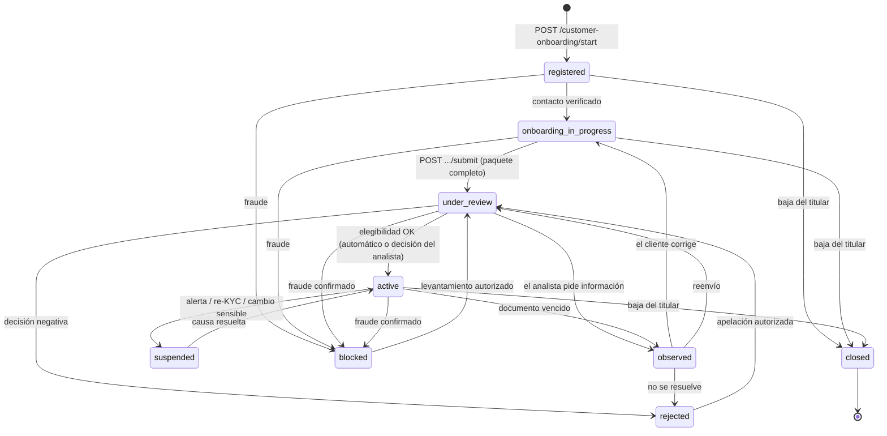
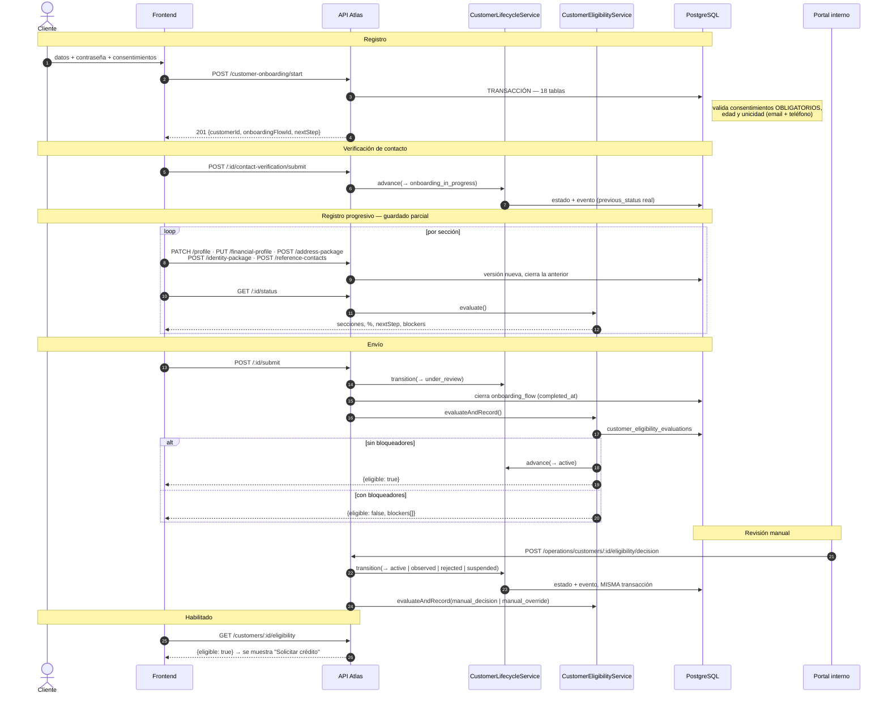

# Atlas — Flujo de onboarding y habilitación crediticia (estado corregido)

**Documento de referencia para el desarrollo del frontend.**
Fecha: 2026-07-27 · Rama: `plan-10-10-docs-kms-refactors`
Antecedente: [`onboarding-habilitacion-credito.md`](./onboarding-habilitacion-credito.md) (diagnóstico previo).

Este documento describe el flujo **tal como quedó implementado** tras corregir las brechas del diagnóstico. Todo lo que aparece aquí como IMPLEMENTADO existe en el código y está cubierto por tests; lo que sigue pendiente está marcado explícitamente y separado al final.

---

## 1. Qué cambió, en una página

| #                | Problema diagnosticado                                                                                                                                                                                   | Estado ahora                                                                                                                                                                               |
| ---------------- | -------------------------------------------------------------------------------------------------------------------------------------------------------------------------------------------------------- | ------------------------------------------------------------------------------------------------------------------------------------------------------------------------------------------ |
| **H1**           | La decisión del analista escribía el evento de historial con `previousStatus: null` y **nunca** actualizaba `customers.lifecycle_status`. Estado e historial divergían desde la primera decisión manual. | **Corregido.** La transición la aplica `CustomerLifecycleService`, que valida contra la máquina de estados y escribe estado + evento con el estado anterior real, en la misma transacción. |
| **H2**           | Solo existía índice único por email. Dos registros concurrentes con el mismo teléfono creaban **dos clientes**.                                                                                          | **Corregido.** `ux_customers_tenant_phone_hash` (índice único parcial) en la migración `20260728090000`.                                                                                   |
| **H3**           | `GET /customers/:id/me` devolvía `onboarding: null` fijo, y `nextStep` ramificaba sobre estados que ningún código escribía: un cliente que ya había subido documentos recibía `identity_capture`.        | **Corregido.** `onboarding` se lee de `onboarding_flows`; `nextStep` viene del evaluador de habilitación.                                                                                  |
| **H4**           | `completion_status` se escribía una vez como `in_progress` y no se actualizaba nunca. Sin tasa de conversión ni de abandono.                                                                             | **Corregido.** El envío del paquete cierra el flujo (`completed`, `completed_at`, `total_duration_seconds`).                                                                               |
| **V1**           | La contraseña era opcional: un cliente registrado sin ella quedaba **sin forma de entrar nunca**.                                                                                                        | **Corregido.** Obligatoria en el registro.                                                                                                                                                 |
| **V2**           | Solo se validaban los consentimientos _enviados_, nunca que estuvieran **todos los obligatorios**. Con mandar uno se pasaba el control.                                                                  | **Corregido.** Se contrasta contra los documentos con `requires_explicit_action` vigentes del tenant.                                                                                      |
| **V3**           | Ninguna validación de edad en un backend de originación de crédito.                                                                                                                                      | **Corregido.** 18–100 años, validado en el registro y en la actualización de perfil.                                                                                                       |
| **V4**           | La vigencia del documento de identidad era opcional y **nunca se comprobaba**.                                                                                                                           | **Corregido.** Obligatoria y validada contra la fecha actual.                                                                                                                              |
| **V6**           | Un cliente que entraba con su teléfono recibía siempre `email: null`, así que la recuperación de contraseña quedaba muerta aunque tuviera correo registrado.                                             | **Corregido.** El correo se recupera de `customer_contact_methods` descifrando el sobre.                                                                                                   |
| **Estados**      | `lifecycle_status` era texto libre _nullable_ sin CHECK. Once valores; cuatro leídos por medio backend y escritos por nadie.                                                                             | **Corregido.** Nueve estados canónicos, `NOT NULL` + CHECK en base de datos, máquina de transiciones en código, un único escritor.                                                         |
| **Datos**        | `customer_attribute_values`, `attribute_definitions` y `customer_reference_contacts` estaban migradas con **cero uso**: no había forma de registrar datos económicos ni referencias.                     | **Corregido.** Endpoints, catálogo sembrado y persistencia versionada.                                                                                                                     |
| **Reanudación**  | No existía guardado parcial ni endpoint de progreso: cerrar la app era perder todo.                                                                                                                      | **Corregido.** Guardado parcial por sección + `GET .../status` con avance calculado en el servidor.                                                                                        |
| **Habilitación** | No existía ninguna forma técnica de responder "¿este cliente puede pedir un crédito?".                                                                                                                   | **Corregido.** `CustomerEligibilityService`: 15 condiciones verificables, evidencia persistida por evaluación.                                                                             |
| **OTP** | `request` no llamaba a ningún proveedor y `submit` aceptaba el literal `'123456'`, bloqueado en producción con un 422. El onboarding no podía completarse fuera de desarrollo. | **Corregido.** Código real hasheado en `auth_one_time_codes`, entregado por correo/SMS/WhatsApp. Ver §9.1. |
| **Documentos** | El cliente elegía la ruta del objeto y declaraba su hash; `s3_bucket` quedaba `null` y el backend **nunca veía el archivo**. | **Corregido.** URL prefirmada con ruta impuesta por el servidor + verificación server-side de hash, tamaño y bytes mágicos. Ver §9.2. |
| **Crédito** | Cero tablas, modelos y endpoints: el recorrido terminaba al quedar habilitado. | **Corregido.** Catálogo de productos y ciclo de vida de la solicitud, con reevaluación de elegibilidad en el servidor. Ver §9.3. |
| **Verificación** | El endpoint de SEGIP existía pero **su resultado no llegaba a ninguna parte**: el expediente seguía en `pending_review` para siempre. | **Corregido.** Verificación automática que traduce el veredicto del proveedor al expediente. Ver §9.4. |
| **C9/C10/C13** | Identidad y evidencia se creaban en `pending_review` **sin camino de salida** y las listas restrictivas no se consultaban: nadie podía llegar a ser elegible. | **Corregido.** Vía automática (§9.4) y vía humana: resolución en bloque y screening idempotente. Ver §9.5. |
| **Riesgo** | La decisión salía de seis constantes escritas a mano; las tablas de ruleset versionado existían, sembradas, y nadie las leía. | **Corregido.** Motor que evalúa el ruleset activo, con degradación a la heurística si no hay política cargada. Ver §9.7. |
| **Antivirus** | La evidencia se almacenaba sin escanear. | **Corregido.** Escaneo `clamd` sobre el buffer ya descargado, con postura fail-closed configurable. Ver §9.8. |
| **Producto** | `min_monthly_income` estaba en el modelo y no se evaluaba: la elegibilidad era global. | **Corregido.** Capa de elegibilidad por producto en el catálogo y en la solicitud. Ver §9.9. |

**Sigue pendiente:** nada de lo identificado en el diagnóstico. Lo que queda son decisiones de negocio —cargar el catálogo de productos, contratar los proveedores y calibrar el ruleset de riesgo— no de implementación. Ver §9.11.

---

## 2. Máquina de estados del cliente

`customers.lifecycle_status` es ahora `NOT NULL DEFAULT 'registered'` con `CHECK` sobre nueve valores. El **único** componente autorizado a escribirlo es `CustomerLifecycleService` ([customer-lifecycle.service.ts](../../src/modules/customers/application/customer-lifecycle.service.ts)).

| Estado                   | Significado                                                         | El cliente puede                        | El analista puede                    |
| ------------------------ | ------------------------------------------------------------------- | --------------------------------------- | ------------------------------------ |
| `registered`             | Cuenta creada, nada verificado.                                     | Verificar contacto.                     | Bloquear, ver.                       |
| `onboarding_in_progress` | Contacto verificado; cargando datos y documentos.                   | Editar todas las secciones, enviar.     | Bloquear, observar.                  |
| `under_review`           | Paquete enviado; validación automática y/o humana.                  | Solo consultar.                         | Decidir, pedir información, escalar. |
| `observed`               | Falta o hay que corregir algo concreto.                             | Corregir y reenviar.                    | Cerrar/abrir observaciones.          |
| `active`                 | Aprobado y operativo. **Único estado que puede habilitar crédito.** | Consultar productos, solicitar crédito. | Suspender, bloquear, revocar.        |
| `suspended`              | Habilitación suspendida (alerta, re-KYC, cambio sensible).          | Ver el motivo, aportar lo pedido.       | Reactivar, escalar.                  |
| `rejected`               | Rechazado por riesgo o cumplimiento.                                | Ver el motivo.                          | Reabrir con justificación.           |
| `blocked`                | Bloqueado por fraude o cumplimiento.                                | Nada operativo.                         | Levantar (vuelve a revisión).        |
| `closed`                 | Baja del titular. **Terminal.**                                     | Nada; no puede iniciar sesión.          | Nada.                                |



**Garantías que la máquina impone (con test de regresión cada una):**

- `closed` no tiene salidas.
- No existe `blocked → active` ni `rejected → active` directos: levantar un bloqueo obliga a volver a evaluar.
- El único camino a `active` durante el onboarding pasa por `under_review`.
- Una transición ilegal responde `422 INVALID_STATUS_TRANSITION: <origen> -> <destino>`.
- Repetir el estado actual es idempotente: no escribe estado ni ensucia el historial.

**Valores heredados.** La migración normaliza los datos existentes (`pending_identity_review`/`pending_review`/`pending_fraud_review` → `under_review`; `pending_more_information` → `observed`; `approved`/`approved_for_next_step` → `active`; `NULL`/desconocido → `registered`). En código, `normalizeLifecycleStatus()` hace la misma traducción por si un despliegue mixto lee un valor viejo — y todo lo desconocido cae al estado más restrictivo, nunca a uno que habilite de más.

---

## 3. Recorrido del cliente, paso a paso

### Paso 0 — Legales

`GET /consent-documents/active?language=es` · público.

El frontend debe marcar como **obligatorios** los documentos con `requiresExplicitAction: true`: el backend ahora rechaza el registro si falta alguno.

### Paso 1 — Registro

`POST /customer-onboarding/start` · público · 10 req/min por IP · headers `x-tenant-id` + `x-idempotency-key`.

Cambios respecto de antes:

- **`password` es obligatoria** (mínimo 10 caracteres). Omitirla ya no es posible.
- **`birthDate`, si se envía, valida edad** (18–100).
- **Se exigen todos los consentimientos obligatorios** del tenant, no solo los que el cliente decida mandar.

Errores: `409 CUSTOMER_ALREADY_EXISTS` · `422 REQUIRED_CONSENT_MISSING: <ids>` · `400` validación.
Estado: `∅ → registered`.

### Paso 2 — Verificación de contacto

`POST /customer-onboarding/:customerId/contact-verification/request` → `202`
`POST /customer-onboarding/:customerId/contact-verification/submit` → `200`

Al verificarse, el cliente pasa a `onboarding_in_progress`: **es el evento que abre el resto del proceso** (antes verificar no cambiaba nada). Respuesta: `nextStep: 'personal_data'`.

> **Pendiente bloqueante:** no hay proveedor de OTP conectado. En producción `submit` responde `422 CONTACT_VERIFICATION_OTP_PROVIDER_NOT_CONFIGURED`. Ver §9.1.

Si el contacto está mal escrito, el cliente ahora puede corregirlo con `POST /customer-onboarding/:customerId/contact-methods` (antes era un callejón sin salida).

### Paso 3 — Sesión

`POST /auth/login` → tokens · `GET /auth/me` → **nuevo**: devuelve `{ actorType, role, tenantId, customerId }`.

El frontend ya no necesita decodificar el JWT para conocer su propio `customerId`.

Recuperación de contraseña: `POST /auth/password-reset/request` funciona ahora también cuando el cliente escribe su **teléfono**, siempre que tenga un correo registrado.

### Paso 4 — Registro progresivo (guardado parcial)

Todos estos endpoints **persisten lo que llega, campo a campo**, validando formato y no completitud. Son la base del autoguardado por sección.

| Endpoint                                                   | Qué guarda                                                                                          | Tablas                                                                                |
| ---------------------------------------------------------- | --------------------------------------------------------------------------------------------------- | ------------------------------------------------------------------------------------- |
| `PATCH /customer-onboarding/:customerId/profile`           | Nombre, apellidos, fecha de nacimiento, género, idioma, opt-in comercial.                           | `customer_profile_versions` (versión nueva + cierre de la anterior)                   |
| `PUT /customer-onboarding/:customerId/financial-profile`   | Situación laboral, empleador, antigüedad, ingresos, egresos, actividad económica, origen de fondos. | `customer_attribute_values` (append-only, cierra la vigencia del valor anterior)      |
| `POST /customer-onboarding/:customerId/address-package`    | Domicilio declarado + GPS.                                                                          | `customer_addresses`, `customer_address_versions`, `address_gps_observations`         |
| `POST /customer-onboarding/:customerId/identity-package`   | Documento de identidad + evidencia.                                                                 | `customer_identity_documents`, `evidence_documents`, `identity_verification_attempts` |
| `POST /customer-onboarding/:customerId/reference-contacts` | Referencias personales/comerciales.                                                                 | `customer_reference_contacts`                                                         |

**Nada se sobrescribe.** El perfil se versiona (`valid_until` + `supersedes_version_id`); los atributos económicos también. Un dato corregido nunca borra al anterior — que es exactamente lo que hace falta cuando alguien pregunta, dos años después, qué ingreso declaró el cliente el día que se le aprobó el crédito.

Los cinco endpoints rechazan la edición con `422 PROFILE_NOT_EDITABLE_IN_STATUS: <estado>` cuando el cliente ya no está en un estado editable (`registered`, `onboarding_in_progress`, `observed`).

**Privacidad:** nombre y teléfono de las referencias se guardan hasheados y cifrados con sobre —son datos de un tercero—, y `consentBasis` es obligatorio y de catálogo cerrado. La auditoría de perfil económico registra solo los **códigos** de atributo, nunca los importes.

### Paso 5 — Consultar el avance

`GET /customer-onboarding/:customerId/status`

```jsonc
{
  "customerId": "42",
  "lifecycleStatus": "onboarding_in_progress",
  "creditEligibilityStatus": null,
  "onboarding": {
    "onboardingFlowId": "77",
    "flowVersion": "v1",
    "completionStatus": "in_progress",
    "startedAt": "2026-07-20T14:02:11.000Z",
    "completedAt": null,
    "abandonedAt": null,
  },
  "completionPercentage": 66,
  "sections": [
    { "code": "contact_verification", "status": "completed", "missingFields": [] },
    { "code": "personal_data", "status": "completed", "missingFields": [] },
    { "code": "financial_profile", "status": "in_progress", "missingFields": ["monthly_income_declared"] },
    { "code": "address", "status": "completed", "missingFields": [] },
    { "code": "identity_documents", "status": "pending", "missingFields": ["identityDocument"] },
    { "code": "reference_contacts", "status": "pending", "missingFields": ["referenceContacts"] },
  ],
  "canSubmit": false,
  "nextStep": "financial_profile",
  "blockers": [{ "code": "FINANCIAL_PROFILE_INCOMPLETE", "fields": ["monthly_income_declared"] }],
}
```

**El porcentaje y el `nextStep` los calcula el servidor, no la app.** Si el frontend los derivara, dos versiones de la app mostrarían avances distintos con los mismos datos, y cada cambio de reglas de negocio exigiría desplegar la app.

Al abrir la sesión, el frontend llama a este endpoint y lleva al cliente a `nextStep`. Es el único lugar donde se decide dónde retomar.

`nextStep` puede ser: uno de los seis códigos de sección · `awaiting_review` · `resolve_observations` · `complete` · `blocked`.

### Paso 6 — Enviar a revisión

`POST /customer-onboarding/:customerId/submit` · body `{ "acknowledgement": true }` · header `x-idempotency-key`.

**Este es el único punto del flujo donde se valida completitud.** En una sola transacción:

1. verifica que todas las secciones estén completas (`422 ONBOARDING_INCOMPLETE: <secciones>` si no);
2. transiciona el cliente a `under_review`;
3. **cierra el flujo de onboarding** (`completion_status: 'completed'`, `completed_at`, `total_duration_seconds`);
4. dispara una evaluación de elegibilidad que puede promover a `active` automáticamente.

Reenviar un paquete ya enviado responde `422 ONBOARDING_ALREADY_SUBMITTED`.

### Paso 7 — Observaciones

`GET /customer-onboarding/:customerId/observations`

Devuelve incidencias de calidad de datos y casos de revisión abiertos, más los bloqueadores vigentes. **No expone las notas internas del analista**, que pueden contener criterio de riesgo reservado (hay un test que lo verifica explícitamente).

### Paso 8 — Habilitación

`GET /customers/:customerId/eligibility`

```jsonc
{
  "eligible": false,
  "lifecycleStatus": "under_review",
  "ruleVersion": "eligibility-v1",
  "evaluatedAt": "2026-07-27T18:44:02.000Z",
  "completionPercentage": 100,
  "canSubmit": true,
  "nextStep": "awaiting_review",
  "sections": [/* ... */],
  "blockers": [
    { "code": "IDENTITY_NOT_VERIFIED", "detail": "pending_review" },
    { "code": "RISK_NOT_APPROVED", "detail": "manual_review_required" },
  ],
}
```

**Cada consulta deja evidencia** en `customer_eligibility_evaluations`: resultado, bloqueadores, versión de la regla, hash de integridad de los insumos, actor y origen de la decisión. Ante "¿por qué se habilitó a este cliente el 12 de agosto?", la respuesta es una fila.

---

## 4. La regla de habilitación

Implementada en [`customer-eligibility.evaluator.ts`](../../src/modules/customers/application/customer-eligibility.evaluator.ts) (lógica pura, sin dependencias de infraestructura) y orquestada por [`customer-eligibility.service.ts`](../../src/modules/customers/application/customer-eligibility.service.ts).

| #   | Condición                                                    | Código de bloqueo                                         |
| --- | ------------------------------------------------------------ | --------------------------------------------------------- |
| C1  | Estado del cliente = `active`                                | `ACCOUNT_NOT_ACTIVE`                                      |
| C2  | Tiene credenciales de acceso                                 | `NO_CREDENTIALS`                                          |
| C3  | Al menos un contacto verificado                              | `CONTACT_NOT_VERIFIED`                                    |
| C4  | Nombre, apellido y fecha de nacimiento válidos (edad 18–100) | `PROFILE_INCOMPLETE` (+ `fields`)                         |
| C5  | Seis atributos económicos obligatorios presentes             | `FINANCIAL_PROFILE_INCOMPLETE` (+ `fields`)               |
| C6  | Domicilio con versión vigente                                | `ADDRESS_MISSING`                                         |
| C7  | Al menos 2 referencias personales                            | `REFERENCES_INSUFFICIENT`                                 |
| C8  | Documento de identidad presente y vigente                    | `IDENTITY_DOCUMENT_MISSING` / `IDENTITY_DOCUMENT_EXPIRED` |
| C9  | Verificación de identidad con resultado `verified`           | `IDENTITY_NOT_VERIFIED`                                   |
| C10 | Ninguna revisión de evidencia sin resolver                   | `EVIDENCE_PENDING_REVIEW`                                 |
| C11 | Todos los consentimientos obligatorios vigentes              | `CONSENT_MISSING` (+ `fields`)                            |
| C12 | Ninguna observación abierta                                  | `OPEN_OBSERVATIONS`                                       |
| C13 | Ninguna coincidencia en listas restrictivas sin descartar    | `COMPLIANCE_MATCH_PENDING`                                |
| C14 | Última evaluación de riesgo aprobada y con menos de 90 días  | `RISK_NOT_APPROVED` / `RISK_ASSESSMENT_STALE`             |
| C15 | Ningún caso de fraude abierto                                | `FRAUD_CASE_OPEN`                                         |

```
habilitado(cliente) := C1 ∧ C2 ∧ … ∧ C15
```

**La regla nunca corta en el primer bloqueador.** Devuelve la lista completa para que el frontend pueda decirle al cliente todo lo que le falta de una sola vez, en vez de una cosa por intento.

### Habilitación automática

Ocurre **solo desde `under_review`** y solo cuando lo único que falta es el estado (es decir, `ACCOUNT_NOT_ACTIVE` es el único bloqueador). Un cliente que todavía está cargando datos no salta a habilitado porque en ese instante no le falte nada, y uno bloqueado o rechazado no se rehabilita solo. Cada una de estas restricciones tiene su test.

### Decisión administrativa

`POST /operations/customers/:customerId/eligibility/decision` · roles internos.

`{ decision: 'approve' | 'reject' | 'observe' | 'suspend' | 'reinstate', reasonCode, notes? }`

- Toda decisión negativa **exige nota**.
- La transición pasa por la máquina de estados: una transición ilegal se rechaza, no se fuerza.
- **Aprobar con bloqueadores pendientes se registra como excepción autorizada** (`decision_source = 'manual_override'`), con la lista exacta de bloqueadores omitidos escrita en las notas. Una excepción que no se distingue de una aprobación normal es una excepción que nadie audita.

---

## 5. Diagrama de secuencia



---

## 6. Contrato para el frontend

### Pantallas

| #   | Pantalla              | Endpoint                                       | Acceso            |
| --- | --------------------- | ---------------------------------------------- | ----------------- |
| 1   | Legales               | `GET /consent-documents/active`                | público           |
| 2   | Registro              | `POST /customer-onboarding/start`              | público           |
| 3   | Verificar contacto    | `.../contact-verification/request` \| `submit` | `registered`      |
| 4   | Login (+ PIN)         | `POST /auth/login`, `/auth/login/pin`          | público           |
| 5   | Recuperar contraseña  | `/auth/password-reset/*`                       | público           |
| 6   | **Hub de onboarding** | `GET /customer-onboarding/:id/status`          | autenticado       |
| 7   | Datos personales      | `PATCH .../profile`                            | editable          |
| 8   | Actividad económica   | `PUT .../financial-profile`                    | editable          |
| 9   | Domicilio             | `POST .../address-package`                     | editable          |
| 10  | Documentos            | `POST .../identity-package`                    | editable          |
| 11  | Referencias           | `POST .../reference-contacts`                  | editable          |
| 12  | Revisión y envío      | `POST .../submit`                              | `canSubmit: true` |
| 13  | En revisión           | `GET .../status` (polling)                     | `under_review`    |
| 14  | Observaciones         | `GET .../observations`                         | `observed`        |
| 15  | Perfil habilitado     | `GET /customers/:id/eligibility`               | `active`          |

### Visibilidad del botón "Solicitar crédito"

| Estado                               | ¿Editar?                      | Botón                                       |
| ------------------------------------ | ----------------------------- | ------------------------------------------- |
| `registered`                         | solo verificación de contacto | oculto                                      |
| `onboarding_in_progress`             | sí                            | oculto                                      |
| `under_review`                       | no                            | oculto                                      |
| `observed`                           | solo lo observado             | oculto                                      |
| `active` + `eligible: true`          | perfil                        | **visible**                                 |
| `active` + `eligible: false`         | perfil                        | visible **deshabilitado**, con `blockers[]` |
| `suspended` / `rejected` / `blocked` | no                            | oculto                                      |

> Ocultar el botón es experiencia de usuario. **La seguridad es que el endpoint de creación de solicitud vuelva a evaluar la regla antes de escribir nada** — así se diseñará cuando exista el dominio de crédito (§9.3).

### Códigos de error

| Código                                                    | HTTP | Acción del frontend                                |
| --------------------------------------------------------- | ---- | -------------------------------------------------- |
| `CUSTOMER_ALREADY_EXISTS`                                 | 409  | Ofrecer login o recuperación.                      |
| `REQUIRED_CONSENT_MISSING: <ids>`                         | 422  | Volver a legales, resaltar los que faltan.         |
| `PROFILE_NOT_EDITABLE_IN_STATUS: <estado>`                | 422  | Modo solo lectura; ir a `status`.                  |
| `ONBOARDING_INCOMPLETE: <secciones>`                      | 422  | Llevar a la primera sección listada.               |
| `ONBOARDING_ALREADY_SUBMITTED`                            | 422  | Ir a "En revisión".                                |
| `INVALID_STATUS_TRANSITION: a -> b`                       | 422  | Refrescar `status`: el estado cambió en paralelo.  |
| `ATTRIBUTE_CATALOG_NOT_SEEDED`                            | 422  | Error de plataforma; reportar, no reintentar.      |
| `REFERENCE_ALREADY_REGISTERED`                            | 409  | Marcar duplicado en el formulario.                 |
| `REFERENCE_CANNOT_BE_THE_CUSTOMER`                        | 422  | Pedir un teléfono distinto al propio.              |
| `REFERENCE_LIMIT_EXCEEDED: max=5`                         | 422  | Deshabilitar "agregar".                            |
| `CONTACT_ALREADY_REGISTERED`                              | 409  | El contacto ya existe.                             |
| `CONTACT_VERIFICATION_OTP_PROVIDER_NOT_CONFIGURED`        | 422  | Pantalla de servicio no disponible, sin reintento. |
| `VERIFICATION_RATE_LIMITED`                               | 409  | Temporizador de 30 s.                              |
| `INVALID_VERIFICATION_CODE` / `VERIFICATION_CODE_EXPIRED` | 401  | Reintentar / reenviar.                             |

### Idempotencia

`POST /customer-onboarding/start`, `.../submit`, los paquetes de identidad y dirección y las evaluaciones de riesgo exigen `x-idempotency-key`. **Ante un reintento hay que reusar la misma clave**, nunca generar una nueva.

---

## 7. Matriz de endpoints del flujo

| Método          | Ruta                                                                 | Estado                          | Roles              |
| --------------- | -------------------------------------------------------------------- | ------------------------------- | ------------------ |
| GET             | `/consent-documents/active`                                          | existente                       | público            |
| POST            | `/customer-onboarding/start`                                         | **modificado** (V1,V2,V3)       | público            |
| POST            | `/customer-onboarding/:id/contact-verification/request` \| `submit`  | **modificado** (transición)     | cliente + internos |
| POST            | `/customer-onboarding/:id/identity-package`                          | **modificado** (V4, transición) | cliente + internos |
| POST            | `/customer-onboarding/:id/address-package`                           | **modificado** (transición)     | cliente + internos |
| PATCH           | `/customer-onboarding/:id/profile`                                   | **nuevo**                       | cliente + internos |
| PUT             | `/customer-onboarding/:id/financial-profile`                         | **nuevo**                       | cliente + internos |
| GET/POST/DELETE | `/customer-onboarding/:id/reference-contacts[/:refId]`               | **nuevo**                       | cliente + internos |
| POST            | `/customer-onboarding/:id/contact-methods`                           | **nuevo**                       | cliente + internos |
| POST            | `/customer-onboarding/:id/documents/upload-url`                      | **nuevo**                       | cliente + internos |
| POST            | `/customer-onboarding/:id/identity-verification`                     | **nuevo**                       | cliente + internos |
| POST            | `/customer-onboarding/jobs/mark-abandoned`                           | **nuevo**                       | admin/system       |
| POST            | `/operations/customers/:id/identity-verification/decision`           | **nuevo**                       | internos           |
| POST            | `/operations/customers/:id/compliance/screening` \| `/clear-matches` | **nuevo**                       | cumplimiento       |
| GET/POST        | `/customers/:id/credit-products` \| `/credit-applications`           | **nuevo**                       | cliente + internos |
| GET/POST/PATCH  | `/operations/credit/*`                                               | **nuevo**                       | internos           |
| GET             | `/customer-onboarding/:id/status`                                    | **nuevo**                       | cliente + internos |
| POST            | `/customer-onboarding/:id/submit`                                    | **nuevo**                       | cliente + internos |
| GET             | `/customer-onboarding/:id/observations`                              | **nuevo**                       | cliente + internos |
| GET             | `/customers/:id/eligibility`                                         | **nuevo**                       | cliente + internos |
| POST            | `/operations/customers/:id/eligibility/decision`                     | **nuevo**                       | internos           |
| GET             | `/auth/me`                                                           | **nuevo**                       | autenticado        |
| POST            | `/auth/password-reset/request`                                       | **modificado** (V6)             | público            |
| GET             | `/customers/:id/me`                                                  | **modificado** (H3)             | cliente + internos |
| POST            | `/operations/manual-review-cases/:caseId/decision`                   | **modificado** (H1)             | internos           |

---

## 8. Cambios de base de datos

Migración [`20260728090000-add-customer-lifecycle-state-machine-and-eligibility.ts`](../../src/database/migrations/20260728090000-add-customer-lifecycle-state-machine-and-eligibility.ts):

1. **Backfill** de `lifecycle_status` al conjunto canónico.
2. `lifecycle_status` → `NOT NULL DEFAULT 'registered'` + `CHECK` sobre los nueve estados.
3. `credit_eligibility_status` + `eligibility_evaluated_at` en `customers` (caché del estado derivado, con CHECK).
4. **`ux_customers_tenant_phone_hash`** — índice único parcial (H2).
5. `ix_customers_tenant_lifecycle_status` — para el listado por estado del portal interno.
6. **`customer_eligibility_evaluations`** — evidencia append-only de cada evaluación.
7. `ux_evidence_documents_customer_hash` — impide registrar el mismo archivo dos veces.

Seeder [`20260728091000-seed-customer-financial-attribute-definitions.ts`](../../src/database/seeders/production/20260728091000-seed-customer-financial-attribute-definitions.ts): ocho definiciones de atributo económico, idempotentes por `attribute_code`.

> `employer_name` y `source_of_funds` quedan marcados `allowed_for_credit_decision = false`. El empleador correlaciona con sector, zona y origen social: usarlo como variable de decisión es un proxy discriminatorio. El origen de fondos se recoge por exigencia de prevención de lavado, no para el score.

**El índice único de teléfono se crea sin tolerancia a fallo.** Si la base tiene duplicados preexistentes, la migración se detiene con la clave conflictiva. Es lo correcto: crear la constraint "cuando se pueda" dejaría sin garantía justo a las instalaciones que más la necesitan.

---

## 9. Segunda tanda: lo que estaba bloqueado

### 9.1 OTP real — **producción desbloqueada**

`requestContactVerification` registraba el intento sin llamar a ningún proveedor, y `submit` aceptaba el literal `'123456'` (bloqueado en producción con un 422 tras una auditoría previa, lo que dejaba el onboarding inutilizable fuera de desarrollo).

**Ahora** ([`contact-verification-code.service.ts`](../../src/modules/customer-onboarding/application/contact-verification-code.service.ts)):

- El código se genera con `randomInt` y **solo se persiste su hash SHA-256** en `auth_one_time_codes`, igual que el PIN de login y el código de reset.
- Vence según `AUTH_ONE_TIME_CODE_TTL_MINUTES`, se consume al primer uso correcto y agota intentos según `AUTH_ONE_TIME_CODE_MAX_ATTEMPTS` (tras lo cual ni el código correcto sirve).
- Un propósito por tipo de contacto (`contact_verification_phone` / `_email`): pedir el código del correo ya no invalida el del teléfono.
- La entrega usa los adaptadores que `notifications` ya tenía y nadie había cableado: MailSender para correo, Twilio/webhook para SMS y WhatsApp.
- Si el canal pedido no tiene proveedor, falla con `503 VERIFICATION_CHANNEL_UNAVAILABLE` **antes** de registrar el intento: un cliente esperando un código que no se envió es indistinguible de un código perdido.
- `deliveryStatus` refleja lo que pasó con el proveedor (`sent` / `delivery_failed`), no un optimismo fijo.

**Configuración:** el correo requiere `MAILSENDER_*`; SMS/WhatsApp, `NOTIFICATION_SMS_PROVIDER` / `NOTIFICATION_WHATSAPP_PROVIDER` y sus credenciales.

### 9.2 Almacenamiento documental — **KYC real desbloqueado**

Antes el cliente elegía la ruta del objeto y declaraba su hash; `s3_bucket` quedaba `null` y **el backend nunca veía el archivo**.

**Ahora** ([`document-storage.service.ts`](../../src/common/storage/document-storage.service.ts), [`s3-signature.util.ts`](../../src/common/storage/s3-signature.util.ts)):

- `POST /customer-onboarding/:customerId/documents/upload-url` devuelve una URL prefirmada. **El servidor impone la ruta** (`tenant/cliente/tipo/uuid`) y firma `Content-Type` y `Content-Length`: subir algo distinto a lo autorizado lo rechaza el almacenamiento.
- Al recibir el paquete de identidad, el backend **descarga cada objeto**, recalcula el SHA-256, contrasta el tamaño y comprueba los **bytes mágicos** contra el tipo declarado. Renombrar un ejecutable a `.jpg` ya no alcanza.
- `s3_bucket` se persiste con el valor real.
- La firma SigV4 se implementó con `node:crypto` en vez de incorporar el SDK de AWS: el repositorio exige un ADR para agregar una librería y de todo el SDK solo hacía falta firmar dos verbos. Funciona contra cualquier almacenamiento compatible con S3 (AWS, MinIO, R2, B2).

**Configuración:** `STORAGE_S3_ENDPOINT`, `STORAGE_S3_BUCKET`, `STORAGE_S3_REGION`, `STORAGE_S3_ACCESS_KEY_ID`, `STORAGE_S3_SECRET_ACCESS_KEY`, `STORAGE_S3_FORCE_PATH_STYLE`, `STORAGE_UPLOAD_URL_TTL_SECONDS`. Sin configurar, los endpoints responden `503 DOCUMENT_STORAGE_NOT_CONFIGURED` en vez de aceptar evidencia inverificable.

**Sigue pendiente:** antivirus. Requiere elegir un motor de escaneo (decisión con costo).

### 9.3 Dominio de crédito — **existe**

Migración [`20260728120000`](../../src/database/migrations/20260728120000-create-credit-products-and-applications.ts): esquema `credit` con `credit_products`, `credit_applications` y `credit_application_events`, más sus CHECK e índices.

| Método   | Ruta                                                      | Rol                |
| -------- | --------------------------------------------------------- | ------------------ |
| GET      | `/customers/:customerId/credit-products`                  | cliente + internos |
| POST     | `/customers/:customerId/credit-applications`              | cliente + internos |
| GET      | `/customers/:customerId/credit-applications`              | cliente + internos |
| GET/POST | `/operations/credit/products`                             | internos           |
| PATCH    | `/operations/credit/products/:productId/status`           | internos           |
| POST     | `/operations/credit/applications/:applicationId/decision` | internos           |
| GET      | `/operations/credit/applications/:applicationId`          | internos           |

Tres decisiones de diseño:

1. **El catálogo es dato, no código.** Montos, plazos, tasas y requisitos son filas que administra negocio. **No hay ningún producto sembrado**: inventar una tasa sería inventar una decisión ajena. El catálogo se carga con `POST /operations/credit/products`, y el producto nace en `draft` — activarlo es una decisión aparte y auditable.
2. **La elegibilidad se reevalúa en el servidor** al crear la solicitud, antes de escribir nada. Un cliente no elegible recibe `422 CUSTOMER_NOT_ELIGIBLE` con la lista de bloqueadores y no se persiste ninguna solicitud. Ocultar el botón en la app es experiencia de usuario; esto es la garantía.
3. **La solicitud guarda la evidencia de por qué se aceptó**: `eligibility_evaluation_id` apunta a la evaluación concreta y `eligibility_snapshot_json` congela su resultado.

Además, `ux_credit_applications_open_per_customer` impide en la base dos solicitudes vivas del mismo cliente; el servicio traduce la violación al mismo `409 CREDIT_APPLICATION_ALREADY_OPEN` que el chequeo previo, gane o pierda la carrera.

### 9.4 Verificación de identidad contra el proveedor externo — **automática**

`POST /customer-onboarding/:customerId/identity-verification`

El endpoint `POST /kyc/segip/verify` ya existía, pero **su resultado no llegaba a ninguna parte**: se guardaba en `data_provider_responses` y el expediente del cliente quedaba intacto en `pending_review`. Este servicio es el puente que faltaba.

Traducción del veredicto del proveedor ([`identity-verification-outcome.ts`](../../src/modules/customer-onboarding/application/identity-verification-outcome.ts), función pura y con test exhaustivo):

| Respuesta del proveedor                                                                    | `final_result`   | Efecto                                                                                                                                |
| ------------------------------------------------------------------------------------------ | ---------------- | ------------------------------------------------------------------------------------------------------------------------------------- |
| `FOUND` sin observaciones                                                                  | `verified`       | Aprueba también la evidencia documental pendiente.                                                                                    |
| `FOUND` con `manualReviewRequired`                                                         | `pending_review` | Se respeta la señal del proveedor en vez de aprobar por el estado a secas.                                                            |
| `PARTIAL_MATCH`                                                                            | `pending_review` | Ni aprueba ni rechaza: es el caso que justifica la revisión humana.                                                                   |
| `NOT_FOUND`                                                                                | `rejected`       | Rechazo real y verificable; el cliente vuelve a `observed`.                                                                           |
| `PROVIDER_UNAVAILABLE` · `DATA_NOT_AVAILABLE` · `FAILED` · `RATE_LIMITED` · `UNAUTHORIZED` | `pending_review` | **No es un rechazo.** Una caída del proveedor no puede castigar al cliente ni cerrar el documento: el reintento sigue siendo posible. |
| Estado desconocido                                                                         | `pending_review` | Un proveedor que empieza a devolver un valor nuevo no habilita clientes por omisión.                                                  |

Garantías adicionales:

- El `documentNumber` viaja en claro porque es lo que el registro necesita, pero **no se persiste** y **no se audita**: se usa para consultar y para comprobar por hash que corresponde al documento ya declarado. Sin esa comprobación se podría verificar la identidad de otra persona y adjuntarla al expediente del cliente (`422 DOCUMENT_NUMBER_MISMATCH`).
- Al proveedor se le envían los datos del **perfil vigente**, no los que mande el cliente en la petición.
- Verificar la identidad **no habilita por sí solo**: reevalúa la regla completa y devuelve los bloqueadores restantes.

**Simulación con el mock.** `AtlasExternalProvidersMock` incorpora el escenario `random`, que sortea el veredicto en **cada request** (60% `happy_path`, 25% `partial_match`, 15% `not_found`). Se resuelve antes de construir la respuesta, así que el cuerpo es idéntico al del escenario fijo equivalente y el backend no puede distinguirlo.

**La aleatoriedad vive en el simulador, no en el backend.** Es deliberado: el backend debe comportarse igual contra el mock que contra el proveedor real, y uno que sortea su propio resultado no prueba nada.

```bash
# global, para toda la sesión
curl -X POST localhost:4010/mock/scenarios/active -H 'content-type: application/json' -d '{"scenario":"random"}'

# o por request, desde el propio endpoint del backend
POST /customer-onboarding/42/identity-verification
{ "documentNumber": "1234567", "scenario": "random" }
```

### 9.5 Condiciones C9, C10 y C13 — **desbloqueadas**

Eran el techo real del flujo: `identity_verification_attempts` y `evidence_reviews` se creaban en `pending_review` **sin camino de salida**, y `watchlist_entries` no se consultaba nunca. Ningún cliente podía llegar a ser elegible por más completo que estuviera su expediente.

| Método | Ruta                                                               | Qué desbloquea                                                                     |
| ------ | ------------------------------------------------------------------ | ---------------------------------------------------------------------------------- |
| POST   | `/operations/customers/:customerId/identity-verification/decision` | **C9 + C10** — resuelve en bloque el intento, el documento y todas sus evidencias. |
| POST   | `/operations/customers/:customerId/compliance/screening`           | **C13** — coteja por hash contra listas del tenant y globales; idempotente.        |
| POST   | `/operations/customers/:customerId/compliance/clear-matches`       | **C13** — descarte auditado de falsos positivos; exige razón y nota.               |

Aprobar la identidad **no habilita por sí solo**: reevalúa la regla completa y devuelve los bloqueadores restantes. Rechazarla lleva al cliente a `observed`. Una coincidencia nueva en listas lo saca del camino automático hacia `under_review`.

### 9.6 Notificaciones y métricas del embudo

- **Evento de dominio por transición.** `CustomerLifecycleService` escribe un `outbox_events` (`customer.lifecycle.<estado>`) en la **misma transacción** que el cambio de estado. Patrón outbox: no puede existir un cambio sin evento ni un evento de un cambio revertido. El orquestador de notificaciones lo consume y avisa al cliente — antes, un cliente observado o rechazado no se enteraba nunca.
- **Job de abandono.** `POST /customer-onboarding/jobs/mark-abandoned` cierra los flujos inactivos (30 días por defecto) con `completion_status = 'abandoned'`. Marca el **flujo**, no al cliente: quien dejó el registro a medias puede volver y retomar. Con esto y el cierre por envío, la tasa de conversión y la de abandono existen por primera vez.

### 9.7 Motor de riesgo por ruleset versionado

`risk.service.ts` decidía con seis constantes escritas a mano: cambiar un umbral era un despliegue. Las tablas `risk_ruleset_versions` y `risk_policy_rules` existían desde el inicio, con reglas ya sembradas, y **nadie las leía**.

Ahora la decisión sale del ruleset activo:

- [`risk-rule-expression.ts`](../../src/modules/risk/application/risk-rule-expression.ts) interpreta el DSL que los seeders ya usaban (`all` / `any` / `not`, con `missing`, `equals`, `in`, `gte`, `gt`, `lte`, `lt`).
- [`risk-ruleset-evaluator.ts`](../../src/modules/risk/application/risk-ruleset-evaluator.ts) resuelve la decisión por **severidad, no por orden de aparición**: basta una regla `BLOCK` para bloquear. Depender del orden de las filas haría que la decisión cambiara al reordenar el catálogo.
- [`risk-policy-decision.service.ts`](../../src/modules/risk/application/risk-policy-decision.service.ts) carga el ruleset vigente y, si no hay ninguno, **degrada a la heurística de arranque** en vez de bloquear el onboarding. El `rulesetVersionCode` que queda persistido en la corrida distingue siempre una decisión de política aprobada de una del motor de arranque.

Tres decisiones del evaluador que evitan fallos silenciosos:

| Situación | Comportamiento | Por qué |
|---|---|---|
| Predicado sobre una feature ausente | **Falso** (salvo `missing: true`) | Si no, "ingreso residual ≤ 0" se dispararía con `undefined` y el sistema bloquearía por falta de datos en vez de pedirlos. |
| Expresión vacía o irreconocible | **No se dispara** | Tratarla como verdadera haría que un error de configuración bloqueara clientes en masa. |
| Regla con acción desconocida | **Revisión manual** | Descartarla en silencio convertiría un error de configuración en una aprobación. |

Los puntajes por dimensión siguen siendo heurísticos y ahora viven en [`risk-heuristic-scoring.ts`](../../src/modules/risk/application/risk-heuristic-scoring.ts): alimentan el desglose explicativo y el nivel de riesgo, **no la decisión**.

### 9.8 Antivirus sobre la evidencia

[`malware-scanner.service.ts`](../../src/common/storage/malware-scanner.service.ts) habla el protocolo `INSTREAM` de `clamd` directamente sobre TCP con `node:net` — mismo criterio que la firma SigV4: el protocolo son tres primitivas y agregar una librería exige un ADR. Funciona contra cualquier `clamd` accesible por TCP.

Se ejecuta al final de la verificación del objeto, sobre el mismo buffer ya descargado: es la comprobación más cara y no tiene sentido pagarla por un archivo que ya falló el hash o el tipo.

**Postura ante fallos:** con el escáner apagado (`MALWARE_SCAN_HOST` vacío) la evidencia se acepta sin escanear — válido solo en desarrollo. Con el escáner **configurado**, un fallo de conexión rechaza la evidencia (`EVIDENCE_SCAN_UNAVAILABLE`) salvo que se apague explícitamente `MALWARE_SCAN_FAIL_CLOSED`. Un antivirus que se cae en silencio es peor que no tenerlo: genera confianza infundada.

### 9.9 Elegibilidad por producto

`credit_products.min_monthly_income` estaba declarado desde que se creó la tabla y no lo evaluaba nadie. [`credit-product-eligibility.ts`](../../src/modules/credit/application/credit-product-eligibility.ts) lo cierra:

- Es una capa **distinta** de la habilitación general: un cliente habilitado puede no alcanzar el umbral de un producto y sí el de otro.
- `GET /customers/:id/credit-products` devuelve `canApply` por producto, combinando ambas capas — el catálogo ya no ofrece todo por igual.
- La creación de la solicitud rechaza con `INSUFFICIENT_DECLARED_INCOME`, `DECLARED_INCOME_MISSING`, `REQUESTED_AMOUNT_OUT_OF_RANGE` o `REQUESTED_TERM_OUT_OF_RANGE`, acumulando todos los bloqueadores en vez de cortar en el primero.
- El ingreso se compara contra lo **declarado**: verificarlo contra un extracto o el buró es una etapa posterior; aquí solo se filtra lo que ni en el papel alcanza.

### 9.10 Verificación encadenada desde el paquete de identidad

`identityPackageSchema` acepta ahora un `documentNumber` **opcional** en claro. Si viene, el backend encadena la verificación externa en el mismo viaje y **no lo persiste**; si no viene, el paquete se guarda igual y la verificación queda como paso explícito.

Es una decisión del frontend, no del backend: hay despliegues donde ese dato no debe salir del dispositivo. El encadenamiento ocurre **fuera de la transacción** — una llamada HTTP dentro de ella mantendría locks abiertos durante toda su latencia — y si el proveedor falla, el paquete ya quedó guardado y la verificación se difiere (`verification.skipped`). Perder el paquete por una caída ajena sería peor.

### 9.11 Lo que sigue pendiente

Nada de lo identificado en el diagnóstico. Quedan decisiones de negocio, no de implementación:

- **Cargar el catálogo de productos** (`POST /operations/credit/products`): el backend impone estructura y coherencia, las condiciones comerciales las define negocio.
- **Contratar y configurar** proveedor de OTP, almacenamiento S3 y `clamd`. Sin ellos los endpoints responden `503` explícito en vez de degradar en silencio.
- **Calibrar el ruleset de riesgo**: el motor ya lo consume; los umbrales son de riesgo, no de ingeniería.

---

## 10. Decisiones fijadas en el código (revisar si el negocio discrepa)

| Decisión                             | Valor adoptado                                                                   | Dónde cambiarlo                            |
| ------------------------------------ | -------------------------------------------------------------------------------- | ------------------------------------------ |
| Edad mínima / máxima                 | 18 / 100 años                                                                    | `customer-eligibility.constants.ts`        |
| Referencias mínimas                  | 2 (máximo 5)                                                                     | `customer-eligibility.constants.ts`        |
| Vigencia de la evaluación de riesgo  | 90 días                                                                          | `customer-eligibility.constants.ts`        |
| Qué consentimientos son obligatorios | los que tengan `requires_explicit_action = true`                                 | dato, por tenant                           |
| Habilitación                         | híbrida: automática desde `under_review`, con decisión manual siempre disponible | `customer-eligibility.service.ts`          |
| Atributos económicos obligatorios    | 6 de 8                                                                           | `customer-eligibility.constants.ts`        |
| Excepción de habilitación            | permitida, registrada como `manual_override` con los bloqueadores omitidos       | `customer-eligibility-decision.service.ts` |

Todos son constantes con nombre en un único archivo por dominio. Cambiar un requisito es cambiar una constante y subir `ELIGIBILITY_RULE_VERSION`, no reescribir lógica — y las evaluaciones históricas siguen explicando por qué se decidió lo que se decidió con la regla de su momento.

---

## 11. Verificación

| Gate                                    | Resultado                                                                   |
| --------------------------------------- | --------------------------------------------------------------------------- |
| `yarn type-check`                       | limpio                                                                      |
| `yarn type-check:tests`                 | limpio                                                                      |
| `yarn lint`                             | 0 errores (151 warnings de complejidad/constructores)                       |
| `yarn format:check`                     | limpio                                                                      |
| `yarn test:coverage --runInBand`        | **263 suites / 2191 tests, gate de cobertura verde**                        |
| `yarn build`                            | limpio                                                                      |
| `yarn check:file-size`                  | OK (el servicio de registro _bajó_ de 623 a 598 líneas)                     |
| `yarn check:domain-schemas`             | 125 modelos OK                                                              |
| `yarn check:domain-schema-layout`       | Onboarding/crédito aplicados; workflow catalog queda pendiente de migración |
| Migración `up → down → up`              | verificada sobre la base real                                               |
| `AtlasExternalProvidersMock` `npm test` | **77 tests, todo en verde**                                                 |

Tests nuevos: máquina de estados y transiciones prohibidas · evaluador de elegibilidad (18 casos) · orquestación y evidencia del motor · decisión administrativa y excepciones · guardas de admisión del registro · estado/envío/observaciones · perfil personal y económico · emisión y verificación del OTP · firma SigV4 y validación de bytes mágicos · creación de solicitud de crédito con reevaluación · resolución de identidad y screening de cumplimiento. Tests actualizados con regresión explícita para H1, H3, H4, V1, V2, V6 y el bypass del código `'123456'`.

**Migraciones aplicadas** (`20260728090000` estados + elegibilidad, `20260728120000` crédito) y catálogo de atributos económicos sembrado con `yarn db:seed:prod`. Reversibilidad verificada con `up → down → up`.
