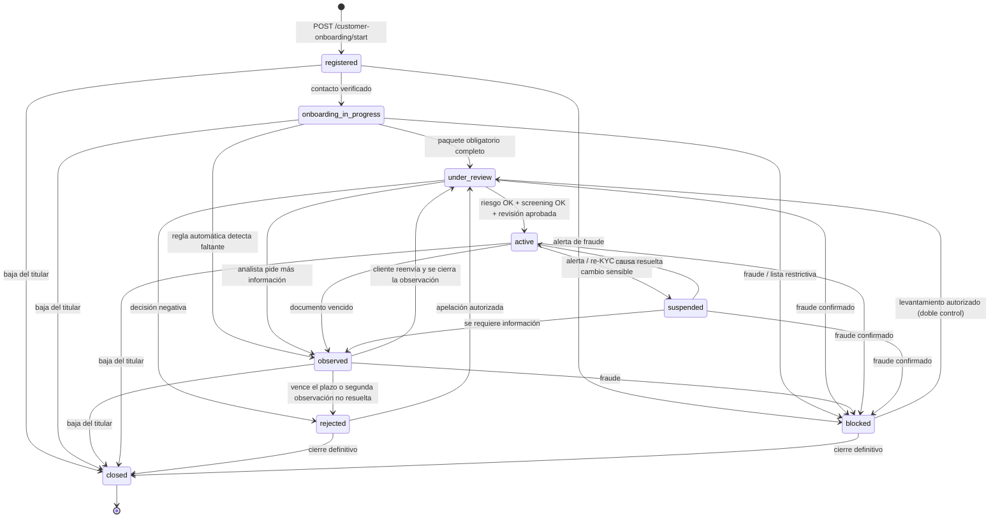
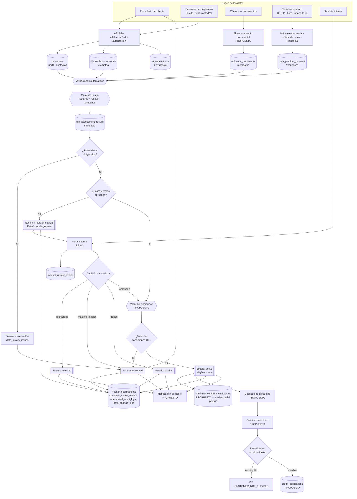

# Atlas — Recorrido del cliente desde el registro hasta la habilitación para crédito

**Documento técnico-funcional de análisis y diseño.**
Fecha: 2026-07-27 · Rama: `plan-10-10-docs-kms-refactors` · Estado: análisis previo a implementación (no se modificó código).

**Convención de clasificación usada en todo el documento:**

| Etiqueta | Significado |
|---|---|
| **EXISTENTE** | Implementado y verificable en el código actual (se cita `archivo:línea`). |
| **PARCIAL** | Implementado a medias: existe el camino pero no cumple su función completa. |
| **FALTANTE** | No existe ni tabla, ni endpoint, ni servicio. |
| **PROPUESTO** | Diseño nuevo que este documento plantea; no existe hoy. |
| **MODIFICAR** | Existe pero está mal, incompleto o inconsistente y debe cambiarse. |
| **DECISIÓN** | Requiere una definición de negocio/Directorio antes de implementar. |

---

## NIVEL 1 — VISIÓN EJECUTIVA

### Objetivo del flujo

Llevar a una persona desde “descargó la app” hasta “el sistema puede evaluar y otorgarle un crédito”, dejando en cada paso **evidencia auditable** de qué datos se recogieron, de dónde vinieron, quién los validó y por qué el cliente quedó habilitado, observado o rechazado.

### Componentes principales (estado real)

| Componente | Estado | Rol en el flujo |
|---|---|---|
| API NestJS + PostgreSQL (Sequelize) | **EXISTENTE** | Núcleo transaccional. Toda escritura de negocio es un endpoint compuesto que toca varias tablas en una transacción. |
| Módulo `auth` (JWT + refresh rotativo + MFA) | **EXISTENTE** | Emite identidad digital del cliente. |
| Módulo `customer-onboarding` (4 endpoints) | **EXISTENTE / PARCIAL** | Registro, verificación de contacto, paquete de identidad, paquete de dirección. |
| Módulo `risk` (motor heurístico v0) | **PARCIAL** | Produce una decisión (`approved_for_next_step` / `manual_review_required`) con puntajes fijos en código, no con un scorecard calibrado. |
| Módulo `operations` (cola de revisión manual) | **PARCIAL** | Un analista decide el caso, pero **la decisión no cambia el estado del cliente**. |
| Módulo `external-data` (SEGIP, InfoCenter, phone-trust, social-trust) | **EXISTENTE** | Verificación contra fuentes externas, con política de costo y kill-switch. |
| Módulo `notifications` (email/SMS/WhatsApp/push) | **EXISTENTE** | Infraestructura de mensajería, **no conectada al onboarding**. |
| Almacenamiento de documentos (S3 u otro) | **FALTANTE** | El backend guarda un `storageKey` que envía el cliente; nadie sube, valida ni escanea el archivo. |
| Productos crediticios y solicitudes de crédito | **FALTANTE** | No existe ninguna tabla, módulo, endpoint ni modelo. Cero. |
| Estado agregado de habilitación | **FALTANTE** | No existe un campo, servicio ni endpoint que responda “¿este cliente puede pedir crédito?”. |

### Recorrido general (lo que hoy funciona de punta a punta)

```
Registro → (contacto verificado*) → paquete de identidad → paquete de dirección
        → evaluación de riesgo → cola de revisión manual → [se corta aquí]
```

`*` La verificación de contacto **está bloqueada en producción por diseño**: no hay proveedor real de OTP conectado (`customer-contact-verification.service.ts:180`). En producción el flujo no puede pasar del primer paso.

### Punto de decisión de habilitación

**No existe.** Hoy el sistema no tiene forma técnica de responder “este cliente está habilitado”. Lo más cercano es `risk_assessment_results.recommended_action = 'approved_for_next_step'`, pero ese valor:
- lo produce un motor con puntajes escritos a mano (`risk.service.ts:78-88`),
- no se refleja en `customers.lifecycle_status`,
- y no bloquea nada porque no hay nada que bloquear (no hay solicitud de crédito).

Este documento propone (§7 y §9.7) un **estado agregado calculado** `credit_eligibility_status` y un servicio único de habilitación, en vez de un booleano que alguien pueda escribir a mano.

### Riesgos principales

1. **El estado del cliente no es una máquina de estados.** `lifecycle_status` es `STRING(40)` *nullable* sin CHECK ni enum en TypeScript, y hoy conviven al menos **11 valores distintos** escritos o leídos por módulos que no se conocen entre sí. Sobre eso no se puede construir una regla de habilitación confiable.
2. **La decisión del analista no cambia el estado del cliente.** `operations.service.ts:155-180` escribe el evento de historial pero nunca hace el `UPDATE` de `customers.lifecycle_status`. El historial y el estado divergen desde la primera decisión manual.
3. **No hay índice único por teléfono.** Solo existe `ux_customers_tenant_email_hash`. Dos registros concurrentes con el mismo teléfono crean dos clientes.
4. **Un cliente puede quedar sin forma de entrar nunca.** La contraseña es opcional en el registro y no hay ningún camino para fijarla después.
5. **No hay guardado parcial estructurado.** No existe endpoint para datos laborales/económicos ni para referencias, aunque las tablas están creadas y vacías de uso.

### Estado actual del proyecto en una línea

La **columna vertebral de identidad, evidencia y auditoría está construida y es sólida**; la **capa de decisión y habilitación no existe**, y el **producto crediticio tampoco**. El frontend de onboarding no puede construirse completo sin cerrar antes las brechas de §7 Fase 0–2.

---

## NIVEL 2 — ARQUITECTURA Y FLUJO

# 1. Diagnóstico del estado actual

## 1.1 Tablas y entidades que participan

### Grupo A — Identidad y cuenta (EXISTENTE, en uso)

| Tabla | Modelo | Rol | Notas de estado |
|---|---|---|---|
| `customers` | `customers.model.ts` | Raíz del cliente. PII hasheada y cifrada. | `lifecycle_status` STRING(40) **nullable, sin CHECK**. |
| `customer_profile_versions` | `customer-profile-versions.model.ts` | Versión vigente del perfil (nombre, fecha de nacimiento, idioma). | Se crea **una sola vez** en el registro; no hay endpoint para versionar. |
| `customer_contact_methods` | `customer-contact-methods.model.ts` | Teléfono y email, hash + cifrado + `last_4`. | `status` pasa a `verified` solo vía OTP. |
| `contact_verification_attempts` | `contact-verification-attempts.model.ts` | Intentos de OTP, con `verification_status` y `failure_reason_code`. | Se crea el intento pero no se envía código. |
| `auth_credentials` | `auth-credentials.model.ts` | Contraseña Argon2id, `token_version`, lockout, `mfa_enabled`. | Único índice: `ux_auth_credentials_actor`. |
| `auth_refresh_tokens` | `auth-refresh-tokens.model.ts` | Refresh con rotación y revocación. | Solo hash del token. |
| `auth_one_time_codes` | `auth-one-time-codes.model.ts` | Códigos de un solo uso (login PIN, reset de contraseña). | **No** se usa para el OTP de contacto del onboarding. |
| `auth_events` | `auth-events.model.ts` | Bitácora de eventos de autenticación y verificación. | |
| `customer_status_events` | `customer-status-events.model.ts` | **Append-only.** Historial de cambios de estado. | Ver hallazgo crítico §7.3. |

### Grupo B — Evidencia documental e identidad verificada (EXISTENTE, en uso)

| Tabla | Rol | Notas |
|---|---|---|
| `customer_identity_documents` | Documento declarado: tipo, hash del número, `last_4`, emisión/vencimiento, punteros a evidencia frente/dorso. | El número **nunca** se guarda en claro. |
| `evidence_documents` | Archivo de evidencia: `s3_key` (= `storageKey` recibido), `mime_type`, `sha256`, tamaño, IP y sesión de subida. | **`s3_bucket` se escribe siempre `null`** (`customer-identity-evidence.repository.ts:58`). |
| `evidence_extractions` | Resultado de OCR/extracción. | Se crea con `{extractionStatus: 'not_executed'}` — no hay OCR. |
| `evidence_reviews` | Revisión humana de la evidencia. | Se crea siempre en `pending_review`; **no hay endpoint para resolverla**. |
| `identity_verification_attempts` | Intento de verificación de identidad. | Se crea siempre con `final_result: 'pending_review'`. |
| `data_provider_requests` / `data_provider_responses` | Llamada a proveedor externo y su respuesta normalizada. | En `identity-package` se crea una respuesta sintética `{status:'pending_manual_or_external_verification'}` sin llamar a nadie. |

### Grupo C — Domicilio y geolocalización (EXISTENTE, en uso)

`customer_addresses` · `customer_address_versions` (versionado con `valid_from`) · `address_gps_observations` (lat/lng, precisión; `match_score_against_declared_address` y `distance_to_declared_meters` se escriben siempre `null`) · `customer_observations` (observación `gps_address_observed`).

### Grupo D — Consentimientos y privacidad (EXISTENTE, en uso)

`consent_documents` · `customer_consents` · `consent_events` (append-only, con IP, fingerprint, canal y user-agent como evidencia) · `privacy_processing_purposes` · `data_subject_requests` · `retention_policies` · `data_classification_policies`.

### Grupo E — Dispositivo, sesión y comportamiento (EXISTENTE, en uso)

`global_device_fingerprints` · `devices` · `customer_device_links` · `device_snapshots` (root, emulador, VPN) · `customer_sessions` · `device_risk_events` · `sim_observations` · `ip_reputation_observations` · `onboarding_flows` · `onboarding_step_events` · `form_field_interaction_events` · `onboarding_behavior_summaries` · `customer_action_logs` · `permission_events` · `customer_activity_summaries`.

### Grupo F — Riesgo y features (PARCIAL)

`feature_definitions` · `feature_computation_runs` · `feature_values` · `feature_snapshots` (con `integrity_hash`) · `feature_lineage_links` · `risk_model_versions` · `risk_ruleset_versions` · `risk_policy_rules` · `risk_assessment_runs` · `risk_assessment_contexts` · `risk_assessment_results` · `risk_rules_fired` · `risk_feature_contributions` · `risk_signal_seeds`.

> El esquema es de calidad productiva (versionado de modelo, linaje, snapshot con hash de integridad). **El motor que lo llena no lo es**: `risk.service.ts:78-88` calcula con seis constantes escritas a mano. El propio código lo documenta como “heurístico v0”.

### Grupo G — Revisión manual y fraude (PARCIAL)

`manual_review_cases` · `manual_review_events` · `fraud_cases` · `fraud_case_events` · `watchlist_entries` · `watchlist_matches` · `data_quality_issues` · `data_quality_rules` · `observation_definitions`.

> `watchlist_entries` / `watchlist_matches` están declaradas en `fraud.repository.ts` y `risk.repository.ts`, pero **el motor de riesgo del onboarding no las consulta**: `createRiskAssessment` solo lee consentimientos, contactos y documentos de identidad (`risk.service.ts:57-61`).

### Grupo H — Tablas creadas y **sin ningún uso en el código** (FALTANTE de wiring)

| Tabla | Modelo existe | Uso en `src/modules/` |
|---|---|---|
| `customer_attribute_values` | Sí | **Ninguno.** Cero referencias. |
| `attribute_definitions` | Sí | Solo en catálogo/metadatos, no en el flujo del cliente. |
| `customer_reference_contacts` | Sí | **Ninguno.** Cero referencias. |
| `customer_context_enrichments` | Sí | Solo `external-data`. |

Esto es directamente relevante: **el modelo para datos laborales/económicos y para referencias personales ya está diseñado y migrado, pero no tiene ni un endpoint ni un servicio.** (§2 pasos 6 y 8.)

### Grupo I — Productos y solicitudes de crédito

**FALTANTE en su totalidad.** No existe tabla, modelo, migración, módulo, servicio ni endpoint. La única mención de “crédito” en el dominio es `attribute_definitions.allowed_for_credit_decision` (una bandera de gobierno de datos) y un seeder de riesgo llamado `seed-bnpl-production-risk-baseline`.

## 1.2 Endpoints que ya soportan el proceso

### Del cliente (rol `customer`)

| Método | Ruta | Estado |
|---|---|---|
| GET | `/consent-documents/active` | **EXISTENTE** — público. |
| POST | `/customer-onboarding/start` | **EXISTENTE** — público, idempotente, transaccional. |
| POST | `/auth/login` · `/auth/login/pin` · `/auth/refresh` · `/auth/logout` | **EXISTENTE** — públicos. |
| POST | `/auth/password-reset/request` · `/confirm` | **EXISTENTE** — pero inaplicable a clientes solo-teléfono (§7.4). |
| POST | `/auth/mfa` | **EXISTENTE** — MFA opt-in del cliente. |
| POST | `/customer-onboarding/:customerId/contact-verification/request` | **PARCIAL** — registra el intento, no envía nada. |
| POST | `/customer-onboarding/:customerId/contact-verification/submit` | **PARCIAL** — bloqueado en producción. |
| POST | `/customer-onboarding/:customerId/identity-package` | **EXISTENTE**. |
| POST | `/customer-onboarding/:customerId/address-package` | **EXISTENTE**. |
| POST | `/customers/:customerId/risk-assessments` | **PARCIAL** — motor heurístico. |
| GET | `/customers/:customerId/me` | **PARCIAL** — `onboarding` siempre `null`; `nextStep` roto (§7.3). |
| POST | `/customers/:customerId/sessions/start` · `/heartbeat` · `/end` | **EXISTENTE**. |
| GET | `/customers/:customerId/session-state` | **EXISTENTE**. |
| POST | `/customers/:customerId/privacy/consent-decisions` | **EXISTENTE**. |
| POST | `/customers/:customerId/privacy/data-subject-requests` | **EXISTENTE**. |
| POST | `/customers/:customerId/telemetry/batch` | **EXISTENTE**. |
| GET/POST | `/customers/:customerId/notifications*` · `/device-tokens` | **EXISTENTE**. |
| POST | `/kyc/segip/verify` | **EXISTENTE** — el `customer` puede invocarlo sobre sí mismo. |
| POST | `/phone-trust/verify` · GET `/phone-trust/:customerId` | **EXISTENTE**. |
| GET/POST | `/social-trust/*` | **EXISTENTE**. |

### De operaciones (roles internos)

`GET /operations/work-queue` · `GET /operations/manual-review-cases` · `GET /operations/fraud-cases` · `GET /operations/customers/:customerId/investigation-summary` · `POST /operations/manual-review-cases/:caseId/decision` · `POST /operations/fraud-cases/:caseId/decision` · `GET /operations/risk-assessments/:id` y `/explanation` · `GET /operations/audit/customer/:customerId` · `POST /operations/data-quality/issues/:issueId/resolve` · `POST /bureau/infocenter/check` · portal interno (`/admin/customers`, `/admin/work-queue`, …).

### Endpoints que el flujo necesita y **no existen**

`GET /customer-onboarding/:customerId/status` · `PATCH` de perfil · datos laborales/económicos · referencias personales · subida de documentos · resolución de `evidence_reviews` · screening de listas · **evaluación de elegibilidad** · **catálogo de productos** · **solicitud de crédito** · `GET /auth/me` para cliente.

## 1.3 Reglas de negocio que existen hoy

| # | Regla | Dónde | Estado |
|---|---|---|---|
| R1 | Para registrarse hace falta teléfono **o** email. | `customer-onboarding.schemas.ts:18-21` | EXISTENTE |
| R2 | La contraseña es **opcional** en el registro; mínimo 10 caracteres si se envía. | `customer-onboarding.schemas.ts:26` | **MODIFICAR** (§7.4) |
| R3 | Se exige al menos 1 consentimiento y **todos los enviados** deben venir `granted: true`. | `customer-onboarding-start.service.ts:157-171` | **MODIFICAR** — no valida que estén *todos los obligatorios*. |
| R4 | No puede haber dos clientes con el mismo teléfono/email en un tenant. | `assertNoDuplicateCustomer` + `ux_customers_tenant_email_hash` | **PARCIAL** — sin índice para teléfono. |
| R5 | El registro completo es una sola transacción (18 tablas). | `customer-onboarding-start.service.ts:87-138` | EXISTENTE |
| R6 | `X-Idempotency-Key` obligatorio en toda escritura compuesta. | `requireIdempotencyKey` + `IdempotencyInterceptor` | EXISTENTE |
| R7 | Un cliente `blocked` no puede pedir OTP, ni enviar identidad, ni ser evaluado. | `customer-contact-verification.service.ts:40`, `risk.service.ts:54` | EXISTENTE |
| R8 | Un cliente `closed` no puede iniciar sesión. | `auth-actor-resolver.service.ts:58,98` | EXISTENTE |
| R9 | Un `customer` solo opera sobre su propio `customerId`. | `assertOwnCustomerResource*` (`ownership.util.ts`) | EXISTENTE |
| R10 | Reenvío de OTP: cooldown de 30 s. Vigencia: 10 min. | `customer-contact-verification.service.ts:57-59, 168` | EXISTENTE |
| R11 | El paquete de identidad exige evidencia `identity_front`. | `customer-identity-package.service.ts:32` | EXISTENTE |
| R12 | No se acepta evidencia en base64 en el body (`data:` prohibido). | `customer-onboarding.schemas.ts:107-111` | EXISTENTE |
| R13 | La evaluación de riesgo exige al menos un consentimiento vigente. | `risk.service.ts:63` | EXISTENTE |
| R14 | Sin documento de identidad o sin contacto verificado ⇒ `manual_review_required` + caso + `data_quality_issues`. | `risk.service.ts:90, 237-259` | EXISTENTE |
| R15 | Score ≥ 65 ⇒ `approved_for_next_step`; nivel: ≥75 low, ≥55 medium, resto high. | `risk.service.ts:90-91` | **PARCIAL** — umbrales hardcodeados. |
| R16 | Rechazar o pedir más información exige nota obligatoria. | `operations.service.ts:126-128` | EXISTENTE |
| R17 | Un caso ya cerrado no se puede volver a decidir (`CASE_ALREADY_CLOSED`). | `operations.service.ts:133` | EXISTENTE |
| R18 | El detalle del scoring nunca se expone al rol `customer`. | `risk.controller.ts:70` | EXISTENTE |
| R19 | En producción la verificación de contacto falla siempre. | `customer-contact-verification.service.ts:180` | **PARCIAL, intencional** |

## 1.4 Datos obligatorios ya definidos

Solo tres cosas son obligatorias hoy para registrarse: **(a)** teléfono o email, **(b)** al menos un consentimiento otorgado, **(c)** huella de dispositivo (`deviceFingerprintHash` 32-128 chars) y canal (`mobile_app` | `web_app`).

Nombre, apellido y fecha de nacimiento son **opcionales** (`customer-onboarding.schemas.ts:12-17`). Nada en el sistema los vuelve obligatorios después. Esto es la brecha funcional más grande del modelo de datos actual: **no existe la noción de “perfil completo”.**

## 1.5 Relaciones y restricciones relevantes

- `customers.current_profile_version_id` → `customer_profile_versions._id`: puntero a la versión vigente. El versionado está diseñado pero solo se usa una vez.
- `customer_addresses.current_version_id` → `customer_address_versions._id`: mismo patrón, **este sí se usa** correctamente al reenviar el paquete de dirección.
- Índices únicos reales: `ux_customers_tenant_email_hash` (parcial, `_deleted=false AND primary_email_hash IS NOT NULL`), `ux_auth_credentials_actor`, `ux_auth_refresh_tokens_hash`.
- Multi-tenant: **todas** las tablas llevan `_tenant_id`, y `TenantGuard` cruza el header contra el token.
- Borrado lógico: `_deleted` endurecido a NOT NULL (migración `20260721120000`).
- Esquemas de dominio en Postgres: `atlasSchemaFor()` reparte las tablas en esquemas por dominio (`customer`, `risk`, `platform`, …).

## 1.6 Qué falta para completar el flujo — resumen

1. Envío real de OTP (bloqueante en producción).
2. Servicio de almacenamiento de documentos.
3. Endpoints de datos personales/laborales/económicos y referencias.
4. Máquina de estados formal del cliente.
5. Servicio y endpoint de elegibilidad.
6. Dominio completo de productos y solicitudes de crédito.
7. Endpoint de estado/progreso del onboarding para reanudar.
8. Cierre real del `onboarding_flow` (`completed_at`, `abandoned_at`).
9. Conexión de la decisión del analista con el estado del cliente.
10. Screening de listas restrictivas dentro del flujo.

---

# 2. Flujo funcional paso a paso

> Convención: **E** = existente · **P** = parcial · **F** = faltante · **PR** = propuesto.

### Paso 0 — Consentimientos legales · **E**

- **Cliente:** abre la app, lee términos y política de privacidad.
- **Pantalla:** `Bienvenida / Legales`.
- **Datos:** ninguno de entrada.
- **Front:** ninguna.
- **Back:** `x-tenant-id` entero positivo.
- **Endpoint:** `GET /consent-documents/active?language=es` — **E**.
- **Tablas:** lee `consent_documents`.
- **Estado:** — → —.
- **Condición para avanzar:** el cliente marca los obligatorios.
- **Errores:** `400` tenant inválido; lista vacía si el tenant no tiene documentos publicados.
- **Corrección:** si la lista viene vacía, el front debe bloquear el registro y mostrar “servicio no disponible”, nunca continuar sin consentimientos.

### Paso 1 — Registro de la cuenta · **E**

- **Cliente:** ingresa teléfono y/o email, contraseña, acepta consentimientos.
- **Pantalla:** `Registro`.
- **Datos:** `customer.{phone,email,firstName,lastName,birthDate}`, `password`, `consents[]`, `device.{deviceFingerprintHash,fingerprintVersion,channel,userAgent,snapshot}`, `permissions[]`, `onboarding.{sourceType,startedStepCode}`.
- **Front:** formato de teléfono/email; contraseña ≥ 10; todos los consentimientos obligatorios marcados; generar y persistir `deviceFingerprintHash` localmente; generar `X-Idempotency-Key` (UUID) y **reusarlo en el reintento**.
- **Back:** Zod completo; `assertNoDuplicateCustomer`; `assertConsentDocumentsAreValid` (existencia + `granted=true`); Argon2id fuera de la transacción; captura de `UniqueConstraintError` → `CUSTOMER_ALREADY_EXISTS`.
- **Endpoint:** `POST /customer-onboarding/start` — **E**, público, 10 req/min por IP.
- **Tablas afectadas (18, una transacción):** `customers`, `auth_credentials`, `customer_profile_versions`, `customer_contact_methods`, `customer_status_events`, `global_device_fingerprints`, `devices`, `customer_device_links`, `customer_sessions`, `device_snapshots`, `onboarding_flows`, `onboarding_step_events`, `permission_events`, `customer_action_logs`, `operational_audit_logs`, `customer_consents`, `consent_events`, `idempotency_keys`.
- **Estado:** `∅` → `registered`.
- **Condición para avanzar:** respuesta `201` con `customerId`.
- **Errores:** `409 CUSTOMER_ALREADY_EXISTS`; `422 REQUIRED_CONSENT_MISSING`; `400` header ausente; `429` throttle.
- **Corrección:** en `409`, el front ofrece “iniciar sesión” o “recuperar contraseña”, nunca reintenta el registro.

> **Riesgo P0:** hoy `password` es opcional. Si el front lo omite, el cliente queda **permanentemente sin acceso**: no hay endpoint para fijar contraseña después y `password-reset/request` retorna sin hacer nada si no existe credencial (`auth-password-reset.service.ts:53-54`). El front **debe** enviar siempre contraseña, y el backend debe volverla obligatoria (§7.4).

### Paso 2 — Verificación del contacto · **P (bloqueado en producción)**

- **Cliente:** recibe un código y lo ingresa.
- **Pantallas:** `Verificar teléfono` / `Verificar email`, con reenvío y cuenta regresiva.
- **Datos:** `contactType`, `verificationChannel`, `verificationCode`.
- **Front:** 6 dígitos numéricos; botón de reenvío deshabilitado 30 s; temporizador de 10 min.
- **Back:** `CONTACT_NOT_REGISTERED`; `CONTACT_ALREADY_VERIFIED`; cooldown 30 s; expiración 10 min; **en producción rechaza siempre**.
- **Endpoints:** `POST …/contact-verification/request` (**202**) y `…/submit` (**200**) — **P**.
- **Tablas:** `contact_verification_attempts`, `customer_contact_methods.status`, `onboarding_step_events`, `auth_events`, `customer_action_logs`, `operational_audit_logs`.
- **Estado:** `registered` → `registered` (**no cambia**; el cambio está en el contacto, no en el cliente).
- **Condición para avanzar:** `customer_contact_methods.status = 'verified'`.
- **Errores:** `401 INVALID_VERIFICATION_CODE` / `VERIFICATION_CODE_EXPIRED`; `409 VERIFICATION_RATE_LIMITED` / `CONTACT_ALREADY_VERIFIED`; `422 CONTACT_NOT_REGISTERED` / `CONTACT_VERIFICATION_OTP_PROVIDER_NOT_CONFIGURED`.
- **Corrección:** reenviar código; cambiar de canal; si el teléfono estaba mal escrito **no hay forma de corregirlo** — falta endpoint (§5, `PATCH /contact-methods`).

> **Faltante bloqueante:** no hay integración de envío. `requestContactVerification` crea la fila y devuelve `deliveryStatus: 'accepted'` sin llamar a `notifications`. El módulo `notifications` con adaptadores email/SMS/WhatsApp **ya existe** y no está cableado.

### Paso 3 — Inicio de sesión · **E**

- **Cliente:** identificador + contraseña; si tiene MFA, PIN por correo.
- **Pantallas:** `Login`, `PIN de verificación`.
- **Datos:** `actorType: 'customer'`, `identifier`, `password`.
- **Front:** guardar `accessToken`/`refreshToken` en almacenamiento seguro; leer `customerId` del payload del JWT (**no hay `GET /auth/me` para cliente** — §5).
- **Back:** Argon2id; lockout tras `AUTH_MAX_FAILED_LOGIN_ATTEMPTS`; rechaza `lifecycleStatus === 'closed'`; `tokenVersion` invalida tokens tras cambio de contraseña.
- **Endpoints:** `POST /auth/login`, `POST /auth/login/pin`, `POST /auth/refresh` — **E**.
- **Tablas:** `auth_credentials`, `auth_refresh_tokens`, `auth_one_time_codes`, `auth_events`.
- **Errores:** `401` credenciales/cuenta bloqueada; `429`.
- **Corrección:** `POST /auth/password-reset/request` — **solo funciona si el identificador es un email** (`auth-password-reset.service.ts:51`). Un cliente registrado solo con teléfono no puede recuperar su cuenta. **MODIFICAR.**

### Paso 4 — Vinculación del perfil de cliente · **E (implícito)**

No existe un paso separado: el `customerId` se crea en el paso 1 y viaja en el JWT (`auth.service.ts:69`). **Un usuario y un cliente son la misma entidad**, no hay tabla `users` separada para clientes. Correcto para este modelo de negocio; no requiere cambio.

### Paso 5 — Datos personales completos · **F**

- **Cliente:** completa nombre, apellidos, fecha de nacimiento, género, estado civil, nacionalidad.
- **Pantalla:** `Datos personales`.
- **Front:** mayor de edad (calculada sobre `birthDate`), nombre no vacío.
- **Back propuesto:** validar edad ≥ 18 (**DECISIÓN D-2**), crear **nueva versión** de perfil, nunca sobrescribir.
- **Endpoint:** `PATCH /customers/:customerId/profile` — **PROPUESTO**.
- **Tablas:** `customer_profile_versions` (insert) + `customers.current_profile_version_id` (update), `customer_status_events` si cambia el estado agregado.
- **Estado:** `registered` → `profile_in_progress`.
- **Hoy:** estos campos solo pueden enviarse en el registro y **son opcionales**; después no hay forma de completarlos ni corregirlos.

### Paso 6 — Información laboral, económica y financiera · **F**

- **Pantalla:** `Actividad económica`.
- **Datos propuestos:** situación laboral, empleador, antigüedad, ingreso mensual declarado, otros ingresos, egresos, actividad económica (CIIU), fuente de fondos (exigencia UIF).
- **Endpoint:** `PUT /customers/:customerId/financial-profile` — **PROPUESTO**.
- **Tablas:** `customer_attribute_values` + `attribute_definitions` (**ambas ya existen y están sin usar**).
- **Estado:** `profile_in_progress` → `profile_in_progress`.
- **Nota de diseño:** `customer_attribute_values` tiene `valid_from`/`valid_until`, `source_type`, `confidence_score`, `verification_status` y `evidence_id`. Es un modelo EAV versionado, apto para guardado parcial campo a campo y para distinguir “declarado por el cliente” de “verificado contra evidencia”. **Usar esta tabla en vez de crear columnas nuevas.**

### Paso 7 — Domicilio y contacto · **E (dirección) / F (contactos adicionales)**

- **Endpoint existente:** `POST /customer-onboarding/:customerId/address-package` — **E**, idempotente y versionado.
- **Tablas:** `customer_addresses`, `customer_address_versions`, `address_gps_observations`, `customer_observations`, `onboarding_step_events`.
- **Estado:** no cambia (el servicio **no** toca `lifecycle_status`).
- **Brecha:** `match_score_against_declared_address` y `distance_to_declared_meters` quedan `null`; no se compara el GPS contra la dirección declarada. Nadie usa esa señal después.
- **Faltante:** agregar/corregir métodos de contacto después del registro.

### Paso 8 — Referencias personales · **F**

- **Endpoint:** `POST /customers/:customerId/reference-contacts` — **PROPUESTO**.
- **Tabla:** `customer_reference_contacts` — **ya existe, sin uso**. Tiene `relationship_type`, `full_name_hash`/`full_name_encrypted`, `phone_hash`/`phone_encrypted`/`phone_last_4`, `consent_basis`, `reference_notified`, `contactability_status`, `verification_status`.
- **DECISIÓN D-3:** el campo `consent_basis` implica una decisión legal — la referencia es un **tercero** cuyos datos se tratan sin que él haya consentido. Debe definirse la base legal y si se le notifica.

### Paso 9 — Carga de documentos · **P**

- **Endpoint existente:** `POST /customer-onboarding/:customerId/identity-package` — **E** para registrar metadatos.
- **Faltante crítico:** el cliente envía `storageKey`, `sha256Hash`, `mimeType` y `fileSizeBytes`, pero **no existe servicio de almacenamiento**. `s3_bucket` se guarda `null`. El backend nunca ve el archivo, no verifica que el hash corresponda al contenido, no comprueba el tipo real (magic bytes) ni escanea malware.
- **PROPUESTO:** `POST /customers/:customerId/documents/upload-url` (presigned, corta vida, prefijo por tenant/cliente, `Content-Length` y `Content-Type` fijados) + verificación server-side del objeto antes de aceptar el paquete.
- **Estado:** `documents_pending` → `documents_submitted` (propuesto). Hoy: `*` → `pending_identity_review` (**E**).

### Paso 10 — Validación de identidad · **P**

- **Automática existente:** `POST /kyc/segip/verify` — **E**, contrasta documento/nombre/fecha contra el registro boliviano.
- **Brecha:** `identity-package` **no invoca** SEGIP. Crea un `data_provider_requests` con la respuesta sintética `pending_manual_or_external_verification`. Los dos caminos existen y no están conectados.
- **PROPUESTO:** al recibir el paquete, disparar SEGIP de forma asíncrona y escribir el resultado en `identity_verification_attempts.final_result`.
- **Manual:** `evidence_reviews` se crea en `pending_review` y **no hay endpoint para resolverla** — **FALTANTE**.

### Paso 11 — Aceptación de términos y contratos · **E (parcial en cobertura)**

- **Endpoints:** consentimientos iniciales en `start` — **E**; cambios posteriores en `POST /customers/:customerId/privacy/consent-decisions` — **E**.
- **Evidencia:** `consent_events` guarda IP, fingerprint, canal, user-agent y timestamp. Calidad probatoria adecuada.
- **Brecha:** no hay validación de que estén **todos** los consentimientos obligatorios (§7.4). Falta también el contrato de crédito propiamente dicho — pertenece al dominio faltante de crédito.

### Paso 12 — Revisión de datos obligatorios · **F**

- **Endpoint:** `GET /customer-onboarding/:customerId/status` — **PROPUESTO**. Debe devolver, por sección: completado / faltante / observado, con la lista exacta de campos pendientes y el porcentaje de avance.
- **Hoy:** lo más cercano es `GET /customers/:customerId/me`, cuyo campo `onboarding` está **hardcodeado a `null`** con un comentario obsoleto (“onboarding_flows table not present in current schema”, `customers.mapper.ts:81`) — la tabla existe y se escribe correctamente. **MODIFICAR.**

### Paso 13 — Evaluación preliminar de elegibilidad · **P**

- **Endpoint:** `POST /customers/:customerId/risk-assessments` — **E** en mecánica, **P** en calidad del motor.
- **Tablas:** 9 tablas de riesgo en una transacción, con snapshot y hash de integridad. Buena base.
- **Estado:** no cambia (**el servicio no toca `lifecycle_status`**).
- **Brecha:** el motor no consulta listas restrictivas, ni buró, ni señales de dispositivo/comportamiento ya persistidas. `behaviorScore` es la constante `50`.

### Paso 14 — Cumplimiento y listas restrictivas · **F en el flujo**

Tablas `watchlist_entries` / `watchlist_matches` existen; el screening **no se ejecuta** en el onboarding. **PROPUESTO:** paso asíncrono obligatorio antes de habilitar. **DECISIÓN D-4:** ¿qué listas (UIF/ASFI, OFAC, PEP), con qué proveedor y qué umbral de coincidencia escala a revisión?

### Paso 15 — Corrección de observaciones · **F**

- El analista hoy puede cerrar el caso con `request_more_information` (`operations.schemas.ts:53`) y proponer `nextCustomerStatus: 'pending_more_information'`, pero **ese estado nunca se escribe en `customers`** y **el cliente nunca se entera** (no se genera notificación).
- **PROPUESTO:** endpoint `GET /customers/:customerId/observations` para que el cliente vea qué le piden, notificación al abrirse la observación, y reenvío del paquete correspondiente que cierre la observación.

### Paso 16 — Aprobación / habilitación · **F**

- No existe transición a un estado de habilitación. Ningún código escribe `approved`, aunque `customers.mapper.ts:14` lo lee.
- **PROPUESTO:** servicio `CustomerEligibilityService` que calcula el estado agregado, más `POST /operations/customers/:customerId/eligibility/decision` para la aprobación manual. **DECISIÓN D-1:** automática, manual o híbrida (§9.7).

### Paso 17 — Productos disponibles · **F**

`GET /credit-products` (**PROPUESTO**) sobre tablas `credit_products` y `credit_product_eligibility_rules` (**PROPUESTAS**). No existe absolutamente nada.

### Paso 18 — Crear solicitud de crédito · **F**

`POST /customers/:customerId/credit-applications` (**PROPUESTO**) sobre `credit_applications` (**PROPUESTA**). La primera validación del endpoint debe ser el servicio de elegibilidad; si no está habilitado → `422 CUSTOMER_NOT_ELIGIBLE` con las razones.

---

# 3. Flujo de estados propuesto

## 3.1 Diagnóstico: los estados de hoy

Valores de `lifecycle_status` observados en el código, con quién los escribe y quién los lee:

| Valor | Lo escribe | Lo lee | Problema |
|---|---|---|---|
| `registered` | `customer-onboarding-start.service.ts:193` | `session-start.service.ts:286` | OK. |
| `pending_identity_review` | `customer-identity-package.service.ts:157` | **nadie** | Escrito y nunca consultado. |
| `blocked` | **nadie** | 5 lugares | **Leído por todos, escrito por nadie.** |
| `closed` | **nadie** | `auth-actor-resolver.service.ts:58,98` | Ídem. |
| `active` | seeder de desarrollo | **nadie** | Valor huérfano. |
| `approved` | **nadie** | `customers.mapper.ts:14` | Ídem. |
| `pending_review` | **nadie** | `customers.mapper.ts:13` | Ídem. |
| `approved_for_next_step` | `operations` (solo en el historial) | **nadie** | Colisión: también es un valor de `recommended_action`. |
| `rejected`, `pending_more_information`, `pending_fraud_review` | `operations` (solo en el historial) | **nadie** | No llegan a `customers`. |
| `pending_kyc` | **nadie** | **nadie** (solo documentación) | Fantasma. |
| `NULL` | posible por esquema | tratado explícitamente en `customers.repository.ts:62` | El estado puede no existir. |

**Conclusión: no hay máquina de estados, hay una columna de texto libre.**

## 3.2 Diseño propuesto — cuatro estados separados + uno derivado

**Decisión de diseño (PROPUESTO):** separar por responsabilidad y **derivar** el estado de habilitación, en vez de mantener un único campo que todos escriben.

| Campo | Tabla | Naturaleza | Quién lo escribe |
|---|---|---|---|
| `lifecycle_status` | `customers` | **Estado de la cuenta.** Persistido. | Solo `CustomerLifecycleService`. |
| `onboarding_flows.completion_status` | `onboarding_flows` | **Estado del proceso.** Persistido. | Servicios de onboarding. |
| `customer_contact_methods.status` · `identity_verification_attempts.final_result` · `evidence_reviews.review_status` | varias | **Estado de la evidencia.** Persistido. | Servicios de verificación. |
| `risk_assessment_results.recommended_action` | riesgo | **Estado de la evaluación.** Persistido, inmutable. | Motor de riesgo. |
| `credit_eligibility_status` | **derivado, no persistido como verdad** | **Estado de habilitación.** | `CustomerEligibilityService`. |

> **Regla:** la habilitación **se calcula**, no se guarda como bandera editable. Se puede materializar en `customers.credit_eligibility_status` como caché con `eligibility_evaluated_at`, pero la fuente de verdad es el cálculo. Esto elimina la clase entera de bugs “alguien puso `approved` a mano”.

## 3.3 Estados de cuenta propuestos (`lifecycle_status`)

| Estado | Descripción | Evento de entrada | Condición de salida | Siguientes permitidos | Acciones del cliente | Acciones del administrador |
|---|---|---|---|---|---|---|
| `registered` | Cuenta creada, nada verificado. | `POST /customer-onboarding/start`. | Contacto verificado. | `onboarding_in_progress`, `blocked`, `closed` | Verificar contacto, completar perfil. | Bloquear, ver. |
| `onboarding_in_progress` | Contacto verificado; completando datos y documentos. | Primer contacto verificado. | Todas las secciones obligatorias enviadas. | `under_review`, `observed`, `blocked`, `closed` | Cargar datos, documentos, referencias. | Bloquear, observar, ver. |
| `under_review` | Paquete completo; validaciones automáticas y/o revisión humana en curso. | Última sección obligatoria enviada. | Resolución de riesgo + revisión + screening. | `active`, `observed`, `rejected`, `blocked` | Consultar estado. Solo lectura. | Decidir el caso, pedir información, escalar. |
| `observed` | Falta o hay que corregir información concreta. | Analista `request_more_information`, o regla automática. | El cliente reenvía y la observación se cierra. | `under_review`, `rejected`, `blocked`, `closed` | Corregir y reenviar lo observado. | Cerrar/abrir observaciones. |
| `active` | Cliente aprobado y operativo. **Único estado que puede habilitar crédito.** | Aprobación automática o del analista. | Bloqueo, cierre o revocación. | `observed`, `suspended`, `blocked`, `closed` | Consultar productos, solicitar crédito. | Suspender, bloquear, revocar. |
| `suspended` | Habilitación suspendida temporalmente (revisión periódica, alerta de fraude, cambio de datos sensibles). | Alerta, re-KYC vencido, cambio de identidad/domicilio. | Resolución de la causa. | `active`, `observed`, `blocked` | Ver el motivo; aportar lo pedido. | Reactivar, escalar. |
| `rejected` | Rechazado por riesgo o cumplimiento. | Decisión del analista o hard-stop. | Solo por apelación autorizada. | `under_review` (apelación), `closed` | Ver el motivo (redactado). | Reabrir con justificación. |
| `blocked` | Bloqueado por fraude o cumplimiento. | Caso de fraude o coincidencia en lista. | Levantamiento con autorización. | `under_review`, `closed` | Ninguna (login permitido, operación no). | Levantar el bloqueo (doble control). |
| `closed` | Cerrado a pedido del titular o por retención. | Solicitud del titular / política. | Terminal. | — | Ninguna. No puede iniciar sesión. | Ninguna operativa. |

**Transiciones prohibidas explícitamente:** `registered → active` (sin pasar por revisión) · `rejected → active` (sin reabrir) · cualquier salida de `closed` · `blocked → active` directo.

## 3.4 Diagrama de estados



## 3.5 Estado del proceso de onboarding (`onboarding_flows.completion_status`)

Hoy se escribe **una sola vez** como `in_progress` y jamás se actualiza; `completed_at` y `abandoned_at` quedan siempre `null`. Propuesto: `in_progress` → `completed` (paquete obligatorio enviado) · `abandoned` (job por inactividad, **DECISIÓN D-7**: ¿cuántos días?) · `superseded` (el cliente reinicia el flujo).

---

# 4. Matriz de campos obligatorios

Leyenda de fuente: **C** cliente · **A** administrador · **X** API externa · **I** cálculo interno.

## 4.1 Cuenta y contacto

| Campo | Descripción | Tipo | Tabla | Oblig. | Momento | Validación | Editable | Verif. | Fuente | Estado |
|---|---|---|---|---|---|---|---|---|---|---|
| `primary_phone_hash` | Hash SHA-256 del teléfono | STRING(128) | `customers` | Sí (o email) | Registro | ≥6 y ≤40 chars antes de hashear | No (solo vía cambio de contacto) | Sí, OTP | C | **E** |
| `primary_phone_encrypted` | Teléfono cifrado (sobre) | BLOB | `customers` | — | Registro | — | No | — | I | **PARCIAL** — se escribe `null` en `createCustomer`; el cifrado real va a `customer_contact_methods`. |
| `primary_phone_last_4` | Últimos 4 para mostrar | STRING(4) | `customers` | — | Registro | — | No | — | I | **E** |
| `primary_email_hash` | Hash del email | STRING(128) | `customers` | Sí (o teléfono) | Registro | RFC email, ≤180 | No | Sí, OTP | C | **E** |
| `primary_email_domain` | Dominio, para señales de riesgo | STRING(120) | `customers` | No | Registro | — | No | — | I | **E** |
| `customer_code` / `customer_uuid` | Identificadores estables | STRING(40)/UUID | `customers` | Sí | Registro | Únicos | No | — | I | **E** |
| `password` | Contraseña Argon2id | TEXT | `auth_credentials` | **Debería ser sí** | Registro | ≥10, ≤128 | Sí (reset) | — | C | **MODIFICAR** — hoy opcional |
| `contact_value_hash` / `_encrypted` / `status` | Método de contacto y su verificación | varios | `customer_contact_methods` | Sí | Registro / verificación | `status ∈ {unverified,verified}` | No | Sí | C+I | **E** |

## 4.2 Perfil personal

| Campo | Descripción | Tipo | Tabla | Oblig. | Momento | Validación | Editable | Verif. | Fuente | Estado |
|---|---|---|---|---|---|---|---|---|---|---|
| `first_name` | Nombres | STRING | `customer_profile_versions` | **Debería** | Datos personales | 1-120, no vacío | Sí (nueva versión) | Sí, SEGIP | C | **MODIFICAR** — hoy opcional |
| `last_name` | Apellidos | STRING | idem | **Debería** | idem | 1-120 | Sí (nueva versión) | Sí, SEGIP | C | **MODIFICAR** |
| `full_name_normalized` | Nombre normalizado para matching | STRING | idem | Sí | Derivado | minúsculas es-BO | No | — | I | **E** |
| `birth_date` | Fecha de nacimiento | DATE | idem | **Debería** | Datos personales | `YYYY-MM-DD`; **edad ≥ 18 (D-2)** | No tras verificación | Sí, SEGIP | C | **MODIFICAR** |
| `preferred_language` | Idioma | STRING | idem | No | Registro | `es` por defecto | Sí | No | C | **E** |
| `marketing_opt_in` | Consentimiento comercial | BOOLEAN | idem | No | Registro | — | Sí | No | C | **E** |
| `gender`, `marital_status`, `nationality` | Demográficos | — | `customer_attribute_values` | **DECISIÓN D-5** | Datos personales | catálogo | Sí | Parcial (SEGIP) | C | **F** |

## 4.3 Identidad documental

| Campo | Descripción | Tipo | Tabla | Oblig. | Momento | Validación | Editable | Verif. | Fuente | Estado |
|---|---|---|---|---|---|---|---|---|---|---|
| `document_type` | `ci` / `passport` / `foreign_id` | ENUM | `customer_identity_documents` | Sí | Identidad | enum cerrado | No | Sí | C | **E** |
| `number_hash` | Hash del número | STRING(128) | idem | Sí | Identidad | 32-128 | No | Sí, SEGIP | C | **E** |
| `number_last_4` | Últimos dígitos | STRING(4) | idem | Sí | Identidad | 2-4 | No | — | C | **E** |
| `issued_at` / `expires_at` | Emisión / vencimiento | DATE | idem | **Debería** | Identidad | `expires_at > hoy` | No | Sí | C | **MODIFICAR** — hoy opcionales y **no se valida vigencia en ningún lado** |
| `country_code` | País emisor | STRING(3) | idem | Sí | Identidad | ISO-3, `BOL` por defecto | No | — | C | **E** |
| `front_evidence_id` / `back_evidence_id` | Punteros a evidencia | BIGINT | idem | Frente sí | Identidad | FK | No | Sí | I | **E** |

## 4.4 Evidencia documental

| Campo | Descripción | Tipo | Tabla | Oblig. | Momento | Validación | Editable | Verif. | Fuente | Estado |
|---|---|---|---|---|---|---|---|---|---|---|
| `s3_key` | Ruta del archivo | STRING(500) | `evidence_documents` | Sí | Carga | no empieza con `data:` | No | — | C | **PARCIAL** — el cliente elige la ruta |
| `s3_bucket` | Bucket | STRING | idem | Debería | Carga | — | No | — | I | **MODIFICAR** — siempre `null` |
| `mime_type` | Tipo | ENUM | idem | Sí | Carga | jpeg/png/pdf | No | **Debería** (magic bytes) | C | **PARCIAL** |
| `sha256_hash` | Hash del archivo | STRING(128) | idem | Sí | Carga | 32-128 | No | **Debería** (recalcular server-side) | C | **PARCIAL** |
| `file_size_bytes` | Tamaño | BIGINT | idem | No | Carga | entero positivo | No | Debería | C | **PARCIAL** |
| `review_status` | Estado de revisión | STRING(40) | `evidence_reviews` | Sí | Post-carga | enum | Solo analista | — | A | **PARCIAL** — se crea, no se resuelve |

## 4.5 Domicilio

| Campo | Tipo | Tabla | Oblig. | Momento | Validación | Editable | Verif. | Fuente | Estado |
|---|---|---|---|---|---|---|---|---|---|
| `department` | STRING(80) | `customer_address_versions` | Sí | Dirección | 1-80 | Sí (nueva versión) | No | C | **E** |
| `city` | STRING(120) | idem | Sí | Dirección | 1-120 | Sí | No | C | **E** |
| `zone` | STRING(120) | idem | No | Dirección | ≤120 | Sí | No | C | **E** |
| `declared_address_text` | TEXT | idem | **Debería** | Dirección | ≤500 | Sí | No | C | **MODIFICAR** — hoy opcional |
| `country_code` | STRING(3) | idem | Sí | Dirección | ISO-3 | Sí | No | C | **E** |
| `gps_lat` / `gps_lng` | DECIMAL | `address_gps_observations` | No | Dirección | ±90 / ±180 | No (append) | — | C (dispositivo) | **E** |
| `distance_to_declared_meters` | DECIMAL | idem | — | Derivado | — | No | — | I | **F** — siempre `null` |

## 4.6 Información económica — **toda FALTANTE**

Propuesta sobre `customer_attribute_values` + `attribute_definitions`:

| `attribute_code` | Descripción | Tipo | Oblig. | Validación | Verif. | Fuente |
|---|---|---|---|---|---|---|
| `employment_status` | Situación laboral | text | Sí | catálogo (dependiente/independiente/…) | No | C |
| `employer_name` | Empleador | text | Si dependiente | ≤180 | Opcional | C |
| `employment_seniority_months` | Antigüedad | number | Sí | ≥0 | No | C |
| `monthly_income_declared` | Ingreso mensual | number | Sí | >0, moneda explícita | Debería (buró/extracto) | C |
| `monthly_expenses_declared` | Egresos | number | Sí | ≥0 | No | C |
| `economic_activity_code` | Actividad (CIIU) | text | Sí | catálogo | No | C |
| `source_of_funds` | Origen de fondos | text | Sí (UIF) | catálogo | No | C |
| `income_verified_amount` | Ingreso verificado | number | No | — | Sí | X/I |

## 4.7 Referencias personales — **FALTANTE**

Sobre `customer_reference_contacts`: `relationship_type` (catálogo), `full_name_hash`/`_encrypted`, `phone_hash`/`_encrypted`/`phone_last_4`, `consent_basis` (**D-3**), `contactability_status`, `verification_status`. Cantidad mínima: **DECISIÓN D-6**.

## 4.8 Consentimientos

| Campo | Tabla | Oblig. | Momento | Validación | Editable | Fuente | Estado |
|---|---|---|---|---|---|---|---|
| `consent_document_id` | `customer_consents` | Sí | Registro | documento publicado y activo | No | C | **E** |
| `purpose_code` | idem | Sí | Registro | ≤80 | No | C | **E** |
| `granted` | idem | Sí | Registro | debe ser `true` para los obligatorios | Sí (revocación) | C | **MODIFICAR** — no se valida el conjunto obligatorio |
| `ip_address`, `device_fingerprint_snapshot`, `user_agent`, `happened_at` | `consent_events` | Sí | Registro | — | No (append-only) | I | **E** |

---

# 5. Matriz de endpoints

## 5.1 Existentes que participan en el flujo

| Método | Ruta | Objetivo | Roles | Entrada | Salida | Estado que modifica | Entidades | Estado | Recomendación |
|---|---|---|---|---|---|---|---|---|---|
| GET | `/consent-documents/active` | Listar legales vigentes | público | `x-tenant-id`, `language`, `purposeCode` | documentos | — | `consent_documents` | **E** | Sin cambios. |
| POST | `/customer-onboarding/start` | Registrar cliente | público | `startOnboardingSchema` + `x-tenant-id` + `x-idempotency-key` | `{customerId, customerCode, lifecycleStatus, onboardingFlowId, sessionId, deviceId, nextStep}` | `∅ → registered` | 18 tablas | **E** | Volver `password` obligatoria; validar el conjunto de consentimientos obligatorios. |
| POST | `/auth/login` | Autenticar | público | `{actorType, identifier, password}` | tokens o reto de PIN | — | `auth_*` | **E** | Añadir `customerId` explícito a la respuesta. |
| POST | `/auth/login/pin` | 2º factor | público | `{challengeToken, pin}` | tokens | — | `auth_one_time_codes` | **E** | Sin cambios. |
| POST | `/auth/refresh` · `/logout` | Rotar / revocar | público | token | tokens / ack | — | `auth_refresh_tokens` | **E** | Sin cambios. |
| POST | `/auth/password-reset/request` · `/confirm` | Recuperar acceso | público | identificador + código | ack | — | `auth_one_time_codes`, `auth_credentials` | **PARCIAL** | Soportar identificador telefónico (hoy exige email). |
| POST | `/auth/mfa` | MFA opt-in | `customer` | `{enabled}` | `{mfaEnabled}` | — | `auth_credentials` | **E** | Sin cambios. |
| POST | `…/contact-verification/request` | Pedir OTP | `customer` + internos | `{contactType, verificationChannel, sessionId?}` | `{verificationAttemptId, deliveryStatus, expiresAt}` | — | `contact_verification_attempts`, … | **PARCIAL** | **Cablear a `notifications`.** |
| POST | `…/contact-verification/submit` | Confirmar OTP | `customer` + internos | `{contactType, verificationChannel, verificationCode}` | `{verificationStatus, nextStep}` | contacto → `verified` | idem + `customer_contact_methods` | **PARCIAL** | Validar contra código real hasheado; propagar a `lifecycle_status`. |
| POST | `…/identity-package` | Enviar identidad | `customer` + internos | `identityPackageSchema` | `{identityVerificationAttemptId, status, nextStep}` | `* → pending_identity_review` | 8 tablas | **E** | Renombrar el estado destino; disparar SEGIP; exigir vigencia del documento. |
| POST | `…/address-package` | Enviar dirección | `customer` + internos | `addressPackageSchema` | `{addressId, addressVersionId, status, nextStep}` | ninguno | 5 tablas | **E** | Calcular distancia GPS↔declarada; volver obligatorio `declaredAddressText`. |
| POST | `/customers/:id/risk-assessments` | Evaluar riesgo | `customer` + internos | `{assessmentType, channel, sessionId?, deviceId?, requestedLimitContext?}` | decisión + razones | ninguno | 9 tablas | **PARCIAL** | Reemplazar heurística por ruleset versionado en DB; incluir watchlist y buró. |
| GET | `/customers/:id/me` | Perfil agregado | `customer` + internos | `x-tenant-id` | perfil, contactos, consentimientos, riesgo reducido, `nextStep` | — | 5 tablas | **PARCIAL** | Poblar `onboarding`; corregir `deriveNextStep`; añadir elegibilidad. |
| POST | `/customers/:id/sessions/start` · `/heartbeat` · `/end` | Sesión de negocio | `customer` | device + GPS | sesión + `nextStep` | ninguno | `customer_sessions`, … | **E** | Sin cambios. |
| GET | `/customers/:id/session-state` | Estado de sesión | `customer` + internos | — | sesión vigente | — | idem | **E** | Sin cambios. |
| POST | `/customers/:id/privacy/consent-decisions` | Cambiar consentimientos | `customer` | decisiones | ack | ninguno | `customer_consents`, `consent_events` | **E** | Revocar un consentimiento obligatorio debe suspender la habilitación. |
| POST | `/customers/:id/privacy/data-subject-requests` | Derechos ARCO | `customer` | solicitud | ack | ninguno | `data_subject_requests` | **E** | Sin cambios. |
| POST | `/customers/:id/telemetry/batch` | Telemetría de onboarding | `customer` | eventos | ack | ninguno | `form_field_interaction_events`, … | **E** | Usarla como señal de comportamiento en riesgo. |
| POST | `/kyc/segip/verify` | Validar identidad | `customer` + internos | documento + nombre + fecha | resultado | ninguno | `data_provider_*` | **E** | Invocar desde `identity-package`. |
| POST | `/bureau/infocenter/check` | Buró de crédito | analistas/admin | documento | resultado | ninguno | `data_provider_*` | **E** | Reservado a la evaluación crediticia, no al onboarding. |
| POST/GET | `/phone-trust/*` · `/social-trust/*` | Señales de confianza | `customer` + internos | varios | señales | ninguno | `customer_context_enrichments` | **E** | Incorporar como features de riesgo. |
| GET | `/operations/work-queue` · `/manual-review-cases` · `/fraud-cases` | Colas de trabajo | internos | filtros | casos paginados | — | `manual_review_cases`, `fraud_cases` | **E** | Sin cambios. |
| GET | `/operations/customers/:id/investigation-summary` | Vista 360 | internos | — | perfil + riesgo + casos | — | 6 tablas | **E** | Añadir el detalle de elegibilidad. |
| POST | `/operations/manual-review-cases/:id/decision` | Decidir caso | internos | `{decision, reasonCode, notes?, nextCustomerStatus?}` | resultado | **escribe historial, NO el estado** | `manual_review_cases`, `customer_status_events`, … | **MODIFICAR** | **P0: aplicar realmente la transición** (§7.3). |
| POST | `/operations/fraud-cases/:id/decision` | Decidir fraude | fraude/admin | decisión | resultado | ídem | `fraud_cases`, … | **MODIFICAR** | Debe poder llevar a `blocked`. |
| GET | `/operations/risk-assessments/:id` · `/explanation` | Detalle y explicación | internos | — | desglose | — | riesgo | **E** | Sin cambios. |
| GET | `/operations/audit/customer/:id` · `/feed` | Auditoría del cliente | internos | filtros | eventos | — | auditoría | **E** | Sin cambios. |
| POST | `/operations/data-quality/issues/:id/resolve` | Resolver issue | internos | resolución | ack | ninguno | `data_quality_issues` | **E** | Enlazar con el cierre de observaciones. |

## 5.2 Endpoints propuestos (no existen)

| # | Método | Ruta | Objetivo | Roles | Entrada | Salida | Estado | Entidades | Prioridad |
|---|---|---|---|---|---|---|---|---|---|
| N1 | GET | `/customer-onboarding/:customerId/status` | Estado y progreso del onboarding para reanudar | `customer` + internos | — | secciones, faltantes, %, observaciones, `nextStep` | — | lectura agregada | **P0** |
| N2 | PATCH | `/customers/:customerId/profile` | Completar/corregir datos personales | `customer` | perfil parcial | perfil vigente | `registered → onboarding_in_progress` | `customer_profile_versions`, `customers` | **P0** |
| N3 | PUT | `/customers/:customerId/financial-profile` | Datos laborales y económicos | `customer` | atributos | atributos vigentes | — | `customer_attribute_values` | **P0** |
| N4 | POST/GET/DELETE | `/customers/:customerId/reference-contacts` | Referencias personales | `customer` | referencias | lista | — | `customer_reference_contacts` | **P1** |
| N5 | POST | `/customers/:customerId/documents/upload-url` | URL prefirmada para subir | `customer` | tipo, mime, tamaño | URL + `storageKey` asignado por el servidor | — | almacenamiento | **P0** |
| N6 | POST | `/customers/:customerId/contact-methods` · PATCH `/:id` | Agregar/corregir contacto | `customer` | contacto | contacto | contacto → `unverified` | `customer_contact_methods` | **P1** |
| N7 | GET | `/customers/:customerId/eligibility` | **Regla de habilitación evaluada** | `customer` + internos | — | `{eligible, status, blockers[], evaluatedAt}` | — | agregada | **P0** |
| N8 | POST | `/customers/:customerId/onboarding/submit` | Cerrar el paquete y pasar a revisión | `customer` | — | `{status}` | `onboarding_in_progress → under_review` | `customers`, `customer_status_events`, `onboarding_flows` | **P0** |
| N9 | GET | `/customers/:customerId/observations` | Observaciones abiertas para el cliente | `customer` | — | lista con instrucciones | — | `data_quality_issues`, `manual_review_cases` | **P1** |
| N10 | POST | `/operations/customers/:customerId/eligibility/decision` | Aprobar/rechazar/suspender manualmente | analistas/admin | `{decision, reasonCode, notes}` | resultado | transición de estado | `customers`, `customer_status_events` | **P0** |
| N11 | POST | `/operations/evidence-reviews/:reviewId/decision` | Resolver revisión de evidencia | internos | decisión | resultado | evidencia | `evidence_reviews` | **P1** |
| N12 | POST | `/customers/:customerId/compliance/screening` | Screening de listas restrictivas | `system`/internos | — | coincidencias | puede llevar a `blocked` | `watchlist_matches` | **P1** |
| N13 | GET | `/credit-products` | Catálogo de productos disponibles | `customer` | — | productos elegibles | — | `credit_products` (**nueva**) | **P2** |
| N14 | POST | `/customers/:customerId/credit-applications` | Crear solicitud de crédito | `customer` | producto, monto, plazo | solicitud | crea solicitud | `credit_applications` (**nueva**) | **P2** |
| N15 | GET | `/auth/me` | Identidad del actor autenticado | cualquiera | — | `{actorType, customerId, role, tenantId}` | — | — | **P1** |

---

# NIVEL 3 — DETALLE OPERATIVO

# 6. Requerimientos para el frontend

## 6.1 Pantallas

| # | Pantalla | Endpoints | Condición de acceso |
|---|---|---|---|
| 1 | Bienvenida + legales | `GET /consent-documents/active` | pública |
| 2 | Registro | `POST /customer-onboarding/start` | pública |
| 3 | Verificación de contacto | `…/contact-verification/request|submit` | `registered` |
| 4 | Login (+ PIN) | `POST /auth/login`, `/auth/login/pin` | pública |
| 5 | Recuperar contraseña | `/auth/password-reset/*` | pública |
| 6 | **Hub de onboarding** (checklist con progreso) | `GET /customer-onboarding/:id/status` (**N1**) | autenticado |
| 7 | Datos personales | `PATCH …/profile` (**N2**) | contacto verificado |
| 8 | Actividad económica | `PUT …/financial-profile` (**N3**) | perfil personal completo |
| 9 | Domicilio (+ GPS) | `POST …/address-package` | — |
| 10 | Referencias | `POST …/reference-contacts` (**N4**) | — |
| 11 | Captura de documentos | `POST …/documents/upload-url` (**N5**) + `…/identity-package` | — |
| 12 | Revisión y envío | `POST …/onboarding/submit` (**N8**) | todas las secciones completas |
| 13 | En revisión | `GET …/status` (polling) | `under_review` |
| 14 | **Observaciones** | `GET …/observations` (**N9**) + reenvío | `observed` |
| 15 | Perfil habilitado | `GET …/eligibility` (**N7**) | `active` |
| 16 | Rechazado / bloqueado | `GET …/status` | `rejected`/`blocked` |
| 17 | Catálogo de productos | `GET /credit-products` (**N13**) | `eligible = true` |
| 18 | Solicitud de crédito | `POST …/credit-applications` (**N14**) | `eligible = true` |

## 6.2 Progreso

El porcentaje **debe venir del backend** (`N1`), no calcularse en el cliente: si el front lo calcula, dos versiones de app mostrarán distinto avance con los mismos datos, y las reglas de completitud cambiarán con el negocio. Estructura sugerida de respuesta:

```jsonc
{
  "lifecycleStatus": "onboarding_in_progress",
  "onboardingFlowId": "1234",
  "completionPercentage": 62,
  "sections": [
    { "code": "contact_verification", "status": "completed", "missingFields": [] },
    { "code": "personal_data",        "status": "completed", "missingFields": [] },
    { "code": "financial_profile",    "status": "in_progress", "missingFields": ["monthly_income_declared"] },
    { "code": "address",              "status": "pending", "missingFields": ["city", "department"] },
    { "code": "identity_documents",   "status": "pending", "missingFields": ["identity_front"] },
    { "code": "references",           "status": "pending", "missingFields": [] }
  ],
  "observations": [],
  "canSubmit": false,
  "nextStep": "financial_profile"
}
```

## 6.3 Guardado parcial y reanudación

**Hoy el guardado parcial no existe.** Los cuatro endpoints de onboarding son “todo o nada”: o se envía el paquete completo y válido, o no se persiste nada. Si el cliente cierra la app a mitad del formulario de identidad, pierde todo lo escrito.

Diseño propuesto:
- **Secciones idempotentes de grano fino** (`N2`, `N3`, `N4`): cada `PATCH`/`PUT` persiste lo que llegue, validando solo el formato de lo enviado. La validación de *obligatoriedad* se ejecuta al enviar (`N8`), no al guardar.
- **Autoguardado** por sección al perder foco, con `X-Idempotency-Key` estable por sección+versión.
- **Reanudación:** al abrir la app autenticada, llamar `N1` y llevar al cliente a `nextStep`. Es el único lugar donde se decide dónde retomar.
- **Borradores locales** solo como caché de UI; la fuente de verdad es siempre el servidor.

## 6.4 Estados de carga, validación y errores

- **Carga:** esqueleto en pantallas de lectura; botón bloqueado con spinner en escritura; **nunca** reintento automático sin reusar la `X-Idempotency-Key`.
- **Validación en línea** (formato) y **validación de servidor** (negocio). Los códigos de error del backend son estables y deben mapearse a mensajes en español:

| Código | Mensaje sugerido | Acción del front |
|---|---|---|
| `CUSTOMER_ALREADY_EXISTS` | “Ya existe una cuenta con ese teléfono o correo.” | Ofrecer login / recuperación. |
| `REQUIRED_CONSENT_MISSING` | “Debes aceptar los documentos obligatorios.” | Volver a legales. |
| `CONTACT_NOT_REGISTERED` | “Ese contacto no está registrado en tu cuenta.” | Ir a corregir contacto (**N6**). |
| `CONTACT_ALREADY_VERIFIED` | “Este contacto ya está verificado.” | Avanzar. |
| `VERIFICATION_RATE_LIMITED` | “Espera unos segundos antes de pedir otro código.” | Temporizador. |
| `INVALID_VERIFICATION_CODE` | “El código no es correcto.” | Reintentar, contador de intentos. |
| `VERIFICATION_CODE_EXPIRED` | “El código expiró.” | Botón de reenvío. |
| `CONTACT_VERIFICATION_OTP_PROVIDER_NOT_CONFIGURED` | “Servicio no disponible temporalmente.” | Pantalla de error, sin reintento. |
| `REQUIRED_EVIDENCE_MISSING` | “Falta la foto del anverso del documento.” | Volver a captura. |
| `CUSTOMER_BLOCKED` / `CUSTOMER_BLOCKED_FOR_RISK_ASSESSMENT` | “Tu cuenta está en revisión. Contacta a soporte.” | Pantalla terminal. |
| `CUSTOMER_NOT_ELIGIBLE` (**propuesto**) | “Aún no cumples los requisitos.” | Mostrar `blockers[]`. |
| `401` en cualquier llamada | — | Refrescar token; si falla, login. |
| `429` | “Demasiados intentos.” | Backoff exponencial. |

## 6.5 Rutas protegidas y visibilidad por estado

| Estado | Puede editar onboarding | Ve “En revisión” | Ve observaciones | **Botón “Solicitar crédito”** |
|---|---|---|---|---|
| `registered` | Solo verificación de contacto | No | No | **Oculto** |
| `onboarding_in_progress` | Sí | No | No | **Oculto** |
| `under_review` | No (solo lectura) | Sí | No | **Oculto** |
| `observed` | Solo lo observado | No | Sí | **Oculto** |
| `active` + `eligible=true` | Perfil (con re-verificación) | No | No | **Visible** |
| `active` + `eligible=false` | Perfil | No | Sí | **Visible pero deshabilitado**, con el motivo |
| `suspended` | No | Sí | Sí | **Oculto** |
| `rejected` / `blocked` | No | No | Motivo redactado | **Oculto** |
| `closed` | — | — | — | Sin sesión |

**Regla de oro para el front:** el botón “Solicitar crédito” se muestra **únicamente** cuando `GET /customers/:id/eligibility` devuelve `eligible: true`. Nunca se decide en el cliente combinando campos sueltos. Y el backend **vuelve a evaluar** la elegibilidad al crear la solicitud: ocultar el botón es UX, no seguridad.

---

# 7. Brechas técnicas y funcionales

## 7.1 Tablas faltantes (PROPUESTAS)

| Tabla | Para qué | Campos clave |
|---|---|---|
| `credit_products` | Catálogo de productos | código, nombre, moneda, monto mín/máx, plazos, tasa, requisitos de elegibilidad, vigencia |
| `credit_product_eligibility_rules` | Reglas por producto | producto, código de regla, expresión, versión, activa |
| `credit_applications` | Solicitud de crédito | cliente, producto, monto, plazo, estado, snapshot de elegibilidad, `idempotency_key` |
| `credit_application_events` | Historial de la solicitud (append-only) | solicitud, evento, actor, payload, `happened_at` |
| `customer_eligibility_evaluations` | **Evidencia de por qué se habilitó** | cliente, resultado, `blockers` JSON, versión de regla, insumos, `evaluated_at`, hash de integridad |
| `onboarding_section_states` *(alternativa a EAV)* | Estado por sección para el progreso | cliente, sección, estado, campos faltantes, `updated_at` |

> `customer_eligibility_evaluations` es la pieza que responde la pregunta del Directorio “¿por qué este cliente quedó habilitado?”. Sin ella, la respuesta hay que reconstruirla a mano.

## 7.2 Campos faltantes en tablas existentes

| Tabla | Campo propuesto | Motivo |
|---|---|---|
| `customers` | `credit_eligibility_status` + `eligibility_evaluated_at` | Caché consultable del estado derivado. |
| `customers` | CHECK sobre `lifecycle_status` + `NOT NULL` con default | Hoy es texto libre nullable. |
| `onboarding_flows` | uso real de `completed_at`, `abandoned_at`, `total_duration_seconds` | Nunca se escriben. |
| `evidence_documents` | `s3_bucket` poblado, `virus_scan_status`, `content_verified_at` | Hoy `null` y sin validación. |
| `address_gps_observations` | `distance_to_declared_meters`, `match_score_against_declared_address` poblados | Señal de riesgo desperdiciada. |
| `customer_identity_documents` | validación de `expires_at` contra la fecha actual | Se acepta documento vencido. |

## 7.3 Hallazgos de integridad — los cuatro que bloquean el flujo

**H1 · CRÍTICO — La decisión del analista no cambia el estado del cliente.**
`operations.service.ts:155-180` inserta en `customer_status_events` con `newStatus: input.body.nextCustomerStatus` y **`previousStatus: null`**, pero nunca ejecuta el `UPDATE` sobre `customers.lifecycle_status`. Consecuencia: el historial dice “aprobado” y el cliente sigue en `pending_identity_review`; `previous_status: null` además rompe la reconstrucción de la cadena de estados. Cualquier regla de habilitación construida sobre `lifecycle_status` dará el resultado equivocado desde la primera decisión manual.
**Corrección:** actualizar estado y evento en la misma transacción, con el `previousStatus` real leído del cliente, y validar la transición contra la máquina de estados.

**H2 · CRÍTICO — Sin índice único por teléfono.**
Solo existe `ux_customers_tenant_email_hash` (`20260701000000:63`). El chequeo `assertNoDuplicateCustomer` corre **antes** de abrir la transacción (`customer-onboarding-start.service.ts:141`), así que dos registros concurrentes con el mismo teléfono y distinta `X-Idempotency-Key` **crean dos clientes**. El `catch (UniqueConstraintError)` no puede salvarlo porque no hay restricción que violar. En un backend KYC, un cliente duplicado significa dos historiales de riesgo y potencialmente dos créditos a la misma persona.
**Corrección:** `CREATE UNIQUE INDEX ux_customers_tenant_phone_hash ON customers(_tenant_id, primary_phone_hash) WHERE _deleted = false AND primary_phone_hash IS NOT NULL;`

**H3 · ALTO — `nextStep` y `onboarding` de `GET /customers/:id/me` son incorrectos.**
`customers.mapper.ts:81` fija `onboarding: null` con el comentario “onboarding_flows table not present in current schema” — la tabla existe, se crea en el registro y se consulta en tres servicios. Y `deriveNextStep` (líneas 11-20) ramifica sobre `pending_review` y `approved`, valores que **ningún código escribe**; el estado que sí se escribe, `pending_identity_review`, cae al `else` y devuelve `identity_capture`, sugiriendo al cliente que vuelva a subir documentos que ya envió.
**Corrección:** poblar `onboarding` desde `onboarding_flows` y reescribir `deriveNextStep` sobre los estados reales (idealmente delegando en el servicio de elegibilidad).

**H4 · ALTO — El flujo de onboarding nunca se cierra.**
`completion_status` se escribe `in_progress` en `customer-onboarding-start.service.ts:467` y no se actualiza jamás; `completed_at` y `abandoned_at` quedan `null` para siempre. Sin esto no hay tasa de conversión, ni tasa de abandono, ni tiempo por etapa — es decir, ninguna de las métricas de §9.12.

## 7.4 Validaciones faltantes

| # | Validación | Dónde | Riesgo |
|---|---|---|---|
| V1 | **Contraseña obligatoria** en el registro | `customer-onboarding.schemas.ts:26` | Cliente sin forma de acceder nunca. |
| V2 | **Conjunto completo** de consentimientos obligatorios | `customer-onboarding-start.service.ts:157-171` | Solo valida los enviados; con enviar uno se pasa. |
| V3 | Edad mínima (**D-2**) | ninguna | Se acepta a un menor de edad. |
| V4 | Vigencia del documento (`expires_at > hoy`) | ninguna | Se acepta documento vencido como evidencia KYC. |
| V5 | Verificación server-side del archivo (hash, magic bytes, antivirus) | ninguna | El cliente afirma qué subió; nadie comprueba. |
| V6 | Recuperación de contraseña por teléfono | `auth-password-reset.service.ts:51` | Cliente solo-teléfono sin recuperación. |
| V7 | Transiciones de estado válidas | ninguna | Cualquier valor de 40 caracteres es aceptable. |
| V8 | Coherencia GPS ↔ dirección declarada | ninguna | Señal antifraude no usada. |
| V9 | Screening de listas antes de habilitar | ninguna | Riesgo regulatorio. |

## 7.5 Riesgos de seguridad

| # | Riesgo | Estado |
|---|---|---|
| S1 | OTP sin proveedor real; en producción el paso está bloqueado. | **Conocido y contenido** (auditoría 2026-07-21, hallazgo 1). |
| S2 | `storageKey` elegido por el cliente ⇒ posible escritura/lectura fuera de su prefijo si el bucket no lo restringe. | **Abierto.** Mitigar con URL prefirmada y prefijo impuesto por el servidor. |
| S3 | `customerId` numérico secuencial y enumerable. | Mitigado por `assertOwnCustomerResource`, pero conviene exponer `customer_uuid` al frontend. |
| S4 | Endpoints de onboarding aceptan roles internos operando sobre cualquier cliente (`assertOwnCustomerResourceOrInternalOperational`). | Intencional; **debe** quedar registrado en auditoría y visible al cliente. |
| S5 | Sin antivirus ni validación de contenido de documentos. | **Abierto.** |
| S6 | Revocación de consentimiento no suspende la habilitación. | **Abierto** — riesgo de tratar datos sin base legal. |
| S7 | PII: hash + cifrado de sobre + redacción en logs. | **Bien resuelto** (`redaction.util.ts`, `envelope-encryption.util.ts`). |

## 7.6 Reglas de negocio ambiguas (requieren definición)

1. ¿Qué es exactamente un “perfil completo”? Hoy nada lo define.
2. ¿La habilitación es automática, manual o híbrida? (**D-1**)
3. ¿Cuántas veces puede un cliente reintentar tras un rechazo?
4. ¿Cuánto dura la habilitación antes de exigir re-KYC?
5. ¿Un cambio de domicilio o de documento suspende la habilitación?
6. ¿Qué consentimientos son estrictamente obligatorios para operar?
7. ¿El ingreso declarado debe verificarse antes de habilitar, o solo antes de desembolsar?

## 7.7 Duplicidades detectadas

- **Estados duplicados con distinto significado:** `approved_for_next_step` es a la vez `recommended_action` del riesgo y valor propuesto de `lifecycle_status`. Debe separarse.
- **`nextStep` calculado en cuatro lugares distintos** con lógicas distintas: `customers.mapper.ts:11`, `session-start.service.ts:286`, `risk.service.ts:274`, y los `nextStep` fijos de identidad/dirección. Debe existir **un solo** cálculo, en el servicio de onboarding.
- **Dos mecanismos de código de un solo uso:** `auth_one_time_codes` (login/reset, con hash y TTL) y `contact_verification_attempts` (OTP de onboarding, sin código almacenado). El OTP de contacto debería reusar `auth_one_time_codes`.

## 7.8 Datos que deben ser auditables

Ya lo son: cambios de estado (`customer_status_events`), consentimientos (`consent_events`), acciones del cliente (`customer_action_logs`), acciones internas (`operational_audit_logs`), decisiones de revisión (`manual_review_events`), cambios de datos (`data_change_logs`).
**Faltan:** evaluación de elegibilidad (tabla nueva), acceso de personal interno a PII de un cliente (lectura, no solo escritura), y descarga de documentos.

## 7.9 Procesos que deben ser transaccionales

Ya lo son y están bien: registro (18 tablas), verificación de contacto, paquete de identidad, paquete de dirección, evaluación de riesgo (9 tablas), decisión de revisión manual.
**Deben serlo y hoy no existen:** transición de estado + evento + notificación; envío del paquete (`N8`); evaluación de elegibilidad + persistencia de evidencia; creación de la solicitud de crédito + snapshot de elegibilidad.

---

# 8. Plan de implementación

## Fase 0 — Correcciones bloqueantes de integridad *(sin frontend)*

- **Objetivo:** que el estado del cliente sea confiable antes de construir nada encima.
- **DB:** índice único por teléfono (H2); CHECK + `NOT NULL` con default en `lifecycle_status`; backfill de estados existentes a la nueva nomenclatura.
- **Backend:** aplicar la transición real en la decisión manual (H1); `previousStatus` real; `CustomerLifecycleService` con tabla de transiciones permitidas como **único** escritor de `lifecycle_status`; corregir `deriveNextStep` y `onboarding` en `/me` (H3); cerrar `onboarding_flows` (H4).
- **Frontend:** ninguno.
- **Pruebas:** unitarias de la máquina de transiciones (permitidas y prohibidas); integración con DB real de decisión manual → estado; migración `up → down → up`; regresión de duplicado por teléfono bajo concurrencia.
- **Aceptación:** ninguna transición fuera de la máquina es posible; `previous_status` nunca `null` salvo el registro inicial; no se pueden crear dos clientes con el mismo teléfono.
- **Riesgos:** el backfill sobre datos existentes debe ser reversible.
- **Dependencias:** ninguna. **Empieza aquí.**

## Fase 1 — Datos del cliente y guardado parcial

- **Objetivo:** que el cliente pueda completar y reanudar su perfil.
- **DB:** poblar `attribute_definitions` con el catálogo económico; índices sobre `customer_attribute_values(_tenant_id, customer_id, attribute_definition_id)`.
- **Backend:** `N2` perfil, `N3` financiero, `N4` referencias, `N6` contactos, `N1` estado/progreso, `N8` envío del paquete.
- **Frontend:** pantallas 6-10 y 12, con autoguardado.
- **Pruebas:** unitarias de completitud por sección; e2e de “empezar, abandonar, retomar”; validación de que `N1` refleja exactamente lo persistido.
- **Aceptación:** un cliente puede cerrar la app en cualquier punto y retomar exactamente donde estaba; el progreso lo calcula solo el backend.
- **Riesgos:** definir la lista de campos obligatorios exige cerrar **D-5** y **D-6**.
- **Dependencias:** Fase 0.

## Fase 2 — OTP real y almacenamiento de documentos

- **Objetivo:** desbloquear producción.
- **DB:** reusar `auth_one_time_codes` para el OTP de contacto; `virus_scan_status` y `content_verified_at` en `evidence_documents`.
- **Backend:** cablear `contact-verification` con `notifications`; código hasheado con TTL y máximo de intentos; eliminar el atajo `123456` (queda solo en tests); `N5` URL prefirmada con prefijo impuesto por el servidor; verificación server-side de hash y tipo real; antivirus.
- **Frontend:** pantalla 3 real; pantalla 11 con subida directa al almacenamiento.
- **Pruebas:** e2e de OTP con proveedor simulado; intento de subida fuera del prefijo (debe fallar); archivo con extensión falsa (debe rechazarse).
- **Aceptación:** el flujo completo funciona en producción sin atajos de desarrollo.
- **Riesgos:** **D-8** (proveedor de SMS/WhatsApp) y **D-9** (almacenamiento) son decisiones externas con costo.
- **Dependencias:** Fase 0.

## Fase 3 — Motor de elegibilidad

- **Objetivo:** que exista una respuesta técnica a “¿está habilitado?”.
- **DB:** `customer_eligibility_evaluations`; `credit_eligibility_status` + `eligibility_evaluated_at` en `customers`.
- **Backend:** `CustomerEligibilityService` (§9.7); `N7` consulta; `N10` decisión manual; `N12` screening; disparo automático de reevaluación ante cada evento relevante.
- **Frontend:** pantallas 13-16.
- **Pruebas:** tabla de casos por cada `blocker`; verificación de que cada evaluación deja evidencia persistida.
- **Aceptación:** para cualquier cliente, el sistema explica en una sola llamada por qué está o no habilitado, y esa explicación queda registrada.
- **Riesgos:** **D-1** (automática/manual/híbrida) y **D-4** (listas) condicionan el diseño.
- **Dependencias:** Fases 0-2.

## Fase 4 — Riesgo productivo

- **Objetivo:** reemplazar la heurística v0 por un ruleset versionado y evaluable.
- **DB:** poblar `risk_policy_rules` y `risk_ruleset_versions` (las tablas ya existen y hay endpoints de activación en `catalog-management`).
- **Backend:** evaluador que lee reglas de la base; incorporar watchlist, telemetría de comportamiento, señales de dispositivo, phone-trust y distancia GPS como features reales.
- **Pruebas:** *golden set* de casos con resultado esperado por versión de ruleset; verificación de que activar una versión nueva no altera evaluaciones históricas.
- **Aceptación:** cambiar un umbral es un cambio de configuración auditado, no un despliegue de código.
- **Dependencias:** Fase 3.

## Fase 5 — Dominio de crédito

- **Objetivo:** habilitar el producto.
- **DB:** `credit_products`, `credit_product_eligibility_rules`, `credit_applications`, `credit_application_events`.
- **Backend:** `N13`, `N14`, con **reevaluación de elegibilidad en el propio endpoint** y snapshot de la evaluación guardado en la solicitud.
- **Frontend:** pantallas 17-18.
- **Pruebas:** intento de solicitud por un cliente no habilitado (`422 CUSTOMER_NOT_ELIGIBLE`); doble envío con la misma `X-Idempotency-Key` (una sola solicitud); revocación de habilitación con solicitud en curso.
- **Aceptación:** es imposible crear una solicitud sin una evaluación de elegibilidad favorable registrada.
- **Dependencias:** todas las anteriores.

---

# 9. Explicación técnica para el Directorio

## 9.1 Vista general de la arquitectura

| Componente | Responsabilidad en el proceso del cliente | Cómo se comunica | Estado |
|---|---|---|---|
| **Aplicación móvil/web** | Recoge datos, captura documentos y huella de dispositivo, muestra el avance. No decide nada. | HTTPS/JSON a la API, con `Authorization: Bearer`, `x-tenant-id` y `X-Idempotency-Key`. | **PROPUESTO** (a construir) |
| **API Atlas (NestJS)** | Único punto de escritura. Valida, autoriza, ejecuta la transacción y deja auditoría. | HTTP hacia afuera; Sequelize hacia Postgres. | **EXISTENTE** |
| **Servicio de autenticación** (módulo `auth`) | Emite y rota la identidad digital; lockout, MFA, revocación por `tokenVersion`. | Interno; el JWT lleva `customerId`, `role`, `tenantId`. | **EXISTENTE** |
| **Base de datos PostgreSQL** | Fuente de verdad. Multi-tenant, esquemas por dominio, tablas append-only para historia. | — | **EXISTENTE** |
| **Motor de reglas de negocio** | Decide si el cliente avanza. | — | **PARCIAL** — hoy son condiciones dispersas en cada servicio; no hay un motor. |
| **Motor de evaluación crediticia** | Score y decisión. | — | **PARCIAL** — heurístico v0, seis constantes en código. |
| **Servicios documentales** | Guardar, validar y custodiar la evidencia. | — | **FALTANTE** — se guarda la referencia, no el archivo. |
| **Servicio de notificaciones** | Avisar al cliente de cada cambio relevante. | Adaptadores email/SMS/WhatsApp/push. | **EXISTENTE pero no conectado al onboarding.** |
| **Sistemas externos** | SEGIP (identidad), InfoCenter (buró), phone-trust, social-trust, QR bancario. | HTTP con resiliencia, política de costo, kill-switch y health. | **EXISTENTE** |
| **Herramientas administrativas** | Colas de trabajo, vista 360 del cliente, decisiones, auditoría, gobierno de datos. | API interna con RBAC propio. | **EXISTENTE** |
| **Procesos automáticos** | Expiración de sesiones, retención de datos, recálculo de calidad de datos. | `runtime-jobs` disparado por endpoint. | **PARCIAL** — no hay cola de mensajes ni planificador interno. |

**Lo importante para el Directorio:** las piezas de *registro, evidencia y trazabilidad* están construidas con calidad productiva. Las piezas de *decisión y producto* no existen. El proyecto tiene los cimientos y le falta el piso superior.

## 9.2 Flujo técnico de extremo a extremo

### Etapa A — Creación de cuenta · **EXISTENTE**

El cliente completa el formulario de registro. El frontend envía `POST /customer-onboarding/start` con teléfono/email, contraseña, consentimientos y huella de dispositivo, más una clave de idempotencia. Lo recibe `CustomerOnboardingController.startOnboarding`, que valida el cuerpo con Zod y delega en `CustomerOnboardingStartService`. Este comprueba que no exista otro cliente con el mismo contacto y que los consentimientos referencien documentos publicados; calcula el hash Argon2id **fuera** de la transacción (por costo de CPU) y abre una única transacción que escribe 18 tablas: el cliente, sus credenciales, la primera versión de su perfil, sus métodos de contacto, el primer evento de estado, la huella global de dispositivo, el dispositivo del tenant, el vínculo cliente-dispositivo, la sesión, el snapshot del equipo, el flujo de onboarding, su primer evento, los permisos concedidos, la bitácora de acción, la auditoría operativa y los consentimientos con su evidencia. El cliente pasa de no existir a `registered`. La respuesta devuelve `customerId`, `onboardingFlowId`, `sessionId` y `nextStep`. Si algo falla, no queda nada a medias. Si el cliente ya existía, responde `409` y el frontend ofrece iniciar sesión.

### Etapa B — Verificación del contacto · **PARCIAL, bloqueante**

El cliente pide un código. `POST …/contact-verification/request` registra el intento y devuelve `deliveryStatus: 'accepted'` — **pero no envía nada**. Al confirmar, `…/submit` valida vigencia (10 min) y, en producción, **rechaza siempre** con `CONTACT_VERIFICATION_OTP_PROVIDER_NOT_CONFIGURED`. Este bloqueo es deliberado: una auditoría previa encontró que el código fijo de desarrollo se aceptaba en producción, lo que permitía dar por verificado el teléfono de cualquier cliente. Se optó por fallar de forma ruidosa antes que dejar un agujero silencioso. **Consecuencia para el Directorio: hasta que se contrate y conecte un proveedor de mensajería, el onboarding no funciona en producción.**

### Etapa C — Inicio de sesión · **EXISTENTE**

`POST /auth/login` con `actorType: 'customer'`. El resolutor busca al cliente por el hash del identificador y rechaza si está `closed`. Verifica Argon2id, aplica lockout tras N fallos y emite access token (con `customerId` embebido) y refresh token rotativo. Si el cliente activó MFA, responde un reto y el PIN llega por correo.

### Etapa D — Registro progresivo de información · **FALTANTE**

Aquí es donde el sistema se detiene. No existen endpoints para completar datos personales, laborales, económicos ni referencias. Las tablas `customer_attribute_values` y `customer_reference_contacts` están migradas y **vacías de uso**. Tampoco existe un endpoint que diga cuánto falta. Es la brecha funcional más grande y la de mayor impacto en el frontend.

### Etapa E — Carga documental · **PARCIAL**

`POST …/identity-package` registra el documento (número hasheado, últimos 4, vigencia), crea una fila de evidencia por archivo, su extracción marcada como “no ejecutada”, su revisión en `pending_review`, y un intento de verificación en `pending_review`. Cambia el estado del cliente a `pending_identity_review`. **El archivo nunca pasa por el backend**: el cliente envía una ruta de almacenamiento y un hash que nadie comprueba. No hay bucket configurado, ni antivirus, ni validación de tipo real.

### Etapa F — Validaciones automáticas · **PARCIAL**

`POST /customers/:id/risk-assessments` produce una evaluación completa y bien trazada: corrida de features, 9 features persistidas, snapshot con hash de integridad, corrida de evaluación, reglas disparadas, contribuciones y resultado con versión de modelo y de ruleset. Si falta documento o contacto verificado, la decisión es `manual_review_required`, se abre un caso y se registran incidencias de calidad de datos. **La mecánica es de calidad productiva; el criterio no**: los puntajes son constantes en código, y no se consultan listas restrictivas, buró, comportamiento ni señales de dispositivo, aunque todo eso ya está persistido.

### Etapa G — Revisión manual · **PARCIAL**

El caso aparece en `/operations/work-queue`. El analista abre la vista 360 y decide con `POST /operations/manual-review-cases/:caseId/decision`. Rechazar o pedir información exige nota. La transacción cierra el caso, registra el evento, escribe un evento de estado, deja una observación y dos registros de auditoría. **Pero el estado del cliente no cambia** (§7.3 H1), y **el cliente no recibe ninguna notificación**.

### Etapa H — Elegibilidad, habilitación, productos y solicitud · **FALTANTE**

Nada de esto existe. §9.7 propone la regla; §8 Fases 3 y 5 proponen la construcción.

## 9.3 Flujo de datos

| Grupo | Origen | Destino | Responsable de actualizar | Validación | Confidencialidad | Persistencia | Uso posterior |
|---|---|---|---|---|---|---|---|
| **Declarados por el cliente** (contacto, nombre, fecha, dirección, ingresos) | Formulario | `customers`, `customer_profile_versions`, `customer_address_versions`, `customer_attribute_values` | El cliente, vía endpoint propio | Zod + reglas de negocio | **Alta** — hash + cifrado de sobre | Versionada (append + puntero a vigente) | Insumo de riesgo y de la decisión crediticia |
| **Capturados por el dispositivo** (huella, GPS, root/emulador/VPN, telemetría de formulario) | SDK del cliente | `devices`, `device_snapshots`, `address_gps_observations`, `form_field_interaction_events` | Sistema | Formato + rangos | Media | Append-only | Señales antifraude |
| **Evidencia documental** | Cámara del cliente | `evidence_documents` (metadatos) + almacenamiento externo (**faltante**) | El cliente sube, el sistema custodia | Hoy solo formato; **debe** validarse contenido | **Máxima** | Inmutable, con retención | KYC y revisión humana |
| **Obtenidos de servicios externos** (SEGIP, buró, phone-trust, social) | Proveedor | `data_provider_requests` / `_responses`, `customer_context_enrichments` | Sistema | Normalización + hash de respuesta | Alta | Con política de costo y retención | Features de riesgo |
| **Calculados internamente** (scores, features, snapshot, decisión) | Motor de riesgo | `feature_values`, `feature_snapshots`, `risk_assessment_results` | Sistema | Hash de integridad | Media | **Inmutable** | Explicación de la decisión |
| **Validados por un operador** (revisión de evidencia, decisión del caso) | Analista interno | `evidence_reviews`, `manual_review_events` | Personal autorizado | Nota obligatoria en decisiones negativas | Alta | Append-only | Evidencia de decisión humana |
| **Aprobados por reglas automáticas** | Motor | `risk_rules_fired`, `risk_assessment_results.recommended_action` | Sistema | Versión de ruleset registrada | Media | Inmutable | Auditoría regulatoria |
| **Históricos que no deben sobrescribirse** | Sistema | `customer_status_events`, `consent_events`, `operational_audit_logs`, `data_change_logs`, `*_versions` | Nadie (solo inserción) | — | Alta | Permanente | Reconstrucción del caso |
| **Temporales o incompletos** | Cliente | Hoy: solo en la app. **Propuesto:** `customer_attribute_values` con `verification_status='draft'` | Cliente | Solo formato | Alta | Sobrescribible | Reanudación |
| **Definitivos** | Sistema | Punteros `current_*_version_id`, `lifecycle_status` | `CustomerLifecycleService` (**propuesto**) | Máquina de estados | Alta | Actualizable con historia | Habilitación |
| **De auditoría** | Todos los servicios | 6 tablas de bitácora | Sistema, nunca un humano | Redacción de PII antes de persistir | Alta | Permanente | Cumplimiento y disputas |

## 9.4 Diagrama de secuencia

> Los participantes marcados `[PROPUESTO]` no existen todavía.

```mermaid
sequenceDiagram
    autonumber
    actor C as Cliente
    participant FE as Frontend [PROPUESTO]
    participant API as API Atlas (NestJS)
    participant AUTH as Módulo auth
    participant ONB as Módulo customer-onboarding
    participant DOC as Almacenamiento documental [PROPUESTO]
    participant ELI as Motor de elegibilidad [PROPUESTO]
    participant RSK as Módulo risk
    participant DB as PostgreSQL
    participant OPS as Portal interno (analista)
    participant EXT as Servicios externos (SEGIP/buró)
    participant NOT as Notificaciones

    Note over C,DB: A. Registro — EXISTENTE
    C->>FE: completa registro y acepta legales
    FE->>API: POST /customer-onboarding/start (+x-idempotency-key)
    API->>ONB: startOnboarding()
    ONB->>DB: TRANSACCIÓN — 18 tablas (cliente, credenciales, perfil, contactos, dispositivo, sesión, flujo, consentimientos, auditoría)
    DB-->>ONB: customerId, onboardingFlowId, sessionId
    ONB-->>FE: 201 {customerId, nextStep}

    Note over C,NOT: B. Verificación de contacto — PARCIAL (sin envío real)
    FE->>API: POST /:id/contact-verification/request
    API->>ONB: crea intento
    ONB->>DB: contact_verification_attempts
    ONB--xNOT: envío de OTP NO IMPLEMENTADO
    C->>FE: ingresa código
    FE->>API: POST /:id/contact-verification/submit
    API->>ONB: valida (en producción rechaza)
    ONB->>DB: contacto = verified

    Note over C,DB: C. Autenticación — EXISTENTE
    C->>FE: login
    FE->>API: POST /auth/login
    API->>AUTH: verifica Argon2id, lockout, MFA
    AUTH->>DB: auth_credentials / auth_refresh_tokens
    AUTH-->>FE: accessToken + refreshToken

    Note over C,DB: D. Perfil progresivo con guardado parcial — FALTANTE
    FE->>API: PATCH /customers/:id/profile [PROPUESTO]
    FE->>API: PUT /customers/:id/financial-profile [PROPUESTO]
    API->>DB: customer_profile_versions / customer_attribute_values
    FE->>API: GET /customer-onboarding/:id/status [PROPUESTO]
    API-->>FE: secciones, % avance, nextStep

    Note over C,DOC: E. Carga documental — PARCIAL
    FE->>API: POST /customers/:id/documents/upload-url [PROPUESTO]
    API-->>FE: URL prefirmada + storageKey
    FE->>DOC: sube el archivo [PROPUESTO]
    FE->>API: POST /:id/identity-package
    API->>ONB: registra documento y evidencia
    ONB->>DB: TRANSACCIÓN — 8 tablas; estado = pending_identity_review

    Note over API,EXT: F. Validación automática — PARCIAL (hoy desconectada)
    ONB-->>EXT: SEGIP [PROPUESTO: disparo automático]
    FE->>API: POST /customers/:id/risk-assessments
    API->>RSK: evalúa
    RSK->>DB: TRANSACCIÓN — 9 tablas de riesgo
    RSK-->>FE: decisión + razones

    Note over OPS,DB: G. Revisión manual — PARCIAL
    RSK->>DB: manual_review_cases (si falta algo)
    OPS->>API: POST /operations/manual-review-cases/:id/decision
    API->>DB: cierra caso + evento de estado
    Note right of DB: HOY NO actualiza customers.lifecycle_status (H1)
    API--xNOT: notificación al cliente NO IMPLEMENTADA

    Note over ELI,DB: H. Habilitación — FALTANTE
    FE->>API: GET /customers/:id/eligibility [PROPUESTO]
    API->>ELI: evalúa la regla
    ELI->>DB: lee 8 fuentes; escribe customer_eligibility_evaluations
    ELI-->>FE: {eligible, blockers[]}
    ELI->>NOT: notifica habilitación [PROPUESTO]

    Note over C,DB: I. Solicitud de crédito — FALTANTE
    FE->>API: GET /credit-products [PROPUESTO]
    FE->>API: POST /customers/:id/credit-applications [PROPUESTO]
    API->>ELI: reevalúa elegibilidad (no confía en el frontend)
    API->>DB: credit_applications + snapshot de elegibilidad
```

## 9.5 Diagrama de flujo de información



## 9.6 Máquina de estados del cliente — transiciones detalladas

| # | Origen | Evento | Validación | Regla de negocio | Destino | Actor | Endpoint | Auditoría | Efecto en el frontend |
|---|---|---|---|---|---|---|---|---|---|
| T1 | `∅` | Registro | Zod + no duplicado + consentimientos válidos | R1-R5 | `registered` | Cliente | `POST /customer-onboarding/start` | `customer_status_events` + `operational_audit_logs` | Va a verificación de contacto |
| T2 | `registered` | Contacto verificado | Código válido y vigente | R10 | `onboarding_in_progress` | Cliente | `…/contact-verification/submit` | evento de estado + `auth_events` | Desbloquea el hub |
| T3 | `onboarding_in_progress` | Envío del paquete | Todas las secciones obligatorias completas | Completitud (**D-5**) | `under_review` | Cliente | `POST …/onboarding/submit` (**N8**) | evento + `onboarding_flows.completed_at` | Pantalla “En revisión” |
| T4 | `under_review` | Evaluación favorable + screening limpio + revisión aprobada | Regla de elegibilidad (§9.7) | **D-1** | `active` | Sistema o analista | automático / `N10` | evento + `customer_eligibility_evaluations` | Perfil habilitado |
| T5 | `under_review` | Analista pide información | Nota obligatoria | R16 | `observed` | Analista | `/operations/manual-review-cases/:id/decision` | evento + `manual_review_events` | Pantalla de observaciones |
| T6 | `observed` | Cliente reenvía | La observación queda cerrada | — | `under_review` | Cliente | endpoint de la sección observada | evento | Vuelve a “En revisión” |
| T7 | `under_review`/`observed` | Decisión negativa | Nota y código de razón obligatorios | R16 | `rejected` | Analista | `N10` | evento + auditoría | Pantalla de rechazo |
| T8 | cualquiera | Fraude confirmado o coincidencia en lista | Caso de fraude cerrado como confirmado | — | `blocked` | Analista de fraude | `/operations/fraud-cases/:id/decision` | evento + `fraud_case_events` | Bloqueo total de operación |
| T9 | `active` | Alerta / re-KYC vencido / cambio sensible | Regla de vigencia (**D-10**) | — | `suspended` | Sistema o analista | `N10` / job | evento | Oculta “Solicitar crédito” |
| T10 | `suspended` | Causa resuelta | Reevaluación de elegibilidad | — | `active` | Sistema o analista | `N10` | evento + nueva evaluación | Rehabilita |
| T11 | `blocked` | Levantamiento autorizado | **Doble control obligatorio** | — | `under_review` | Admin (2 personas) | `N10` | evento + auditoría reforzada | Vuelve a revisión |
| T12 | cualquiera | Baja del titular | Solicitud verificada | Retención legal | `closed` | Cliente o admin | `data-subject-requests` | evento + `data_subject_requests` | Cierre de sesión |

**Separación de estados — recomendación explícita al Directorio:**

| Estado | ¿Se almacena? | Dónde |
|---|---|---|
| De la cuenta | **Sí** | `customers.lifecycle_status` (con CHECK) |
| Del proceso de onboarding | **Sí** | `onboarding_flows.completion_status` |
| De la documentación | **Sí** | `evidence_reviews.review_status`, `identity_verification_attempts.final_result` |
| De la validación de riesgo | **Sí, inmutable** | `risk_assessment_results.recommended_action` |
| De elegibilidad crediticia | **Derivado**, cacheado con evidencia | `customers.credit_eligibility_status` + `customer_eligibility_evaluations` |
| **General de habilitación** | **No como bandera editable** | Se calcula; se registra cada cálculo |

La razón es sencilla: un booleano `is_enabled` que cualquier servicio pueda escribir se corrompe. Un estado derivado de condiciones verificables, con la evidencia de cada evaluación guardada, es defendible ante un regulador y ante una demanda.

## 9.7 Regla técnica de habilitación (PROPUESTA)

### Condiciones

| # | Condición funcional | Condición técnica verificable | Estado hoy |
|---|---|---|---|
| C1 | La cuenta está operativa | `customers.lifecycle_status = 'active'` y `_deleted = false` y `closed_at IS NULL` | Estado no existe |
| C2 | Tiene credenciales | Existe `auth_credentials` para (`customer`, `customerId`) | Puede no existir (V1) |
| C3 | Al menos un contacto verificado | `∃ customer_contact_methods WHERE status='verified'` | **EXISTENTE** |
| C4 | Perfil personal completo | `first_name`, `last_name`, `birth_date` no nulos en la versión vigente y edad ≥ 18 | Campos opcionales |
| C5 | Perfil económico completo | Todos los `attribute_code` obligatorios presentes y vigentes en `customer_attribute_values` | **FALTANTE** |
| C6 | Domicilio declarado | Existe `customer_addresses` con `current_version_id` y `department`+`city` | **EXISTENTE** |
| C7 | Referencias mínimas (**D-6**) | `count(customer_reference_contacts) ≥ N` | **FALTANTE** |
| C8 | Documento vigente | `∃ customer_identity_documents WHERE expires_at > now()` con evidencia frente | Sin validar vigencia |
| C9 | Identidad verificada | `identity_verification_attempts.final_result = 'verified'` (SEGIP o revisión humana) | Siempre `pending_review` |
| C10 | Evidencia aprobada | Ninguna `evidence_reviews` en `pending_review`/`rejected` | Sin resolución |
| C11 | Consentimientos obligatorios vigentes | Todos los `purpose_code` obligatorios con `granted=true` y `revoked_at IS NULL` | Conjunto no definido |
| C12 | Sin observaciones abiertas | Ninguna `data_quality_issues` abierta ni `manual_review_cases` sin cerrar | **EXISTENTE** |
| C13 | Cumplimiento aprobado | Ninguna `watchlist_matches` sin descartar | **FALTANTE** |
| C14 | Riesgo favorable y vigente | Última `risk_assessment_results.recommended_action = 'approved_for_next_step'` y no más antigua que el TTL (**D-11**) | Motor heurístico |
| C15 | Sin fraude abierto | Ningún `fraud_cases` abierto | **EXISTENTE** |

### Expresión lógica

```
habilitado(cliente) :=
    C1 ∧ C2 ∧ C3 ∧ C4 ∧ C5 ∧ C6 ∧ C7
  ∧ C8 ∧ C9 ∧ C10 ∧ C11
  ∧ C12 ∧ C13 ∧ C14 ∧ C15
```

### Pseudocódigo del servicio responsable

```ts
// PROPUESTO — CustomerEligibilityService.evaluate()
// No es código de implementación: fija el contrato para discutirlo.
async function evaluate(tenantId, customerId): Promise<EligibilityResult> {
  const f = await loadFacts(tenantId, customerId);   // una lectura por fuente, en paralelo
  const blockers: Blocker[] = [];

  if (f.customer.lifecycleStatus !== 'active')   blockers.push({ code: 'ACCOUNT_NOT_ACTIVE',        detail: f.customer.lifecycleStatus });
  if (!f.hasCredentials)                          blockers.push({ code: 'NO_CREDENTIALS' });
  if (!f.hasVerifiedContact)                      blockers.push({ code: 'CONTACT_NOT_VERIFIED' });
  if (f.missingProfileFields.length)              blockers.push({ code: 'PROFILE_INCOMPLETE',       fields: f.missingProfileFields });
  if (f.missingFinancialFields.length)            blockers.push({ code: 'FINANCIAL_PROFILE_INCOMPLETE', fields: f.missingFinancialFields });
  if (!f.hasCurrentAddress)                       blockers.push({ code: 'ADDRESS_MISSING' });
  if (f.referenceCount < REQUIRED_REFERENCES)     blockers.push({ code: 'REFERENCES_INSUFFICIENT',  required: REQUIRED_REFERENCES });
  if (!f.hasValidIdentityDocument)                blockers.push({ code: 'IDENTITY_DOCUMENT_INVALID_OR_EXPIRED' });
  if (f.identityVerification !== 'verified')      blockers.push({ code: 'IDENTITY_NOT_VERIFIED' });
  if (f.pendingEvidenceReviews > 0)               blockers.push({ code: 'EVIDENCE_PENDING_REVIEW' });
  if (f.missingRequiredConsents.length)           blockers.push({ code: 'CONSENT_MISSING',          purposes: f.missingRequiredConsents });
  if (f.openObservations > 0)                     blockers.push({ code: 'OPEN_OBSERVATIONS' });
  if (f.unclearedWatchlistMatches > 0)            blockers.push({ code: 'COMPLIANCE_MATCH_PENDING' });
  if (f.latestRisk?.action !== 'approved_for_next_step') blockers.push({ code: 'RISK_NOT_APPROVED' });
  if (isStale(f.latestRisk?.evaluatedAt, RISK_TTL_DAYS)) blockers.push({ code: 'RISK_ASSESSMENT_STALE' });
  if (f.openFraudCases > 0)                       blockers.push({ code: 'FRAUD_CASE_OPEN' });

  const result = { eligible: blockers.length === 0, blockers, evaluatedAt: now(), ruleVersion: ELIGIBILITY_RULE_VERSION };

  // Evidencia: toda evaluación se persiste, sea favorable o no.
  await persistEvaluation(tenantId, customerId, result, integrityHash(f));
  return result;
}
```

### Contrato de respuesta

```jsonc
{
  "eligible": false,
  "status": "onboarding_in_progress",
  "evaluatedAt": "2026-07-27T14:22:11.000Z",
  "ruleVersion": "eligibility-v1",
  "blockers": [
    { "code": "FINANCIAL_PROFILE_INCOMPLETE", "fields": ["monthly_income_declared"] },
    { "code": "IDENTITY_NOT_VERIFIED" }
  ]
}
```

### Evidencia de auditoría

Cada evaluación deja una fila en `customer_eligibility_evaluations` con el resultado, los bloqueadores, la versión de la regla, un hash de integridad de los insumos y la marca de tiempo. Ante la pregunta “¿por qué este cliente fue habilitado el 12 de agosto?”, la respuesta es una fila, no una investigación.

### Automática, manual o híbrida — **DECISIÓN D-1**

Recomendación técnica: **híbrida con automatismo por defecto.** El motor habilita automáticamente cuando C1-C15 se cumplen sin intervención; escala a un analista cuando hay coincidencia en listas, riesgo alto, señales de dispositivo adversas o evidencia dudosa. Un analista puede además rechazar o suspender en cualquier momento, siempre con código de razón y nota. Motivo: la decisión automática es reproducible y escala; la humana es necesaria para los casos límite, que son exactamente los que un regulador revisa.

## 9.8 Procesamiento síncrono y asíncrono

### Debe ser síncrono (el cliente espera la respuesta)

Registro · login · verificación de OTP · guardado de cada sección · consulta de estado y progreso · consulta de elegibilidad · creación de la solicitud de crédito. Todos son transacciones cortas cuyo resultado el cliente necesita para decidir el siguiente paso.

### Debe ser asíncrono

| Proceso | Evento disparador | Servicio | Estado temporal del cliente | Resultado | Tiempo máximo | Reintentos | Errores | Anti-duplicación | Cómo lo consulta el front |
|---|---|---|---|---|---|---|---|---|---|
| Envío de OTP | Solicitud de código | `notifications` (**a cablear**) | contacto `pending_verification` | Mensaje entregado | 30 s | 3, backoff exponencial | Cambiar de canal | Cooldown 30 s + `X-Idempotency-Key` | Temporizador; reenvío manual |
| Verificación SEGIP | Paquete de identidad recibido | `external-data` (**a disparar**) | `under_review` | `identity_verification_attempts.final_result` | 60 s | 2 | Escala a revisión manual | `idempotency_key` en `data_provider_requests` | Polling de `N1` |
| Screening de listas | Perfil completo | `N12` (**propuesto**) | `under_review` | `watchlist_matches` | 30 s | 2 | Escala a cumplimiento | Hash del insumo | Polling de `N1` |
| Evaluación de riesgo | Paquete completo o cambio relevante | `risk` | `under_review` | `risk_assessment_results` | 10 s | 1 | Escala a manual | `X-Idempotency-Key` | Polling |
| Reevaluación de elegibilidad | Cualquier cambio en C1-C15 | `ELI` (**propuesto**) | sin cambio | Nueva evaluación + posible transición | 5 s | 1 | Log + alerta | Hash de insumos: si no cambian, no reevalúa | `GET …/eligibility` |
| Notificación de cambio de estado | Toda transición | `notifications` | sin cambio | Mensaje entregado | 60 s | 3 | Cola de fallidos | `notification_messages` idempotente | Bandeja in-app (ya existe) |
| Marcado de flujos abandonados | Job programado (**D-7**) | `runtime-jobs` | `onboarding_in_progress` → flujo `abandoned` | Métrica de abandono | diario | — | Log | Filtro por `abandoned_at IS NULL` | — |
| Revisión manual | Caso abierto | Analista humano | `under_review` / `observed` | Decisión registrada | **SLA de negocio (D-12)** | — | Escalamiento por antigüedad | Caso ya cerrado ⇒ `409` | Polling de `N1` |

**Brecha de infraestructura:** no existe cola de mensajes ni planificador interno. Los jobs de `runtime-jobs` se disparan por endpoint. Para lo asíncrono anterior hay dos opciones: patrón *outbox* sobre la tabla `outbox_events` (**ya existe**) con un worker, o un planificador externo que llame a los endpoints. **DECISIÓN D-13.**

## 9.9 Seguridad, privacidad y trazabilidad

| Aspecto | Implementado hoy | Debe incorporarse |
|---|---|---|
| Autenticación | JWT HS256 con algoritmo fijado, refresh rotativo, lockout, `tokenVersion` para revocación masiva, MFA opt-in del cliente y obligatorio para internos. | — |
| Autorización | `RolesGuard` + `TenantGuard` + `assertOwnCustomerResource*` centralizado (anti-BOLA). | Revisar cada endpoint nuevo con el mismo patrón. |
| Permisos por rol | 13 roles; RBAC interno con permisos por recurso. | Rol y permisos específicos para decidir elegibilidad. |
| Datos personales | Teléfono/email/documento **hasheados** y **cifrados con sobre** (clave de datos por valor). Solo se guardan en claro dominio de email y últimos 4 dígitos. | Aplicar el mismo criterio a los datos económicos sensibles. |
| Cifrado en tránsito | TLS. | — |
| Documentos | Metadatos con hash e IP de origen. | **Bucket privado, URL prefirmada de corta vida, prefijo impuesto por el servidor, antivirus, cifrado en reposo, acceso auditado.** |
| Registro de accesos | Escrituras auditadas en 6 tablas. | **Auditar la lectura de PII por personal interno**, no solo la escritura. |
| Auditoría de cambios | `data_change_logs`, `customer_status_events`, `consent_events` — append-only. | Añadir la evaluación de elegibilidad. |
| Trazabilidad de estados | Historial completo… salvo que la decisión manual no actualiza el estado (H1). | Corregir H1; `previous_status` real siempre. |
| Consentimientos | Evidencia probatoria completa: IP, huella, canal, user-agent, timestamp. | Validar el conjunto obligatorio; suspender habilitación si se revoca uno esencial. |
| Modificaciones no autorizadas | Ownership + tenant + roles. | Doble control para levantar bloqueos y para excepciones de habilitación. |
| Validación de archivos | Solo formato declarado; se prohíbe base64 en el body. | Verificación real de contenido. |
| Sesiones | Expiración, heartbeat, cierre, job de sesiones obsoletas. | — |
| Idempotencia | `X-Idempotency-Key` obligatorio + interceptor global sobre `idempotency_keys`. | Extender a los endpoints nuevos, en especial la solicitud de crédito. |
| Duplicados | Índice único por email; chequeo de aplicación. | **Índice único por teléfono (H2).** |
| Logs | Redacción de PII y de secretos; prohibido loguear SQL. | Mantener el criterio en el código nuevo. |
| Secretos | `.env` fuera del repositorio (gate automatizado); defaults de desarrollo bloqueados en producción; KMS exigido en producción. | — |

## 9.10 Integridad y consistencia de datos

| Riesgo | Mecanismo hoy | Mecanismo requerido |
|---|---|---|
| Clientes duplicados | Índice único por email + chequeo previo | **Índice único por teléfono** (H2) |
| Perfil incompleto tratado como habilitado | — | Regla de elegibilidad como única puerta (§9.7) |
| Documentos duplicados | — | Índice único por `(tenant, customer, sha256_hash)` |
| Estados contradictorios | — | CHECK + máquina de transiciones + escritor único |
| Actualizaciones parciales | Transacción por caso de uso (bien resuelto) | Mantener el patrón en los endpoints nuevos |
| Pérdida de información | Tablas append-only y versionado | Extender el versionado a los datos económicos |
| Operaciones repetidas | Idempotencia global | Extender a los endpoints nuevos |
| Solicitud de crédito por cliente no habilitado | — | **Reevaluación dentro del endpoint**, no confiar en el frontend |
| Cambio manual sin auditoría | `operational_audit_logs` + `data_change_logs` | Código de razón obligatorio en toda transición manual |
| Desincronización con externos | `data_provider_requests/responses` con hash e idempotencia | Estado explícito `pending`/`failed` visible en el estado del cliente |
| Concurrencia sobre el mismo cliente | Transacciones | Bloqueo optimista (`_updated_at`) o `SELECT … FOR UPDATE` en las transiciones de estado |

## 9.11 Intervención administrativa

| Intervención | Motivo | Rol | Ve | Puede decidir | Puede modificar | Estados que puede fijar | Evidencia obligatoria | Impacto | Notificación | Restricciones |
|---|---|---|---|---|---|---|---|---|---|---|
| **Revisión de caso** | Faltan datos o riesgo no aprobado | `internal_operator`, `risk_analyst` | Vista 360: perfil, contactos, consentimientos, riesgo, casos | aprobar / rechazar / pedir información / escalar / sin acción | Nada del cliente | `active`, `observed`, `rejected` | Código de razón; nota obligatoria si es negativo | Avanza o detiene el onboarding | **Propuesta** | Caso cerrado no se reabre (`409`) |
| **Revisión de evidencia** | Documento ilegible o dudoso | `internal_operator` | Documento y metadatos | aprobar / rechazar | Solo el estado de la revisión | — | Motivo del rechazo | Puede generar observación | **Propuesta** | **Endpoint faltante (N11)** |
| **Decisión de fraude** | Señales adversas | `fraud_analyst` | Caso, dispositivo, sesiones, coincidencias | confirmar / descartar | Nada | `blocked` | Motivo y evidencia | Bloqueo total | **Propuesta** | Solo rol de fraude |
| **Excepción de habilitación** | Caso legítimo bloqueado por una regla | `admin` | Evaluación completa con bloqueadores | habilitar por excepción | Nada | `active` | **Justificación + segundo aprobador** | Habilita saltando una condición | **Propuesta** | **Doble control obligatorio**; caduca y se reevalúa |
| **Levantamiento de bloqueo** | Error o resolución | `admin` | Historial completo | levantar | Nada | `under_review` | Justificación + segundo aprobador | Vuelve a revisión | **Propuesta** | Doble control |
| **Resolución de incidencia de datos** | Dato erróneo detectado | `internal_operator` | Incidencia | resolver / descartar | Nada del cliente | — | Nota | Puede cerrar una observación | — | **EXISTENTE** |

**Distinción que el Directorio debe tener clara:**
- *Validación automática*: la ejecuta el sistema con reglas versionadas; reproducible; sin criterio humano.
- *Revisión manual*: un analista evalúa evidencia y decide dentro de opciones acotadas.
- *Aprobación administrativa*: un administrador confirma una decisión que el sistema ya recomendó.
- *Excepción autorizada*: alguien habilita **a pesar** de que una regla no se cumple — debe exigir doble control, justificación y caducidad. Es el único mecanismo capaz de saltarse la regla y por eso el más vigilado.
- *Corrección del cliente*: el propio titular arregla lo observado. Es el camino preferente: no consume tiempo de analista y deja al titular como responsable de sus datos.

## 9.12 Observabilidad operativa

| Qué medir | Cómo obtenerlo | Estado |
|---|---|---|
| Registros iniciados | `count(onboarding_flows)` por día | **EXISTENTE** |
| Perfiles completados | `count(completion_status='completed')` | **FALTANTE** — nunca se escribe (H4) |
| Tasa de abandono | `abandoned_at IS NOT NULL` / total | **FALTANTE** (H4) |
| Tiempo promedio por etapa | Diferencias entre `onboarding_step_events` | **EXISTENTE** (los eventos se registran) |
| Errores por endpoint | `system_action_logs` + reporte de tráfico/latencia | **EXISTENTE** |
| Fallos de validación | Códigos de error agregados | **PARCIAL** — hay logs, falta métrica |
| Procesos externos pendientes | `data_provider_requests` sin respuesta | **EXISTENTE** |
| Clientes observados | `count(lifecycle_status='observed')` | Depende de Fase 0 |
| Clientes habilitados | `count(credit_eligibility_status='eligible')` | **FALTANTE** |
| Intentos de solicitud bloqueados | Contador de `CUSTOMER_NOT_ELIGIBLE` | **FALTANTE** |
| Tiempo de revisión manual | `closed_at - created_at` en `manual_review_cases` | **EXISTENTE** |
| Disponibilidad de servicios | `/health/liveness`, `/health/readiness`, `provider-health` | **EXISTENTE** |
| Rendimiento de consultas | Reporte de latencia por endpoint | **EXISTENTE** |
| Eventos de seguridad | `auth_events`, intentos fallidos, lockouts | **EXISTENTE** |

**Propuesto:** métricas RED por endpoint del onboarding; **embudo de conversión por etapa** como tablero principal de negocio; alertas por tasa de fallo de OTP, por antigüedad de la cola de revisión y por caída de proveedor externo; `correlationId` propagado extremo a extremo (ya existe en la infraestructura de logs) e incluido en la respuesta de error para soporte; eventos de negocio explícitos (`customer_registered`, `contact_verified`, `onboarding_submitted`, `customer_enabled`, `credit_application_created`) sobre `outbox_events`.

## 9.13 Escenarios técnicos

**1 · Flujo exitoso sin observaciones.** `∅ → registered → onboarding_in_progress → under_review → active`. Se ejecutan registro, OTP, secciones de perfil, carga documental, SEGIP, screening, riesgo y elegibilidad. Se escriben las ~30 tablas del recorrido. El frontend muestra el hub, luego “En revisión” y finalmente el perfil habilitado con el botón de crédito. Auditoría: 4 eventos de estado, 1 evaluación de elegibilidad, N registros de acción y auditoría operativa. Recuperación: no aplica.

**2 · Abandono y retorno.** Estado inicial `onboarding_in_progress` con dos secciones completas. El cliente cierra la app. Al volver, inicia sesión y el frontend llama `GET /customer-onboarding/:id/status`, que devuelve el porcentaje y `nextStep`. **Hoy esto no funciona**: no existe el endpoint ni el guardado parcial, y `nextStep` de `/me` devuelve un valor incorrecto (H3). Con la Fase 1, funciona.

**3 · Documentación incompleta.** El cliente sube solo el anverso. `identity-package` responde `422 REQUIRED_EVIDENCE_MISSING` y **no persiste nada** (la transacción no se abre). El frontend vuelve a la captura. Sin cambio de estado. Correcto tal como está.

**4 · Información inválida.** Zod rechaza con `400` y el detalle del campo. Nada se persiste. El frontend marca el campo. Correcto.

**5 · Cliente observado.** `under_review → observed`. El analista decide `request_more_information` con nota obligatoria; se cierra el caso, se escribe el evento de estado y una observación. **Hoy el estado del cliente no cambia y el cliente no se entera** (H1 + falta de notificación). Con la Fase 0 y `N9`, el cliente ve exactamente qué le piden, lo reenvía, y vuelve a `under_review`.

**6 · Falla de un servicio externo.** SEGIP no responde. `external-data` aplica reintentos, circuit breaker y kill-switch; registra `provider_health_logs`. El cliente queda en `under_review` con el proveedor pendiente; **no debe quedar bloqueado indefinidamente**: si el proveedor no responde dentro del plazo, el caso escala a revisión manual. Recuperación: reintento del request (`POST /external-data/requests/:id/retry`, existente).

**7 · Duplicidad de identidad.** Dos registros con el mismo email: el segundo recibe `409 CUSTOMER_ALREADY_EXISTS`, garantizado por el índice único. **Con el mismo teléfono: hoy se crean dos clientes** (H2). Además, dos personas distintas con el mismo número de documento no se detectan: no hay unicidad sobre `number_hash`. Recuperación tras el fix: el segundo intento recibe `409` y se ofrece recuperación de cuenta.

**8 · Intento de solicitar crédito sin estar habilitado.** El endpoint no existe. **Propuesto:** `POST …/credit-applications` reevalúa elegibilidad como primera operación y responde `422 CUSTOMER_NOT_ELIGIBLE` con los bloqueadores; se registra el intento como evento de seguridad. Nada se persiste en `credit_applications`. El punto clave: ocultar el botón en el frontend es experiencia de usuario, **la seguridad es la reevaluación en el servidor**.

**9 · Cambio de información después de la habilitación.** Estado inicial `active`. El cliente cambia de domicilio o de documento. **Propuesto:** un cambio en un dato que participa de la regla de habilitación dispara reevaluación; si afecta identidad o domicilio, el cliente pasa a `suspended` hasta revalidar. **DECISIÓN D-14:** qué campos son “sensibles” a este efecto. Hoy no hay ni endpoint de cambio ni reevaluación.

**10 · Revocación o suspensión.** Disparadores: fraude confirmado, coincidencia en lista, re-KYC vencido, revocación de un consentimiento obligatorio, documento vencido. `active → suspended` o `→ blocked`, con evento de estado, notificación y bloqueo inmediato de la creación de solicitudes. Las solicitudes ya en curso: **DECISIÓN D-15**. Recuperación: resolución de la causa y reevaluación.

## 9.14 Resumen ejecutivo técnico

**Cómo fluye la información.** El cliente entrega datos desde la app; la API los valida contra reglas explícitas, los escribe en PostgreSQL dentro de una transacción por caso de uso y deja registro auditable de cada paso. Los datos sensibles se guardan hasheados y cifrados; los identificadores se conservan en claro solo en su forma parcial (dominio de correo, últimos 4 dígitos). Los servicios externos enriquecen y verifican. El motor de riesgo consume esos datos y produce una decisión versionada e inmutable. Los casos límite llegan a una cola de analistas. Al final —**y esta es la pieza que falta**— un motor de elegibilidad determina si el cliente puede solicitar crédito, y deja constancia de por qué.

**Fuente de verdad por tipo de dato.**

| Tipo | Fuente de verdad |
|---|---|
| Identidad del cliente | `customers` + `customer_profile_versions` (versión vigente) |
| Contacto y su verificación | `customer_contact_methods` |
| Credenciales | `auth_credentials` |
| Domicilio | `customer_address_versions` (versión vigente) |
| Documentos e imágenes | `customer_identity_documents` + `evidence_documents` + almacenamiento (**faltante**) |
| Consentimientos | `customer_consents` + `consent_events` |
| Datos económicos | `customer_attribute_values` (**sin uso hoy**) |
| Riesgo | `risk_assessment_results` (inmutable) |
| Decisiones humanas | `manual_review_events` / `fraud_case_events` |
| Estado de la cuenta | `customers.lifecycle_status` (**hoy poco confiable**) |
| **Habilitación** | **Cálculo del motor de elegibilidad + `customer_eligibility_evaluations` (ambos propuestos)** |

**Cómo se controla el avance.** Hoy, con condiciones dispersas dentro de cada servicio y un campo `nextStep` calculado de cuatro formas distintas. La propuesta es concentrar todo en una máquina de estados con un único servicio autorizado a escribir el estado, y un único servicio que responde si el cliente está habilitado.

**Cómo se evita que un usuario incompleto solicite crédito.** Con tres capas: el frontend oculta el botón según `GET /customers/:id/eligibility`; el endpoint de solicitud **reevalúa la elegibilidad antes de escribir nada**; y la base de datos guarda el snapshot de la evaluación junto a la solicitud, de modo que siempre puede reconstruirse con qué evidencia se aceptó. La segunda capa es la que realmente protege.

**Procesos automáticos.** Registro, verificación de contacto, verificación de identidad contra SEGIP, screening de listas, cálculo de features y riesgo, evaluación de elegibilidad, notificaciones, expiración de sesiones, retención de datos.

**Procesos que requieren intervención humana.** Revisión de evidencia dudosa, decisión sobre riesgo alto, resolución de coincidencias en listas restrictivas, confirmación de fraude, excepciones de habilitación y levantamiento de bloqueos.

**Qué falta desarrollar** (por criticidad): (1) proveedor real de OTP — bloquea producción; (2) almacenamiento y validación de documentos; (3) endpoints de datos personales, económicos y referencias con guardado parcial; (4) máquina de estados y corrección de las cuatro brechas de integridad; (5) motor de elegibilidad con evidencia; (6) motor de riesgo productivo basado en reglas versionadas; (7) dominio de productos y solicitudes de crédito.

**Principales riesgos técnicos.** El estado del cliente no es confiable hoy (H1, H3). Se pueden crear clientes duplicados por teléfono (H2). No hay métricas de conversión ni de abandono (H4). El motor de riesgo no está calibrado. Los documentos no se custodian realmente. No hay cola de mensajes para el trabajo asíncrono.

**Decisiones arquitectónicas previas al frontend.** Estado agregado derivado frente a bandera persistida (recomendación: derivado). Granularidad del guardado parcial (recomendación: por sección, con validación de obligatoriedad diferida al envío). Progreso calculado en el servidor (recomendación: sí, siempre). Cómo se ejecuta lo asíncrono: patrón outbox con worker frente a planificador externo. Proveedor de mensajería y de almacenamiento.

**Qué evidencia tendrá el sistema.** Para cada cliente: la cadena completa de estados con actor, motivo y momento (`customer_status_events`); la evidencia probatoria de cada consentimiento con IP, dispositivo y canal (`consent_events`); cada evaluación de riesgo con su snapshot de datos, reglas disparadas y versión de modelo, inmutable (`risk_assessment_*`); cada decisión humana con su autor, código de razón y nota (`manual_review_events`); toda operación interna sobre sus datos (`operational_audit_logs`, `data_change_logs`); y —una vez construida— cada evaluación de habilitación con sus bloqueadores y la versión de la regla aplicada (`customer_eligibility_evaluations`).

---

# 10. Decisiones pendientes — lista priorizada

> **Estas son las respuestas que se necesitan antes de escribir código.** Están ordenadas por bloqueo: las primeras condicionan el diseño de las demás.

## Bloqueantes para empezar (P0)

| # | Decisión | Por qué bloquea | Recomendación técnica |
|---|---|---|---|
| **D-1** | ¿La habilitación es automática, manual o híbrida? | Define si se construye un motor con escalamiento o una bandeja de aprobación. Cambia el diseño de §9.7 completo. | **Híbrida**: automática por defecto, con escalamiento por reglas de riesgo/cumplimiento. |
| **D-5** | ¿Cuál es exactamente la lista de campos obligatorios para considerar un perfil “completo”? | Sin esto no hay `N1` (progreso), ni `N8` (envío), ni regla de elegibilidad, ni pantallas. **Es la decisión que más bloquea al frontend.** | Partir de §4 y cerrarla con negocio y cumplimiento en una sola sesión. |
| **D-8** | ¿Qué proveedor de OTP (SMS/WhatsApp/email) se contrata? | Producción está bloqueada hasta resolverlo. Tiene costo y plazo de contratación. | Iniciar la contratación en paralelo a la Fase 0. |
| **D-9** | ¿Qué almacenamiento de documentos se usa (S3, MinIO, otro) y bajo qué política de retención y cifrado? | Sin esto no hay carga documental real ni KYC válido. | S3 privado con URL prefirmada, cifrado en reposo y acceso auditado. |
| **D-2** | ¿Edad mínima y máxima para ser cliente? | Es una validación obligatoria hoy inexistente; afecta el esquema y el formulario. | 18 años; máximo según política de riesgo. |
| **D-16** | ¿Se aprueba corregir las cuatro brechas de integridad (H1-H4) antes de cualquier desarrollo de frontend? | Construir sobre un estado no confiable obliga a rehacer. | **Sí, sin excepción.** |

## Importantes antes de la Fase 2-3 (P1)

| # | Decisión | Impacto |
|---|---|---|
| **D-4** | ¿Qué listas restrictivas se consultan (UIF/ASFI, OFAC, PEP), con qué proveedor y qué umbral escala a revisión? | Define `N12` y la condición C13. Riesgo regulatorio si se omite. |
| **D-3** | Base legal para tratar datos de referencias personales (terceros que no consintieron), y si se les notifica. | Condiciona el diseño de `N4` y `consent_basis`. |
| **D-6** | ¿Cuántas referencias personales se exigen y de qué tipo? | Condición C7 de elegibilidad. |
| **D-11** | ¿Cuánto tiempo es válida una evaluación de riesgo antes de exigir una nueva? | Condición C14. Define el TTL. |
| **D-10** | ¿Cada cuánto se exige re-KYC y qué lo dispara? | Define la transición `active → suspended`. |
| **D-12** | SLA de revisión manual y política de escalamiento por antigüedad. | Define alertas y tablero operativo. |
| **D-13** | ¿Cómo se ejecuta el trabajo asíncrono: outbox + worker, o planificador externo? | Decisión de infraestructura; afecta despliegue y operación. |
| **D-7** | ¿Tras cuántos días de inactividad un onboarding se marca abandonado? | Define el job y la métrica de abandono. |

## Necesarias antes del dominio de crédito (P2)

| # | Decisión | Impacto |
|---|---|---|
| **D-17** | Catálogo de productos crediticios: tipos, montos, plazos, moneda, tasas, requisitos diferenciales. | Define `credit_products` y sus reglas de elegibilidad. |
| **D-18** | ¿La elegibilidad es única o por producto? (Un cliente puede calificar para un producto y no para otro.) | Cambia el modelo: regla global frente a regla por producto. |
| **D-14** | ¿Qué campos son “sensibles” de modo que cambiarlos suspenda la habilitación? | Escenario 9. |
| **D-15** | ¿Qué pasa con una solicitud en curso si el cliente es suspendido o bloqueado? | Escenario 10. |
| **D-19** | ¿Puede un cliente rechazado volver a intentarlo? ¿Tras cuánto tiempo y cuántas veces? | Define la transición de apelación. |
| **D-20** | ¿El ingreso declarado debe verificarse antes de habilitar, o solo antes de desembolsar? | Define si C5 exige verificación o solo declaración. |

---

## Anexo — Evidencia de las afirmaciones principales

| Afirmación | Evidencia |
|---|---|
| El registro es una transacción de 18 tablas | `src/modules/customer-onboarding/application/customer-onboarding-start.service.ts:87-138` |
| La contraseña es opcional | `src/modules/customer-onboarding/customer-onboarding.schemas.ts:26` |
| No se valida el conjunto de consentimientos obligatorios | `customer-onboarding-start.service.ts:157-171` |
| La verificación de contacto está bloqueada en producción | `customer-contact-verification.service.ts:180` |
| No se envía ningún OTP | `customer-contact-verification.service.ts:60-131` (no invoca `notifications`) |
| El motor de riesgo usa constantes en código | `src/modules/risk/risk.service.ts:78-88` |
| La decisión manual no actualiza `lifecycle_status` | `src/modules/operations/operations.service.ts:155-180` y `operations.repository.ts:284-313` |
| `previous_status` se escribe `null` en la decisión manual | `operations.service.ts:160` |
| `onboarding` de `/me` está fijado en `null` | `src/modules/customers/customers.mapper.ts:81` |
| `deriveNextStep` usa estados que nadie escribe | `customers.mapper.ts:11-20` |
| `completion_status` solo se escribe `in_progress` | `customer-onboarding-start.service.ts:467`; sin `UPDATE` en todo `src/` |
| No hay índice único por teléfono | `src/database/migrations/20260701000000-add-auth-credentials-and-email-uniqueness.ts:63` (solo email) |
| `s3_bucket` se escribe siempre `null` | `src/modules/customer-onboarding/repositories/customer-identity-evidence.repository.ts:58` |
| No hay endpoint de subida de archivos | Inventario completo de rutas: ningún endpoint de upload |
| `customer_attribute_values` y `customer_reference_contacts` no se usan | Cero referencias a `CustomerAttributeValueModel` y `CustomerReferenceContactModel` en `src/modules/` |
| No existe dominio de crédito | Cero tablas, modelos, migraciones o módulos de productos/solicitudes |
| El reset de contraseña no funciona sin credenciales ni sin email | `src/modules/auth/auth-password-reset.service.ts:51-54` |
| `lifecycle_status` es texto libre nullable | `src/database/migrations/20260626154045-schema-part-1-customers-identity.ts:92-98` |
| El motor de riesgo no consulta listas restrictivas | `risk.service.ts:57-61` (solo consentimientos, contactos e identidades) |
