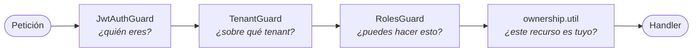

# Actores y roles

Quién puede hacer qué, y dónde lo impone el código. Ningún permiso de esta página es una convención:
todos los aplica `RolesGuard` sobre el decorador `@Roles(...)` del handler.

---

## Actores

| Actor | Rol técnico | Quién es | Cómo se autentica |
|---|---|---|---|
| Cliente | `customer` | La persona que solicita crédito | Login público → JWT propio con `tenantId` |
| Operador interno | `internal_operator` | Analista de back office | Login interno → JWT con roles RBAC |
| Analista | `analyst` | Revisión especializada (riesgo, fraude) | Ídem |
| Administrador | `admin` | Configura catálogos, proveedores y políticas del tenant | Ídem |
| Administrador de plataforma | `platform_admin` | Opera la plataforma completa | Ídem |
| Sistema | `system` | El propio backend disparando trabajo de fondo | Sin sesión humana. El planificador se identifica como `runtime-jobs-scheduler` |

---

## Las tres capas de autorización

Un endpoint protegido pasa por tres comprobaciones **independientes**, en este orden. Que sean tres y
no una es lo que evita que un fallo en cualquiera de ellas abra todo:

| Capa | Qué comprueba | Qué impide |
|---|---|---|
| `JwtAuthGuard` | Firma HS256, `iss`, `aud`, `tokenVersion` | Tokens ajenos, expirados o revocados |
| `TenantGuard` | `x-tenant-id` == `tenantId` del token | Que un actor del tenant A opere el tenant B cambiando un encabezado |
| `RolesGuard` | El rol del actor está en `@Roles(...)` | **BFLA** — un cliente llamando a un endpoint de operación |
| `ownership.util` | El recurso pertenece al actor | **BOLA** — un cliente leyendo el expediente de otro |

!!! danger "Por qué existe `TenantGuard`"
    Antes de que existiera, ningún guard central obligaba a que `x-tenant-id` coincidiera con el
    token: un actor autenticado en el tenant A podía operar el tenant B **cambiando un encabezado**.
    Fue la vulnerabilidad ATLAS-SEC-001. Hoy está en los 17 controllers que reciben ese encabezado.

---

## Qué puede hacer cada rol

| Capacidad | `customer` | `internal_operator` / `analyst` | `admin` | `platform_admin` | `system` |
|---|:---:|:---:|:---:|:---:|:---:|
| Registrarse y completar su onboarding | ✅ | — | — | — | — |
| Ver y editar **sus** datos | ✅ | ✅ | ✅ | ✅ | — |
| Ver los datos de **otro** cliente | ❌ | ✅ | ✅ | ✅ | — |
| Consultar su elegibilidad | ✅ | ✅ | ✅ | ✅ | — |
| Decidir identidad / cumplimiento / fraude | ❌ | ✅ | ✅ | ✅ | — |
| Decidir una solicitud de crédito | ❌ | ✅ | ✅ | ✅ | — |
| Configurar catálogos y proveedores | ❌ | ❌ | ✅ | ✅ | — |
| Gestionar usuarios y roles internos | ❌ | ❌ | ✅ | ✅ | — |
| Disparar trabajos de fondo por HTTP | ❌ | ❌ | ✅ | ✅ | ✅ |
| Gobernar el catálogo de esquema | ❌ | ❌ | ❌ | ✅ | — |

---

## El actor `system`

El planificador registra sus ejecuciones con `role: 'system'` y `sub: 'runtime-jobs-scheduler'`. No
es un atajo para saltarse la autorización: es el **mismo** rol que ya autoriza el controller para
disparos máquina-a-máquina, y el `sub` deja rastro de que la ejecución vino del planificador y no de
un operador humano.

Cada ejecución queda en `system_job_runs` con su entrada, su resultado y su actor. La pregunta
"¿quién lanzó este job de retención?" tiene respuesta.

---

## Deuda registrada

26 controllers leen `@Headers('x-tenant-id')` en vez de usar `@CurrentTenant()`. Son
**semánticamente idénticos** y la brecha de seguridad real ya la cierra `TenantGuard`, así que es
duplicación, no riesgo. Está congelada con el trinquete `yarn check:tenant-header`, que falla si un
archivo nuevo introduce el patrón. Ver [ATLAS-SEC-002](../pending/pending-items.md).
