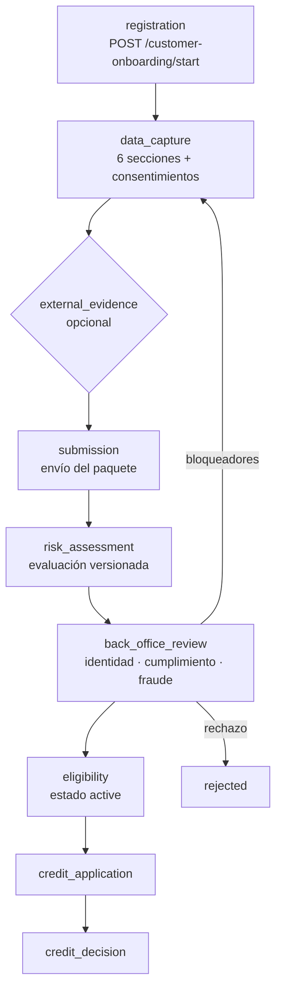

# Contexto de negocio

> Por qué existe este backend y qué problema resuelve. Todo lo afirmado aquí se puede rastrear a un
> módulo, una tabla o un endpoint concretos.

## 1. El problema

Otorgar crédito a una persona exige responder tres preguntas antes de comprometer dinero:

1. **¿Existe y es quien dice ser?** — identidad verificada contra fuentes autoritativas, no contra lo
   que el propio solicitante escribe.
2. **¿Puede pagar?** — capacidad financiera derivada de evidencia, no de una declaración.
3. **¿Debemos prestarle?** — riesgo, cumplimiento normativo y señales de fraude.

Cada respuesta depende de datos que viven fuera de la organización (registro civil, buró crediticio,
operadoras móviles, banca) y de decisiones que un humano debe poder auditar meses después.

Atlas es el backend que **orquesta ese recorrido de punta a punta** y conserva la evidencia de cada
decisión.

## 2. Qué NO es

Delimitarlo importa tanto como describirlo:

- **No es un core bancario.** Compras, cuotas, comercios y liquidación quedan fuera del alcance
  actual. El dominio `credit` cubre el catálogo de productos y el ciclo de solicitud y decisión.
- **No es un motor de scoring financiero certificado.** `RiskService` calcula con reglas heurísticas
  versionadas y se identifica como tal: cada evaluación reporta `modelCode: risk_heuristic_v0`. Está
  documentado como decisión abierta (ATLAS-RISK-001), no presentado como lo que no es.
- **No inventa datos.** Los nueve proveedores externos pueden operar en modo simulado en desarrollo,
  pero en producción un proveedor en modo simulado queda **bloqueado** (`PROVIDER_UNAVAILABLE`) en
  vez de servir evidencia fabricada que acabaría persistida como features del cliente. Ver el
  hallazgo A-02 de [la auditoría integral](../audit/auditoria-integral-2026-07-30.md).

## 3. Capacidades

| Capacidad | Módulos | Qué resuelve |
|---|---|---|
| Identidad y onboarding KYC | `customer-onboarding`, `customers`, `consents` | Captura y verifica los datos del solicitante en seis secciones, con consentimientos explícitos |
| Evidencia externa | `external-data` | Consulta a nueve proveedores (registro civil, buró, telco, banca, confianza digital) con circuit breaker, idempotencia y auditoría |
| Riesgo | `risk` | Evaluación versionada y explicable, con features derivadas de la evidencia |
| Fraude | `fraud` | Casos, señales y revisión de dispositivos y comportamiento |
| Elegibilidad | `customers` | Decide si el cliente puede solicitar crédito y devuelve los **bloqueadores** que se lo impiden |
| Crédito | `credit`, `operations` | Catálogo de productos, solicitud y decisión |
| Privacidad | `customer-privacy` | Consentimientos, retención y derechos del titular |
| Operación interna | `operations`, `internal-users`, `internal-portal`, `systems-ops` | Revisión de back office, RBAC interno, gobierno y salud del propio sistema |
| Notificación | `notifications`, `mail-sender` | Avisos multicanal con preferencias y evidencia de entrega |
| Gobierno del proceso | `workflow-catalog` | El recorrido estándar como **dato versionado y verificable**, no como prosa |

## 4. Actores

| Actor | Quién es | Cómo entra |
|---|---|---|
| **Cliente** (`customer`) | La persona que solicita crédito | App móvil / web pública. Token de acceso propio |
| **Operador interno** (`internal_operator`, `analyst`) | Analista de back office: revisa identidad, cumplimiento y fraude | Portal administrativo interno |
| **Administrador** (`admin`, `platform_admin`) | Configura catálogos, proveedores, políticas y usuarios internos | Portal administrativo interno |
| **Sistema** (`system`) | El propio backend disparando trabajo de fondo | Sin sesión humana: el planificador se identifica como `runtime-jobs-scheduler` |

Todos operan **dentro de un tenant**. El aislamiento no es una convención: `TenantGuard` contrasta el
encabezado `x-tenant-id` contra el `tenantId` del token y responde 403 si no coinciden.

## 5. El recorrido crediticio estándar

El proceso completo está sembrado como dato en `workflow_definitions` bajo el código
`customer_credit_journey` v1: **22 etapas, 57 pasos, 18 dependencias y 33 transiciones**, donde cada
paso apunta a un endpoint que existe hoy.

Resumen de las etapas principales (detalle completo en
[workflow-catalog.md](../endpoints/workflow-catalog.md)):

Lo relevante de que el recorrido sea **dato** y no prosa:
`GET /operations/workflows/:code/consistency` compara cada paso contra las rutas que este proceso
tiene realmente montadas (vía `DiscoveryService`, no análisis de archivos) y contra la máquina de
estados del cliente. Renombrar una ruta deja de ser un cambio silencioso.

## 6. La regla de negocio central: bloqueadores, no booleanos

`CustomerEligibilityService` no responde "sí/no". Responde **qué falta**, con una lista de
bloqueadores nombrados: `NO_CREDENTIALS`, `CONSENT_MISSING`, `IDENTITY_NOT_VERIFIED`,
`RISK_NOT_APPROVED`, `COMPLIANCE_MATCH_PENDING`, `FRAUD_CASE_OPEN`, `OPEN_OBSERVATIONS`,
`EVIDENCE_PENDING_REVIEW`, `RISK_ASSESSMENT_STALE`.

Es una decisión de diseño con consecuencias directas:

- El cliente puede saber **qué le falta**, no sólo que no puede continuar.
- El catálogo de flujos deriva el avance de esos mismos bloqueadores en vez de reimplementar la
  lógica, así que no hay dos fuentes de verdad sobre dónde va un cliente.
- Una regla nueva es un bloqueador nuevo, visible en el contrato, no una condición escondida en un
  `if`.

## 7. Evidencia y auditoría

Un backend que decide sobre crédito tiene que poder explicar cada decisión meses después. Atlas lo
sostiene con cuatro registros:

| Registro | Qué conserva |
|---|---|
| `operational_audit_logs` | Toda acción de un actor sobre un recurso, con payload redactado |
| `system_job_runs` | Toda ejecución de trabajo de fondo, con su entrada y su resultado |
| Evaluaciones de riesgo | La versión del modelo, el ruleset y las features usadas en **esa** decisión |
| Observaciones y casos | El rastro humano de la revisión de back office |

Ninguno guarda PII en claro en los logs: `redactSensitiveObject` y `redactSensitiveText` se aplican
antes de escribir, y desde el hallazgo A-04 también en stdout, que es el canal que recoge el
agregador en un contenedor.

## 8. Documentos relacionados

- [Actores y roles](actors-and-roles.md)
- [Flujos críticos](critical-workflows.md)
- [Reglas de negocio](business-rules.md)
- [Glosario](glossary.md)
- [Catálogo de flujos de trabajo](../endpoints/workflow-catalog.md)
- [Onboarding y habilitación crediticia](../architecture/onboarding-habilitacion-credito.md)
