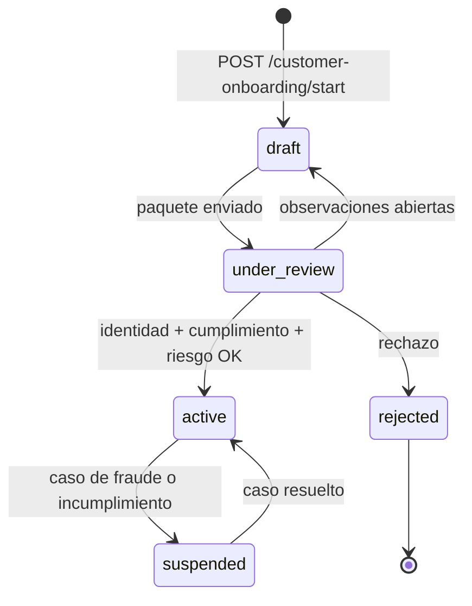

# Reglas de negocio

Las reglas que gobiernan el recorrido crediticio, con el archivo que las aplica. Una regla que no
puedas rastrear a código no es una regla: es una intención.

---

## 1. La elegibilidad devuelve bloqueadores, no un booleano

`CustomerEligibilityService` **no** responde "sí/no". Responde **qué falta**.

| Bloqueador | Significa | Se resuelve |
|---|---|---|
| `NO_CREDENTIALS` | La cuenta no tiene credenciales | Completando el registro |
| `CONSENT_MISSING` | Falta un consentimiento obligatorio | Aceptando el documento vigente |
| `IDENTITY_NOT_VERIFIED` | La identidad no está aprobada | Revisión de back office |
| `EVIDENCE_PENDING_REVIEW` | Hay evidencia sin revisar | Revisión de back office |
| `COMPLIANCE_MATCH_PENDING` | Coincidencia de cumplimiento sin resolver | Resolución por un analista |
| `FRAUD_CASE_OPEN` | Hay un caso de fraude abierto | Cierre o descarte del caso |
| `OPEN_OBSERVATIONS` | Quedan observaciones sin atender | El cliente corrige, el analista cierra |
| `RISK_NOT_APPROVED` | La evaluación de riesgo no aprueba | Nueva evaluación con evidencia adicional |
| `RISK_ASSESSMENT_STALE` | La evaluación caducó | Recálculo |

**Por qué importa el diseño.** Con un booleano, el cliente sabe que no puede continuar pero no por
qué, y el soporte tiene que investigar cada caso. Con bloqueadores nombrados, el cliente ve qué le
falta, el catálogo de flujos deriva su avance de esos mismos códigos —sin reimplementar nada— y una
regla nueva es un bloqueador nuevo y visible, no una condición escondida en un `if`.

---

## 2. Máquina de estados del cliente

Cada transición deja una fila en `customer_status_events`: quién, cuándo y por qué. La pregunta "¿por
qué este cliente está suspendido?" tiene respuesta sin abrir un log.

---

## 3. Consentimiento antes que dato

Ningún proveedor externo marcado `requires_consent` se consulta sin consentimiento vigente del
titular. No es una comprobación en el controller: la impone la maquinaria de políticas del módulo
`external-data`, en el mismo punto que decide el modo y el coste.

Revocar un consentimiento emite `consent.revoked`, que es la señal con más consecuencias legales del
catálogo de eventos.

---

## 4. En producción no se sirven datos simulados

Los nueve proveedores se siembran con `default_mode = 'mock_local'`. En producción, un proveedor en
modo simulado queda **bloqueado** (`PROVIDER_UNAVAILABLE`) en vez de devolver un dato inventado.

El razonamiento: un payload fabricado por el propio adaptador se persiste como observación y como
feature del cliente, y alimenta el motor de riesgo. Verificar una identidad contra un dato inventado
no es un fallo silencioso, es una decisión crediticia sobre ficción.

El escape hatch existe (`EXTERNAL_PROVIDERS_ALLOW_MOCK_IN_PRODUCTION=true`) para demos comerciales, y
exige además declarar la URL del servidor de mocks: asumirlo tiene que ser un acto explícito.

`BankingQrService` tiene su propio portón, porque un QR de cobro simulado es un QR al que alguien
transfiere dinero real.

---

## 5. El motor de riesgo se declara heurístico

`RiskService` calcula con reglas explícitas y versionadas, no con un modelo estadístico calibrado.
Cada evaluación reporta `modelCode: risk_heuristic_v0`, `modelVersion` y `rulesetVersion`.

Es una decisión de honestidad: presentar una heurística como scoring financiero certificado es lo que
convierte una limitación conocida en un riesgo regulatorio. Registrado como ATLAS-RISK-001.

Las reglas del baseline BNPL envían a **revisión manual** ante capacidad incompleta o
sobreendeudamiento, en vez de aprobar. Los umbrales requieren validación con Riesgo y Cumplimiento
antes de activar originación.

---

## 6. Idempotencia en toda mutación sensible

Reintentar con la misma `x-idempotency-key` devuelve el resultado de la primera ejecución. En un
backend que consulta proveedores **de pago por consulta**, un reintento sin idempotencia no sólo
duplica un efecto: cuesta dinero.

Las claves en `processing` no se purgan **nunca**: podrían pertenecer a una petición en vuelo, y
borrarlas convertiría un reintento legítimo en una segunda ejecución del comando.

---

## 7. Un proveedor caro se bloquea por política

`INFOCENTER` (buró crediticio) tiene `is_costly: true` y `requires_manual_approval: true`. Su política
sólo lo permite en las etapas `MANUAL_REVIEW`, `LIMIT_INCREASE` y `FRAUD_REVIEW`.

El coste está modelado como dato (`external_provider_cost_policies`: coste unitario, topes por
usuario y día, TTL de caché), no como una condición en el código. Cambiar la política es cambiar una
fila.

---

## 8. El DDL no sale de la API

Aprobar un cambio en `PATCH /operations/schema/change-log/:id/approve` registra la decisión en
`schema_change_log` pero **no ejecuta `CREATE TABLE`**. El DDL real sigue saliendo por migraciones
Sequelize revisadas en PR.

Decisión deliberada: la API gobierna el catálogo y la auditoría; el esquema físico se cambia con
revisión humana. Registrado como ATLAS-TECH-007.

---

## 9. Trazabilidad

| Regla | Código | Prueba |
|---|---|---|
| Bloqueadores de elegibilidad | `customers/customer-eligibility.service.ts` | `test/unit/customers/` |
| Máquina de estados | `customers/` + `customer_status_events` | `test/unit/customers/` |
| Consentimiento antes que dato | `external-data/application/` | `test/unit/external-data/` |
| Sin datos simulados en producción | `productionIntegrationBlockers` | `test/unit/external-data/` |
| Riesgo heurístico declarado | `risk/risk-heuristic-v0.constants.ts` | `test/unit/risk/` |
| Idempotencia | `runtime-hardening/idempotency.interceptor.ts` | `test/unit/runtime-hardening/` |
| Política de proveedor caro | `external_provider_cost_policies` | `test/unit/external-data/` |

Matriz completa en [traceability-matrix.md](../governance/traceability-matrix.md).
