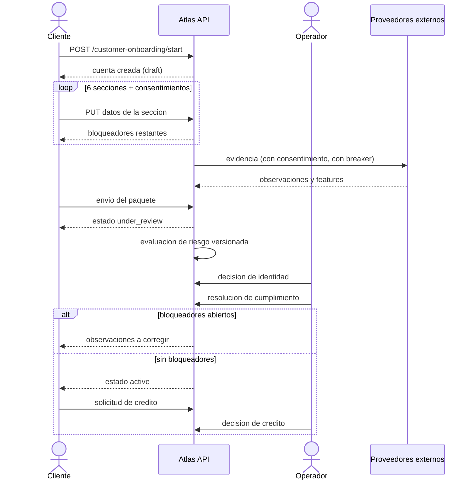

# Flujos críticos

El recorrido crediticio estándar, etapa por etapa. Está sembrado como **dato versionado**
(`customer_credit_journey` v1: 22 etapas, 57 pasos, 18 dependencias, 33 transiciones), no como prosa:
detalle en [workflow-catalog.md](../endpoints/workflow-catalog.md).

---

## Flujo principal · Del registro a la decisión de crédito

---

## Etapas

| # | Etapa | Actor | Se completa cuando |
|---|---|---|---|
| 5 | `credit_catalog` (opcional) | interno | manual |
| 10 | `registration` | cliente | sin bloqueador `NO_CREDENTIALS` |
| 20 | `session_bootstrap` (opcional) | cliente | manual |
| 30 | `data_capture` | cliente | sin bloqueadores de las 6 secciones ni de consentimientos |
| 30.10–30.60 | contacto, personales, perfil financiero, domicilio, documentos, referencias | cliente | cada sección sin bloqueador |
| 30.70 | `privacy_consents` | cliente | sin `CONSENT_MISSING` |
| 40 | `external_evidence` (opcional) | sistema | manual |
| 50 | `submission` | cliente | estado ∈ {under_review, active, suspended, rejected} |
| 60 | `risk_assessment` | sistema | sin `RISK_NOT_APPROVED` ni `RISK_ASSESSMENT_STALE` |
| 70 | `back_office_review` | interno | manual |
| 70.10 | `identity_decision` | interno | sin `IDENTITY_NOT_VERIFIED` ni `EVIDENCE_PENDING_REVIEW` |
| 70.20 | `compliance_screening` | interno | sin `COMPLIANCE_MATCH_PENDING` |
| 70.30 | `manual_review` (opcional) | interno | sin `OPEN_OBSERVATIONS` |
| 70.40 | `fraud_review` (opcional) | interno | sin `FRAUD_CASE_OPEN` |
| 80 | `eligibility` | sistema | estado `active` |
| 90 | `credit_application` | cliente | manual |
| 100 | `credit_decision` (terminal) | interno | manual |

Entrada: `POST /customer-onboarding/start`. Salida:
`POST /operations/credit/applications/:applicationId/decision`.

---

## Ramas de excepción

Declaradas explícitamente en el catálogo, no implícitas en el código:

| Situación | A dónde va |
|---|---|
| Verificación de identidad fallida | Evidencia externa adicional |
| Paquete incompleto | Observaciones al cliente |
| Coincidencia de cumplimiento | Resolución por analista |
| Decisión que pide más información | Circuito de observaciones |
| Caso de fraude descartado | Reevaluación |

---

## Por qué el flujo es dato y no prosa

`GET /operations/workflows/:code/consistency` compara **cada paso** contra las rutas que este proceso
tiene realmente montadas (vía `DiscoveryService`, no análisis de archivos) y contra la máquina de
estados del cliente.

Renombrar una ruta deja de ser un cambio silencioso: el informe de consistencia lo detecta antes que
un cliente. Estado verificado el 2026-07-28: `in_sync`, 0 errores.

Complemento estático: `test/unit/workflow-catalog/customer-credit-workflow.seed-data.spec.ts`, que
corre sin base de datos.

---

## Flujos no cubiertos todavía

El informe reporta ~66 avisos `ROUTE_NOT_MAPPED`: rutas de dominios que el flujo toca (recuperación
de contraseña, notificaciones, tokens de dispositivo, administración de proveedores, jobs) pero que
**no forman parte del recorrido estándar**.

Son avisos, no errores, y el estado sigue siendo `in_sync`. Cuando producto defina esos flujos, se
siembran como definiciones propias con su `workflow_code`: la estructura ya lo soporta sin cambios de
esquema. Registrado como ATLAS-FLOW-003.
