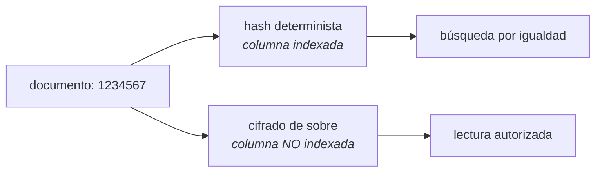

# Arquitectura de datos

PostgreSQL 16 es la **fuente de verdad**. MongoDB sólo alimenta el visor de logs y Redis sólo guarda
estado efímero (rate limiting, locks de líder, caché): ninguno de los dos contiene dato que no se
pueda reconstruir.

---

## 1. Separación por esquemas de dominio

**138 tablas en 12 esquemas**, más `public`, reservado para el tracking de Umzug y compatibilidad de
infraestructura. Ningún modelo de negocio resuelve en `public`.

| Esquema | Tablas | Qué contiene |
|---|---:|---|
| `platform_ops` | 31 | Catálogo del propio sistema, jobs, workflows, gobierno de esquema |
| `telemetry` | 18 | Señales de dispositivo, comportamiento y sesión |
| `catalog` | 17 | Catálogos versionados y definiciones semánticas |
| `risk` | 14 | Features, rulesets, evaluaciones y políticas de riesgo |
| `customer` | 12 | Cliente, documentos, contactos, direcciones, elegibilidad |
| `privacy` | 11 | Consentimientos, finalidades, retención y clasificación |
| `iam` | 10 | Tenants, usuarios de plataforma e internos, credenciales, tokens |
| `case_management` | 6 | Casos de fraude, observaciones y revisión |
| `integrations` | 6 | Proveedores externos, peticiones, respuestas y salud |
| `audit` | 5 | Registro operativo y de acciones HTTP |
| `messaging` | 5 | Notificaciones, plantillas, preferencias y entregas |
| `credit` | 3 | Productos, solicitudes y decisiones |

El mapa tabla → esquema vive en un único sitio
([`domain-schemas.ts`](../../src/database/domain-schemas.ts)) que comparten los decoradores de los
modelos y las migraciones. Dos fuentes de verdad sobre dónde vive una tabla es exactamente el error
que ese archivo existe para impedir, y `yarn check:domain-schemas` lo vigila.

---

## 2. Convenciones de columna

| Convención | Regla | Por qué |
|---|---|---|
| Clave primaria | `_id BIGSERIAL` | Prefijo `_` para distinguir columnas de plataforma de las de negocio |
| Tenant | `_tenant_id BIGINT` | Presente en toda tabla con alcance de tenant. Ausente a propósito en catálogos de plataforma |
| Auditoría | `_created_at`, `_updated_at` | `TIMESTAMP WITH TIME ZONE`, siempre UTC |
| Borrado lógico | `_deleted BOOLEAN NOT NULL DEFAULT false` | **`NOT NULL` es obligatorio**: una fila con `NULL` es invisible para los filtros `!= true` y escapa de los índices únicos parciales |
| Claves foráneas | `SET NULL` si la columna es nullable, `RESTRICT` si no; `ON UPDATE CASCADE` | Política central en `atlas-schema-builder.util.ts`, no decidida caso a caso |

---

## 3. PII: hash para buscar, blob para guardar

Un backend KYC necesita **buscar** por documento o correo sin **almacenarlos** en claro. El patrón:

Reglas que lo sostienen:

- **Las columnas cifradas nunca se indexan.** Un índice sobre un valor cifrado filtra información por
  patrones de acceso y no sirve para buscar.
- **Las vistas `read_api` no exponen ni hashes ni blobs.** Lo vigila `yarn check:read-api-views`.
- El proveedor de cifrado es intercambiable: `local` por defecto, **AWS KMS** cuando `KMS_KEY_ID` y
  `AWS_REGION` están configurados. El identificador del proveedor viaja embebido en cada valor, así
  que los valores cifrados con `local` se siguen descifrando tras migrar a KMS. Ver
  [ADR-0004](../adr/0004-kms-envelope-encryption.md).

---

## 4. Mínimo privilegio

Dos identidades de base de datos, no una:

| Rol | Privilegios | Lo usa |
|---|---|---|
| `atlas_app_rw` | DML sobre las tablas de negocio. **Sin DDL** | Los procesos `api` y `worker` |
| `atlas_migrator` | DDL | El job `migrate` |

Un runtime con privilegios DDL convierte cualquier inyección en un cambio de esquema. La separación
la comprueba `yarn check:db-privileges --strict` en CI, y los scripts de bootstrap están en
[`ops/postgres/`](../../ops/postgres/).

Ambos roles llevan `statement_timeout` e `idle_in_transaction_session_timeout`: una consulta colgada
no puede retener una conexión del pool indefinidamente.

---

## 5. Pools de conexión

| Pool | Variable | Para qué |
|---|---|---|
| Escritura | `DB_POOL_MAX` (20) | El pool por defecto |
| Lectura | `DB_READ_POOL_MAX` (10) | Opt-in (`DB_READ_ENABLED`). Dirige las lecturas a una réplica |

Dimensionar de modo que **(instancias × `DB_POOL_MAX`) no supere** el `CONNECTION LIMIT` del rol en
PostgreSQL. Con la API y el worker separados, la cuenta incluye **ambos** conjuntos de réplicas — es
una de las razones por las que el rol de cada proceso importa operativamente.

`atlas_db_pool_connections{state="waiting"}` debe mantenerse en 0. Un valor sostenido por encima
significa que los handlers esperan una conexión, no a la base.

---

## 6. Documentos relacionados

- [Catálogo de entidades](entity-catalog.md)
- [Migraciones y seeds](migrations.md)
- [Retención y clasificación](retention.md)
- [Verificación del split de migraciones](../architecture/migration-split-verification.md)
