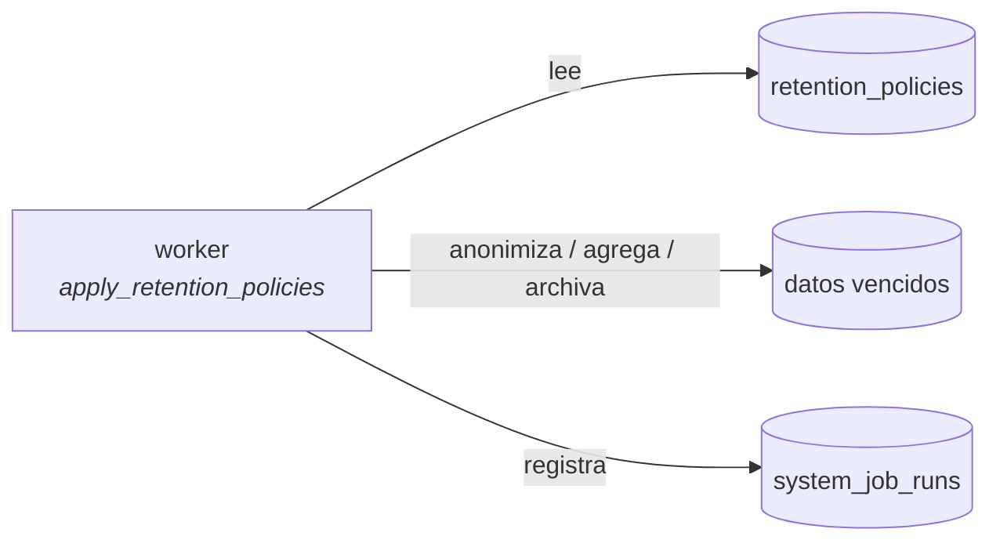

# Retención y clasificación

Cuánto se conserva cada dato, con qué base legal y qué pasa al vencer. En un backend KYC esto no es
higiene: es la diferencia entre cumplir y no cumplir.

---

## Cómo se modela

La retención es **dato**, no código. Vive en `privacy.retention_policies`:

| Columna | Significado |
|---|---|
| `policy_code` | Identificador estable de la política. **Es la clave por la que se referencia** |
| `applies_to` | Qué clase de dato cubre |
| `retention_days` | Días de conservación |
| `post_retention_action` | `anonymize`, `aggregate_then_delete`, `archive`, `delete` |
| `legal_basis` | La base legal que justifica el periodo |
| `is_active` | Si se aplica |

Cambiar un periodo es actualizar una fila, no desplegar código.

---

## Políticas del perfil de producción

| `policy_code` | Aplica a | Días | Acción | Base legal |
|---|---|---:|---|---|
| `external-provider-evidence-1825d` | Evidencia de proveedores externos (identidad, buró, telco, banca) | 1825 | `anonymize` | `kyc_aml_record_keeping` |
| `risk-model-inputs-730d` | Features, observaciones y señales de scoring | 730 | `aggregate_then_delete` | `risk_management_and_model_monitoring` |

!!! warning "ATLAS-DATA-001 · Pendiente de confirmación legal"
    **Los dos periodos son un punto de partida defendible, no una decisión validada.** 1825 días
    (5 años) es el plazo de conservación de registros habitual en normativa KYC/AML, y 730 días
    conservan la capacidad de auditar un modelo pasado sin guardar indefinidamente las señales
    individuales del cliente.

    Legal debe confirmarlos **por jurisdicción**. Un periodo demasiado corto destruye evidencia que
    podría exigirse; demasiado largo conserva PII más de lo permitido. Ambos extremos son
    incumplimiento.

    Lo que sí está garantizado hoy es que **existe** una política productiva explícita y auditable,
    en vez de ninguna o una etiquetada `dev_testing_only`.

---

## Quién la aplica

El job `apply_retention_policies` del **worker**, cada 24 horas por defecto.

!!! danger "Este job es el que más caro sale si no corre"
    Antes de que existiera el planificador, los jobs sólo podían dispararse por HTTP y **nadie los
    llamaba**: las políticas de retención de datos personales no se aplicaban nunca. Era el hallazgo
    A-03.

    Hoy la alerta `AtlasRetentionJobNotRunning` dispara si no completa ninguna ejecución en la
    ventana esperada. El silencio deja de ser indistinguible del funcionamiento correcto.

---

## Clasificación de sensibilidad

| Nivel | Qué es | Cómo se trata |
|---|---|---|
| **Secreto** | Contraseñas, tokens, claves | Hash Argon2 o cifrado. Nunca en logs, nunca en respuestas |
| **PII crítica** | Documento de identidad, biometría | Hash indexado para buscar + blob cifrado para guardar. Nunca en vistas `read_api` |
| **PII** | Nombre, correo, teléfono, domicilio | Redactada en logs. Acceso por rol y ownership |
| **Media** | Estados, evaluaciones, eventos de auditoría | Sin PII directa; puede contener referencias |
| **Baja** | Catálogos, definiciones, configuración | Sin restricción especial |

Las reglas por campo viven en `privacy.sensitive_field_rules` y `privacy.data_classification_policies`.

---

## Garantías en el pipeline de datos personales

| Garantía | Dónde se impone |
|---|---|
| Las columnas cifradas **nunca** se indexan | Revisión + convención de `atlas-schema-builder.util.ts` |
| Las vistas `read_api` no exponen hashes ni blobs | `yarn check:read-api-views` |
| Los logs no llevan PII en claro | `redactSensitiveText` en archivo **y** stdout |
| Los logs no llevan SQL | Regla explícita: Sequelize inlinea los valores |
| La query string se sanea | `sanitizeUrlForLog`: nombres sí, valores no |
| El payload de auditoría se redacta | `redactSensitiveObject` |
| Un consentimiento revocado se propaga | Evento `consent.revoked` |

---

## Derechos del titular

El módulo `customer-privacy` expone consentimientos, finalidades y solicitudes de privacidad. Un
consentimiento revocado emite `consent.revoked`, y un consumidor que trate datos amparados por él
**debe** dejar de hacerlo: es la señal con más consecuencias legales del catálogo de eventos.
