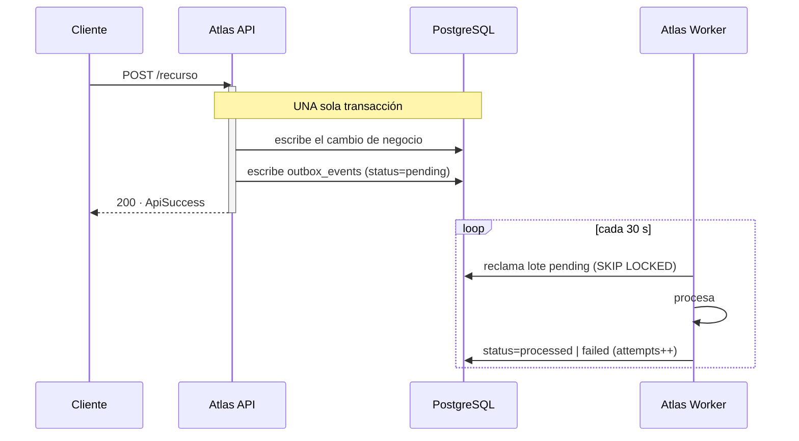
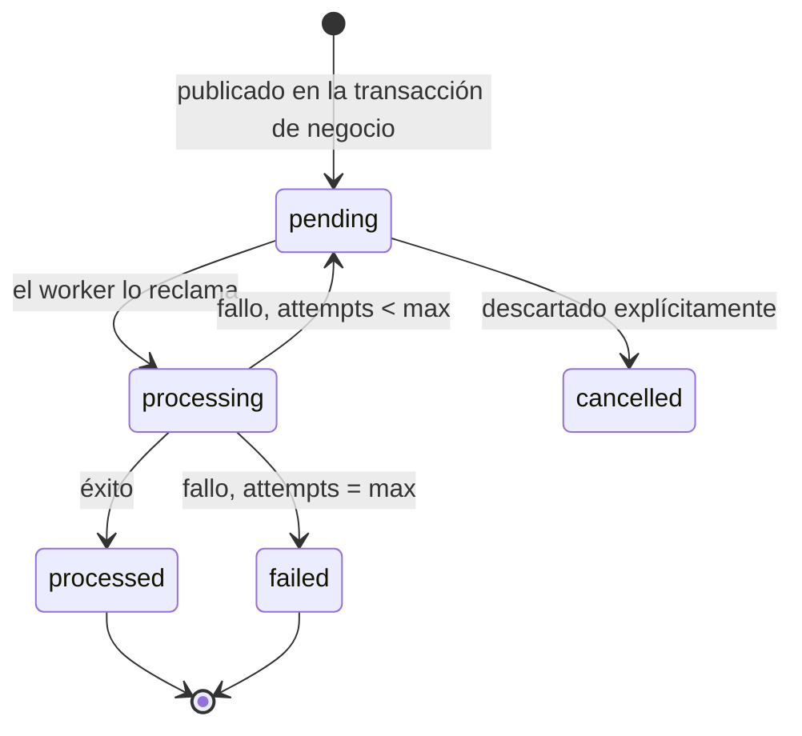

# Eventos de dominio

Atlas publica eventos de dominio con garantía **at-least-once** mediante un **outbox transaccional en
PostgreSQL**. No hay broker externo, y la decisión está razonada en
[ADR-0001](../adr/0001-outbox-en-postgresql.md).

Contrato formal para consumidores: [`asyncapi/asyncapi.yaml`](../../asyncapi/asyncapi.yaml).

---

## 1. Cómo se publica

Lo que hace fiable a este patrón es que **el evento y el cambio de negocio comparten transacción**:
si el commit falla, no queda un evento huérfano; si el proceso muere después del commit, el evento
sigue ahí esperando. No existe la ventana "cambié el estado pero el evento se perdió".

El despacho corre en el **worker** (`process_outbox`, cada 30 s), no en el proceso que atendió la
petición. Ver [Procesamiento en segundo plano](../architecture/background-processing.md).

---

## 2. Catálogo

**89 eventos en 9 familias.** El registro canónico es
[`event-registry.ts`](../../src/modules/events/event-registry.ts); publicar un código que no esté ahí
se rechaza.

| Familia | Eventos | Prioridad | Ejemplos |
|---|---:|---:|---|
| `user_security` | 10 | — | `user.registered`, `user.login.failed`, `user.account.locked` |
| `kyc_legal` | 10 | 10 | `kyc.submitted`, `kyc.approved`, `consent.accepted`, `consent.revoked` |
| `risk_scoring_fraud` | 11 | 20 | `score.calculated`, `risk.alert.created`, `fraud.case.opened` |
| `credit_line` | 9 | — | `credit_line.approved`, `credit_limit_movement.recorded` |
| `purchase_downpayment` | 8 | — | `purchase.*` |
| `installments_collections` | 14 | — | `installment.*`, `collection.*` |
| `payments` | — | — | `payments.*` |
| `merchant_settlement` | 15 | — | `merchant.*`, `reconciliation.*` |
| `notifications` | 12 | — | `notification.sent`, `notification.failed`, `template.*` |

!!! note "Familias del roadmap"
    `purchase_downpayment`, `installments_collections`, `payments` y `merchant_settlement`
    corresponden a capacidades **fuera del alcance actual** (compras, cuotas, comercios). Sus códigos
    están reservados en el registro para que el contrato de eventos no cambie de forma incompatible
    cuando se implementen. Un consumidor no debe esperar recibirlos hoy.

---

## 3. Semántica de entrega

| Propiedad | Valor | Consecuencia para el consumidor |
|---|---|---|
| Garantía | **At-least-once** | **Hay que ser idempotente.** Un evento puede llegar dos veces |
| Orden | **No garantizado entre agregados**; por prioridad dentro del lote | No asumir orden global. Usar `aggregate_id` + estado, no la secuencia de llegada |
| Deduplicación | `idempotency_key` opcional por evento | Si se envía, el mismo evento no se encola dos veces |
| Correlación | `correlation_id` y `causation_id` | Permiten reconstruir la cadena causal completa |
| Reintentos | `attempts` hasta `max_attempts` | Con backoff, dentro del propio job |
| Fallo terminal | `status = 'failed'` | La fila **permanece**: es la cola de fallos, consultable, no un mensaje perdido |

### Estados de una fila del outbox

### Por qué no hay dead-letter queue separada

`status = 'failed'` **es** la cola de fallos. Un evento agotado no se mueve a ninguna parte: se queda
en `outbox_events` con su contador de intentos, su último error y su payload íntegro. Investigarlo es
una consulta SQL, y reprocesarlo es volver a ponerlo en `pending`.

Una DLQ separada añadiría un segundo almacén que reconciliar con este, a cambio de nada que esta
tabla no dé ya.

---

## 4. Estructura de un evento

| Campo | Tipo | Descripción |
|---|---|---|
| `event_code` | string(160) | Código del catálogo. Ej. `kyc.approved` |
| `event_family` | string(80) | Familia. Agrupa por dominio |
| `event_version` | int | Versión del esquema del payload |
| `aggregate_type` | string(120) | Tipo de la entidad. Ej. `customer` |
| `aggregate_id` | string(120) | Identificador de la entidad afectada |
| `event_payload_json` | jsonb | Carga. **Sin PII en claro** |
| `metadata_json` | jsonb | `correlationId`, `causationId`, módulo y acción de origen |
| `_tenant_id` | bigint | Tenant. `null` si es un evento de plataforma |
| `priority` | int | Menor = antes dentro del lote |
| `status`, `attempts`, `max_attempts` | — | Ciclo de vida y reintentos |

---

## 5. Guía para consumidores

1. **Sé idempotente.** At-least-once significa que el mismo evento llegará dos veces alguna vez. La
   clave natural es `(event_code, aggregate_id, event_version)`.
2. **No asumas orden entre agregados.** Reacciona al estado que trae el evento, no a la secuencia.
3. **Tolera campos nuevos.** Añadir una propiedad opcional al payload **no** es un cambio
   incompatible: un consumidor que falle ante un campo desconocido se romperá solo.
4. **Un cambio incompatible sube `event_version`.** El código no cambia; la versión sí.
5. **Propaga `correlationId`.** Es lo que permite seguir una operación desde la petición HTTP
   original hasta el último efecto.

---

## 6. Observabilidad

| Señal | Qué vigila |
|---|---|
| `atlas_outbox_pending_events{tenant_id}` | Profundidad del backlog. Si sube sostenidamente, el despacho no sigue el ritmo |
| `atlas_scheduled_job_runs_total{job="process_outbox"}` | Que el despacho corre. Silencio = nadie despacha |
| `atlas_app_info{role="worker"}` | Que existe un proceso ejecutando trabajo de fondo |

Las alertas correspondientes están en
[`prometheus-alerts.yml`](../../ops/observability/prometheus-alerts.yml).
