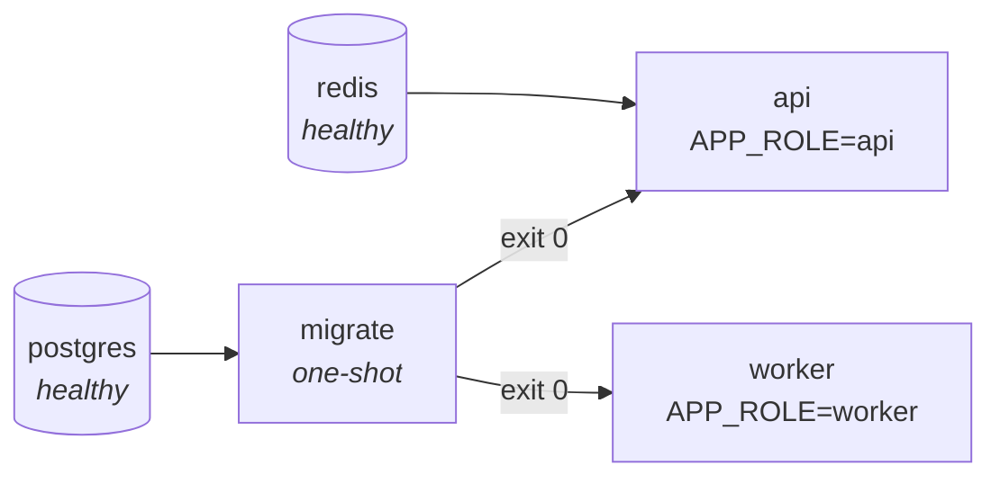

# Configuración local

Dos caminos, según lo que se vaya a hacer. Ninguno de los dos exige instalar PostgreSQL o Redis a
mano.

---

## Camino A · Desarrollo con recarga en caliente

El habitual para escribir código: la infraestructura en contenedores, el backend en el host.

```bash
# 1. Infraestructura (PostgreSQL 16 + Redis 7, las mismas versiones que CI)
docker compose up -d

# 2. Dependencias y configuración
yarn install
cp .env.example .env          # los valores por defecto ya apuntan a los contenedores de arriba

# 3. Esquema y datos de desarrollo
yarn db:migration:up
yarn db:seed:dev

# 4. Arranque con recarga
yarn start:dev                # http://localhost:3005
```

!!! tip "Puertos ocupados"
    Si la máquina ya corre un PostgreSQL o un Redis local, el compose acepta puertos alternativos sin
    editar el archivo:

    ```bash
    POSTGRES_PUBLISH_PORT=55433 REDIS_PUBLISH_PORT=56380 docker compose up -d
    ```

    Recuerda ajustar `DB_PORT` y `REDIS_URL` en tu `.env` para que apunten ahí.

### Verificación

```bash
curl -s http://localhost:3005/api/v1/health | jq
```

Debe responder `status: "ok"`, `database: "ok"` y la versión del build. La respuesta viene dentro del
sobre estándar (`requestId` / `data` / `timestamp`): ver [Modelo de error](../api/error-model.md).

---

## Camino B · Stack completo containerizado

El que reproduce el despliegue real: los **tres roles de proceso** orquestados, sin nada corriendo
fuera de un contenedor.

```bash
docker compose --profile app up -d --build
```

Levanta, en este orden y por condición (no por espera ciega):



`migrate` aplica migraciones y seeders y termina. `api` y `worker` **no arrancan** hasta que sale con
código 0: una API sirviendo contra un esquema a medio migrar es peor que una API que no arranca.

### Verificación

```bash
docker compose --profile app ps          # api y worker deben quedar (healthy)
curl -s http://localhost:3005/api/v1/health
curl -s http://localhost:3006/health/readiness      # sonda del worker
curl -s http://localhost:3006/metrics | grep atlas_app_info
```

`atlas_app_info` debe aparecer **dos veces** con roles distintos (`api` y `worker`). Si falta una,
ese rol no está corriendo — y hay una alerta de Prometheus que lo dice.

### Añadir el visor de logs

```bash
docker compose --profile app --profile logs up -d
```

### Limpiar

```bash
docker compose --profile app down -v     # -v borra también los volúmenes
```

---

## Documentación de la API en local

Con `API_DOCS_ENABLED=true` (el default fuera de producción):

| Ruta | Qué es |
|---|---|
| <http://localhost:3005/api/v1/reference> | **Scalar** — la referencia recomendada |
| <http://localhost:3005/api/v1/docs> | Swagger UI |
| <http://localhost:3005/api/v1/docs/openapi.json> | El contrato que genera **este** proceso |

Y el portal técnico que estás leyendo:

```bash
pip install mkdocs-material
yarn docs:serve      # http://127.0.0.1:8000
```

---

## Problemas frecuentes

| Síntoma | Causa | Solución |
|---|---|---|
| `ECONNREFUSED 127.0.0.1:5432` | El contenedor de PostgreSQL no está arriba, o publica otro puerto | `docker compose ps` y ajusta `DB_PORT` |
| El arranque aborta con un error de Zod | Falta una variable o su valor no es válido | `yarn env:doctor` explica cuál y por qué |
| `relation "..." does not exist` | Faltan migraciones | `yarn db:migration:up` |
| El planificador no ejecuta nada | `RUNTIME_JOBS_SCHEDULER_ENABLED=false` (el default) | Ponlo en `true`, o usa el camino B, donde el worker ya lo trae |
| `APP_ROLE=api` + planificador activo aborta el arranque | Combinación incoherente, rechazada a propósito | Usa `APP_ROLE=all` en local, o separa los procesos |
| `EPERM` al instalar dependencias en Windows | Un proceso `node` en marcha mantiene abierto un binario nativo | Detén `yarn start:dev` antes de `yarn add` |
