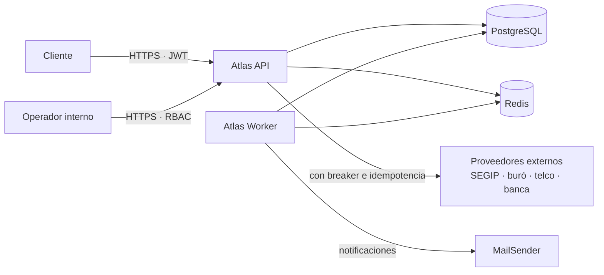

# Atlas Backend

Backend fintech de **identidad, onboarding KYC, elegibilidad, crédito, riesgo y operación**, sobre
NestJS 11, PostgreSQL 16 y TypeScript estricto.

!!! info "Versión documentada"
    Contrato **0.3.0** · OpenAPI **3.1** · 252 rutas / 264 operaciones · Node ≥ 22 · 284 suites y
    2 425 pruebas en verde. Línea base completa en [reports/baseline.md](reports/baseline.md).

---

## Qué resuelve

Otorgar crédito exige responder tres preguntas antes de comprometer dinero: **¿existe y es quien dice
ser?**, **¿puede pagar?** y **¿debemos prestarle?**. Cada respuesta depende de datos externos
(registro civil, buró, telco, banca) y de decisiones que un humano tiene que poder auditar meses
después. Atlas orquesta ese recorrido de punta a punta y conserva la evidencia de cada decisión.

Delimitación honesta de lo que **no** es: no es un core bancario (compras, cuotas y comercios quedan
fuera), no es un motor de scoring certificado (el motor es heurístico y se declara como tal), y en
producción **no sirve datos simulados** — un proveedor externo en modo simulado queda bloqueado en
vez de fabricar evidencia. Detalle en [Contexto de negocio](business/business-context.md).

---

## Contexto del sistema



El backend se despliega en **dos roles de proceso** desde una sola imagen: `api` atiende clientes y
`worker` ejecuta el trabajo de fondo. Por qué, y qué implica, en
[Procesamiento en segundo plano](architecture/background-processing.md) y
[ADR-0006](adr/0006-separacion-de-roles-api-worker.md).

---

## Enlaces rápidos

<div class="grid cards" markdown>

- :material-rocket-launch: **Empezar**

    Levantar el stack en local, variables de entorno y primeros comandos.

    [:octicons-arrow-right-24: Configuración local](getting-started/local-setup.md)

- :material-api: **Consumir la API**

    Convenciones, sobre de respuesta, modelo de error y catálogo de endpoints.

    [:octicons-arrow-right-24: Convenciones de API](api/conventions.md)

- :material-sitemap: **Entender la arquitectura**

    Modelo C4, dependencias reales entre módulos y decisiones registradas.

    [:octicons-arrow-right-24: Modelo C4](architecture/c4-model.md)

- :material-server-network: **Desplegar y operar**

    Checklist de producción, roles de proceso, observabilidad y runbooks.

    [:octicons-arrow-right-24: Despliegue a producción](runbooks/despliegue-produccion.md)

</div>

---

## Cómo se ejecuta en local

```bash
docker compose up -d          # PostgreSQL + Redis
yarn install
yarn db:migration:up && yarn db:seed:dev
yarn start:dev                # API en http://localhost:3005
```

O el stack completo containerizado, con los tres roles orquestados:

```bash
docker compose --profile app up -d --build
```

Detalle y verificación en [Configuración local](getting-started/local-setup.md).

---

## Cómo se prueba la API

Con la API levantada y `API_DOCS_ENABLED=true`:

| Ruta | Qué es |
|---|---|
| `/api/v1/reference` | **Scalar** — referencia interactiva recomendada |
| `/api/v1/docs` | Swagger UI, conservada para clientes existentes |
| `/api/v1/docs/openapi.json` | El contrato crudo que genera **este** proceso de sus propias rutas |

El contrato versionado vive en `docs/endpoints/openapi.yaml` y lo protegen dos gates:
`yarn check:openapi` (reglas propias) y `yarn docs:openapi:lint` (estándar OpenAPI vía Redocly).

---

## Cómo se responde a un incidente

1. `GET /api/v1/health` — versión, commit y estado de la base del build desplegado.
2. `GET /api/v1/health/readiness` — Postgres y Redis. 503 también durante el drenado por SIGTERM.
3. `atlas_app_info{role="api"}` y `atlas_app_info{role="worker"}` — si falta una de las dos series,
   ese rol no está corriendo, y hay una alerta que lo dice.
4. Runbooks por escenario en [Despliegue a producción](runbooks/despliegue-produccion.md).

Cualquier incidencia se cita con su `requestId`: es el mismo valor que devuelve toda respuesta y el
que correlaciona los logs.

---

## Propiedad y gobierno

| Área | Responsable |
|---|---|
| Backend, contrato de API, despliegue | Equipo Backend Atlas |
| Retención y bases legales de tratamiento | Legal / Cumplimiento (ver [ATLAS-DATA-001](pending/pending-items.md)) |
| Umbrales de riesgo y política crediticia | Riesgo |

Los pendientes abiertos y la deuda aceptada explícitamente están en
[pending-items.md](pending/pending-items.md). Nada se da por cerrado sin evidencia: ver
[Validación final](reports/final-validation.md).
