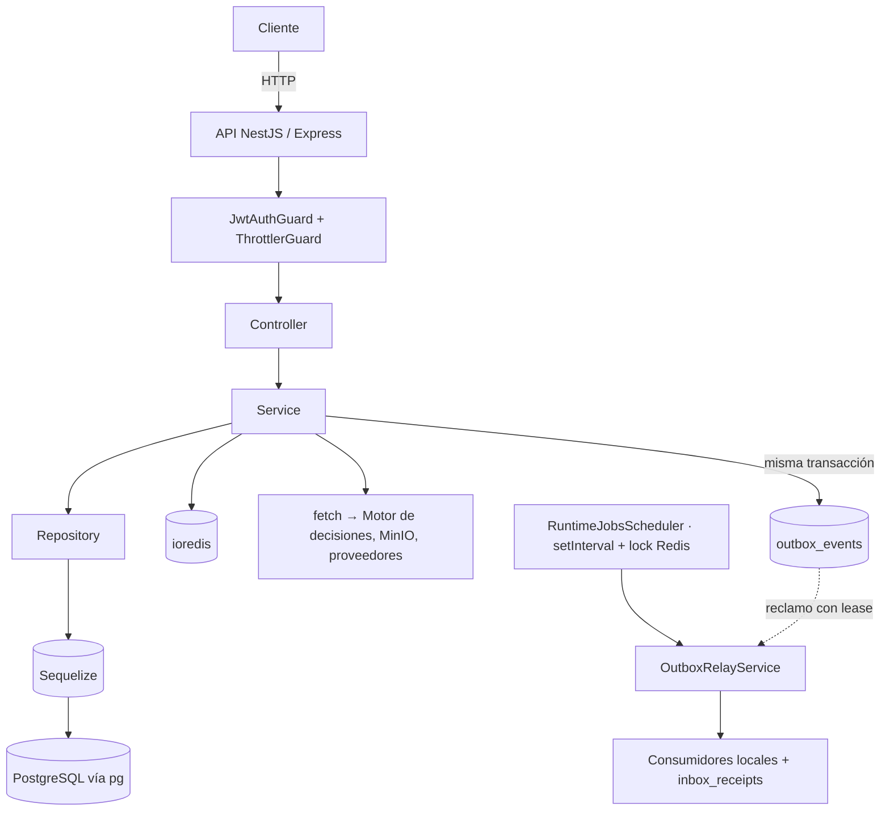

# Fase 0 — Auditoría del estado actual

Inspección del repositorio **antes** de tocar una línea de código. El objetivo es no
reimplementar lo que ya existe, no romper lo que ya funciona y no instrumentar tecnologías
que este backend no usa.

## Conclusión en una frase

AtlasBackend **ya arranca un SDK de OpenTelemetry** y **ya correlaciona el `trace_id` en los
logs**, pero lo hace con `auto-instrumentations-node` sin exclusiones, sin muestreo basado en
el padre, sin propagadores declarados, **sin capa de trazado para el dominio**, **sin
propagación al outbox** y **sin forma de levantar Jaeger**. El trabajo no es instalar nada
nuevo desde cero: es **cerrar los huecos reales** de una base que ya existe a medias.

## 1. Arquitectura detectada

| Elemento | Valor real | Fuente |
| --- | --- | --- |
| Framework | NestJS 11 | `package.json` |
| Módulos ES | **ESM puro** (`"module": "NodeNext"`, imports con extensión `.js`) | `tsconfig.json` |
| Adaptador HTTP | **Express** (`@nestjs/platform-express`) | `main.ts` |
| ORM | **Sequelize 6** + `sequelize-typescript` (`@nestjs/sequelize`) | `package.json` |
| Driver PostgreSQL | `pg` 8 (`pg-hstore`) — Sequelize habla por él | `package.json` |
| Cliente Redis | `ioredis` 5, cliente único global (`REDIS_CLIENT`) | `common/redis/redis.module.ts` |
| HTTP saliente | **`fetch` global (undici)** en 14 clientes. **No hay Axios ni `HttpModule`** | `decision-engine.client.ts`, `minio-file-storage.adapter.ts`, … |
| Logs | `AppFileLogger extends ConsoleLogger` — JSON a stdout + `Archivo.log`. **No hay Pino** | `common/logging/app-file-logger.service.ts` |
| Métricas | `prom-client` vía `MetricsService`, `GET /metrics` | `common/observability/metrics.service.ts` |
| Colas | **No hay Bull/BullMQ.** Outbox transaccional en PostgreSQL con lease, testigo y DLQ | `platform/events/outbox-relay.service.ts` |
| Cron | **No hay `@nestjs/schedule`.** `setInterval` + elección de líder por Redis | `modules/runtime-jobs/runtime-jobs-scheduler.service.ts` |
| WebSockets | No | — |
| Configuración | `env.ts` + esquemas zod por área (`env.observability.schema.ts`) | `config/` |
| Gestor de paquetes | **Yarn 1.22.22** (`packageManager`) | `package.json` |
| Node exigido | `>=22.0.0`; entorno actual v22.23.2 | `package.json`, `node -v` |

> **Corrección explícita al enunciado del encargo:** el briefing asumía Pino, Axios y
> Bull/BullMQ. Ninguno de los tres existe aquí. Se instrumenta lo que hay —Sequelize sobre
> `pg`, `fetch`/undici, outbox propio, logger propio— y **no se instala nada** para cubrir
> tecnologías ausentes.

### Procesos ejecutables

Son **tres**, y arrancan por separado desde la misma imagen:

| Proceso | Entrada | Qué es | Sondas |
| --- | --- | --- | --- |
| API | `src/main.ts` | `NestFactory.create` (Express), controladores de negocio | `/api/v1/health`, `/metrics` |
| Worker | `src/worker.ts` | `createApplicationContext` con `WorkerModule`, sin rutas | sonda `node:http` en `WORKER_PROBE_PORT` |
| Worker de mensajería | `src/messaging-worker.ts` | `createApplicationContext` con `MessagingWorkerModule` | la misma sonda |

`APP_ROLE` (`all` \| `api` \| `worker`) decide qué trabajo de fondo corre. Los tres entrypoints
ya importan `./observability/tracing-bootstrap.js` como primer import tras `reflect-metadata`
— **ese punto crítico ya está bien resuelto** y se conserva.

Hay además procesos de un solo disparo (`db:migration:up`, `db:seed:demo`, los `smoke:*`) que
hoy no emiten trazas y que **no** conviene instrumentar: su valor diagnóstico es su código de
salida, no una traza.

### Flujo actual



**El salto que hoy rompe la traza** es el punteado: la API escribe la fila y hace commit; el
relay la reclama minutos después, en **otro proceso**. El contexto de OpenTelemetry vive en
`AsyncLocalStorage` y no sobrevive a ese salto.

## 2. Qué existe ya (y se conserva)

| Pieza | Archivo | Veredicto |
| --- | --- | --- |
| Arranque temprano del SDK | `src/observability/tracing-bootstrap.ts` | **Se conserva el patrón**, se reescribe el contenido |
| `startTracing` / `shutdownTracing` | `src/observability/tracing.ts` | Se reescribe: le faltan sampler, propagadores, recurso y exclusiones |
| Config OTLP | `src/common/observability/observability.config.ts` | Se conserva para métricas; la parte OTel se sustituye |
| `trace_id` en cada log | `src/common/logging/request-context.ts` | **Ya correcto.** Falta `span_id` y `trace_flags` |
| Cierre en `SIGTERM`/`SIGINT` | `src/main.ts`, `worker.ts`, `messaging-worker.ts` | Ya correcto |
| Métricas Prometheus | `src/common/observability/metrics.service.ts` | Intacto, no se toca |
| `correlationId` por request | `runWithRequestContext` (CLS) | Intacto: es correlación de negocio, complementaria al `trace_id` |
| Columna para el portador | `outbox_events.metadata_json` (JSONB) | **Ya existe: no hace falta migración** |

## 3. Huecos reales a cerrar

1. **`auto-instrumentations-node` sin control.** Habilita más de cuarenta parches (`fs` está
   apagado, pero `dns`, `net`, `winston`, `graphql`… no). Ruido y latencia en el camino
   caliente. → Fase 4.
2. **Sin exclusión de sondas.** `/health`, `/health/liveness`, `/health/readiness`,
   `/metrics` se consultan cada pocos segundos y dominarían el volumen. → Fase 4.
3. **Sin muestreo basado en el padre.** El `NodeSDK` lee `OTEL_TRACES_SAMPLER` del entorno,
   pero nada lo valida ni lo acota: una errata deja el muestreo en un valor sorpresa. → Fase 17.
4. **Sin propagadores declarados** ni namespace, versión ni entorno en el recurso: en Jaeger
   todo aparece como `atlas-backend` sin distinguir API de worker ni dev de producción. → Fase 3.
5. **Sin capa de trazado para el dominio.** Ningún servicio puede abrir un span de negocio sin
   importar `@opentelemetry/api` a mano. → Fase 5.
6. **Sin `x-trace-id` en la respuesta.** Soporte técnico no tiene con qué buscar. → Fase 6.
7. **Sin propagación al outbox.** El trabajo asíncrono nace huérfano. → Fase 12.
8. **Sin traza raíz en los jobs programados.** → Fase 13.
9. **Sin `recordException` en el filtro de excepciones.** El span queda en verde ante un 500
   manejado. → Fase 7.
10. **Sin forma de levantar Jaeger** ni de verificar que una traza llegó. → Fases 14 y 21.
11. **Sin una sola prueba** de la capa de observabilidad. → Fases 19–21.
12. **`OTEL_EXPORTER_OTLP_ENDPOINT`** se concatena a mano con `/v1/traces`; el estándar es
    `OTEL_EXPORTER_OTLP_TRACES_ENDPOINT` con la ruta ya incluida. → Fase 3 (se admiten ambas).

## 4. Datos sensibles: dónde podrían filtrarse

Este backend trata KYC, crédito y PII cifrada. Los vectores concretos:

| Vector | Riesgo | Mitigación prevista |
| --- | --- | --- |
| Cabeceras HTTP | `authorization`, `cookie`, `x-api-key` | **No** activar `headersToSpanAttributes` |
| Parámetros SQL | Carnet, selfie, teléfono, correo en `INSERT` | `PgInstrumentation({ enhancedDatabaseReporting: false })` |
| Valores de Redis | Cachés con ámbito de inquilino | `dbStatementSerializer` que devuelve sólo el comando |
| URLs salientes | Query strings con identificadores personales | Revisión en Fase 11; sin captura de query |
| Mensajes de excepción | Pueden llevar fragmentos del cuerpo | Código estable como descripción de estado, no el mensaje |
| Atributos de negocio | Ids de cliente, montos | Sólo ids opacos e internos; nunca documento, nombre ni monto |
| Payload del outbox | Ya lo filtra `FORBIDDEN_PAYLOAD_KEYS` | El portador viaja **fuera** del payload, en `metadata_json` |

Política completa en `04-data-privacy-policy.md`.

## 5. Endpoints que se excluyen del trazado

```
/health            /health/liveness   /health/readiness
/healthz           /ready             /readiness        /liveness
/metrics           /favicon.ico
```

Con el prefijo global `/api/v1` las sondas viven en `/api/v1/health*`; `/metrics` está
excluido del prefijo (convención de scrape de Prometheus). La exclusión compara **sufijo de
ruta**, no igualdad, para cubrir ambos casos.

## 6. Riesgos de compatibilidad

| Riesgo | Por qué | Cómo se contiene |
| --- | --- | --- |
| **ESM + NodeNext** | Toda importación nueva necesita extensión `.js` o el build falla | Se respeta en cada archivo nuevo |
| Gate `check:file-size` | 300 líneas por archivo runtime nuevo, sin excepción | Cada archivo se diseña por debajo del límite |
| Gate `check:architecture` | Límites entre capas | `common/observability` ya es infraestructura transversal permitida |
| Gate `check:env-example` | Toda clave del esquema zod debe estar en `.env.example` | Se añaden las claves nuevas a ambos |
| Cobertura por módulo | Código nuevo sin pruebas baja el global | Pruebas unitarias en la misma fase (19) |
| `lint --max-warnings=109` | Un aviso nuevo rompe CI | Se comprueba tras cada fase |
| Dos copias de `@opentelemetry/instrumentation` | Rompió la imagen del Motor con TS7006 | Se fijan versiones de instrumentación compatibles entre sí y se verifica el árbol |
| Otras sesiones en el mismo árbol | `git commit` publica el índice entero | Se commitea siempre con `-- <rutas>` |

## 7. Archivos que se van a modificar

```
package.json                                   dependencias OTel
.env.example                                   variables nuevas
src/main.ts                                    nombre de servicio por proceso
src/worker.ts                                  idem
src/messaging-worker.ts                        idem
src/observability/tracing.ts                   reescritura
src/observability/tracing-bootstrap.ts         reescritura
src/common/observability/observability.module.ts   registra la capa de trazado
src/common/logging/request-context.ts          + span_id, trace_flags
src/common/logging/app-file-logger.service.ts  emite ambos campos
src/common/filters/http-exception.filter.ts    recordException en el span activo
src/config/env.observability.schema.ts         claves OTEL_* validadas
src/platform/events/sequelize-outbox-writer.ts inyección del portador
src/platform/events/outbox-relay.service.ts    extracción + span consumidor
src/modules/runtime-jobs/runtime-jobs-scheduler.service.ts   traza raíz por tanda
```

## 8. Archivos que NO se tocan

- `src/common/observability/metrics.service.ts` y `metrics.controller.ts` — las métricas son
  un eje independiente y ya funcionan.
- Cualquier `*.model.ts`, migración o seeder — **la observabilidad no necesita esquema nuevo**:
  `outbox_events.metadata_json` ya existe.
- La lógica de negocio de cualquier módulo. Los spans de negocio (Fase 8) se añaden
  **envolviendo** el cuerpo existente, sin reescribirlo.
- `src/config/env.ts` — deuda congelada por el gate de tamaño; las claves nuevas van al
  esquema de observabilidad.

## 9. Plan adaptado a este repositorio

| Fase | Adaptación concreta |
| --- | --- |
| 2 | Cinco instrumentaciones explícitas; **se retira** `auto-instrumentations-node` |
| 3 | Reescritura de `src/observability/` con la estructura completa; tres nombres de servicio |
| 4 | Sin instrumentación de Sequelize: `pg` ya ve toda consulta (evita duplicar spans) |
| 6 | Sobre `AppFileLogger`, no sobre Pino (no existe) |
| 12 | Portador en `outbox_events.metadata_json`, no en cabeceras de broker |
| 13 | Sobre `setInterval` + lock de Redis, no sobre `@nestjs/schedule` |

## Criterio de aceptación de la fase

Se entiende cómo arranca cada uno de los tres procesos, qué instrumenta cada tecnología
presente y qué no existe en este repositorio. **Cumplido.**
