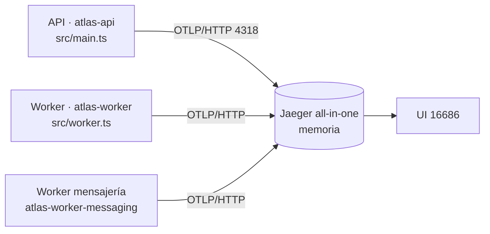
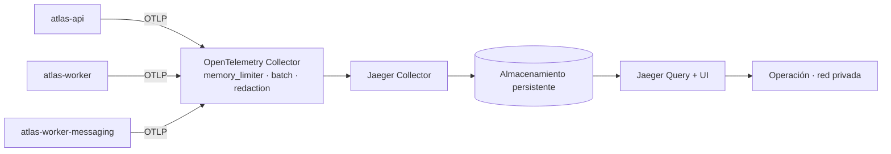

# Fase 1 — Diseño de la arquitectura de observabilidad

Cómo se integra OpenTelemetry en AtlasBackend **sin que el dominio sepa que Jaeger existe**.

## Principio rector

```
Dominio  →  TracingService  →  @opentelemetry/api  →  NodeSDK  →  OTLP  →  Jaeger
            ^^^^^^^^^^^^^^
            única dependencia que ve un servicio de negocio
```

Ningún módulo de `src/modules/**` importa un paquete de Jaeger, y los que necesiten un span
inyectan `TracingService`. Cambiar de backend de trazas —o retirarlas— es cambiar el
exportador en un archivo.

## Topologías

### Desarrollo



Un contenedor, almacenamiento en memoria, sólo en `127.0.0.1`. `yarn jaeger:up`.

### Producción



El Collector es la pieza que hace que **una caída de Jaeger no se note en el backend**:
absorbe el lote, reintenta y descarta si hace falta. Detalle en `03-production-topology.md`.

## Decisiones

| Decisión | Elegido | Alternativa descartada | Por qué |
| --- | --- | --- | --- |
| Protocolo | **OTLP/HTTP (`http/protobuf`)** | OTLP/gRPC | Un puerto TCP normal, atraviesa cualquier proxy y no añade `@grpc/grpc-js` (≈ 8 MB) a la imagen. El volumen de este backend no justifica gRPC |
| Exportador | `@opentelemetry/exporter-trace-otlp-http` | Cliente Jaeger heredado | El cliente Jaeger está retirado desde 2023; Jaeger recibe OTLP nativo desde 1.35 |
| Instrumentaciones | **Cinco, explícitas** | `auto-instrumentations-node` | Cuarenta parches de los que se usan cinco; `fs` y `dns` entierran la operación de negocio bajo ruido |
| Sequelize | **No se instrumenta** | `opentelemetry-instrumentation-sequelize` (terceros) | `pg` ya ve **toda** consulta que Sequelize emite. Añadirla duplicaría cada consulta en dos spans que describen la misma llamada, y el paquete no es oficial |
| Muestreo | `ParentBasedSampler(TraceIdRatioBased)` | Muestreo siempre-sí | Media traza no sirve: si un servicio aguas arriba decidió muestrear, se respeta |
| Propagadores | `tracecontext` + `baggage` (W3C) | B3 | No hay ningún consumidor heredado que lo exija; B3 sólo engorda cada petición saliente |
| Configuración | `process.env` en el arranque, validada en el esquema zod | `ConfigService` | El SDK corre **antes** de que exista el contenedor de Nest. Las mismas claves se declaran en `env.observability.schema.ts` para que queden validadas y documentadas |
| Activación | **Opt-in** (`OTEL_ENABLED=false` por defecto) | Siempre encendido | Un despliegue que no mira trazas no debe pagar parcheo ni conexiones de fondo |
| Portador entre procesos | `outbox_events.metadata_json.otel` | Columna nueva; dentro del payload | La columna JSONB **ya existe**; el payload lo valida `validateEnvelope` y rechaza claves desconocidas |
| Logs | Campos en `AppFileLogger` | Reemplazar por Pino | Pino no está instalado y el pipeline a Mongo depende del formato actual |
| Spans de middleware Express | **Apagados** (`ignoreLayersType: [MIDDLEWARE]`) | Dejarlos | Medido: 7 de 18 spans por petición eran middleware y 5 duraban 0,0 ms. El coste del parseo del cuerpo sigue visible como el hueco entre el span del servidor y el del manejador |
| Texto de las consultas | **Redactado en proceso** (`redactSqlLiterals`) | Publicarlo tal cual | Sequelize incrusta literales: una petición de login publicó el hash del identificador de una persona. Ver abajo |
| Cadena de consulta de las URLs | **Borrada antes de exportar** (`RedactingSpanProcessor`) | Filtrar sólo en el Collector | Las URLs firmadas de MinIO llevan la credencial en la query; en desarrollo no hay Collector que la filtre |
| Línea de versiones OTel | **0.222** en todo el árbol | Mantener 0.220 | `instrumentation-ioredis@0.70` es la primera que soporta ioredis 6, y pide el core 0.222. Mezclar líneas deja dos copias de `@opentelemetry/instrumentation` |

## Identidad de los servicios

`<producto>-<componente>`, uno por proceso. Reutilizar un nombre entre API y worker haría que
el grafo de dependencias de Jaeger mostrara **un solo nodo hablando consigo mismo**.

| Proceso | `service.name` por defecto | Sobrescribible con |
| --- | --- | --- |
| `src/main.ts` | `atlas-api` | `OTEL_SERVICE_NAME` |
| `src/worker.ts` | `atlas-worker` | `OTEL_SERVICE_NAME` |
| `src/messaging-worker.ts` | `atlas-worker-messaging` | `OTEL_SERVICE_NAME` |

Recurso común: `service.namespace=atlas`, `service.version` (de `OTEL_SERVICE_VERSION` o
`BUILD_VERSION`), `deployment.environment.name`.

## Convenciones de nombres

**Spans de negocio:** `<dominio>.<acción>`, estables y **sin identificadores**.

```
credit.evaluate      customer.register     identity.verify
outbox.publish       outbox.dispatch       job.run
notification.dispatch
```

Nunca `credit.evaluate.387471`: un nombre construido con un id crea una serie por ejecución e
inutiliza toda agregación.

**Atributos propios**, con namespace `app.*` para no colisionar con las convenciones
semánticas:

```
app.module          app.operation        app.tenant.id
app.entity.type     app.entity.id        app.job.name
app.job.attempt     app.job.outcome      app.job.processed.count
app.event.type      app.error.retryable
```

## Atributos prohibidos

Nunca, en ningún span: contraseñas, tokens, cookies, cabeceras `Authorization`, documentos de
identidad, números de cuenta, montos de crédito, nombres, teléfonos, correos, cuerpos de
petición o respuesta, valores de parámetros SQL, valores de Redis, variables de entorno.

## Política de errores

1. La excepción se registra **una sola vez**, en el span donde nace.
2. La **descripción del estado es un código estable** (`error.type`), nunca el mensaje: el
   mensaje puede llevar fragmentos del cuerpo de la petición.
3. El span se marca `ERROR` y el error se **relanza** intacto. La observabilidad no altera el
   flujo de control ni convierte un fallo en un éxito.
4. Un valor lanzado que no sea `Error` se sustituye por su código estable antes de registrarlo.

## Dos hallazgos que cambiaron el diseño

Ninguno se veía compilando ni pasando pruebas; los dos salieron de mirar una traza real.

### La instrumentación de Redis no hacía nada

El repositorio tiene **ioredis 6.0.0**. `@opentelemetry/instrumentation-ioredis@0.68` declara
soportar `>=2.0.0 <6`, así que no parcheaba nada y **no emitía ni un error**. Una petición de
login ejecutaba tres comandos Redis medidos en el servidor y la traza no mostraba ninguno.

Arreglo: subir a `instrumentation-ioredis@0.70` (soporta `<7`), lo que arrastra toda la línea
de versiones a 0.222 para no acabar con dos copias de `@opentelemetry/instrumentation`.

**Consecuencia permanente:** al subir `ioredis`, `pg`, `express` o `undici` hay que volver a
comprobar el rango de su instrumentación, porque el síntoma de la incompatibilidad es la
ausencia de spans, no un fallo. Está en el runbook, §1.

### Sequelize incrusta valores en el texto de la consulta

`enhancedDatabaseReporting: false` deja fuera los parámetros LIGADOS, y con eso bastaría si
todas las consultas los usaran. No es el caso: medido el 2026-09-18, una petición de login
generó `… WHERE "identifier_hash" = '2a91be56…'`, es decir el identificador seudonimizado de
una persona, dentro de `db.query.text`.

La regla del repositorio ya lo decía para los logs —«nunca loguear SQL, Sequelize inlinea
valores»— y no se estaba aplicando al canal nuevo. `redactSqlLiterals` sustituye todo literal
de cadena por `'?'` conservando la forma de la sentencia.

## Estrategia de cierre

`SIGTERM` y `SIGINT` → `stopTracing()` → `sdk.shutdown()` (vacía el lote pendiente). **Nunca
lanza**: perder spans no puede convertir un apagado limpio en una caída. Ya está enganchado en
los tres entrypoints.

## Estrategia para el trabajo asíncrono

```mermaid
sequenceDiagram
  participant API as atlas-api
  participant DB as outbox_events
  participant W as atlas-worker
  API->>API: span outbox.publish (PRODUCER)
  API->>DB: INSERT … metadata_json.otel = {traceparent}
  Note over DB: commit; el contexto en memoria muere aquí
  W->>DB: reclamo con lease
  W->>W: propagation.extract(metadata_json.otel)
  W->>W: span outbox.dispatch (CONSUMER, padre = el productor)
```

Una fila escrita antes de que existiera esta propagación **no lleva portador**: `extract`
devuelve el contexto activo y el consumidor abre una traza raíz. La compatibilidad hacia atrás
es por construcción, no por una rama especial.

## Estrategia de muestreo

| Entorno | Ratio | Razón |
| --- | --- | --- |
| desarrollo | 1.0 | Volumen nulo; se quiere ver todo |
| pruebas | exportador en memoria | Una prueba no habla con la red |
| staging | 0.25 – 1.0 | Según tráfico real |
| producción | 0.05 – 0.20 | Punto de partida, **a ajustar con medición** |

Configurable por `OTEL_TRACES_SAMPLER_ARG`, nunca escrito en el código.

## Estructura de archivos

```
src/observability/
├── telemetry.bootstrap.ts    efecto de importación: arranca el SDK
├── telemetry.config.ts       lectura y validación de process.env
├── telemetry.constants.ts    nombres de span, atributos, exclusiones
├── telemetry.types.ts        tipos de la capa
├── telemetry.instrumentations.ts  las cinco instrumentaciones
└── tracing.ts                startTracing / stopTracing

src/common/observability/
├── tracing.service.ts            fachada para el dominio
├── trace-context.service.ts      lectura de trace_id / span_id
├── trace-error.ts                registro uniforme de excepciones
├── trace-response.interceptor.ts cabecera x-trace-id
├── messaging-trace.service.ts    inyección / extracción entre procesos
└── observability.module.ts       (existente) registra todo lo anterior
```

El arranque vive en `src/observability/` y **no** en `common/`: es lo único del repositorio
que corre fuera del contenedor de inyección, y la separación lo hace evidente.

## Criterio de aceptación de la fase

Cada decisión tiene alternativa evaluada y motivo. **Cumplido.**
