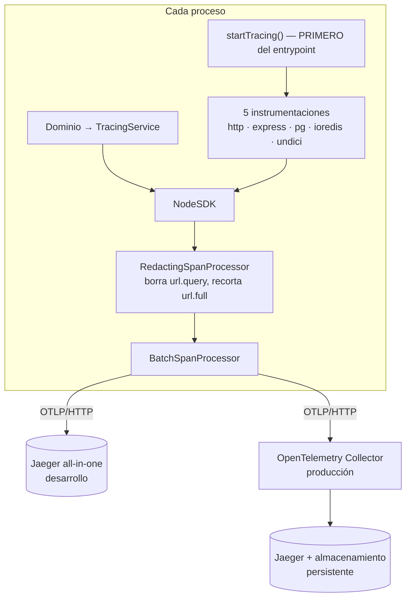

# Informe de implementación — trazabilidad distribuida en AtlasBackend

Fecha: 2026-09-18. Estado final al pie.

## 1. Resumen ejecutivo

AtlasBackend ya arrancaba un SDK de OpenTelemetry, pero exportaba **trazas incompletas y con
datos personales dentro**: instrumentación indiscriminada sin exclusiones, sin muestreo basado
en el padre, sin capa para el dominio, sin propagación al trabajo asíncrono, sin forma de
levantar Jaeger y sin una sola prueba. Redis, además, **no se instrumentaba en absoluto** sin
que nada lo dijera.

Ahora una petición produce una traza legible de quince spans que atraviesa HTTP, controlador,
Redis y PostgreSQL; el `trace_id` viaja en la respuesta y en cada línea de log; el trabajo que
salta al worker por el outbox **conserva la misma traza**; los trabajos programados abren su
propia traza raíz; y tres barreras distintas impiden que un dato personal llegue al almacén.

El valor concreto: ante un fallo reportado por un usuario, soporte pide el `x-trace-id` y ve el
recorrido completo —incluida la parte que ocurrió minutos después en otro proceso— sin
reproducir el incidente.

## 2. Arquitectura final



Tres procesos, tres nombres: `atlas-api`, `atlas-worker`, `atlas-worker-messaging`.

## 3. Archivos creados

| Archivo | Responsabilidad |
| --- | --- |
| `src/observability/telemetry.types.ts` | Contratos de la capa |
| `src/observability/telemetry.constants.ts` | Nombres de span, atributos, rutas excluidas |
| `src/observability/telemetry.config.ts` | Lee y acota las variables `OTEL_*` |
| `src/observability/telemetry.instrumentations.ts` | Las cinco instrumentaciones, con sus exclusiones |
| `src/observability/sql-redaction.ts` | Borra los literales que Sequelize incrusta en el SQL |
| `src/observability/redacting-span-processor.ts` | Última barrera en proceso: quita la query de las URLs |
| `src/common/observability/tracing.service.ts` | Fachada para el dominio |
| `src/common/observability/trace-context.service.ts` | Lee `trace_id` / `span_id` activos |
| `src/common/observability/trace-error.ts` | Registro uniforme de excepciones |
| `src/common/observability/trace-response.interceptor.ts` | Cabecera `x-trace-id` |
| `src/common/observability/messaging-trace.service.ts` | Inyección y extracción entre procesos |
| `src/common/observability/messaging-attributes.ts` | Atributos de mensajería, definidos una vez |
| `src/platform/events/local-consumer-dispatch.publisher.ts` | Extraído del relay (gate de tamaño) |
| `docker-compose.jaeger.yml` | Jaeger local, capa sobre el compose principal |
| `infra/otel-collector/otel-collector.config.yml` | Collector de producción |
| `scripts/verify-jaeger.sh` + `scripts/emit-verification-span.ts` | Comprobación de punta a punta |
| `docs/observability/*.md` | Ocho documentos |
| 9 ficheros de prueba | 120 unitarias + 7 de integración |

## 4. Archivos modificados

| Archivo | Cambio |
| --- | --- |
| `src/observability/tracing.ts` | Reescrito: recurso completo, sampler, propagadores, saneado, guarda de arranque tardío |
| `src/main.ts`, `worker.ts`, `messaging-worker.ts` | `startTracing('<nombre-del-proceso>')` como primera sentencia |
| `src/app.module.ts` | `TraceResponseInterceptor` como interceptor MÁS EXTERNO |
| `src/common/observability/observability.module.ts` | Registra y exporta la capa de trazado |
| `src/common/logging/request-context.ts` | Expone `span_id` y `trace_flags`, delegando en la capa |
| `src/common/logging/app-file-logger.service.ts` | Emite `trace_id`, `span_id`, `trace_flags` |
| `src/common/filters/http-exception.filter.ts` | Marca el span: 5xx como error, 4xx sólo con su código |
| `src/platform/events/sequelize-outbox-writer.ts` | Span PRODUCER + portador en `metadata_json` |
| `src/platform/events/outbox-relay.service.ts` | Span CONSUMER enlazado; publicador extraído |
| `src/modules/runtime-jobs/runtime-jobs-scheduler.service.ts` | Traza raíz por tanda, span por inquilino |
| 4 servicios de dominio | Un span de negocio cada uno (ver `02-business-spans-catalog.md`) |
| `package.json`, `yarn.lock` | Línea 0.222, cinco instrumentaciones, `auto-instrumentations-node` **retirado** |
| `.env.example` | 13 variables documentadas |

`src/observability/tracing-bootstrap.ts` se **eliminó**: cada entrypoint declara ahora su propio
nombre de servicio, que es lo que ese archivo no podía hacer.

## 5. Instrumentaciones activas

| Tecnología | Paquete | Qué cubre |
| --- | --- | --- |
| HTTP | `instrumentation-http@0.222` | Entrante y saliente por `http`/`https` |
| Express | `instrumentation-express@0.70` | Enrutado (**sin** capas de middleware) |
| PostgreSQL | `instrumentation-pg@0.74` | Toda consulta de Sequelize, con el SQL redactado |
| Redis | `instrumentation-ioredis@0.70` | Límite de tasa, locks, caché, idempotencia |
| `fetch` | `instrumentation-undici@0.32` | Motor de decisiones, MinIO, proveedores |

**No se instrumenta Sequelize**: emite por `pg`, que ya está instrumentado; añadirla duplicaría
cada consulta en dos spans que describen la misma llamada.

## 6. Spans de negocio

`credit.evaluate`, `risk.assess`, `customer.register`, `notification.dispatch`,
`outbox.publish` (PRODUCER), `outbox.dispatch` (CONSUMER), `job.run` (raíz), `job.tenant.run`.
Cuatro operaciones más quedaron **deliberadamente sin span propio** porque eran 1:1 con su
endpoint; llevan atributos sobre el span del servidor. Catálogo: `02-business-spans-catalog.md`.

## 7. Correlación de logs

Cada línea emitida dentro de una petición trazada lleva `trace_id`, `span_id` y `trace_flags`,
con los nombres de la convención de OpenTelemetry. Fuera de una traza van a `null`: nunca un
identificador inventado. Verificado: el log del filtro de excepciones y la cabecera
`x-trace-id` de la misma petición coinciden.

## 8. Workers y propagación

La API escribe el portador W3C en `outbox_events.metadata_json.otel` **dentro** del span
productor; el relay lo extrae al reclamar y abre un span consumidor con ese padre. Verificado
contra PostgreSQL real: mismo `trace_id`, `span_id` distintos, relación padre-hijo correcta.
Una fila sin portador, con portador manipulado o escrita antes de esta propagación **se procesa
igual** y abre su propia traza. **No hizo falta ninguna migración**: la columna ya existía.

## 9. Seguridad

Tres barreras, cada una cubriendo lo que la anterior no ve:

1. **La instrumentación no lo captura**: sin cabeceras, sin parámetros ligados, sin cuerpos, y
   el serializador de Redis devuelve sólo el nombre del comando.
2. **En proceso, antes de exportar**: `redactSqlLiterals` borra los literales que Sequelize
   incrusta en el texto de la consulta; `RedactingSpanProcessor` quita la cadena de consulta de
   cualquier URL —las firmadas de MinIO llevan la credencial ahí—.
3. **En el Collector**: `attributes/redact` para lo que empiece a emitirse tras una subida de
   versión sin que nadie lo note.

Verificado sobre una traza real: ni el correo, ni el documento, ni la cadena de consulta, ni el
hash del identificador aparecen en ninguna parte.

## 10. Pruebas realizadas

| Comando | Resultado |
| --- | --- |
| `yarn type-check` | ✅ |
| `yarn type-check:tests` | ✅ |
| `yarn lint` | ✅ (103 avisos, tope 109; **ninguno nuevo**) |
| `yarn format:check` | ✅ |
| `yarn check:file-size` | ✅ |
| `yarn check:architecture` | ✅ (98 infracciones, línea base 98, **0 nuevas**) |
| `yarn check:auth-coverage` · `check:migrations` · `check:openapi` · `check:env-example` · `check:no-env-file` | ✅ |
| `yarn test:unit` | ✅ **5386 pruebas, 526 suites** |
| `yarn test:integration` | 123/124. **El fallo es previo**: `api-worker-isolation`, verificado en un worktree limpio en HEAD sin estos cambios (ver §14) |
| `yarn jaeger:verify` | ✅ y **comprobado que no miente**: falla con Jaeger apagado y con el destino equivocado |
| E2E manual contra Jaeger real | ✅ 15 spans, jerarquía correcta, sondas excluidas, sin fugas |

La configuración del Collector se validó con el binario real
(`otel/opentelemetry-collector-contrib:0.138.0 validate`), y se comprobó que **rechaza** una
condición OTTL rota: el verde significa algo.

## 11. Rendimiento

**No medido bajo carga.** Lo que sí está medido, y el método para lo que falta, en
`05-performance-results.md`. Lo verificado: el proceso no cae ni se bloquea con el destino de
trazas inalcanzable, y el cierre vacía el lote sin lanzar.

## 12. Uso local

```bash
yarn jaeger:up
echo 'OTEL_ENABLED=true' >> .env
echo 'OTEL_EXPORTER_OTLP_TRACES_ENDPOINT=http://localhost:4318/v1/traces' >> .env
yarn start:dev
yarn jaeger:verify
# UI: http://localhost:16686
```

## 13. Producción

Collector como sidecar → Jaeger Collector/Query → almacenamiento persistente (**Badger** para
empezar; OpenSearch sólo cuando la retención o la búsqueda lo exijan). Retención de 7 días. UI
nunca publicada. Detalle y disparadores en `03-production-topology.md`.

## 14. Riesgos restantes

| Riesgo | Estado |
| --- | --- |
| **Sobrecarga sin medir bajo carga** | Abierto. El arnés existe (`yarn perf:load`); falta un entorno con tráfico representativo |
| **Subir `ioredis`, `pg`, `express` o `undici`** puede dejar su instrumentación muda sin un solo error | Mitigado con procedimiento en el runbook §1; **no hay gate automático** |
| `EventContext.traceparent` (`platform/observability/event-context.ts`) sigue siendo un campo que siempre vale `null` | Preexistente, **no tocado**: la propagación duradera va por `metadata_json` y ese campo es para eventos hijos dentro del mismo proceso, donde el contexto ya viaja solo |
| `api-worker-isolation` en rojo | **Preexistente y ajeno.** `CustomerTelemetryModule` pasó a ser alcanzable desde el worker en el commit `654ca01` sin actualizar `WORKER_EXCLUDED_MODULES`. Verificado en worktree limpio en HEAD. **Pertenece a otra sesión** |
| `package-lock.json` del ERP y otros repos | Fuera de alcance de este repositorio |

## 15. Matriz de cumplimiento

| Requisito | Estado | Evidencia |
| --- | ---: | --- |
| Jaeger se levanta localmente | Cumplido | `docker-compose.jaeger.yml`, `yarn jaeger:up` |
| Arranca con observabilidad encendida | Cumplido | E2E en `:3099` |
| Arranca con observabilidad apagada | Cumplido | `tracing.spec.ts` |
| Funciona con Jaeger caído | Cumplido | Medido: `ECONNREFUSED` en segundo plano, proceso vivo |
| Trazas HTTP | Cumplido | Traza real, 15 spans |
| Controllers en el flujo | Cumplido | `request handler - /api/v1/auth/login` |
| Spans de negocio | Cumplido | `02-business-spans-catalog.md` |
| PostgreSQL | Cumplido | 8 spans `pg.query` / `pg.connect` |
| Sequelize instrumentado | Cumplido **por `pg`** | Decisión justificada en `01` |
| Redis | Cumplido | `pttl`, `pexpire`, `incr` — tras corregir la incompatibilidad de versión |
| HTTP externo | Parcial | `undici` activo y `url.full` saneado; **no ejercitado** con un proveedor real en esta puesta en marcha |
| Errores marcados | Cumplido | `trace-error.spec.ts` + traza real |
| Logs con `trace_id` | Cumplido | Misma petición: log y cabecera coinciden |
| `x-trace-id` en la respuesta | Cumplido | `trace-response.interceptor.spec.ts` + E2E |
| API y worker en la misma traza | Cumplido | `outbox-trace-continuity.spec.ts` contra PostgreSQL real |
| Cron con traza raíz | Cumplido | `runtime-jobs-scheduler.service.ts` |
| Health checks excluidos | Cumplido | Verificado: `/api/v1/health` no emite `x-trace-id` |
| Sin tokens, contraseñas ni PII | Cumplido | Búsqueda directa sobre la traza real: 0 coincidencias |
| Pruebas unitarias | Cumplido | 5386 en verde |
| Pruebas de integración | Cumplido | 7 nuevas en verde; 1 rojo previo ajeno |
| E2E con Jaeger | Cumplido | `yarn jaeger:verify`, con control negativo |
| Build y lint | Cumplido | Batería completa |
| Documentación y runbook | Cumplido | Ocho documentos |
| Diseño de producción | Cumplido | `03-production-topology.md` |
| **Rendimiento medido** | **NO cumplido** | `05-performance-results.md` lo declara abierto |

## 16. Estado final

```
COMPLETO CON OBSERVACIONES
```

Todo lo instrumentado está verificado ejecutándolo, no sólo compilando. Las dos observaciones
que impiden declararlo `COMPLETO` son explícitas y están documentadas: **la sobrecarga no se ha
medido bajo carga representativa**, y **la instrumentación de HTTP saliente no se ha ejercitado
contra un proveedor real**. Ninguna de las dos se afirma como resuelta.
