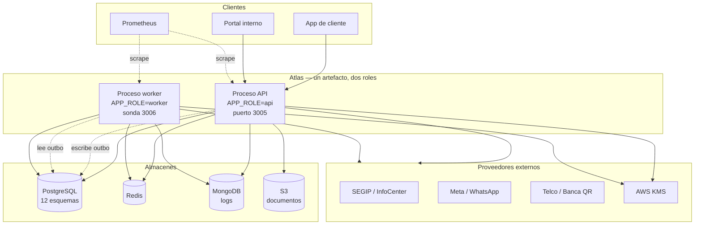
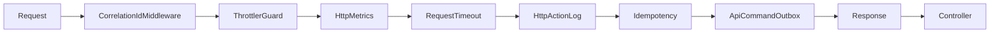

# Visión de arquitectura

## Estilo real

**Monolito modular desplegable en dos roles.** Un único artefacto compilado, un único `AppModule`, 28 módulos NestJS con límites explícitos, y una variable de entorno que decide si el proceso atiende HTTP, ejecuta trabajo de fondo, o ambas cosas.

`VERIFICADO` — no es una arquitectura de microservicios: hay un solo `package.json`, un solo despliegue y una sola base de datos transaccional. Tampoco es un monolito plano: los módulos declaran sus dependencias, los dominios tienen esquemas físicos separados y existen gates automáticos que vigilan los límites.

Detalle en [[02-architecture/architectural-style]].

## El diagrama que hay que entender primero



Las vistas formales están en [[02-architecture/views/c4-context]], [[02-architecture/views/c4-container]] y [[02-architecture/views/c4-component]].

## Las cinco decisiones que explican el resto

### 1. Un artefacto, dos roles

> [!info] Verificado
> `main.ts` y `worker.ts` comparten `AppModule`. El worker usa `createApplicationContext()`, que instancia **todos los providers pero no registra ninguna ruta**: los controllers de negocio simplemente no existen en ese proceso.
>
> Ambos entrypoints comprueban `APP_ROLE` y **salen con código 1** si no les corresponde. El comentario del código lo justifica: *"un rol mal puesto tiene que doler al desplegar, no en la primera auditoría"*.

Consecuencia: no hay dos bases de código que mantener sincronizadas, y no hay forma de que un despliegue exponga por accidente los controllers de negocio en el contenedor que el manifiesto trata como interno.

### 2. Los eventos van por outbox, no por broker

No hay Kafka, RabbitMQ ni SQS. Los eventos de dominio se escriben en `platform_ops.outbox_events` **dentro de la misma transacción** que el cambio de negocio, y el job `process_outbox` los publica después. Ver [[07-async-processing/events]] y [[02-architecture/adr/0001-outbox-en-postgresql|ADR-0001]].

Consecuencia: se elimina la clase de fallo *"la escritura se confirmó pero el evento se perdió"*, a cambio de latencia de publicación (un intervalo de job) y de carga adicional sobre PostgreSQL.

### 3. Los dominios se separan por esquema, no por base

12 esquemas PostgreSQL (`iam`, `customer`, `privacy`, `telemetry`, `catalog`, `credit`, `risk`, `case_management`, `audit`, `integrations`, `messaging`, `platform_ops`) con una única fuente de verdad del mapa tabla → esquema.

> [!warning] Riesgo — el límite es lógico, no físico
> **153 de 244 FK cruzan el límite de un esquema.** Los dominios comparten transacciones e integridad referencial. Extraer uno a su propio servicio exigiría sustituir esas FK por validación en aplicación y aceptar consistencia eventual. Ver [[02-architecture/module-boundaries]] y [[14-audits/risks-register|ARCH-001]].

### 4. La configuración se valida al arrancar, no en runtime

159 variables pasan por Zod en `parseEnv()`. Si algo no valida, el proceso **lanza con el detalle por campo** y no arranca.

Consecuencia: los fallos de configuración aparecen en el despliegue, no como un 500 intermitente tres horas después. Ver [[10-operations/configuration]].

### 5. La cadena de interceptores tiene un orden deliberado



`VERIFICADO` — el orden está en `app.module.ts:101-116`, y cada posición tiene una razón escrita en el código:

| Interceptor | Por qué está donde está |
|---|---|
| `HttpMetricsInterceptor` | El más externo: mide la latencia **total**, incluyendo el resto de interceptores |
| `RequestTimeoutInterceptor` | Justo dentro de métricas, para que un request cortado por timeout **sí** quede medido con su 503 en vez de desaparecer de las series |
| `HttpActionLogInterceptor` | Antes de idempotencia, para que los *replays* de idempotencia también queden registrados |
| `IdempotencyInterceptor` | Reclama la clave antes de que se ejecute el comando |
| `ApiCommandOutboxInterceptor` | Emite el evento del comando tras la ejecución |
| `ResponseInterceptor` | El más interno: envuelve el valor devuelto por el controller |

Detalle en [[02-architecture/critical-sequences]].

## Envoltura de respuesta

Toda respuesta exitosa sale con la misma forma:

```json
{ "requestId": "<correlationId>", "data": { }, "timestamp": "<ISO-8601>" }
```

`requestId` es el ID de correlación del request, lo que permite atar la respuesta que ve el cliente con las líneas de log y la traza. Ver [[04-api/conventions]].

## Atributos de calidad observados

| Atributo | Cómo se sostiene | Evidencia |
|---|---|---|
| Disponibilidad | Readiness que distingue dependencia obligatoria de informativa; apagado con drenado; `tini` para propagar señales | `health.controller.ts`, `GracefulShutdownService` |
| Resiliencia | Circuit breaker + reintentos por adaptador; timeout en todo probe; job de rescate de eventos atascados | `common/resilience/`, `reclaim_stuck_events` |
| Consistencia | Outbox transaccional; 244 FK; idempotencia por clave en comandos | `outbox_events`, `idempotency_keys` |
| Auditabilidad | Log de acciones HTTP, auditoría operativa, `data_change_logs`, catálogos de sistema | esquema `audit`, `platform_ops` |
| Seguridad | 3 guards en cadena, Zod en toda entrada, PII cifrada, rate limiting distribuido | [[08-security/security-overview]] |
| Mantenibilidad | Gates de tamaño de archivo, de esquemas de dominio, de sobrelectura y de uso de cabecera de tenant | `scripts/check-*.ts` |
| Rendimiento | Pools dimensionados, modelo de lectura separado, baseline de consultas capturable | `DB_POOL_*`, `read_api` |

## Lo que la arquitectura no resuelve hoy

- **Escalado independiente por dominio**: al ser un artefacto único, se escala todo o nada (aunque API y worker escalan por separado).
- **Aislamiento de fallo entre dominios**: un problema en el pool de PostgreSQL afecta a todos los dominios a la vez.
- **Latencia de publicación de eventos**: acotada por el intervalo del job `process_outbox`, no por el instante de la escritura.

Ver [[02-architecture/architecture-risks]].

## Relaciones

- [[02-architecture/containers-and-services]] · [[02-architecture/components]] · [[02-architecture/dependency-map]]
- [[02-architecture/runtime-topology]] · [[02-architecture/deployment-topology]] · [[02-architecture/trust-boundaries]]
