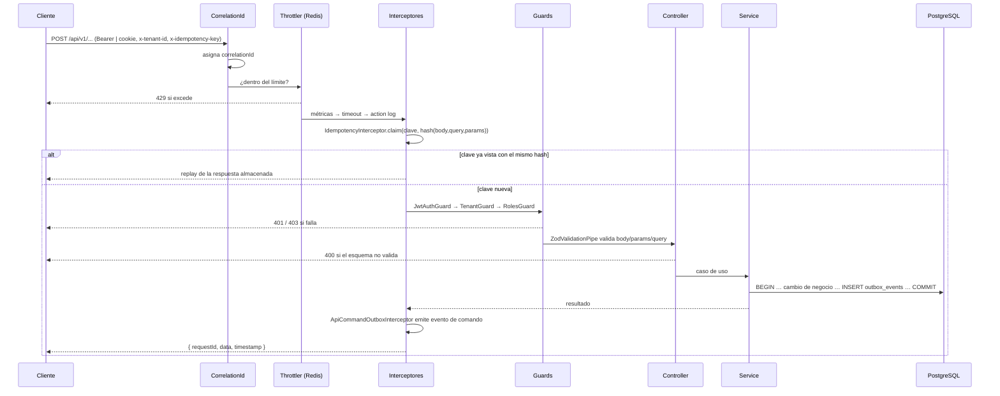
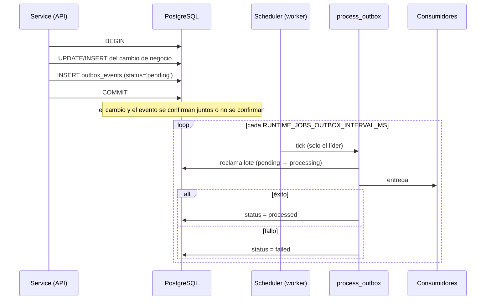
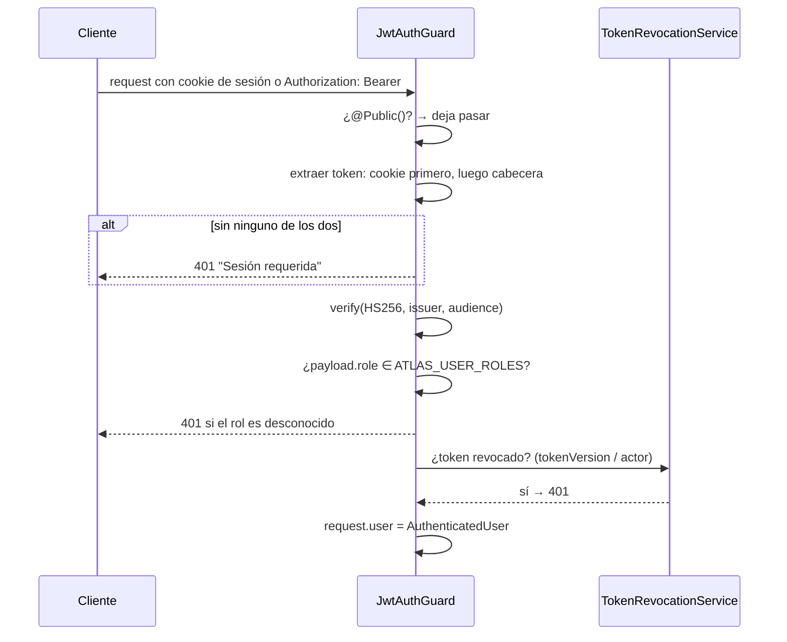
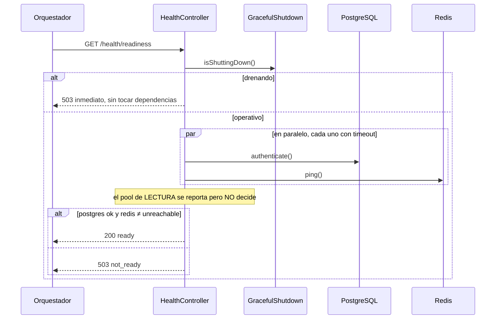

# Secuencias críticas

Los cuatro caminos cuyo comportamiento hay que entender antes de tocar nada.

## 1. Comando autenticado con idempotencia

El caso general de cualquier `POST`/`PUT`/`PATCH`/`DELETE`.

> [!info] La clave de idempotencia incluye el hash del request
> `IdempotencyInterceptor` calcula `requestHash(body, query, params)` y lo guarda junto a la clave, con ámbito `tenantScope` (el `tenantId` del token, o el header, o `'global'`) y `scope` = `MÉTODO + URL`.
>
> Repetir la **misma** clave con un cuerpo **distinto** no es un reintento: es un error del cliente. Guardar el hash permite distinguirlos en vez de devolver silenciosamente una respuesta que no corresponde al cuerpo enviado.
>
> Solo se aplica a `POST`/`PUT`/`PATCH`/`DELETE`, y **solo si el header viene**: sin `x-idempotency-key`, el interceptor no hace nada. Varios controllers lo exigen explícitamente (`throw new BadRequestException('X-Idempotency-Key header is required.')`).

## 2. Publicación de un evento de dominio (outbox)

> [!info] Por qué existe `reclaim_stuck_events`
> Si el proceso muere entre `pending → processing` y la resolución, el evento queda en `processing` **para siempre**: ninguna consulta de reclamo mira ese estado. Sería una pérdida silenciosa.
>
> El job `reclaim_stuck_events` rescata los que llevan más de `RUNTIME_JOBS_STUCK_EVENT_MINUTES` en `processing`. El propio código lo dice: *"sin este job esos eventos quedan en `processing` para siempre… se pierden en silencio"*.

## 3. Autenticación

Puntos que importan:

- **La cookie tiene prioridad sobre la cabecera.** Un cliente que envíe ambas usará la cookie.
- Un `Authorization` con formato distinto de `Bearer <token>` produce **401 inmediato**, no se ignora.
- El rol se valida contra `ATLAS_USER_ROLES`, la misma constante que usa el resolver de actor: no pueden desincronizarse.

Detalle en [[08-security/authentication]].

## 4. Readiness durante el apagado

> [!info] Dos decisiones deliberadas
> 1. **El drenado se comprueba primero y sin tocar dependencias.** Durante el apagado la respuesta debe ser inmediata y negativa, no depender de que PostgreSQL conteste.
> 2. **El pool de lectura se reporta pero no decide el readiness.** Es una dependencia *compartida* por todas las instancias: si la réplica cae, marcar `not_ready` sacaría del balanceador a **todo** el despliegue —incluidos los caminos de escritura, auth y onboarding, que siguen sanos— convirtiendo una degradación parcial en una caída total. El operador lo ve; el orquestador no actúa sobre ello.

## Relaciones

- [[02-architecture/views/c4-component]] · [[07-async-processing/events]] · [[08-security/authentication]] · [[09-observability/observability-overview]]
