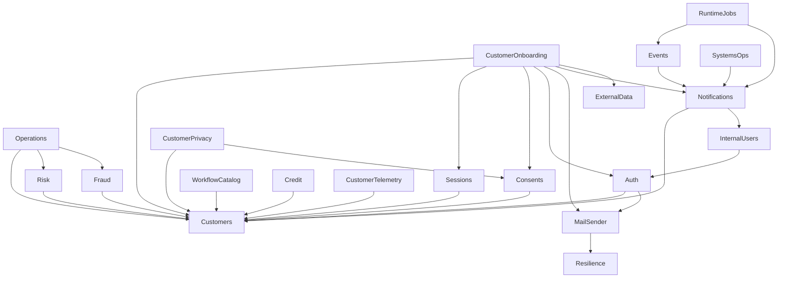

# Mapa de dependencias

## Dependencias entre módulos de negocio

Extraído del array `imports` de cada `@Module`, descartando `SequelizeModule.forFeature`, `ConfigModule` y `ThrottlerModule`.

## Grafo acíclico, sin excepciones

> [!info] Verificado
> **No hay ni un solo `forwardRef` en `src/`.** La regla del proyecto —*"sin dependencias circulares; `forwardRef` prohibido salvo justificación explícita"*— se cumple de hecho, no solo en el papel. El grafo de módulos es un DAG: se puede recorrer en orden topológico y razonar sobre él sin ciclos.
>
> Esto es lo que hace que la afirmación "los límites de módulo son reales" sea comprobable y no aspiracional.

## Módulos por acoplamiento entrante

| Módulo | Importado por | Qué exporta |
|---|---:|---|
| `CustomersModule` | **12** | `CustomersService`, `CustomersRepository`, `CustomerLifecycleService`, `CustomerEligibilityService`, `CustomerEligibilityRepository` |
| `NotificationsModule` | 4 | Servicio de notificaciones |
| `AuthModule` | 2 | Servicios de autenticación |
| `ConsentsModule` | 2 | Servicios de consentimiento |
| `MailSenderModule` | 2 | Envío de correo |
| `SessionsModule`, `ExternalDataModule`, `InternalUsersModule`, `RiskModule`, `FraudModule`, `EventsModule` | 1 cada uno | — |

> [!warning] `CustomersModule` es el núcleo compartido
> 12 de los 27 módulos de negocio dependen de él, y exporta **5 símbolos**, incluido `CustomersRepository`. Un repositorio exportado significa que otros módulos pueden consultar la persistencia de clientes directamente, sin pasar por su servicio.
>
> Consecuencia práctica: un cambio de firma en `CustomersService` o `CustomersRepository` propaga a casi la mitad del sistema. Es el punto donde la regla del proyecto —*"no exportar repositories salvo necesidad transaccional real y documentada"*— está bajo más presión. Ver [[13-change-impact/high-risk-components]].

## Módulos hoja

Sin dependencias hacia otros módulos de negocio: `Audit`, `CatalogManagement`, `DataQuality`, `Health`, `InternalPortal`, `LogSync`, `SchemaManagement`, `Customers`, `ExternalData`, `RuntimeHardening`, `Sessions` (solo hacia `Customers`).

Son los candidatos naturales a extracción si alguna vez se rompe el monolito.

## Dependencias de infraestructura (todas las comparten)

Registradas como globales en `AppModule`: `RedisModule`, `LifecycleModule`, `ResilienceModule`, `ObservabilityModule`, `CommonAuthModule`, `DatabaseModule`, `ReadDatabaseModule`, `RuntimeHardeningModule`.

## Acoplamiento en la capa de datos

El grafo de módulos es limpio; el de **tablas** no lo es tanto: **153 de 244 FK cruzan el límite de un esquema de dominio**. Los módulos están desacoplados en código y acoplados en la base de datos.

| Esquema | FK salientes a otros esquemas |
|---|---|
| Ver el desglose completo | [[05-data/relationship-catalog]] |

Ver [[02-architecture/module-boundaries]] para la lectura conjunta de ambos grafos.

## Dependencias externas

| Dependencia | Tipo | Criticidad | Si falla |
|---|---|---|---|
| PostgreSQL | Almacén transaccional | **Crítica** | El readiness devuelve 503 y la instancia sale del balanceador |
| Redis | Rate limiting, caché, líder de jobs | **Alta** en producción | Readiness falla si está configurado y no responde; en dev es opcional |
| MongoDB | Destino de sincronía de logs | Media | Degrada la consulta de logs; no afecta al readiness |
| S3 | Documentos de evidencia | Media | Falla la subida de evidencia de onboarding |
| AWS KMS | Cifrado de PII | Alta | Sin él se usa el proveedor `local` — ver [[08-security/data-protection]] |
| Proveedores externos (SEGIP, InfoCenter, Meta, telco) | Enriquecimiento y verificación | Variable | Circuit breaker por adaptador; ver [[06-integrations/index]] |

## Relaciones

- [[02-architecture/module-boundaries]] · [[02-architecture/communication-matrix]] · [[13-change-impact/dependency-impact-map]]
