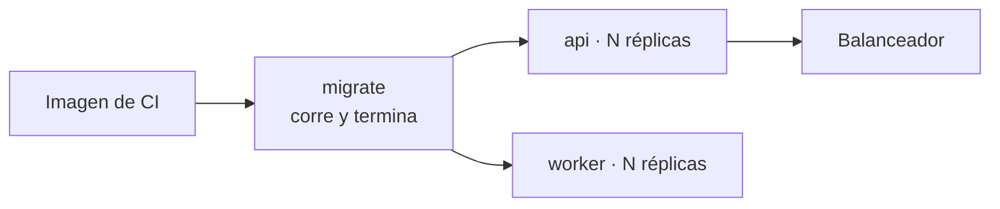

# Topología de despliegue

## Orden de arranque

`migrate` debe **terminar** antes de que arranquen `api` y `worker`: usa la identidad con DDL y deja el esquema en la versión que el código espera.

## Unidades

| Unidad | Comando | Réplicas | Puerto |
|---|---|---|---|
| `migrate` | `migrate.js up` | 1, efímera | — |
| `api` | `node dist/src/main.js` | N | 3005 |
| `worker` | `node dist/src/worker.js` | N (con líder) | 3006 |

Misma imagen en las tres. Lo que cambia es el comando y `APP_ROLE`.

## Sondas

| Sonda | Ruta | Decide |
|---|---|---|
| Liveness | `/health/liveness` | Si el proceso responde. No toca dependencias |
| Readiness | `/health/readiness` | Si puede atender: PostgreSQL **y** Redis (si está configurado) |
| Health general | `/health` | Informativo; incluye versión y commit |

El `HEALTHCHECK` de Docker corre cada 15 s con 30 s de gracia inicial.

## Escalado

| Componente | Cómo | Límite |
|---|---|---|
| `api` | Horizontal | **(réplicas × `DB_POOL_MAX`) ≤ `CONNECTION LIMIT` del rol** |
| `worker` | Horizontal | El liderazgo evita ejecución duplicada; el trabajo útil no crece linealmente |
| PostgreSQL | Vertical + réplicas de lectura | Un solo primario |
| Redis | — | Instancia única |

> [!warning] El pool es el techo real de la API
> Escalar réplicas sin revisar ese producto agota las conexiones del servidor. El síntoma (errores de adquisición del pool) aparece lejos de la causa (una réplica de más).

## Apagado

`tini` propaga `SIGTERM` → `GracefulShutdownService` marca drenado → readiness pasa a 503 **mientras los módulos siguen vivos** → se cierra el contexto → se cierra la sonda → flush de trazas → `exit(0)`.

El orquestador debe dar margen entre `SIGTERM` y `SIGKILL` para que el drenado sirva de algo.

## Configuración por entorno

Todo por variables de entorno, validadas con Zod al arrancar. En producción Zod además **exige** `REDIS_URL` y rechaza los secretos de ejemplo. Ver [[10-operations/configuration]].

## Lo que no está en el repositorio

`INFERIDO` — no hay manifiestos de Kubernetes, Terraform ni pipelines de despliegue: solo `docker-compose.prod.yml`, que espera una `ATLAS_IMAGE` ya construida. El despliegue real se define fuera.

## Relaciones

- [[10-operations/deployment]] · [[02-architecture/runtime-topology]] · [[02-architecture/views/c4-container]]
