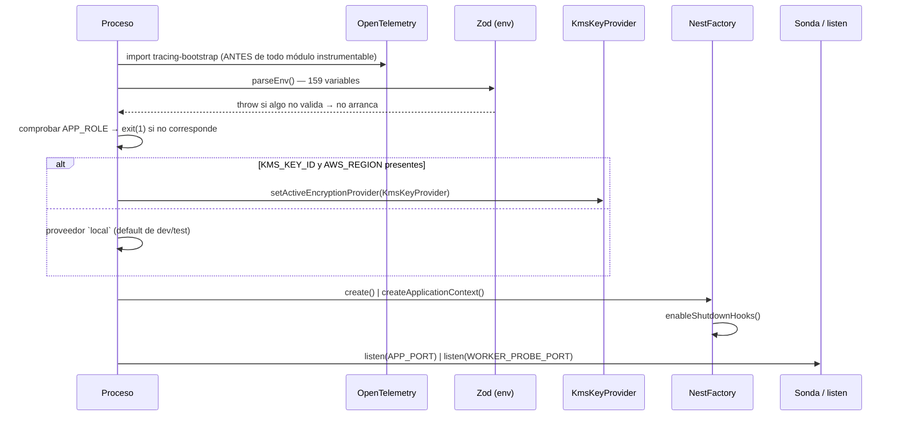
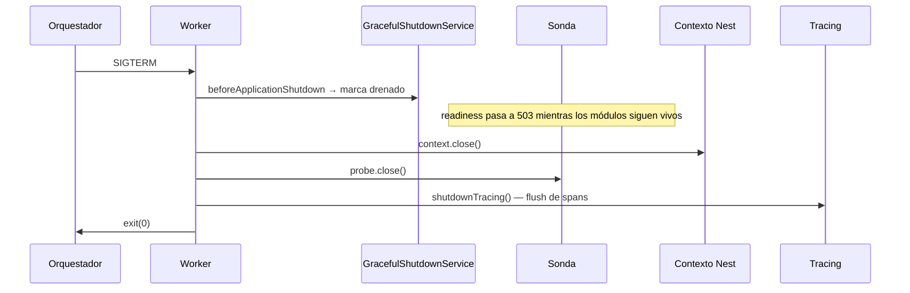

# Topología de ejecución

## Los dos procesos

| | Proceso API | Proceso worker |
|---|---|---|
| Entrypoint | `dist/src/main.js` | `dist/src/worker.js` |
| `APP_ROLE` | `api` o `all` | `worker` o `all` |
| Arranque Nest | `NestFactory.create()` | `NestFactory.createApplicationContext()` |
| Rutas HTTP | 266 rutas de negocio | **ninguna** — solo la sonda |
| Puerto | `APP_PORT` (3005) | `WORKER_PROBE_PORT` (3006) |
| Trabajo de fondo | No (si `APP_ROLE=api`) | Sí — 9 jobs programados |
| Endpoints expuestos | Todos + `/metrics` | `/health/liveness`, `/health/readiness`, `/metrics` |

> [!info] Verificado — el rol equivocado no arranca
> Ambos entrypoints comprueban su rol antes de construir nada:
>
> - `main.ts:30-33` — si `!runsHttpApi()`, registra el error y `process.exit(1)`.
> - `worker.ts:47-50` — si `appRole() === 'api'`, ídem.
>
> El comentario explica la elección: arrancar la API completa con `APP_ROLE=worker` *"expondría los controllers de negocio en un contenedor que el manifiesto trata como interno"*. Se falla en vez de montarlos.

## Por qué el worker no registra rutas

`createApplicationContext()` instancia todos los providers pero no levanta el servidor HTTP de Nest. Los controllers de negocio **no existen** en ese proceso: no es que estén protegidos, es que no hay dónde llamarlos.

Los servicios de fondo (`RuntimeJobsSchedulerService`, `SystemsHealthMonitorService`, `StartupSeedService`) arrancan solos porque `runsBackgroundWork()` es verdadero. **No hay un registro de jobs duplicado** en `worker.ts`: la lista vive en `scheduled-jobs.catalog.ts` y es la única.

## La sonda del worker

El worker levanta un servidor HTTP mínimo (`createWorkerProbeServer`) que no es Nest. Existe por dos razones concretas:

1. El orquestador necesita decidir si el contenedor está sano.
2. Prometheus necesita hacer *scrape* de las métricas del trabajo de fondo.

Usa un puerto distinto del de la API porque en un despliegue de una sola máquina ambos procesos conviven, y porque así el manifiesto puede publicar uno sin publicar el otro.

## Secuencia de arranque

> [!info] El orden del bootstrap de OpenTelemetry no es negociable
> `import './observability/tracing-bootstrap.js'` va **antes** que cualquier otro import en `main.ts` y `worker.ts`. Las auto-instrumentaciones envuelven HTTP, Express y `pg` en el momento de cargarlos; si un módulo instrumentable se carga primero, queda sin instrumentar. Es no-op salvo `OTEL_ENABLED=true`.

## Secuencia de apagado

`VERIFICADO` — el orden importa y está comentado en `worker.ts:80-82`: la sonda se cierra **después** del contexto, porque readiness debe dejar de responder 200 *mientras* los módulos siguen vivos, no después. Así el balanceador retira la instancia antes de que empiece a rechazar trabajo.

`SIGINT` se maneja además de `SIGTERM` para cubrir Ctrl-C en desarrollo y los orquestadores que envían `SIGINT`.

## Red de seguridad ante fallos asíncronos

Ambos procesos instalan `unhandledRejection` y `uncaughtException`. La razón está escrita en el código: sin esos handlers, Node imprime el stack a `stderr` **fuera de `AppFileLogger`**, así que el crash no llega a `Archivo.log` ni a la sincronía con MongoDB — quedaría sin evidencia en el propio pipeline de logs. Se registra con stack, se intenta un flush de trazas y se sale con código ≠ 0 para que el orquestador reinicie.

## Concurrencia del trabajo de fondo

Varias instancias de worker pueden convivir. La exclusión la resuelven `RuntimeJobsSchedulerService` y `job-tick-guard.ts` (liderazgo, reentrada, watchdog), separados a propósito del **catálogo** de jobs: la lista de qué corre cambia a menudo, la mecánica de concurrencia casi nunca.

Ver [[07-async-processing/schedulers]] y [[07-async-processing/ordering-and-concurrency]].

## Relaciones

- [[02-architecture/deployment-topology]] · [[10-operations/startup-shutdown]] · [[09-observability/observability-overview]]
