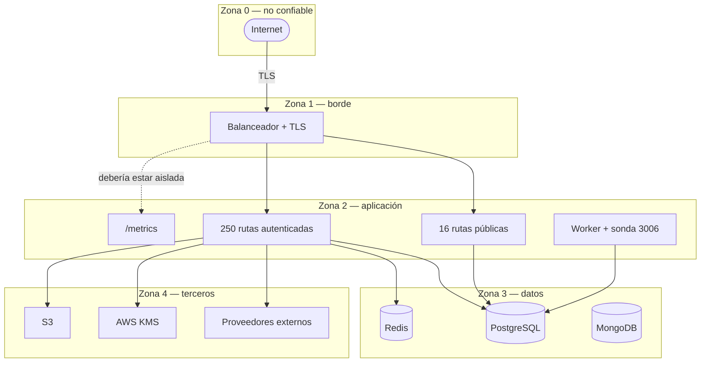

# Fronteras de confianza

## Cruces y sus controles

| Cruce | Control | Estado |
|---|---|---|
| Internet → borde | TLS, `helmet()`, CORS con lista explícita | ✅ |
| Borde → rutas públicas | Rate limiting + validación Zod | ✅ |
| Borde → rutas autenticadas | JWT HS256 + revocación → rol → tenant → pertenencia | ✅ |
| Borde → `/metrics` | **Sin autenticación de aplicación**; depende de aislamiento de red | ⚠️ no verificable desde el código |
| App → PostgreSQL | Identidad de runtime sin DDL; TLS opcional | ✅ |
| App → Redis | `REDIS_URL` | ✅ |
| App → terceros | Circuit breaker, timeouts, reintentos; consentimiento atado a cada consulta | ✅ |
| App → KMS | Credenciales de AWS; `providerId` embebido en cada valor | ✅ |
| Subida de archivos | Antimalware **antes** de almacenar | ✅ |

## Cambios de privilegio

| Punto | De → a |
|---|---|
| Login | Anónimo → actor con rol |
| `/auth/refresh` | Token expirado → token vigente |
| Rutas internas | Cliente → operador (por rol de token) |
| Migración | Runtime sin DDL → identidad con DDL (**proceso distinto**) |
| Jobs | Request de usuario → `SCHEDULER_ACTOR` con rol `system` |

> [!info] El planificador tiene identidad propia
> Los jobs corren como `{ sub: 'runtime-jobs-scheduler', role: 'system' }`, no suplantando a un usuario. En la auditoría se distingue lo que hizo el sistema de lo que hizo una persona — que es justo lo que hay que poder separar cuando se investiga un incidente.

## La frontera que el código no puede garantizar

> [!warning] Aislamiento de red de `/metrics` y de la sonda del worker
> `/metrics` (puerto 3005) y la sonda del worker (3006) no llevan autenticación de aplicación. La regla del proyecto exige red aislada, pero **eso se decide en el despliegue**, fuera de este repositorio.
>
> Confirmarlo y dejarlo escrito en [[10-operations/deployment]]. Ver [[14-audits/risks-register|SEC-004]].

## Relaciones

- [[08-security/threat-model]] · [[08-security/security-overview]] · [[02-architecture/views/c4-context]]
