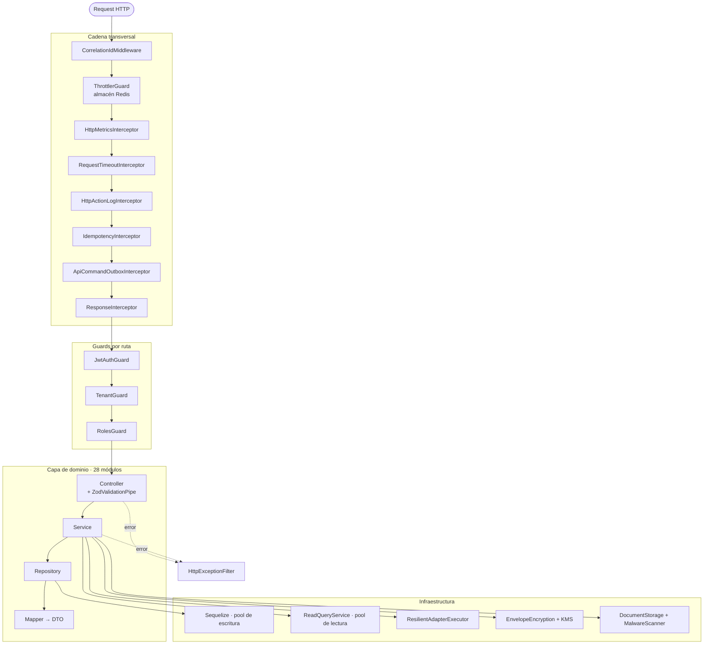

# Vista C4 — Componentes

Nivel 3: qué hay dentro del proceso API.



## Componentes transversales

| Componente | Responsabilidad | Evidencia |
|---|---|---|
| `CorrelationIdMiddleware` | Asigna/propaga el ID de correlación a todo request (`forRoutes('*')`) | `common/middleware/` |
| `ThrottlerGuard` | Rate limiting global; usa `RedisThrottlerStorage` si hay Redis, para que el contador sea **compartido entre instancias** | `app.module.ts:64-71` |
| `HttpMetricsInterceptor` | Métricas RED por ruta; el más externo, mide latencia total | `common/observability/` |
| `RequestTimeoutInterceptor` | Techo de tiempo por request; el 503 resultante **sí** queda medido | `common/interceptors/` |
| `HttpActionLogInterceptor` | Registro auditable de acciones; envuelve también los *replays* de idempotencia | `common/interceptors/` |
| `IdempotencyInterceptor` | Reclama `x-idempotency-key` en `POST`/`PUT`/`PATCH`/`DELETE` | `modules/runtime-hardening/` |
| `ApiCommandOutboxInterceptor` | Emite el evento de comando al outbox | `modules/runtime-hardening/` |
| `ResponseInterceptor` | Envuelve toda respuesta en `{ requestId, data, timestamp }` | `common/interceptors/` |
| `HttpExceptionFilter` | Modelo de error único; sanea el 5xx que ve el cliente | `common/filters/` |

## Guards

Se aplican por controller con `@UseGuards(JwtAuthGuard, TenantGuard, RolesGuard)`, en ese orden.

| Guard | Qué decide | Nota |
|---|---|---|
| `JwtAuthGuard` | Que el token sea válido, no esté revocado y su `role` pertenezca a `ATLAS_USER_ROLES` | Acepta el token por **cookie** (`ACCESS_TOKEN_COOKIE`) o por cabecera `Bearer`, en ese orden de preferencia |
| `TenantGuard` | Que `x-tenant-id` no **contradiga** el `tenantId` del token | Ver el aviso de abajo |
| `RolesGuard` | Que el `role` del token esté en la lista de `@Roles(...)` | Sin `@Roles`, deja pasar cualquier autenticado |

> [!warning] `TenantGuard` es permisivo por diseño
> Devuelve `true` —deja pasar— en dos casos: si el token **no trae `tenantId`**, y si el header `x-tenant-id` está ausente o vacío. Solo lanza `ForbiddenException` cuando el header está presente **y** difiere del token.
>
> Es un detector de contradicción, no un exigidor de tenant. El aislamiento real depende de que cada servicio filtre por `_tenant_id`; el gate `yarn check:tenant-header` vigila el uso de la cabecera con una línea base. Registrado como [[14-audits/risks-register|SEC-001]].

## Componentes de infraestructura

| Componente | Responsabilidad |
|---|---|
| `ReadQueryService` / `ReadDatabaseModule` | Pool de **lectura** separado; si `DB_READ_ENABLED` está apagado, apunta al de escritura |
| `ResilientAdapterExecutorService` | Envuelve toda llamada externa con circuit breaker + reintentos + timeout |
| `EnvelopeEncryption` + `KmsKeyProvider` | Cifrado de PII; el proveedor activo se fija en el bootstrap y va embebido en cada valor cifrado |
| `DocumentStorage` + `MalwareScanner` | Subida de evidencia a S3 con análisis previo |
| `GracefulShutdownService` | Marca el drenado en `beforeApplicationShutdown` |
| `AppFileLogger` | Logger a archivo; origen de la sincronía a MongoDB |

## Patrón de capas en cada módulo

`VERIFICADO` — consistente en los 28 módulos:

```
controller  →  valida con ZodValidationPipe, autoriza, delega. Sin lógica de negocio.
service     →  reglas de negocio, transacciones, orquestación.
repository  →  solo persistencia.
mapper      →  modelo Sequelize → DTO. Nunca sale un modelo al transporte HTTP.
schemas.ts  →  esquemas Zod; también generan el contrato OpenAPI vía zodToApiSchema.
```

Un mismo esquema Zod valida la entrada **y** documenta el contrato: no pueden divergir.

## Relaciones

- [[02-architecture/critical-sequences]] · [[02-architecture/components]] · [[08-security/authorization]]
