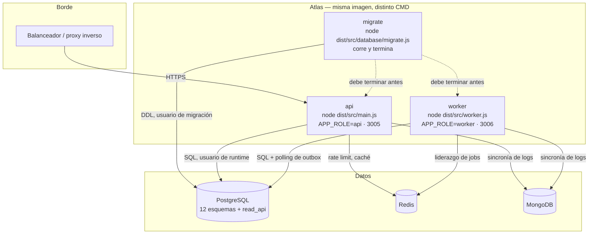

# Vista C4 — Contenedores

Nivel 2: las unidades desplegables y cómo se comunican.

## Contenedores

| Contenedor | Imagen | Comando | Puerto | Escala |
|---|---|---|---|---|
| `migrate` | `atlas-backend` | `migrate.js up` | — | 1, hasta completar |
| `api` | `atlas-backend` | `main.js` | 3005 | N réplicas |
| `worker` | `atlas-backend` | `worker.js` | 3006 (sonda) | N réplicas, con elección de líder |
| `postgres` | PostgreSQL | — | 5432 | 1 primario (+ réplicas de lectura opcionales) |
| `redis` | Redis | — | 6379 | 1 |
| `mongo` | MongoDB | — | 27017 | 1 |

`VERIFICADO` — los tres contenedores de Atlas están declarados en `docker-compose.yml` (dev, con `postgres`/`redis`/`mongo` incluidos) y `docker-compose.prod.yml` (producción, que espera `ATLAS_IMAGE` construida por CI y **no** incluye los almacenes).

## La imagen

Multi-etapa `deps → build → runtime` sobre `node:22-bookworm-slim`:

- Corre como **`USER node`**, no root.
- `tini` como `ENTRYPOINT`: reaper de zombies y propagación correcta de señales — condición necesaria para que el apagado con drenado funcione.
- `EXPOSE 3005 3006`.
- `HEALTHCHECK` cada 15 s, timeout 5 s, 30 s de gracia inicial, 3 reintentos.
- `tmpfs` y volúmenes de log dedicados por rol (`atlas-api-logs`, `atlas-worker-logs`).

## El contenedor de migración va primero

`migrate` corre hasta terminar antes de que arranquen `api` y `worker`. Usa una **identidad PostgreSQL distinta** (`DB_MIGRATION_USER`) de la del runtime (`DB_USER`): el proceso que atiende tráfico no tiene privilegios de DDL.

Ver [[10-operations/deployment]] y `docs/database/postgres-roles.md`.

## Comunicación entre contenedores

| Origen | Destino | Protocolo | Síncrono | Autenticación |
|---|---|---|---|---|
| Balanceador | `api` | HTTPS → HTTP | Sí | JWT del cliente |
| `api` | PostgreSQL | TCP/PostgreSQL (TLS opcional vía `DB_SSL`) | Sí | Usuario/contraseña de runtime |
| `api` | Redis | RESP | Sí | `REDIS_URL` |
| `worker` | PostgreSQL | TCP/PostgreSQL | Sí | Ídem `api` |
| `api` → `worker` | **ninguna** | — | — | No se hablan directamente |

> [!info] API y worker no se comunican entre sí
> Su único punto de encuentro es la tabla `platform_ops.outbox_events`: la API escribe, el worker lee. No hay RPC, ni cola, ni descubrimiento de servicios entre ellos. Es lo que permite escalarlos, reiniciarlos y desplegarlos por separado sin coordinación.

## Lo que no está en el compose

`INFERIDO` — el balanceador, la terminación TLS, el registro de imágenes, el colector OTLP y el proveedor KMS son externos a los ficheros de composición. No hay manifiestos de Kubernetes ni Terraform en el repositorio: el despliegue real está fuera de este código.

## Relaciones

- [[02-architecture/views/c4-component]] · [[02-architecture/deployment-topology]] · [[10-operations/deployment]]
