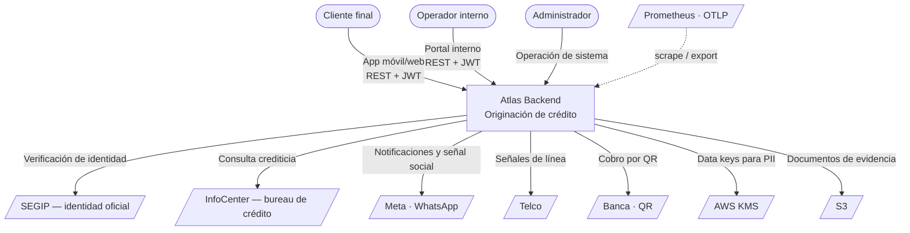

# Vista C4 — Contexto del sistema

Nivel 1: Atlas como una caja, y con quién habla.

## Actores

| Actor | Cómo entra | Rol de token |
|---|---|---|
| Cliente final | App de cliente → endpoints públicos de auth y rutas bajo `customers/:customerId` | `customer` |
| Operador interno | Portal interno → rutas de operación, riesgo, fraude y cumplimiento | `internal_operator`, `risk_analyst`, `compliance_analyst`, `fraud_analyst` |
| Administrador | Portal interno → gestión de usuarios internos, catálogos de sistema, jobs | `admin`, `platform_admin`, `system_admin` |
| Sistema automático | Planificador interno y llamadas máquina-a-máquina | `system` |

## Sistemas externos

| Sistema | Propósito | Criticidad | Modo de fallo |
|---|---|---|---|
| SEGIP | Verificación de identidad oficial | Alta | Bloquea la verificación de identidad en onboarding |
| InfoCenter | Bureau de crédito | Alta | Degrada el enriquecimiento; la decisión de riesgo pierde señal |
| Meta / WhatsApp | Notificaciones y señales de confianza digital | Media | Degrada un canal de notificación; hay otros |
| Telco | Señales de línea y antigüedad | Media | Degrada señal de riesgo |
| Banca / QR | Cobro por QR | Media | `INFERIDO` — adaptador presente (`banking-qr.service.ts`, `qr-generic`) |
| AWS KMS | Data keys para cifrado de PII | Alta | Cae al proveedor `local`; ver [[08-security/data-protection]] |
| S3 | Documentos de evidencia | Media | Falla la subida de evidencia |
| Prometheus / colector OTLP | Observabilidad | Baja | Se pierde visibilidad, no funcionalidad |

Todos los adaptadores externos pasan por `ResilientAdapterExecutorService` con circuit breaker y reintentos. Ver [[06-integrations/index]].

## Lo que Atlas NO hace

- No sirve interfaces de usuario: los frontends son sistemas aparte.
- No administra crédito tras el desembolso: no hay cuotas, cobranza ni liquidación a comercios persistidas. Ver [[14-audits/contradictions]].
- No opera su propia infraestructura: el despliegue, la red y el escalado son externos.

## Relaciones

- [[02-architecture/views/c4-container]] · [[02-architecture/trust-boundaries]] · [[06-integrations/index]]
