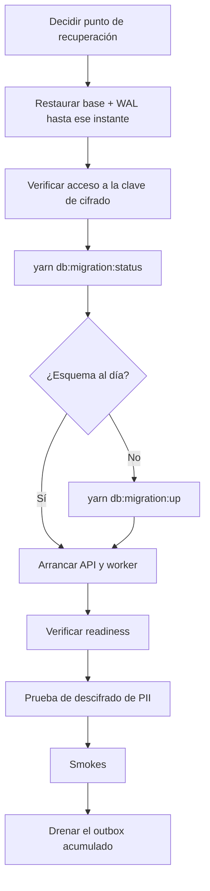

# Copias de seguridad y restauración

> [!warning] Esta nota es una PROPUESTA, no una descripción de lo que existe
> El repositorio **no contiene** ningún procedimiento de backup: ni scripts, ni configuración, ni RPO/RTO. Lo que sigue es la política **recomendada** para un sistema con las características de Atlas, con valores concretos para aprobar o ajustar.
>
> Todo lo marcado `PROPUESTA` requiere decisión e implementación en la infraestructura. Lo marcado `VERIFICADO` sí sale del código.

## Qué hay que respaldar y con qué prioridad

| Almacén | Contenido | Prioridad | Si se pierde |
|---|---|---|---|
| **PostgreSQL** | 130 tablas: la fuente de verdad | **Crítica** | Pérdida total del negocio |
| **Clave maestra de cifrado** | Descifra toda la PII | **Crítica** | La copia de PostgreSQL queda **ilegible** |
| **S3** | Documentos de evidencia KYC | Alta | Se pierde el respaldo probatorio de las verificaciones |
| **MongoDB** | Logs sincronizados | Baja | Se pierde histórico de logs, no datos de negocio |
| **Redis** | Rate limiting, caché, liderazgo | **Ninguna** | Se reconstruye solo |

> [!danger] La clave de cifrado es parte de la copia
> Es el error más caro y el más fácil de cometer. Atlas cifra la PII con *envelope encryption*: restaurar PostgreSQL **sin poder descifrar** deja teléfonos, correos y documentos como `BLOB` ilegibles.
>
> - **Con KMS** (`KMS_KEY_ID` + `AWS_REGION`): la CMK **no se puede exportar**. La política es no borrarla nunca — programar su eliminación destruye los datos de forma irreversible — y replicarla a la región de recuperación si el plan contempla otra región.
> - **Sin KMS**: la clave se deriva de una **variable de entorno**. Esa variable *es* la copia: debe vivir en un gestor de secretos con su propio respaldo y rotación. Ver [[14-audits/risks-register|SEC-002]].

## Objetivos recomendados

`PROPUESTA` — valores de partida para un backend de originación de crédito con datos KYC:

| Almacén | RPO | RTO | Mecanismo |
|---|---|---|---|
| PostgreSQL | **5 min** | **1 h** | Base diaria + archivado continuo de WAL (PITR) |
| S3 (evidencia) | ~0 | 15 min | Versionado + replicación entre regiones |
| MongoDB | 24 h | Best-effort | Snapshot diario |
| Redis | N/A | N/A | Sin copia — se reconstruye |

**Por qué PITR y no solo un volcado diario.** Un `pg_dump` nocturno implica un RPO de hasta 24 h: en el peor caso se pierde un día entero de onboardings, decisiones de riesgo y consentimientos. En un sistema donde el consentimiento es la **base legal** de cada consulta a un bureau, perder ese registro no es solo perder datos — es perder la prueba de que se estaba autorizado a pedirlos.

## Retención recomendada

`PROPUESTA`:

| Tipo | Retención | Motivo |
|---|---|---|
| WAL continuo | **30 días** | Ventana de PITR: cubre la detección tardía de una corrupción lógica |
| Base diaria | 30 días | Punto de partida de cualquier PITR |
| Snapshot mensual | **12 meses** | Auditoría y requisitos regulatorios de KYC/crédito |
| Snapshot anual | Según normativa local | Decisión de cumplimiento, no técnica |

Ajustar los dos últimos a la normativa aplicable. La retención de **copias** es independiente de la retención de **datos** que aplica `apply_retention_policies`: son dos relojes distintos, y borrar un dato en producción no lo borra de las copias.

## Requisitos de las copias

`PROPUESTA`:

- **Cifradas en reposo**, con clave distinta de la de producción.
- **Fuera de la cuenta/proyecto de producción** — una copia que un compromiso de producción puede borrar no protege del ransomware.
- **Inmutables** (object lock / retención bloqueada) durante su ventana.
- **Acceso auditado**: descargar una copia es exfiltrar la base entera de PII.

## Procedimiento de restauración



Pasos con comando concreto:

```bash
yarn db:migration:status              # ¿coincide el esquema con el código desplegado?
curl -s http://<host>:3005/health     # versión y commit
curl -s http://<host>:3005/health/readiness
yarn smoke:core && yarn smoke:auth
```

> [!info] Verificado — lo que sí es reproducible desde el repositorio
> | Capacidad | Cómo |
> |---|---|
> | Reconstruir el esquema desde cero | `yarn db:migration:up` (61 migraciones idempotentes) |
> | Datos maestros mínimos | `yarn db:seed:prod`, idempotente y verificable |
> | Verificar integridad de seeds | `yarn db:seed:verify-graph` |
> | Reproducir el artefacto | Imagen determinista desde CI |
>
> **El esquema y los datos maestros no necesitan copia**: se regeneran. Lo que hay que respaldar son los datos de negocio y la clave que los descifra.

## Verificación periódica

> [!danger] Una copia que no se ha restaurado nunca no es una copia
> Es el fallo clásico: el backup corre verde durante dos años y el día del incidente resulta que el WAL estaba incompleto, o que nadie tiene permisos sobre la clave.

`PROPUESTA` — **simulacro mensual** en un entorno desechable:

1. Restaurar a un punto arbitrario de los últimos 30 días.
2. Comprobar que `yarn db:migration:status` no reporta divergencia.
3. **Descifrar un registro de PII** y comprobar que el valor es legible — esto valida la clave, no solo los datos.
4. Arrancar API y worker; confirmar readiness.
5. Ejecutar `yarn smoke:core`.
6. Anotar el RTO real conseguido y compararlo con el objetivo.

El paso 3 es el que suele descubrirse tarde: valida la mitad del sistema que el backup de la base **no** cubre.

## Casos que no cubre una restauración

| Efecto | Por qué |
|---|---|
| Eventos ya publicados | Los consumidores ya reaccionaron |
| Notificaciones enviadas | Irreversibles |
| Consultas a proveedores externos | Tuvieron coste y quedaron registradas en su lado |
| Estado de Redis | Se reconstruye, pero los contadores de rate limit se reinician |

Restaurar a un punto anterior **reintroduce eventos ya procesados** en el outbox. Como la entrega es *al menos una vez* y los consumidores deben ser idempotentes, el sistema lo tolera por diseño — pero conviene revisar el volumen antes de arrancar el worker tras una restauración grande.

## Qué falta decidir

- [ ] Aprobar o ajustar los RPO/RTO propuestos
- [ ] Elegir destino y región de las copias
- [ ] Definir quién tiene permiso para restaurar (y auditarlo)
- [ ] Programar el primer simulacro y fijar la cadencia
- [ ] Confirmar la retención regulatoria aplicable

## Relaciones

- [[10-operations/disaster-recovery]] · [[05-data/data-stores]] · [[05-data/sensitive-data]] · [[08-security/data-protection]] · [[05-data/retention-and-deletion]]
