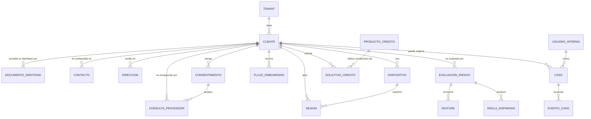

# Modelo conceptual de datos

Los conceptos de negocio y sus relaciones, sin depender del motor ni de la implementación.

## Conceptos

| Concepto | Qué es | Fuente de verdad |
|---|---|---|
| **Tenant** | La organización que opera sobre Atlas. Discrimina casi todo el dato | [[tenants]] |
| **Cliente** | La persona que solicita crédito | [[customers]] |
| **Documento de identidad** | Acreditación oficial, con su evidencia | [[customer_identity_documents]] |
| **Consentimiento** | Autorización explícita a tratar datos para un fin | [[customer_consents]] |
| **Dispositivo** | El aparato desde el que opera el cliente; señal de riesgo y de fraude | [[devices]] |
| **Sesión** | Un periodo de interacción continuada | [[customer_sessions]] |
| **Flujo de onboarding** | El recorrido de alta, paso a paso | [[onboarding_flows]] |
| **Feature** | Variable derivada que alimenta la decisión | [[feature_values]] |
| **Evaluación de riesgo** | Una corrida del motor sobre un cliente | [[risk_assessment_runs]] |
| **Solicitud de crédito** | La petición formal | [[credit_applications]] |
| **Caso** | Expediente de revisión manual o de fraude | [[manual_review_cases]], [[fraud_cases]] |
| **Consulta a proveedor** | Una llamada externa y su respuesta | [[data_provider_requests]] |
| **Usuario interno** | Quien opera desde el portal | [[internal_users]] |

## Reglas de negocio conceptuales

`VERIFICADO` — sostenidas por restricciones físicas:

- Todo dato de negocio pertenece a **un** tenant (`_tenant_id`, 59 tablas lo referencian).
- Un cliente tiene **un** estado de ciclo de vida en cada momento, con un único escritor autorizado (`CustomerLifecycleService`) y un `CHECK` que acota los valores.
- Una evidencia documental **no puede ser huérfana**: `CHECK ck_evidence_document_not_orphan` exige `customer_id` o `uploaded_from_session_id`.
- Una evaluación de riesgo **debe tener sujeto**: `CHECK ck_risk_assessment_subject_present`.
- El cómputo en dispositivo **no puede almacenar contactos ni SMS crudos**: `CHECK ck_on_device_no_raw_contacts_or_sms` lo impide a nivel de base de datos.

> [!info] La última regla es una decisión de privacidad grabada en el esquema
> `(raw_contacts_stored IS FALSE AND raw_sms_stored IS FALSE)` convierte una política —"no exfiltramos la agenda ni los mensajes"— en algo que la base de datos rechaza. No depende de que nadie se acuerde.

## Fuera del modelo

Compras, cuotas, pagos, cobranza, comercios y liquidaciones **no existen** como conceptos persistidos, pese a estar en el catálogo de eventos. Ver [[14-audits/contradictions]].

## Relaciones

- [[05-data/logical-data-model]] · [[05-data/physical-data-model]] · [[05-data/entity-relationship-model]]
