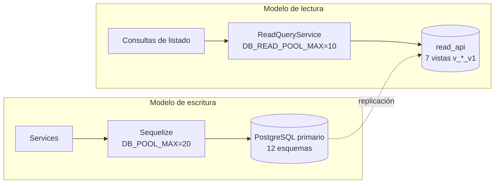

# Arquitectura de datos

## Cifras

| | |
|---|---|
| Tablas | **130** |
| Columnas | **2 040** |
| Claves foráneas | **244** (153 cruzan esquema) |
| Índices declarados | 290 |
| Esquemas de dominio | 12 + `read_api` + `public` |
| Migraciones | 61 |
| Vistas de lectura | 7 (`read_api.v_*_v1`) |

## Almacenes

| Almacén | Rol | Consistencia | Criticidad |
|---|---|---|---|
| **PostgreSQL** | Fuente de verdad transaccional | Fuerte (ACID) | Crítica — sin él, readiness 503 |
| **PostgreSQL (réplica de lectura)** | Consultas del modelo de lectura | Eventual | Media — se reporta, no decide el readiness |
| **Redis** | Rate limiting, caché, liderazgo de jobs | Ninguna garantía de durabilidad | Alta en producción |
| **MongoDB** | Destino de sincronía de logs de aplicación | Eventual | Media — degrada la consulta de logs |
| **S3** | Documentos de evidencia | Eventual | Media |

Ver [[05-data/data-stores]].

## Separación en 12 esquemas

Un único mapa tabla → esquema, en `ATLAS_DOMAIN_TABLES`. `atlasSchemaFor(tableName)` **lanza** si la tabla no está registrada: es imposible que un modelo nuevo resuelva a un esquema por accidente.

| Esquema | Tablas | Dominio |
|---|---:|---|
| [[platform_ops-schema\|platform_ops]] | 25 | Operación de plataforma |
| [[telemetry-schema\|telemetry]] | 18 | Telemetría, dispositivos y sesiones |
| [[catalog-schema\|catalog]] | 15 | Catálogo y contexto |
| [[risk-schema\|risk]] | 14 | Riesgo y *features* |
| [[customer-schema\|customer]] | 12 | Clientes e identidad |
| [[privacy-schema\|privacy]] | 11 | Privacidad y consentimiento |
| [[iam-schema\|iam]] | 10 | Identidad y acceso |
| [[case_management-schema\|case_management]] | 6 | Casos y fraude |
| [[integrations-schema\|integrations]] | 6 | Integraciones externas |
| [[audit-schema\|audit]] | 5 | Auditoría y calidad |
| [[messaging-schema\|messaging]] | 5 | Mensajería |
| [[credit-schema\|credit]] | 3 | Crédito |

`public` queda reservado al tracking de Umzug y compatibilidad de infraestructura: **ningún modelo de negocio resuelve ahí**.

### El search_path importa

Dos rutas distintas, declaradas por separado:

- `ATLAS_RUNTIME_SEARCH_PATH` = los 12 esquemas + `read_api` + `public`
- `ATLAS_MIGRATION_SEARCH_PATH` = `public` **primero**, luego los 12 + `read_api`

La inversión es deliberada: las migraciones necesitan ver primero el tracking de Umzug en `public`; el runtime necesita resolver primero sus tablas de dominio.

## Escritura y lectura separadas

> [!info] Las vistas están versionadas en el nombre
> `v_customer_overview_v1`, `v_risk_assessment_summary_v1`, `v_operations_work_queue_v1`, `v_provider_health_latest_v1`, `v_notification_delivery_summary_v1`, `v_system_endpoint_coverage_v1`, `v_audit_event_feed_v1`.
>
> El sufijo `_v1` permite publicar una `_v2` y migrar consumidores sin romper a nadie. Es lo que convierte a `read_api` en un **contrato** en vez de un atajo a las tablas.

Si `DB_READ_ENABLED` está apagado, el token de lectura apunta al pool de escritura: hay un solo camino físico y el health check lo reporta como `not_configured` en vez de fingir dos dependencias sanas.

## Convenciones físicas

| Convención | Detalle |
|---|---|
| PK | `_id` `BIGINT` autoincremental, sustituta. **Nunca** se expone como identificador público (para eso están `*_uuid` y `*_code`) |
| Tenant | `_tenant_id` `BIGINT` con FK a `iam.tenants` — 59 tablas la referencian |
| Marcas de tiempo | `_created_at` / `_updated_at` propias; `timestamps: false` en todos los `@Table` |
| Borrado | `_deleted BOOLEAN`; endurecida a `NOT NULL` por la migración `20260721120000` |
| Identificadores en TS | `string`, no `number` — `BIGINT` excede `Number.MAX_SAFE_INTEGER` |

## Integridad referencial: una sola política

> [!info] Verificado
> `addForeignKeys` aplica la misma regla a las 244 FK, sin excepciones:
> - `onUpdate: 'CASCADE'`
> - `onDelete: allowNull ? 'SET NULL' : 'RESTRICT'`
>
> **Ninguna FK borra en cascada.** Un padre con hijos obligatorios no se puede borrar físicamente: el sistema depende del borrado lógico y de las políticas de retención. Es una decisión coherente con un backend sujeto a auditoría, donde perder evidencia por un `DELETE` accidental es peor que acumular filas.

## Dónde está el acoplamiento

**153 de 244 FK cruzan esquemas.** Las tablas más referenciadas concentran el riesgo de cambio:

| Tabla | Referencias entrantes |
|---|---:|
| [[tenants]] | 59 |
| [[customers]] | 35 |
| [[customer_sessions]] | 21 |
| [[devices]] | 19 |
| [[internal_users]] | 12 |

Cambiar la forma de `customers` impacta a 35 tablas de varios dominios. Ver [[13-change-impact/high-risk-components]].

## Riesgo de rendimiento conocido

> [!warning] PERF-001 — 168 FK sin índice en el lado hijo
> PostgreSQL **no** crea índice automáticamente en la columna hija de una FK. La estrategia de índices actual cubre `_tenant_id` y algunas combinaciones añadidas después, pero deja sin índice 168 columnas FK de negocio (`customer_status_events.customer_id`, `data_provider_requests.provider_id`, …).
>
> Afecta a los `JOIN` por esa columna y a la verificación de `RESTRICT` al borrar un padre.
>
> **Es un riesgo estático, no un cuello confirmado:** no se ejecutó ninguna medición. `yarn db:capture-query-baseline` existe justamente para producirla. Ver [[14-audits/risks-register]].

## Relaciones

- [[05-data/conceptual-data-model]] · [[05-data/logical-data-model]] · [[05-data/physical-data-model]]
- [[05-data/entity-relationship-model]] · [[05-data/relationship-catalog]] · [[05-data/data-dictionary]]
