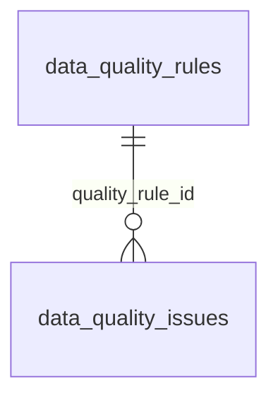

# Esquema `audit` — Auditoría y calidad

5 tabla(s) · 57 atributos.

> [!info] Verificado
> Los esquemas físicos se declaran en `ATLAS_DOMAIN_TABLES` en [`src/database/domain-schemas.ts`](../../../../src/database/domain-schemas.ts). Cada modelo resuelve el suyo con `atlasSchemaFor(tableName)`, que **lanza** si la tabla no está registrada: no existe una segunda fuente de verdad.

## Tablas

| Tabla | Modelo ORM | Atributos | FK salientes | Referencias entrantes |
|---|---|---|---|---|
| [[data_change_logs]] | `DataChangeLogModel` | 13 | 3 | 0 |
| [[data_quality_issues]] | `DataQualityIssueModel` | 10 | 2 | 0 |
| [[data_quality_rules]] | `DataQualityRuleModel` | 12 | 0 | 1 |
| [[operational_audit_logs]] | `OperationalAuditLogModel` | 13 | 3 | 0 |
| [[schema_constraint_notes]] | `SchemaConstraintNoteModel` | 9 | 0 | 0 |

## Acoplamiento con otros esquemas

- **Depende de** (FK salientes hacia): [[iam-schema|iam]]
- **Es referenciado por**: ninguno
- FK que cruzan el límite del esquema: **7 salientes**, **0 entrantes**.

> [!warning] Acoplamiento físico entre dominios
> Las FK que cruzan esquemas atan estos dominios a nivel de base de datos: no se pueden separar en bases distintas sin sustituir la integridad referencial por validación en aplicación. Ver [[02-architecture/module-boundaries]].

## Diagrama entidad-relación (intra-esquema)

Solo se representan las relaciones cuyos dos extremos viven en `audit`. Las relaciones cruzadas están en [[05-data/relationship-catalog]].

## Relaciones

- Modelo global: [[05-data/entity-relationship-model]]
- Arquitectura de datos: [[05-data/data-architecture]]
