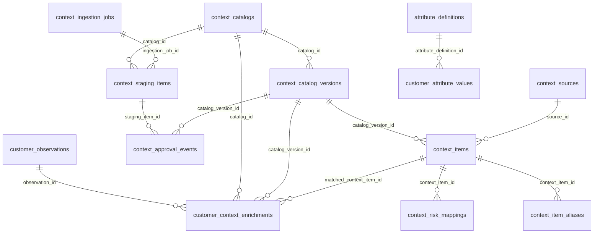

# Esquema `catalog` — Catálogo y contexto

15 tabla(s) · 212 atributos.

> [!info] Verificado
> Los esquemas físicos se declaran en `ATLAS_DOMAIN_TABLES` en [`src/database/domain-schemas.ts`](../../../../src/database/domain-schemas.ts). Cada modelo resuelve el suyo con `atlasSchemaFor(tableName)`, que **lanza** si la tabla no está registrada: no existe una segunda fuente de verdad.

## Tablas

| Tabla | Modelo ORM | Atributos | FK salientes | Referencias entrantes |
|---|---|---|---|---|
| [[attribute_definitions]] | `AttributeDefinitionModel` | 25 | 1 | 1 |
| [[context_approval_events]] | `ContextApprovalEventModel` | 8 | 3 | 0 |
| [[context_catalog_versions]] | `ContextCatalogVersionModel` | 13 | 3 | 3 |
| [[context_catalogs]] | `ContextCatalogModel` | 9 | 0 | 3 |
| [[context_ingestion_jobs]] | `ContextIngestionJobModel` | 11 | 0 | 1 |
| [[context_item_aliases]] | `ContextItemAliasModel` | 7 | 1 | 0 |
| [[context_items]] | `ContextItemModel` | 11 | 2 | 3 |
| [[context_risk_mappings]] | `ContextRiskMappingModel` | 13 | 1 | 0 |
| [[context_sources]] | `ContextSourceModel` | 10 | 0 | 1 |
| [[context_staging_items]] | `ContextStagingItemModel` | 13 | 3 | 1 |
| [[customer_attribute_values]] | `CustomerAttributeValueModel` | 15 | 4 | 0 |
| [[customer_context_enrichments]] | `CustomerContextEnrichmentModel` | 16 | 6 | 0 |
| [[customer_observations]] | `CustomerObservationModel` | 21 | 6 | 1 |
| [[event_definitions]] | `EventDefinitionModel` | 18 | 1 | 0 |
| [[observation_definitions]] | `ObservationDefinitionModel` | 22 | 1 | 0 |

## Acoplamiento con otros esquemas

- **Depende de** (FK salientes hacia): [[iam-schema|iam]], [[privacy-schema|privacy]], [[customer-schema|customer]], [[telemetry-schema|telemetry]], [[integrations-schema|integrations]]
- **Es referenciado por**: ninguno
- FK que cruzan el límite del esquema: **18 salientes**, **0 entrantes**.

> [!warning] Acoplamiento físico entre dominios
> Las FK que cruzan esquemas atan estos dominios a nivel de base de datos: no se pueden separar en bases distintas sin sustituir la integridad referencial por validación en aplicación. Ver [[02-architecture/module-boundaries]].

## Diagrama entidad-relación (intra-esquema)

Solo se representan las relaciones cuyos dos extremos viven en `catalog`. Las relaciones cruzadas están en [[05-data/relationship-catalog]].

## Relaciones

- Modelo global: [[05-data/entity-relationship-model]]
- Arquitectura de datos: [[05-data/data-architecture]]
