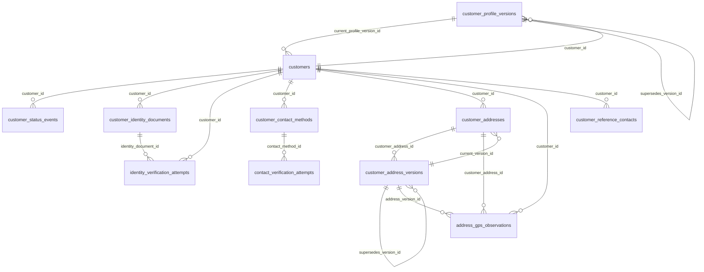

# Esquema `customer` — Clientes e identidad

12 tabla(s) · 192 atributos.

> [!info] Verificado
> Los esquemas físicos se declaran en `ATLAS_DOMAIN_TABLES` en [`src/database/domain-schemas.ts`](../../../../src/database/domain-schemas.ts). Cada modelo resuelve el suyo con `atlasSchemaFor(tableName)`, que **lanza** si la tabla no está registrada: no existe una segunda fuente de verdad.

## Tablas

| Tabla | Modelo ORM | Atributos | FK salientes | Referencias entrantes |
|---|---|---|---|---|
| [[address_gps_observations]] | `AddressGpsObservationModel` | 13 | 5 | 0 |
| [[contact_verification_attempts]] | `ContactVerificationAttemptModel` | 11 | 3 | 0 |
| [[customer_address_versions]] | `CustomerAddressVersionModel` | 19 | 4 | 3 |
| [[customer_addresses]] | `CustomerAddressModel` | 11 | 3 | 2 |
| [[customer_contact_methods]] | `CustomerContactMethodModel` | 18 | 2 | 1 |
| [[customer_eligibility_evaluations]] | `CustomerEligibilityEvaluationModel` | 15 | 0 | 0 |
| [[customer_identity_documents]] | `CustomerIdentityDocumentModel` | 23 | 4 | 1 |
| [[customer_profile_versions]] | `CustomerProfileVersionModel` | 16 | 3 | 2 |
| [[customer_reference_contacts]] | `CustomerReferenceContactModel` | 17 | 2 | 0 |
| [[customer_status_events]] | `CustomerStatusEventModel` | 12 | 4 | 0 |
| [[customers]] | `CustomerModel` | 18 | 2 | 35 |
| [[identity_verification_attempts]] | `IdentityVerificationAttemptModel` | 19 | 7 | 0 |

## Acoplamiento con otros esquemas

- **Depende de** (FK salientes hacia): [[iam-schema|iam]], [[privacy-schema|privacy]], [[integrations-schema|integrations]], [[telemetry-schema|telemetry]]
- **Es referenciado por**: [[integrations-schema|integrations]], [[privacy-schema|privacy]], [[telemetry-schema|telemetry]], [[catalog-schema|catalog]], [[risk-schema|risk]], [[case_management-schema|case_management]]
- FK que cruzan el límite del esquema: **22 salientes**, **27 entrantes**.

> [!warning] Acoplamiento físico entre dominios
> Las FK que cruzan esquemas atan estos dominios a nivel de base de datos: no se pueden separar en bases distintas sin sustituir la integridad referencial por validación en aplicación. Ver [[02-architecture/module-boundaries]].

## Diagrama entidad-relación (intra-esquema)

Solo se representan las relaciones cuyos dos extremos viven en `customer`. Las relaciones cruzadas están en [[05-data/relationship-catalog]].

## Relaciones

- Modelo global: [[05-data/entity-relationship-model]]
- Arquitectura de datos: [[05-data/data-architecture]]
