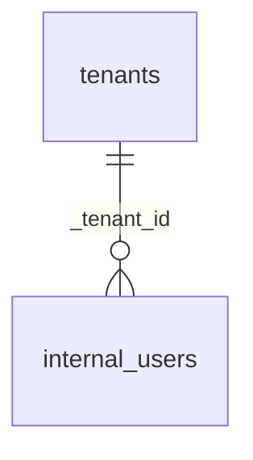

# Esquema `iam` — Identidad y acceso

10 tabla(s) · 114 atributos.

> [!info] Verificado
> Los esquemas físicos se declaran en `ATLAS_DOMAIN_TABLES` en [`src/database/domain-schemas.ts`](../../../../src/database/domain-schemas.ts). Cada modelo resuelve el suyo con `atlasSchemaFor(tableName)`, que **lanza** si la tabla no está registrada: no existe una segunda fuente de verdad.

## Tablas

| Tabla | Modelo ORM | Atributos | FK salientes | Referencias entrantes |
|---|---|---|---|---|
| [[auth_credentials]] | `AuthCredentialModel` | 14 | 0 | 0 |
| [[auth_one_time_codes]] | `AuthOneTimeCodeModel` | 11 | 0 | 0 |
| [[auth_refresh_tokens]] | `AuthRefreshTokenModel` | 13 | 0 | 0 |
| [[internal_permissions]] | `InternalPermissionModel` | 14 | 0 | 0 |
| [[internal_role_permissions]] | `InternalRolePermissionModel` | 5 | 0 | 0 |
| [[internal_roles]] | `InternalRoleModel` | 11 | 0 | 0 |
| [[internal_user_roles]] | `InternalUserRoleModel` | 11 | 0 | 0 |
| [[internal_users]] | `InternalUserModel` | 18 | 1 | 12 |
| [[platform_users]] | `PlatformUserModel` | 9 | 0 | 10 |
| [[tenants]] | `TenantModel` | 8 | 0 | 59 |

## Acoplamiento con otros esquemas

- **Depende de** (FK salientes hacia): ninguno
- **Es referenciado por**: [[integrations-schema|integrations]], [[customer-schema|customer]], [[privacy-schema|privacy]], [[telemetry-schema|telemetry]], [[catalog-schema|catalog]], [[risk-schema|risk]], [[case_management-schema|case_management]], [[audit-schema|audit]]
- FK que cruzan el límite del esquema: **0 salientes**, **80 entrantes**.

## Diagrama entidad-relación (intra-esquema)

Solo se representan las relaciones cuyos dos extremos viven en `iam`. Las relaciones cruzadas están en [[05-data/relationship-catalog]].

## Relaciones

- Modelo global: [[05-data/entity-relationship-model]]
- Arquitectura de datos: [[05-data/data-architecture]]
