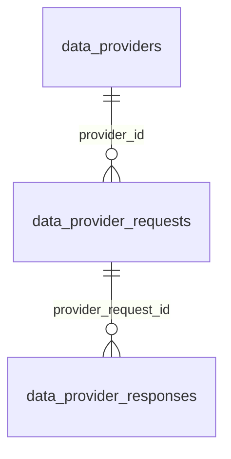

# Esquema `integrations` — Integraciones externas

6 tabla(s) · 108 atributos.

> [!info] Verificado
> Los esquemas físicos se declaran en `ATLAS_DOMAIN_TABLES` en [`src/database/domain-schemas.ts`](../../../../src/database/domain-schemas.ts). Cada modelo resuelve el suyo con `atlasSchemaFor(tableName)`, que **lanza** si la tabla no está registrada: no existe una segunda fuente de verdad.

## Tablas

| Tabla | Modelo ORM | Atributos | FK salientes | Referencias entrantes |
|---|---|---|---|---|
| [[data_provider_requests]] | `DataProviderRequestModel` | 29 | 5 | 4 |
| [[data_provider_responses]] | `DataProviderResponseModel` | 15 | 3 | 0 |
| [[data_providers]] | `DataProviderModel` | 17 | 1 | 2 |
| [[external_oauth_connections]] | `ExternalOauthConnectionModel` | 16 | 0 | 0 |
| [[external_provider_cost_policies]] | `ExternalProviderCostPolicyModel` | 22 | 0 | 0 |
| [[provider_health_logs]] | `ProviderHealthLogModel` | 9 | 0 | 0 |

## Acoplamiento con otros esquemas

- **Depende de** (FK salientes hacia): [[privacy-schema|privacy]], [[iam-schema|iam]], [[customer-schema|customer]], [[risk-schema|risk]]
- **Es referenciado por**: [[customer-schema|customer]], [[telemetry-schema|telemetry]], [[catalog-schema|catalog]]
- FK que cruzan el límite del esquema: **7 salientes**, **4 entrantes**.

> [!warning] Acoplamiento físico entre dominios
> Las FK que cruzan esquemas atan estos dominios a nivel de base de datos: no se pueden separar en bases distintas sin sustituir la integridad referencial por validación en aplicación. Ver [[02-architecture/module-boundaries]].

## Diagrama entidad-relación (intra-esquema)

Solo se representan las relaciones cuyos dos extremos viven en `integrations`. Las relaciones cruzadas están en [[05-data/relationship-catalog]].

## Relaciones

- Modelo global: [[05-data/entity-relationship-model]]
- Arquitectura de datos: [[05-data/data-architecture]]
