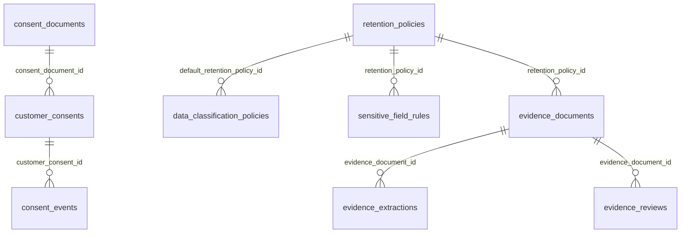

# Esquema `privacy` — Privacidad y consentimiento

11 tabla(s) · 144 atributos.

> [!info] Verificado
> Los esquemas físicos se declaran en `ATLAS_DOMAIN_TABLES` en [`src/database/domain-schemas.ts`](../../../../src/database/domain-schemas.ts). Cada modelo resuelve el suyo con `atlasSchemaFor(tableName)`, que **lanza** si la tabla no está registrada: no existe una segunda fuente de verdad.

## Tablas

| Tabla | Modelo ORM | Atributos | FK salientes | Referencias entrantes |
|---|---|---|---|---|
| [[consent_documents]] | `ConsentDocumentModel` | 15 | 2 | 1 |
| [[consent_events]] | `ConsentEventModel` | 13 | 3 | 0 |
| [[customer_consents]] | `CustomerConsentModel` | 16 | 4 | 4 |
| [[data_classification_policies]] | `DataClassificationPolicyModel` | 13 | 1 | 0 |
| [[data_subject_requests]] | `DataSubjectRequestModel` | 14 | 3 | 0 |
| [[evidence_documents]] | `EvidenceDocumentModel` | 20 | 4 | 8 |
| [[evidence_extractions]] | `EvidenceExtractionModel` | 12 | 2 | 0 |
| [[evidence_reviews]] | `EvidenceReviewModel` | 10 | 3 | 0 |
| [[privacy_processing_purposes]] | `PrivacyProcessingPurposeModel` | 9 | 0 | 0 |
| [[retention_policies]] | `RetentionPolicyModel` | 10 | 0 | 9 |
| [[sensitive_field_rules]] | `SensitiveFieldRuleModel` | 12 | 1 | 0 |

## Acoplamiento con otros esquemas

- **Depende de** (FK salientes hacia): [[iam-schema|iam]], [[customer-schema|customer]], [[telemetry-schema|telemetry]]
- **Es referenciado por**: [[integrations-schema|integrations]], [[customer-schema|customer]], [[telemetry-schema|telemetry]], [[catalog-schema|catalog]], [[risk-schema|risk]]
- FK que cruzan el límite del esquema: **16 salientes**, **15 entrantes**.

> [!warning] Acoplamiento físico entre dominios
> Las FK que cruzan esquemas atan estos dominios a nivel de base de datos: no se pueden separar en bases distintas sin sustituir la integridad referencial por validación en aplicación. Ver [[02-architecture/module-boundaries]].

## Diagrama entidad-relación (intra-esquema)

Solo se representan las relaciones cuyos dos extremos viven en `privacy`. Las relaciones cruzadas están en [[05-data/relationship-catalog]].

## Relaciones

- Modelo global: [[05-data/entity-relationship-model]]
- Arquitectura de datos: [[05-data/data-architecture]]
