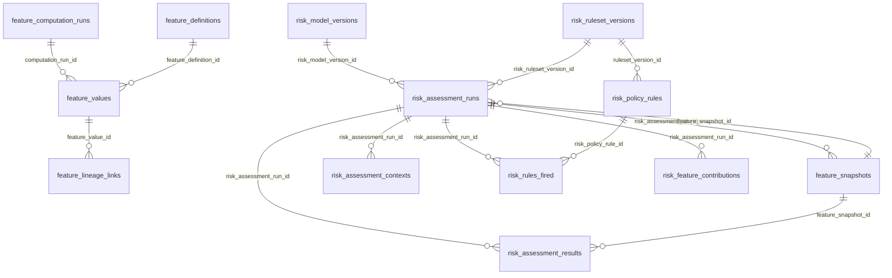

# Esquema `risk` — Riesgo y features

14 tabla(s) · 237 atributos.

> [!info] Verificado
> Los esquemas físicos se declaran en `ATLAS_DOMAIN_TABLES` en [`src/database/domain-schemas.ts`](../../../../src/database/domain-schemas.ts). Cada modelo resuelve el suyo con `atlasSchemaFor(tableName)`, que **lanza** si la tabla no está registrada: no existe una segunda fuente de verdad.

## Tablas

| Tabla | Modelo ORM | Atributos | FK salientes | Referencias entrantes |
|---|---|---|---|---|
| [[feature_computation_runs]] | `FeatureComputationRunModel` | 20 | 5 | 1 |
| [[feature_definitions]] | `FeatureDefinitionModel` | 26 | 1 | 1 |
| [[feature_lineage_links]] | `FeatureLineageLinkModel` | 10 | 2 | 0 |
| [[feature_snapshots]] | `FeatureSnapshotModel` | 18 | 6 | 2 |
| [[feature_values]] | `FeatureValueModel` | 20 | 7 | 1 |
| [[risk_assessment_contexts]] | `RiskAssessmentContextModel` | 24 | 2 | 0 |
| [[risk_assessment_results]] | `RiskAssessmentResultModel` | 26 | 7 | 1 |
| [[risk_assessment_runs]] | `RiskAssessmentRunModel` | 19 | 8 | 7 |
| [[risk_feature_contributions]] | `RiskFeatureContributionModel` | 10 | 2 | 0 |
| [[risk_model_versions]] | `RiskModelVersionModel` | 13 | 1 | 1 |
| [[risk_policy_rules]] | `RiskPolicyRuleModel` | 12 | 1 | 1 |
| [[risk_rules_fired]] | `RiskRuleFiredModel` | 14 | 3 | 0 |
| [[risk_ruleset_versions]] | `RiskRulesetVersionModel` | 10 | 1 | 2 |
| [[risk_signal_seeds]] | `RiskSignalSeedModel` | 15 | 0 | 0 |

## Acoplamiento con otros esquemas

- **Depende de** (FK salientes hacia): [[privacy-schema|privacy]], [[iam-schema|iam]], [[customer-schema|customer]], [[telemetry-schema|telemetry]]
- **Es referenciado por**: [[integrations-schema|integrations]], [[telemetry-schema|telemetry]], [[case_management-schema|case_management]]
- FK que cruzan el límite del esquema: **32 salientes**, **3 entrantes**.

> [!warning] Acoplamiento físico entre dominios
> Las FK que cruzan esquemas atan estos dominios a nivel de base de datos: no se pueden separar en bases distintas sin sustituir la integridad referencial por validación en aplicación. Ver [[02-architecture/module-boundaries]].

## Diagrama entidad-relación (intra-esquema)

Solo se representan las relaciones cuyos dos extremos viven en `risk`. Las relaciones cruzadas están en [[05-data/relationship-catalog]].

## Relaciones

- Modelo global: [[05-data/entity-relationship-model]]
- Arquitectura de datos: [[05-data/data-architecture]]
