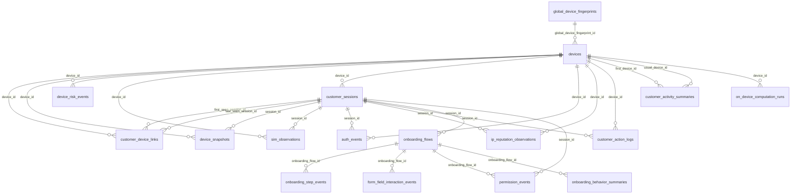

# Esquema `telemetry` — Telemetría, dispositivos y sesiones

18 tabla(s) · 237 atributos.

> [!info] Verificado
> Los esquemas físicos se declaran en `ATLAS_DOMAIN_TABLES` en [`src/database/domain-schemas.ts`](../../../../src/database/domain-schemas.ts). Cada modelo resuelve el suyo con `atlasSchemaFor(tableName)`, que **lanza** si la tabla no está registrada: no existe una segunda fuente de verdad.

## Tablas

| Tabla | Modelo ORM | Atributos | FK salientes | Referencias entrantes |
|---|---|---|---|---|
| [[auth_events]] | `AuthEventModel` | 11 | 4 | 0 |
| [[customer_action_logs]] | `CustomerActionLogModel` | 10 | 4 | 0 |
| [[customer_activity_summaries]] | `CustomerActivitySummaryModel` | 20 | 5 | 0 |
| [[customer_device_links]] | `CustomerDeviceLinkModel` | 14 | 5 | 0 |
| [[customer_sessions]] | `CustomerSessionModel` | 16 | 3 | 21 |
| [[device_risk_events]] | `DeviceRiskEventModel` | 10 | 2 | 0 |
| [[device_snapshots]] | `DeviceSnapshotModel` | 20 | 4 | 0 |
| [[devices]] | `DeviceModel` | 12 | 2 | 19 |
| [[form_field_interaction_events]] | `FormFieldInteractionEventModel` | 10 | 2 | 0 |
| [[global_device_fingerprints]] | `GlobalDeviceFingerprintModel` | 9 | 0 | 1 |
| [[ip_reputation_observations]] | `IpReputationObservationModel` | 15 | 5 | 0 |
| [[on_device_computation_runs]] | `OnDeviceComputationRunModel` | 16 | 6 | 1 |
| [[on_device_metric_values]] | `OnDeviceMetricValueModel` | 10 | 2 | 0 |
| [[onboarding_behavior_summaries]] | `OnboardingBehaviorSummaryModel` | 15 | 3 | 0 |
| [[onboarding_flows]] | `OnboardingFlowModel` | 11 | 3 | 10 |
| [[onboarding_step_events]] | `OnboardingStepEventModel` | 11 | 2 | 0 |
| [[permission_events]] | `PermissionEventModel` | 10 | 4 | 0 |
| [[sim_observations]] | `SimObservationModel` | 17 | 4 | 0 |

## Acoplamiento con otros esquemas

- **Depende de** (FK salientes hacia): [[iam-schema|iam]], [[customer-schema|customer]], [[integrations-schema|integrations]], [[risk-schema|risk]], [[privacy-schema|privacy]]
- **Es referenciado por**: [[customer-schema|customer]], [[privacy-schema|privacy]], [[catalog-schema|catalog]], [[risk-schema|risk]], [[case_management-schema|case_management]]
- FK que cruzan el límite del esquema: **32 salientes**, **24 entrantes**.

> [!warning] Acoplamiento físico entre dominios
> Las FK que cruzan esquemas atan estos dominios a nivel de base de datos: no se pueden separar en bases distintas sin sustituir la integridad referencial por validación en aplicación. Ver [[02-architecture/module-boundaries]].

## Diagrama entidad-relación (intra-esquema)

Solo se representan las relaciones cuyos dos extremos viven en `telemetry`. Las relaciones cruzadas están en [[05-data/relationship-catalog]].

## Relaciones

- Modelo global: [[05-data/entity-relationship-model]]
- Arquitectura de datos: [[05-data/data-architecture]]
