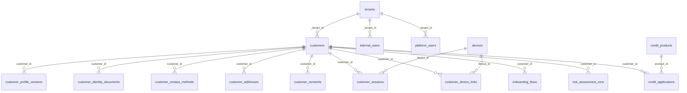

# Modelo entidad-relación

130 entidades y 244 relaciones. Un único diagrama sería ilegible, así que se divide por dominio.

## Núcleo

## Por dominio

| Esquema | Diagrama |
|---|---|
| Identidad y acceso | [[iam-schema]] |
| Clientes | [[customer-schema]] |
| Privacidad | [[privacy-schema]] |
| Telemetría | [[telemetry-schema]] |
| Catálogo | [[catalog-schema]] |
| Riesgo | [[risk-schema]] |
| Crédito | [[credit-schema]] |
| Casos y fraude | [[case_management-schema]] |
| Auditoría | [[audit-schema]] |
| Integraciones | [[integrations-schema]] |
| Mensajería | [[messaging-schema]] |
| Operación de plataforma | [[platform_ops-schema]] |

## Los nodos centrales

| Entidad | Referencias entrantes | Consecuencia |
|---|---:|---|
| [[tenants]] | 59 | Todo cuelga del tenant |
| [[customers]] | 35 | Cambiar su forma impacta a 35 tablas de varios dominios |
| [[customer_sessions]] | 21 | La sesión es el contexto de buena parte de la telemetría |
| [[devices]] | 19 | El dispositivo es señal de riesgo transversal |
| [[internal_users]] | 12 | Casi toda acción interna deja autor |

## Tipos de relación presentes

| Tipo | Ejemplo |
|---|---|
| Uno a muchos | `customers` → `customer_addresses` |
| Uno a uno opcional | `customers.current_profile_version_id` → `customer_profile_versions` |
| Muchos a muchos vía asociativa | `internal_users` ↔ `internal_roles` por `internal_user_roles` |
| Autorrelación | `customer_profile_versions.supersedes_version_id` |
| Múltiple al mismo destino | `customer_identity_documents` → `evidence_documents` dos veces (`front_`, `back_`) |
| Actor alternativo | `customer_status_events` con `changed_by_internal_user_id` **y** `changed_by_platform_user_id`, ambos opcionales |
| Polimórfica sin FK | `system_catalog_review_events.target_type` + `target_id` — ver [[14-audits/risks-register\|DATA-002]] |

## Catálogo completo

Las 244 relaciones, con cardinalidad y política de borrado: [[05-data/relationship-catalog]].

## Relaciones

- [[05-data/data-architecture]] · [[05-data/conceptual-data-model]] · [[15-reference/entity-catalog]]
