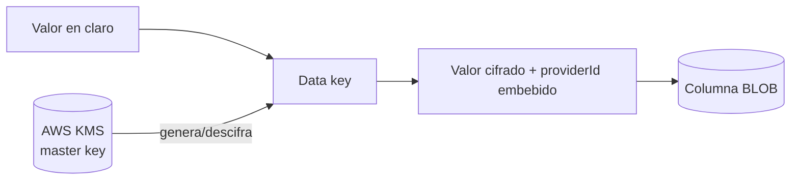

# Datos sensibles

Atlas es un backend KYC: nombre, correo, teléfono, documento de identidad, dirección y ubicación son **PII regulada**, no metadatos.

## El patrón de tres columnas

> [!info] Verificado
> Cada dato sensible de alta consulta se almacena **tres veces**, con propósitos distintos. En `customer.customers`:
>
> | Columna | Tipo | Para qué |
> |---|---|---|
> | `primary_phone_hash` | `STRING(128)` | Buscar por igualdad **sin descifrar** |
> | `primary_phone_encrypted` | `BLOB` | El valor real, cifrado con envelope encryption |
> | `primary_phone_last_4` | `STRING(4)` | Que un operador identifique el dato sin verlo entero |
>
> Lo mismo para el correo, más `primary_email_domain` (parte no identificatoria, útil para análisis).
>
> **Por qué importa:** buscar "¿existe un cliente con este teléfono?" no requiere descifrar toda la tabla. Y mostrar un listado a un operador no requiere descifrar nada. El descifrado queda para el momento en que hace falta el valor real, que es raro y auditable.

## Alcance

Clasificación por convención de nombre (`INFERIDO`, no hay etiquetado explícito por columna):

| Sufijo | Columnas | Significado |
|---|---:|---|
| `*_encrypted` | ver [[05-data/data-dictionary]] | PII cifrada |
| `*_hash` | ídem | PII hasheada para búsqueda |
| `*_last_4` / `*_last4` | ídem | Fragmento mostrable |
| `*_domain` | ídem | Derivado no identificatorio |

Además hay tablas cuyo contenido es sensible en bloque: `customer_identity_documents`, `identity_verification_attempts`, `evidence_documents`, `customer_addresses`, `address_gps_observations`, `ip_reputation_observations`, `device_snapshots`.

## Cifrado: envelope encryption

| Proveedor | Cuándo | Clave maestra |
|---|---|---|
| `KmsKeyProvider` | Si `KMS_KEY_ID` **y** `AWS_REGION` están definidos | Gestionada por AWS KMS |
| `local` | En caso contrario — default de dev/test | Derivada por SHA-256 de una variable de entorno |

> [!info] El `providerId` va embebido en cada valor
> Por eso se puede activar KMS sobre una base ya cifrada con `local`: los valores antiguos siguen descifrándose (el proveedor `local` sigue registrado) mientras los nuevos salen con KMS. La migración de los existentes es `yarn crypto:reencrypt-pii` (con `--dry-run` disponible).
>
> Activar KMS **no toca ningún call site**: `encryptSecretEnvelope(x)` toma el proveedor activo, que se fija una vez en el bootstrap de `main.ts` y `worker.ts`.

> [!danger] SEC-002 — producción sin KMS
> Sin `KMS_KEY_ID` + `AWS_REGION` en producción, la clave maestra se deriva de una variable de entorno: **comprometerla descifra toda la PII**. El código emite un aviso ruidoso pero **no bloquea el arranque**. Ver [[14-audits/risks-register]].

## PII fuera de la base de datos

| Camino | Control |
|---|---|
| Logs de aplicación | `redactSensitiveText` en el logger de archivo |
| Payloads persistidos (auditoría, telemetría) | `redactSensitiveObject` |
| Errores SQL | **El SQL nunca se registra** — Sequelize inlinea valores y filtraría PII al log |
| Respuestas HTTP | Mappers a DTO; ningún modelo Sequelize sale al transporte |
| Sincronía a MongoDB | Hereda la redacción del logger de origen |
| Documentos de evidencia | S3 + análisis antimalware previo |

> [!info] La prohibición de loguear SQL no es cosmética
> En un backend KYC, una consulta con valores inlineados lleva teléfonos, correos y números de documento en claro. Como el pipeline de logs se sincroniza a MongoDB, esa PII acabaría replicada en un segundo almacén con otro modelo de acceso. Por eso el filtro de excepciones registra el mensaje del driver y el SQLSTATE, pero nunca la consulta.

## Derechos del titular

`privacy.data_subject_requests` modela las solicitudes de acceso, rectificación y supresión. Las políticas viven en `privacy.retention_policies`, `privacy.data_classification_policies` y `privacy.sensitive_field_rules`; el job `apply_retention_policies` las ejecuta.

> [!warning] El borrado no es un `DELETE`
> Ninguna FK usa `ON DELETE CASCADE`, y las obligatorias son `RESTRICT`: borrar físicamente un cliente con historial es **imposible** por diseño. Atender una supresión exige un procedimiento explícito —borrado lógico, anonimización o purga dirigida—, no una sentencia. Ver [[05-data/retention-and-deletion]].

## Consentimiento

`privacy.customer_consents`, `consent_documents`, `consent_events` y `privacy_processing_purposes` registran para qué se autorizó tratar cada dato. `data_provider_requests.consent_id` ata cada consulta a un proveedor externo con el consentimiento que la ampara — trazabilidad de base legal por llamada.

## Qué NO se pudo verificar

`PENDIENTE`:

- Que la rotación de claves KMS esté configurada.
- Que no exista PII en claro en registros históricos anteriores a la introducción del cifrado.
- La efectividad real de las reglas de redacción (requiere inspeccionar logs de un entorno).

## Relaciones

- [[08-security/data-protection]] · [[05-data/retention-and-deletion]] · [[05-data/data-dictionary]] · [[08-security/security-overview]]
