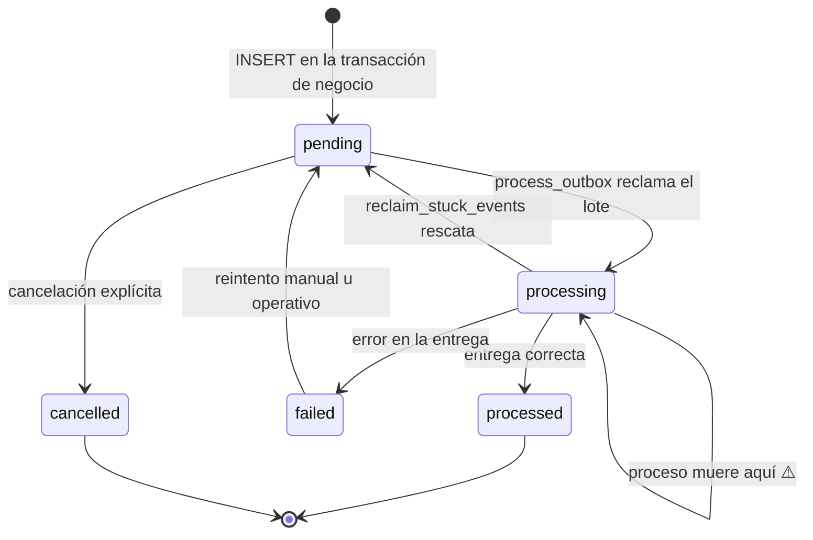

# Eventos y outbox

## Por qué no hay broker

Atlas no usa Kafka, RabbitMQ ni SQS. Los eventos de dominio se escriben en `platform_ops.outbox_events` **dentro de la misma transacción** que el cambio de negocio.

> [!info] Qué clase de fallo elimina
> Con un broker externo, entre `COMMIT` de la base de datos y `publish()` al broker hay una ventana: si el proceso muere ahí, el cambio quedó confirmado y el evento se perdió — sin rastro, sin reintento, sin forma de detectarlo. Es la pérdida silenciosa clásica.
>
> Con outbox transaccional, el evento **es** parte del cambio: o se confirman los dos o no se confirma ninguno. El coste es latencia de publicación (un intervalo de job) y carga adicional sobre PostgreSQL.
>
> Ver [[02-architecture/adr/0001-outbox-en-postgresql|ADR-0001]].

## Ciclo de vida

`OutboxEventStatus = 'pending' | 'processing' | 'processed' | 'failed' | 'cancelled'`.

> [!warning] El estado `processing` es el peligroso
> Si el proceso muere entre reclamar el lote y resolverlo, los eventos quedan en `processing` **indefinidamente**: ninguna consulta de reclamo mira ese estado, así que no los ve nadie.
>
> El job `reclaim_stuck_events` existe exactamente para eso — rescata los que llevan más de `RUNTIME_JOBS_STUCK_EVENT_MINUTES` en `processing`. El comentario del catálogo de jobs lo dice sin rodeos: *"sin este job esos eventos quedan en `processing` para siempre: ninguna consulta de reclamo los mira, así que se pierden en silencio"*.

## Dos caminos de emisión

| Camino | Quién emite | Cuándo |
|---|---|---|
| **Explícito** | El servicio de dominio, dentro de su transacción | Eventos de negocio (`kyc.approved`, `score.calculated`, …) |
| **Automático** | `ApiCommandOutboxInterceptor` | Todo comando HTTP que pase por la cadena de interceptores |

El interceptor va **después** de `IdempotencyInterceptor`: un *replay* de idempotencia no vuelve a emitir el evento del comando.

## Catálogo

92 tipos de evento en 9 familias, con prioridad declarada. El listado completo está en [[15-reference/events-catalog]].

| Familia | Eventos | Prioridad | Persistencia del agregado |
|---|---:|---|---|
| `user_security` | 10 | por defecto | ✅ |
| `kyc_legal` | 10 | 10 | ✅ |
| `notifications` | 12 | 10 | ✅ |
| `risk_scoring_fraud` | 11 | 20 | ✅ |
| `credit_line` | 9 | 20 | ⚠️ parcial — no hay tabla `credit_lines` |
| `merchant_settlement` | 15 | 20 | ❌ sin tablas |
| `purchase_downpayment` | 8 | 30 | ❌ sin tablas |
| `installments_collections` | 14 | 40 | ❌ sin tablas |
| `payments` | 3 | 40 | ❌ sin tablas |

> [!danger] 40 de 92 eventos no tienen dónde ocurrir
> Las familias de compras, cuotas, pagos y liquidación a comercios declaran agregados (`purchase`, `installment`, `payment`, `merchant`, `settlement`, `mdr_invoice`) que **no tienen tabla** en las 130 del esquema.
>
> Un consumidor que se suscriba a `installment.overdue` no recibirá nada hoy. El registro documenta la intención del producto, no la capacidad del sistema. Registrado como [[14-audits/contradictions|C-001]].

## Procesamiento

Dos jobs distintos, con intervalos independientes:

| Job | Intervalo | Qué hace |
|---|---|---|
| `process_outbox` | `RUNTIME_JOBS_OUTBOX_INTERVAL_MS` | Publica los eventos pendientes del outbox |
| `process_events` | `RUNTIME_JOBS_EVENTS_INTERVAL_MS` | Procesa los eventos ya publicados hacia sus consumidores |
| `reclaim_stuck_events` | `RUNTIME_JOBS_STUCK_EVENTS_INTERVAL_MS` | Rescata los atascados en `processing` |

El tamaño de lote es `RUNTIME_JOBS_BATCH_LIMIT` para todos.

## Garantías

| Propiedad | Garantía |
|---|---|
| Durabilidad | **Fuerte** — el evento se confirma con el cambio de negocio |
| Entrega | **Al menos una vez** — un fallo tras entregar y antes de marcar `processed` reentrega |
| Orden de **reclamo** | Determinista: `ORDER BY priority DESC NULLS LAST, available_at ASC NULLS FIRST, _id ASC` |
| Orden de **entrega** | **No garantizado** — ver abajo |
| Idempotencia del consumidor | **Obligatoria** — se deduce de la entrega "al menos una vez" |
| Latencia | Acotada por el intervalo del job, no por el instante de escritura |

> [!warning] Reclamo ordenado no significa entrega ordenada
> `CLAIM_PENDING_EVENTS_SQL` ordena por prioridad, disponibilidad e `_id`, y usa `FOR UPDATE SKIP LOCKED`. Dentro de un lote el orden es determinista — pero `SKIP LOCKED` existe precisamente para que **varios workers reclamen lotes distintos en paralelo**.
>
> Dos eventos del mismo agregado pueden caer en lotes diferentes y procesarse a la vez. **No construyas lógica que dependa de recibir `kyc.submitted` antes que `kyc.approved`.** La forma robusta es que el evento lleve el estado necesario, o que el consumidor consulte el estado actual.

La columna `priority` respeta las prioridades declaradas por familia en el registro de eventos: `kyc_legal` y `notifications` (10) se reclaman antes que `payments` o `installments_collections` (40).

## Relaciones

- [[07-async-processing/queues]] · [[07-async-processing/schedulers]] · [[07-async-processing/retry-and-dead-letter]] · [[07-async-processing/idempotency]]
- [[outbox_events]] · [[15-reference/events-catalog]]
