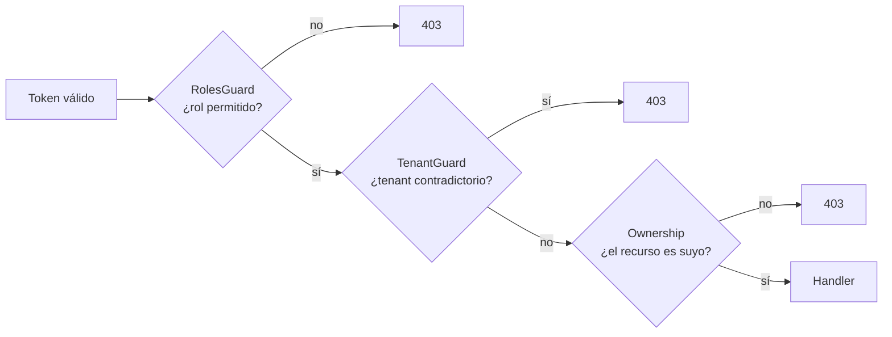

# Autorización

Atlas autoriza en **tres capas independientes**. Ninguna sustituye a las otras.

## Capa 1 — Rol (`RolesGuard`)

Compara el claim `role` del JWT contra la lista de `@Roles(...)` del handler o de la clase (`getAllAndOverride`: el del método gana).

> [!warning] Sin `@Roles`, cualquier autenticado pasa
> `RolesGuard` devuelve `true` cuando no hay metadatos de rol. Un endpoint con `JwtAuthGuard` pero **sin** `@Roles` queda abierto a los 13 roles, incluido `customer`. No es un fallo del guard: es el contrato por defecto que hay que tener presente al añadir rutas.

### Vocabulario de roles de token

13 valores en `ATLAS_USER_ROLES`: `customer`, `internal_operator`, `risk_analyst`, `compliance_analyst`, `fraud_analyst`, `system`, `system_admin`, `qa_engineer`, `devops`, `readonly_auditor`, `merchant`, `admin`, `platform_admin`.

> [!info] Por qué la lista está centralizada
> El comentario del código lo documenta: antes existía **tres veces** —el tipo, un `KNOWN_ROLES` en `jwt-auth.guard.ts` y otro en `auth-actor-resolver.service.ts`—, así que añadir un rol en un sitio y olvidarlo en otro dejaba *"un rol que el resolver acepta pero el guard rechaza (o al revés): una divergencia silenciosa entre quién puede iniciar sesión y qué token se acepta"*.
>
> Ahora el tipo y ambos conjuntos se derivan de la constante y no pueden desincronizarse.

## Capa 2 — Tenant (`TenantGuard`)

Cruza el header `x-tenant-id` con el `tenantId` del token.

> [!danger] Es un detector de contradicción, no un exigidor
> Devuelve `true` —deja pasar— en dos casos:
> - el token **no trae** `tenantId`;
> - el header está **ausente o vacío**.
>
> Solo lanza `403` cuando el header existe **y difiere** del token. El aislamiento real depende de que cada servicio filtre por `_tenant_id` en sus consultas.
>
> El gate `yarn check:tenant-header` vigila el uso de la cabecera contra `.tenant-header-baseline.json`. Que exista una línea base confirma que la cobertura no era completa cuando se creó. Registrado como [[14-audits/risks-register|SEC-001]].

## Capa 3 — Pertenencia del objeto (anti-BOLA)

La capa que impide que un cliente lea los datos de otro. Centralizada en `ownership.util.ts` (`assertOwnCustomerResource`).

Patrón real, de `CustomerSessionsController`:

> *"Un `customer` solo puede abrir sesiones para sí mismo (`assertOwnCustomerResource`); los roles internos pueden operar en nombre de cualquier cliente."*

Sin esta capa, `GET /customers/:customerId/...` con rol `customer` permitiría a cualquiera leer a cualquiera cambiando el id de la URL — el fallo de autorización más común en APIs REST (*Broken Object Level Authorization*).

> [!info] Por qué está centralizada
> Es una comprobación que hay que repetir en **cada** endpoint por id. Una función compartida convierte "acordarse de comprobarlo" en "llamar a la utilidad", y hace auditable de un vistazo quién la llama y quién no.

## RBAC interno: el segundo vocabulario

20 roles organizacionales (`InternalRoleCode`) persistidos en `iam.internal_roles`, con permisos en `iam.internal_permissions` y asignaciones en `iam.internal_user_roles` / `iam.internal_role_permissions`.

| Departamento | Roles |
|---|---|
| Sistemas | `SUPER_ADMIN`, `SYSTEMS_ADMIN`, `INTERNAL_IDENTITY_ADMIN` |
| Operaciones | `OPERATIONS_MANAGER`, `OPERATIONS_ANALYST` |
| Riesgo | `RISK_MANAGER`, `RISK_ANALYST`, `FRAUD_ANALYST` |
| Cumplimiento | `COMPLIANCE_MANAGER`, `COMPLIANCE_ANALYST` |
| Cobranza | `COLLECTIONS_MANAGER`, `COLLECTIONS_AGENT` |
| Finanzas / comercio | `FINANCE_MANAGER`, `MERCHANT_OPERATIONS` |
| Gobierno de datos | `DATA_GOVERNANCE_MANAGER`, `DATA_QUALITY_ANALYST` |
| Otros | `QA_ENGINEER`, `AUDITOR_READONLY`, `SUPPORT_AGENT`, `EXECUTIVE_READONLY` |

Cada uno declara un `legacyRoleCode` que lo mapea al vocabulario de token. El mapeo completo está en [[15-reference/permissions-matrix]].

> [!info] Dos vocabularios, dos propósitos
> El rol de **token** es grueso y estable: decide qué endpoints alcanzas. El rol **interno** es fino y organizacional: modela el puesto real y permite conceder o revocar sin reemitir tokens. Mezclarlos obligaría a reemitir el token de todo el equipo cada vez que alguien cambia de función.

## Roles de base de datos

Cuarta capa, fuera de la aplicación: el runtime usa una identidad PostgreSQL **sin privilegios de DDL**, distinta de la de migración. Ver [[05-data/schemas]].

## Cobertura observada

| Métrica | Valor |
|---|---|
| Rutas con `@Roles` explícito | 250 de 266 |
| Rutas públicas (`@Public`) | 16 |
| Rol con mayor alcance | Ver [[15-reference/permissions-matrix]] |

## Relaciones

- [[08-security/authentication]] · [[08-security/security-overview]] · [[04-api/authorization]] · [[15-reference/permissions-matrix]]
