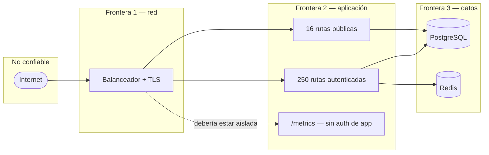

# Visión de seguridad

> [!warning] Esta nota no declara que Atlas sea seguro
> Documenta los **controles encontrados** y las **brechas visibles** por análisis estático. No sustituye una prueba de penetración ni una revisión con acceso a un entorno real.

## Controles presentes

| Área | Control | Evidencia |
|---|---|---|
| Autenticación | JWT HS256 con `issuer`/`audience` fijados; revocación por `tokenVersion`; cookie con prioridad sobre `Bearer` | `jwt-auth.guard.ts` |
| Contraseñas | `argon2` | `package.json` |
| Autorización | `RolesGuard` sobre `@Roles`; vocabulario de roles centralizado; ownership anti-BOLA (`assertOwnCustomerResource`) | `roles.guard.ts`, `ownership.util.ts` |
| Multi-tenant | `_tenant_id` en la mayoría de tablas; `TenantGuard` cruza header contra token; gate `check:tenant-header` | `tenant.guard.ts` |
| Validación | Zod en **todo** endpoint; el mismo esquema genera el contrato OpenAPI | `*.schemas.ts` |
| Inyección SQL | SQL crudo solo con `replacements` parametrizados y allowlist de columnas; Mongo con `escapeRegex` | regla del proyecto + `postgres-error.ts` |
| Rate limiting | Global + `@Throttle` estricto en auth; almacén Redis compartido entre instancias | `app.module.ts` |
| Cifrado de PII | Envelope encryption con KMS; patrón hash + cifrado + fragmento | `envelope-encryption.util.ts` |
| Cabeceras | `helmet()` | `main.ts:63` |
| CORS | Lista explícita, no comodín | `getAllowedCorsOrigins()` |
| Subida de archivos | Análisis antimalware antes de almacenar | `malware-scanner.service.ts` |
| Secretos | `.env` nunca versionado (gate `check:no-env-file`); defaults de dev bloqueados en producción por Zod | `env-cross-checks.ts` |
| Logs | `redactSensitiveObject` / `redactSensitiveText`; **el SQL nunca se registra** | `http-exception.filter.ts` |
| Auditoría | Log de acciones HTTP, auditoría operativa, `data_change_logs` | esquema `audit` |
| Privilegios de BD | Identidad de migración distinta de la de runtime | `DB_MIGRATION_USER` vs `DB_USER` |
| Contenedor | Corre como `USER node`, no root | `Dockerfile:89` |

## Brechas visibles

### `SEC-001` — `TenantGuard` no exige el tenant

`RIESGO` · Severidad media

`TenantGuard` devuelve `true` si el token **no trae `tenantId`** o si el header `x-tenant-id` está ausente. Solo lanza `403` cuando el header está presente **y contradice** al token.

Es un detector de contradicción, no un exigidor de tenant. El aislamiento real recae íntegramente en que cada servicio filtre por `_tenant_id` en sus consultas. El gate `yarn check:tenant-header` vigila el uso con una línea base, lo que confirma que la cobertura **no era completa** cuando se creó la línea base.

**Recomendación:** para las rutas por tenant, exigir el header y rechazar el token sin `tenantId`, en vez de dejar pasar.

### `SEC-002` — PII sin KMS en producción

`RIESGO` · Severidad alta

Si `KMS_KEY_ID` o `AWS_REGION` faltan en producción, la clave maestra de cifrado de PII se **deriva de una variable de entorno** (SHA-256). Comprometer esa variable descifra toda la PII almacenada.

`env.ts:44-50` emite un `console.warn` ruidoso pero **no bloquea el arranque**. El propio comentario lo reconoce como *"un despliegue legítimo en la etapa actual"* y remite al hallazgo S-M3 de la auditoría interna.

**Mitigación existente:** `yarn crypto:reencrypt-pii` migra los valores ya cifrados al proveedor KMS. El `providerId` va embebido en cada valor, así que conviven valores cifrados con `local` y con KMS sin romper el descifrado.

### `SEC-003` — 16 endpoints públicos

`INFORMATIVO` · Severidad baja si el rate limiting es correcto

16 rutas no exigen JWT, incluidas `POST /auth/login`, `/auth/login/pin`, `/auth/password-reset/request`, `/auth/password-reset/confirm`, `/auth/refresh`, `/auth/logout` y los health checks. Su protección depende del rate limiting y de la validación Zod.

Ver el detalle por ruta en [[15-reference/permissions-matrix]].

### `SEC-004` — `/metrics` sin autenticación de aplicación

`RIESGO` · Severidad media según la exposición de red

`/metrics` queda fuera del prefijo `/api/v1` y no pasa por `JwtAuthGuard`. Expone series con nombres de ruta, códigos de estado y latencias — información útil para un atacante que perfile el sistema.

La regla del proyecto ya lo contempla: *"endpoints de infra (`/metrics`) sin auth de app deben ir tras red aislada y `@SkipThrottle`"*. **Esa condición de red no se puede verificar desde el código.**

## Superficie de ataque

Detalle en [[08-security/threat-model]] y [[02-architecture/trust-boundaries]].

## Qué NO se pudo verificar

`PENDIENTE` — requiere entorno o herramientas fuera del análisis estático:

- Que `/metrics` esté efectivamente tras una red aislada.
- Que los secretos de producción no sean los defaults de desarrollo.
- Que TLS esté terminado correctamente y `DB_SSL` activo en producción.
- Vulnerabilidades de dependencias (`yarn audit --level high` no se ejecutó).
- Que la rotación de claves KMS esté configurada.

## Relaciones

- [[08-security/authentication]] · [[08-security/authorization]] · [[08-security/data-protection]] · [[08-security/threat-model]] · [[14-audits/risks-register]]
