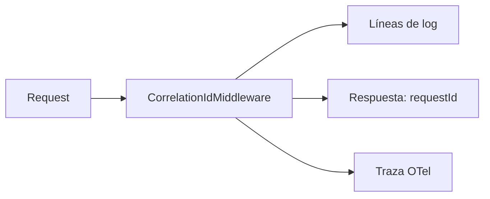

# Correlación de peticiones

## Un id, tres destinos

`CorrelationIdMiddleware` se aplica a `forRoutes('*')`: **ningún** request queda sin id.

| Destino | Campo |
|---|---|
| Respuesta HTTP | `requestId` en la envoltura `{ requestId, data, timestamp }` |
| Logs | En cada línea del request |
| Trazas | Atado al span cuando `OTEL_ENABLED=true` |

## Cómo se usa

**Ante un fallo reportado por un usuario:** pedir el `requestId` de la respuesta y buscarlo en los logs. Da el request exacto, no un rango horario.

**Ante un 500:** el log lleva el `requestId` **y** la causa real del driver (`buildInternalCause()`), que el cliente nunca vio.

**Entre procesos:** el id no cruza a los jobs del worker. Un evento del outbox procesado después no lleva el `correlationId` del request que lo originó salvo que se propague en el payload. `NO_CONFIRMADO` — no se verificó que se propague.

## Propagación desde el cliente

Si el cliente envía `x-correlation-id`, se respeta; si no, se genera. Permite atar una operación que atraviesa varios sistemas bajo un mismo identificador.

## Relaciones

- [[09-observability/logging]] · [[09-observability/tracing]] · [[04-api/conventions]]
