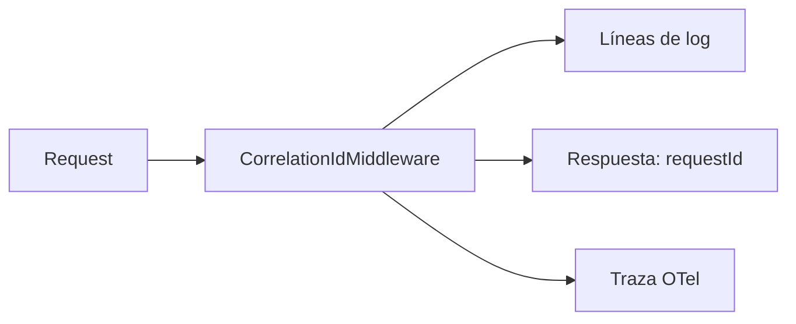

# Correlación de peticiones

## Un id, tres destinos

`CorrelationIdMiddleware` se aplica a `forRoutes('*')`: **ningún** request queda sin id.

| Destino | Campo |
|---|---|
| Respuesta HTTP | `requestId` en la envoltura `{ requestId, data, timestamp }` |
| Logs | En cada línea del request |
| Trazas | Atado al span cuando `OTEL_ENABLED=true` |

## Cómo se usa

**Ante un fallo reportado por un usuario:** pedir el `requestId` de la respuesta y buscarlo en los logs. Da el request exacto, no un rango horario.

**Ante un 500:** el log lleva el `requestId` **y** la causa real del driver (`buildInternalCause()`), que el cliente nunca vio.

**Entre procesos: sí cruza.**

> [!info] Verificado — el outbox conserva la correlación
> `platform_ops.outbox_events` tiene una columna dedicada `correlation_id` (`outbox-events.model.ts:71-72`), y `ApiCommandOutboxInterceptor` la rellena con `request.correlationId` al emitir (`outbox.interceptor.ts:52`).
>
> Consecuencia práctica: un evento procesado por el worker **minutos después** sigue atado al request HTTP que lo originó. Se puede recorrer la cadena completa —petición del cliente → cambio de negocio → evento → procesamiento en el worker— con un solo identificador, aunque cruce dos procesos y un intervalo de job.
>
> El módulo `events` además permite **filtrar por `correlationId`** en sus consultas de listado (`events.repository.ts`, `events.schemas.ts`), así que es una vía de diagnóstico de primera clase, no un dato enterrado.

## Propagación desde el cliente

Si el cliente envía `x-correlation-id`, se respeta; si no, se genera. Permite atar una operación que atraviesa varios sistemas bajo un mismo identificador.

## Relaciones

- [[09-observability/logging]] · [[09-observability/tracing]] · [[04-api/conventions]]
