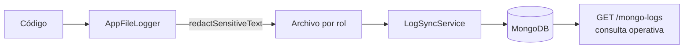

# Logs

## El pipeline

`AppFileLogger` sustituye al logger por defecto de Nest en ambos entrypoints. `bufferLogs` se activa fuera de desarrollo.

Volúmenes separados por rol: `atlas-api-logs` y `atlas-worker-logs`.

## Redacción de datos sensibles

| Camino | Mecanismo |
|---|---|
| Texto de log | `redactSensitiveText` |
| Payloads persistidos (auditoría, telemetría) | `redactSensitiveObject` |
| SQL | **Nunca se registra** |

> [!danger] Por qué el SQL está prohibido en el log
> Sequelize inlinea los valores en la consulta. En un backend KYC eso significa teléfonos, correos y números de documento **en claro** — y como el pipeline se sincroniza a MongoDB, esa PII acabaría replicada en un segundo almacén con otro modelo de acceso.
>
> El filtro de excepciones registra el mensaje del driver y el código SQLSTATE, que es lo que delata la causa, pero no la consulta. Al depurar, no esperes ver el SQL.

## Qué se registra siempre

| Evento | Dónde |
|---|---|
| Toda acción HTTP | `HttpActionLogInterceptor` — incluidos los *replays* de idempotencia |
| Errores 5xx con su causa real | `HttpExceptionFilter` → `buildInternalCause()` |
| `unhandledRejection` / `uncaughtException` | Handlers globales, con stack |
| Arranque y apagado | Bootstrap de ambos procesos |
| Ejecuciones de job | `system_job_runs` |

> [!info] Por qué existen los handlers globales de crash
> Sin ellos, Node imprime el stack a `stderr` **fuera de `AppFileLogger`**: no llegaría ni al archivo ni a MongoDB. El crash quedaría sin evidencia justo en el pipeline de logs propio. Con ellos, se registra con stack, se intenta un flush de trazas y se sale con código ≠ 0 para que el orquestador reinicie.

## Consulta operativa

`mongo-logs.controller.ts` expone la consulta de logs sincronizados. La entrada se escapa con `escapeRegex` para evitar inyección de operadores de Mongo.

Ver [[02-architecture/adr/0003-mongo-log-sync|ADR-0003]].

## Auditoría frente a logs

No es lo mismo y no comparten almacén:

| | Logs | Auditoría |
|---|---|---|
| Dónde | Archivo → MongoDB | PostgreSQL (`audit`, `platform_ops`) |
| Para qué | Depurar, operar | Responder "quién hizo qué y cuándo" |
| Retención | Del almacén de logs | Políticas de retención de datos |
| Transaccional | No | Sí |

## Relaciones

- [[09-observability/observability-overview]] · [[05-data/sensitive-data]] · [[04-api/error-model]]
