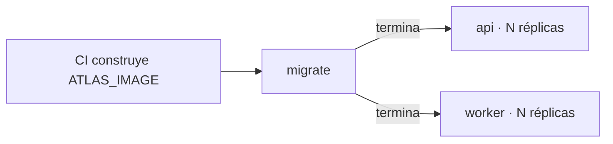

# Despliegue

## Secuencia



1. CI construye y publica la imagen.
2. `migrate` aplica las migraciones con la identidad **con DDL** y termina.
3. `api` y `worker` arrancan con la identidad de runtime, **sin DDL**.

`docker-compose.prod.yml` exige `ATLAS_IMAGE` explícitamente (`${ATLAS_IMAGE:?...}`): no arranca con una imagen local por accidente.

## Antes de desplegar

```bash
yarn type-check && yarn type-check:tests
yarn lint && yarn format:check
yarn test
yarn build
yarn check:migrations
yarn check:openapi
yarn check:no-env-file
```

Lista completa en [[11-quality/quality-gates]].

## Compatibilidad de migraciones

> [!warning] Las migraciones corren **antes** que el código nuevo
> Durante la ventana entre `migrate` y el arranque de las réplicas nuevas —y mientras conviven réplicas viejas y nuevas— el esquema nuevo debe ser compatible con el código **viejo**.
>
> Implica el patrón habitual en dos fases: añadir columna nullable → desplegar código que la escribe → hacerla `NOT NULL` en un despliegue posterior. Un `NOT NULL` sin default en el primer paso rompe las réplicas antiguas que aún insertan sin esa columna.

Verificar reversibilidad con `yarn check:migrations` y probar `up → down → up` en un entorno desechable.

## Configuración

Todo por variables de entorno. En producción Zod **exige** `REDIS_URL` y rechaza los secretos de ejemplo; una variable mal puesta impide el arranque. Ver [[10-operations/configuration]].

Revisar antes de escalar: **(réplicas × `DB_POOL_MAX`) ≤ `CONNECTION LIMIT` del rol `atlas_app_rw`**.

## Verificación posterior

```bash
curl -s http://<host>:3005/health          # versión y commit desplegados
curl -s http://<host>:3005/health/readiness
curl -s http://<host>:3006/health/readiness  # worker
```

Después, los smokes: `yarn smoke:core`, `yarn smoke:auth`, `yarn smoke:events`. Ver [[11-quality/testing-strategy]].

## Reversión

Ver [[10-operations/rollback]]. Regla corta: **revertir el código es seguro; revertir la migración no siempre lo es**.

## Comprobación de red pendiente

> [!warning] Verificar en el despliegue real
> `/metrics` (3005) y la sonda del worker (3006) **no** llevan autenticación de aplicación. Confirmar que no son alcanzables desde fuera y dejarlo documentado aquí. Ver [[14-audits/risks-register|SEC-004]].

## Relaciones

- [[02-architecture/deployment-topology]] · [[10-operations/rollback]] · [[10-operations/startup-shutdown]] · [[11-quality/quality-gates]]
