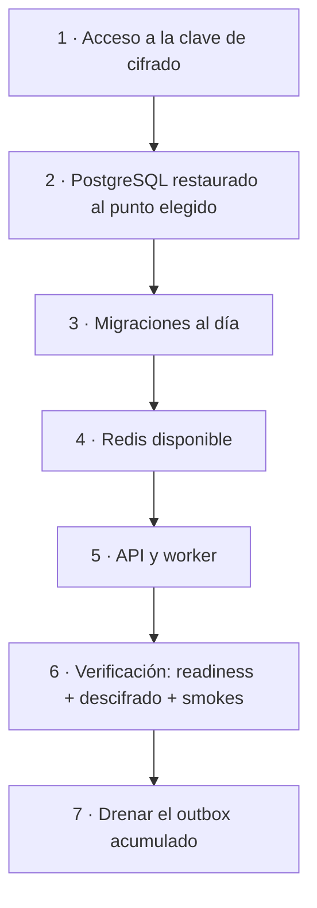

# Recuperación ante desastres

> [!warning] PROPUESTA
> No hay plan de recuperación en el repositorio. Esta nota separa lo que el código **sí** garantiza (verificado) de la política **recomendada** (propuesta, pendiente de aprobar e implementar).

## Lo que el código ya garantiza

`VERIFICADO`:

| Capacidad | Cómo |
|---|---|
| Reconstruir el esquema | 61 migraciones idempotentes (`yarn db:migration:up`) |
| Sembrar datos maestros | `yarn db:seed:prod`, idempotente y verificable |
| Reproducir el artefacto | Imagen determinista desde CI |
| Reanudar el trabajo pendiente | Los jobs retoman `pending`; `reclaim_stuck_events` rescata lo atascado |
| Saber qué versión corre | `GET /health` devuelve versión, commit y fecha de build |
| No arrancar mal configurado | 159 variables validadas con Zod + cross-checks de rol |

**Un despliegue vacío se reconstruye entero desde el repositorio.** Lo que no se reconstruye son los datos de negocio y la clave que los descifra.

## Puntos únicos de fallo

| Componente | Impacto | Mitigación en el código | Mitigación propuesta |
|---|---|---|---|
| PostgreSQL primario | **Total** — readiness 503 en todo el despliegue | Ninguna | Réplica en espera con promoción |
| **Clave maestra de PII** | **Total sobre la PII** — datos ilegibles | `providerId` embebido permite convivencia de proveedores | CMK replicada; nunca programar su borrado |
| Redis | Alto en producción — rate limit y liderazgo de jobs | `RUNTIME_JOBS_ALLOW_WITHOUT_LOCK: false` (fail-closed) | Instancia gestionada con conmutación |
| S3 | Medio — evidencia KYC | — | Versionado + replicación |

> [!info] Una degradación parcial no tumba el despliegue
> El readiness distingue a propósito entre dependencia obligatoria e informativa: si cae **la réplica de lectura**, se reporta pero **no** saca instancias del balanceador. Los caminos de escritura, auth y onboarding siguen sirviendo. Ver [[02-architecture/critical-sequences]].

## Orden de recuperación

`PROPUESTA` — derivado de las dependencias reales del arranque:

**La clave va primero, antes que la base.** Restaurar PostgreSQL sin poder descifrar produce un sistema que arranca, responde y devuelve PII ilegible — un fallo peor que no arrancar, porque parece que funciona.

## Escenarios

`PROPUESTA` — cada uno necesita su procedimiento probado:

| Escenario | Estrategia recomendada | RTO objetivo |
|---|---|---|
| Pérdida del primario de PostgreSQL | Promover réplica; si no hay, PITR desde la última base + WAL | 1 h |
| **Corrupción lógica** (despliegue defectuoso, borrado masivo) | PITR al instante **anterior** al daño | 1–2 h |
| Pérdida de Redis | Recrear instancia; el sistema se recupera solo | 15 min |
| Pérdida de la clave de cifrado | **No hay recuperación** si la CMK se destruyó | — |
| Pérdida de región | Restaurar en la región secundaria | 4 h |

> [!danger] El único escenario sin retorno
> Todos los demás se recuperan con tiempo. La destrucción de la clave maestra **no**: los datos siguen ahí, cifrados, y nadie puede leerlos. Por eso la política de la clave (nunca programar su borrado, replicarla, auditar quién puede tocarla) importa más que la frecuencia de las copias.
>
> AWS KMS exige una ventana de espera de 7–30 días antes de borrar una CMK precisamente por esto. Configurar la alerta sobre esa programación es barato y evita el único fallo irreversible del sistema.

## Comunicación durante el incidente

`PROPUESTA` — mínimos:

- Quién declara el desastre y quién autoriza la restauración.
- Dónde se comunica el estado.
- Registro de decisiones para el post-mortem.
- Si hubo exposición o pérdida de PII: qué obligación de notificación aplica y en qué plazo.

## Verificación

El simulacro mensual descrito en [[05-data/backups-and-restore]] es lo que convierte este plan en algo real. Sin él, es una intención.

## Qué falta decidir

- [ ] Aprobar RPO/RTO por escenario
- [ ] Decidir si hay región secundaria
- [ ] Definir la estrategia de la clave (replicación, custodia, alerta de borrado programado)
- [ ] Asignar responsable de declarar el desastre
- [ ] Ejecutar el primer simulacro y registrar el RTO real

## Relaciones

- [[05-data/backups-and-restore]] · [[10-operations/runbooks/index]] · [[02-architecture/architecture-risks]] · [[08-security/data-protection]]
