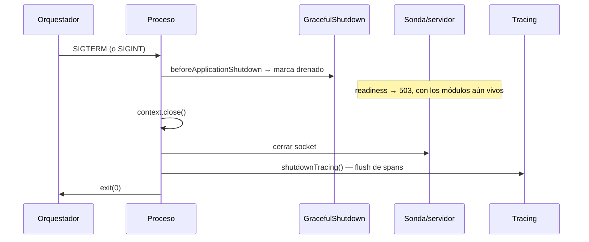

# Arranque y apagado

## Arranque

| Paso | Qué ocurre | Si falla |
|---|---|---|
| 1 | `import './observability/tracing-bootstrap.js'` — **antes** que cualquier módulo instrumentable | Sin instrumentación |
| 2 | `parseEnv()` valida 159 variables | **Lanza y no arranca**, con detalle por campo |
| 3 | Comprobación de `APP_ROLE` | `process.exit(1)` |
| 4 | Activación de KMS si `KMS_KEY_ID` + `AWS_REGION` | Cae al proveedor `local` (solo avisa) |
| 5 | `NestFactory.create()` / `createApplicationContext()` | Fallo de arranque |
| 6 | `enableShutdownHooks()` | — |
| 7 | `listen(APP_PORT)` / sonda en `WORKER_PROBE_PORT` | Puerto ocupado |

> [!info] Tres cosas fallan a propósito en el arranque
> Configuración inválida, rol equivocado y cookie mal configurada (`SameSite=none` sin `Secure`) **impiden arrancar**. Es preferible a un servicio que arranca y falla de forma intermitente horas después.

## Apagado

> [!info] El orden no es casual
> La sonda se cierra **después** del contexto: readiness debe dejar de responder 200 *mientras* los módulos siguen vivos, no después. Así el balanceador retira la instancia **antes** de que empiece a rechazar trabajo.

`SIGINT` se maneja además de `SIGTERM` para cubrir Ctrl-C en desarrollo y los orquestadores que lo envían.

## Requisitos del orquestador

| Requisito | Valor real | Por qué |
|---|---|---|
| Margen entre `SIGTERM` y `SIGKILL` | `api`: **45 s** · `worker`: **60 s** | Sin él, el drenado no sirve de nada |
| `tini` como PID 1 | Ya en el `Dockerfile` | Propaga señales y recoge zombies |
| Readiness antes de enviar tráfico | — | Evita mandar peticiones a una instancia que aún no puede servir |

> [!info] Verificado — `stop_grace_period` está dimensionado a propósito
> `docker-compose.prod.yml` lo justifica en el propio fichero:
>
> - **`api`: 45 s** — *"Debe superar `SHUTDOWN_DRAIN_MS`: si Docker matara el contenedor durante el drenado, drenar no serviría de nada y cada despliegue seguiría tirando peticiones."*
> - **`worker`: 60 s** — más holgado: *"una tanda de jobs en curso debe poder terminar. El planificador comprueba `stopped` entre tenants, así que aborta en el siguiente límite limpio."*
>
> Si cambias `SHUTDOWN_DRAIN_MS`, revisa ambos valores. Un margen menor que el drenado convierte el apagado ordenado en un `SIGKILL` con peticiones en vuelo.

## Cross-checks que impiden un despliegue mudo

> [!info] Verificado — dos combinaciones no arrancan
> `env-cross-checks.ts:89-111` rechaza las dos formas de quedarse sin trabajo de fondo sin enterarse:
>
> | Combinación | Por qué se rechaza |
> |---|---|
> | `APP_ROLE=worker` + planificador **apagado** | *"arranca sano y no ejecuta ningún trabajo de fondo"* |
> | `APP_ROLE=api` + planificador **encendido** | Haría *"creer que los jobs corren cuando el gate de rol los desactiva"* |
>
> El comentario resume el criterio: *"no funcionan a medias: fallan en silencio, que es peor"*. En producción, además, `RUNTIME_JOBS_ALLOW_WITHOUT_LOCK: 'false'` hace **fail-closed sin Redis** — con varias instancias no hay forma de impedir que procesen el mismo lote.

## Fallos asíncronos

`unhandledRejection` y `uncaughtException` se capturan en ambos procesos: se registra con stack **dentro** de `AppFileLogger` (si no, el stack iría a `stderr` y no llegaría ni al archivo ni a MongoDB), se intenta flush de trazas y se sale con código ≠ 0 para que el orquestador reinicie.

## Relaciones

- [[02-architecture/runtime-topology]] · [[10-operations/deployment]] · [[10-operations/runbooks/readiness-en-503]]
