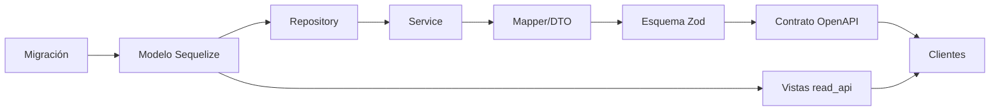

# Mapa de impacto de cambios

Qué se rompe si tocas cada cosa.

## Por artefacto

| Si cambias… | Impacta a | Verifica con |
|---|---|---|
| `src/common/types/auth.types.ts` (roles) | Guard, resolver de actor, **250 rutas** con `@Roles` | `yarn type-check`, `smoke:auth`, `smoke:internal-rbac` |
| `src/database/domain-schemas.ts` | Los 130 modelos y las migraciones | `yarn check:domain-schemas` |
| `CustomersService` / `CustomersRepository` | **12 de 27 módulos** | `yarn test`, smokes de cliente |
| Tabla `customers` | **35 tablas** con FK entrantes | `yarn check:migrations` |
| Tabla `tenants` | **59 referencias** | Todo |
| Cadena de interceptores (`app.module.ts`) | **Todas** las rutas | Suite completa + smokes |
| Un esquema Zod | Validación **y** contrato OpenAPI | `yarn check:openapi` |
| `scheduled-jobs.catalog.ts` | Trabajo de fondo | `smoke:runtime` |
| `env.schema.ts` | Arranque de ambos procesos | `yarn env:doctor`, `check:env-example` |
| Vistas `read_api` | Consumidores del modelo de lectura | `yarn check:read-api-views` |
| Un adaptador externo | Su dominio + gobierno de coste/consentimiento | `smoke:external-providers*` |

## Los nodos que concentran el riesgo

| Nodo | Alcance | Por qué |
|---|---:|---|
| [[tenants]] | 59 FK entrantes | Todo cuelga del tenant |
| [[customers]] | 35 FK entrantes | Núcleo del dominio |
| `CustomersModule` | 12 módulos | Exporta servicios **y** repositorio |
| `ATLAS_USER_ROLES` | 250 rutas | Fuente única del vocabulario de roles |
| Cadena de interceptores | 266 rutas | Toda petición pasa por ella |

## Efecto de un cambio de esquema

Un cambio de columna recorre las seis capas. El gate `check:openapi` detiene el que llegue al contrato sin declararse.

## Compatibilidad durante el despliegue

Durante la ventana entre `migrate` y el arranque de las réplicas nuevas conviven **esquema nuevo + código viejo**. Ver el patrón en dos fases en [[10-operations/deployment]].

## Relaciones

- [[13-change-impact/high-risk-components]] · [[13-change-impact/change-checklists]] · [[02-architecture/dependency-map]]
