<!-- Generado por scripts/processes/generate-process-docs.ts desde src/modules/workflow-catalog/definitions. No editar a mano. -->

# P-01 · Alta de cuenta: de la primera pantalla a la sesión iniciada

`account_signup_to_login` · v1 · prioridad **P0** · tipo `customer_journey` · dueño `OPERATIONS_MANAGER` · bloques `ATLAS_BACKEND`

Qué endpoints recorre un usuario para crearse una cuenta y quedar logueado: textos legales, alta, verificación de contacto, consentimientos y login (con su segundo factor y su recuperación de acceso).

## Por qué existe

Sin cuenta verificada y sesión no hay cliente: este proceso crea la identidad digital de la persona, verifica que el correo y el teléfono son suyos y le entrega una sesión segura con la que recorre todo lo demás.

## Quién lo inicia y quién lo cierra

Lo inicia el cliente al pulsar «Crear cuenta» en la app y lo cierra él mismo al iniciar sesión; el operador interno sólo interviene desde «Contactos pendientes» cuando la verificación no llega.

## Cuándo empieza y cuándo termina

Empieza con el registro (POST /customer-onboarding/start) y termina con una sesión válida (login + refresh) y el estado de alta leído al entrar; el código OTP se pide al abrir la pantalla, no con un botón.

## Qué pasa cuando falla

Un correo o teléfono sin verificar deja al cliente en `registered` y aparece en la cola de contactos pendientes del portal; el 409 VERIFICATION_RATE_LIMITED no es un error sino un código ya enviado, y el login con credenciales inválidas responde 401 sin revelar cuál falló.

## Qué indicador dice que va bien

Tasa de registros que verifican contacto en 24 h y tasa de 429 en login; la primera sale de customers + contact verifications, la segunda del limitador de acceso.

## Resultado

- **Éxito:** El cliente existe, tiene contacto verificado y una sesión iniciada con token vigente.
- **Fracaso:** El alta queda sin credenciales, sin contacto verificado o el login se bloquea por intentos.

## Dónde vive cada instancia

`ATLAS_BACKEND` · `customer.customers` · estado en `lifecycle_status` · abiertas: `registered`, `onboarding_in_progress`

## Etapas

```mermaid
flowchart LR
  signup_legal_preview["Textos legales vigentes"]
  signup_account_creation["Creación de la cuenta"]
  signup_credentials["Provisión de credenciales"]
  signup_contact_verification["Verificación de contacto"]
  signup_privacy_consents["Consentimientos de privacidad"]
  signup_first_login["Primera sesión iniciada"]
  signup_recovery["Recuperación de acceso"]
  signup_legal_preview --> signup_account_creation
  signup_account_creation --> signup_credentials
  signup_credentials --> signup_contact_verification
  signup_contact_verification --> signup_privacy_consents
  signup_privacy_consents --> signup_first_login
  signup_first_login --> signup_recovery
```

| Etapa | Nombre | Actor | Cliente | Pantalla | Pasos |
|---|---|---|---|---|---|
| `signup_legal_preview` | Textos legales vigentes | customer | CONSUMER_APP | **sin pantalla declarada** | 1 |
| `signup_phone_trust` | Confianza del teléfono (WhatsApp) | external_provider | BLOCK | — | 2 |
| `signup_account_creation` | Creación de la cuenta | customer | CONSUMER_APP | **sin pantalla declarada** | 1 |
| `signup_credentials` | Provisión de credenciales | internal_user | ADMIN_PORTAL | **sin pantalla declarada** | 1 |
| `signup_contact_verification` | Verificación de contacto | customer | CONSUMER_APP | **sin pantalla declarada** | 3 |
| `signup_privacy_consents` | Consentimientos de privacidad | customer | CONSUMER_APP | **sin pantalla declarada** | 1 |
| `signup_first_login` | Primera sesión iniciada | customer | CONSUMER_APP | **sin pantalla declarada** | 4 |
| `signup_recovery` | Recuperación de acceso | customer | CONSUMER_APP | **sin pantalla declarada** | 2 |

### Textos legales vigentes (`signup_legal_preview`)

La app muestra los términos y la política de privacidad ANTES de pedir un solo dato. Es público a propósito.

| Paso | Tipo | Bloque | Operación | Roles | Eventos |
|---|---|---|---|---|---|
| Consultar los documentos legales vigentes | http | ATLAS_BACKEND | `GET /consent-documents/active` | — | — |

### Confianza del teléfono (WhatsApp) (`signup_phone_trust`)

Verificación alternativa del teléfono con el proveedor externo. Opcional: refuerza la confianza del contacto.

| Paso | Tipo | Bloque | Operación | Roles | Eventos |
|---|---|---|---|---|---|
| Enviar el código por WhatsApp | http | ATLAS_BACKEND | `POST /whatsapp/verification/start` | customer, internal_operator, risk_analyst, admin, platform_admin | — |
| Confirmar el código de WhatsApp | http | ATLAS_BACKEND | `POST /whatsapp/verification/confirm` | customer, internal_operator, risk_analyst, admin, platform_admin | — |

### Creación de la cuenta (`signup_account_creation`)

Crea el cliente y su expediente de onboarding. A partir de aquí existe un customerId al que colgar todo lo demás.

| Paso | Tipo | Bloque | Operación | Roles | Eventos |
|---|---|---|---|---|---|
| Iniciar el alta | http | ATLAS_BACKEND | `POST /customer-onboarding/start` | — | — |

### Provisión de credenciales (`signup_credentials`)

Alta de la credencial de acceso. No la ejecuta el cliente: es una operación de administración.

| Paso | Tipo | Bloque | Operación | Roles | Eventos |
|---|---|---|---|---|---|
| Provisionar credenciales de acceso | http | ATLAS_BACKEND | `POST /auth/provision-credentials` | admin, platform_admin | — |

### Verificación de contacto (`signup_contact_verification`)

Registra correo y teléfono y comprueba que son del usuario con un código de un solo uso.

| Paso | Tipo | Bloque | Operación | Roles | Eventos |
|---|---|---|---|---|---|
| Registrar los medios de contacto | http | ATLAS_BACKEND | `POST /customer-onboarding/:customerId/contact-methods` | customer, internal_operator, risk_analyst, admin, platform_admin | — |
| Solicitar el código de verificación | http | ATLAS_BACKEND | `POST /customer-onboarding/:customerId/contact-verification/request` | customer, internal_operator, risk_analyst, admin, platform_admin | — |
| Enviar el código recibido | http | ATLAS_BACKEND | `POST /customer-onboarding/:customerId/contact-verification/submit` | customer, internal_operator, risk_analyst, admin, platform_admin | — |

### Consentimientos de privacidad (`signup_privacy_consents`)

Registra la aceptación de los documentos que se mostraron al principio. Sin esto el expediente queda bloqueado.

| Paso | Tipo | Bloque | Operación | Roles | Eventos |
|---|---|---|---|---|---|
| Registrar las decisiones de consentimiento | http | ATLAS_BACKEND | `POST /customers/:customerId/privacy/consent-decisions` | customer, internal_operator, compliance_analyst, admin, platform_admin | — |

### Primera sesión iniciada (`signup_first_login`)

El objetivo del recorrido: el usuario obtiene su token y la app confirma quién es.

| Paso | Tipo | Bloque | Operación | Roles | Eventos |
|---|---|---|---|---|---|
| Autenticarse con usuario y contraseña | http | ATLAS_BACKEND | `POST /auth/login` | — | — |
| Completar el segundo factor | http | ATLAS_BACKEND | `POST /auth/mfa` | — | — |
| Autenticarse con PIN | http | ATLAS_BACKEND | `POST /auth/login/pin` | — | — |
| Confirmar el actor autenticado | http | ATLAS_BACKEND | `GET /auth/me` | — | — |

### Recuperación de acceso (`signup_recovery`)

Rama de excepción: el usuario no logra entrar y restablece su contraseña antes de reintentar.

| Paso | Tipo | Bloque | Operación | Roles | Eventos |
|---|---|---|---|---|---|
| Pedir el restablecimiento de contraseña | http | ATLAS_BACKEND | `POST /auth/password-reset/request` | — | — |
| Confirmar la nueva contraseña | http | ATLAS_BACKEND | `POST /auth/password-reset/confirm` | — | — |

## Fuentes

- `src/database/seeders/demo/referencia.seed-data.ts`
