<!-- Generado por scripts/processes/generate-process-docs.ts desde src/modules/workflow-catalog/definitions. No editar a mano. -->

# P-23 · Ciclo contable: borrador → publicar → reversar, factura AR, recibo y cierre de período

`accounting_documents_cycle` · v1 · prioridad **P0** · tipo `back_office` · dueño `ERP:CFO` · bloques `ERP_BACKEND`, `DASHBOARDS`

Cómo un documento contable nace en borrador en el ERP, pasa (si lo exige) por la aprobación de alguien distinto de quien lo creó, se publica con huella SHA-256, se reversa sin tocar el original, y cómo la factura AR, el recibo y el cierre de período generan y bloquean sus propios asientos.

## Por qué existe

Cada venta, cobro y ajuste de Atlas tiene que terminar en un asiento de doble partida que cuadre, que no se pueda editar una vez publicado y que caiga en un período abierto; sin este ciclo no hay balance, ni resultado, ni cierre mensual que un auditor pueda aceptar.

## Quién lo inicia y quién lo cierra

Lo inicia el contable (rol ERP accountant, o admin/cfo) creando el borrador desde «Documentos contables» del ERP; lo cierra el CFO o un admin al cerrar el período. Si el borrador pide aprobación, decide un CFO o admin que NO sea quien lo creó (ATL-03, provisional hasta DEC-10).

## Cuándo empieza y cuándo termina

Empieza con un documento DRAFT (POST /accounting/documents) y termina con el documento POSTED y el período cerrado (POST /accounting/closings/periods/close), que emite el aviso accounting.period.closed al buzón de salida; un reverso deja el original REVERSED y un borrador rechazado queda sin publicar.

## Qué pasa cuando falla

Un asiento descuadrado se rechaza al crear (UNBALANCED_JOURNAL); sin período abierto que cubra la fecha responde ACCOUNTING_PERIOD_NOT_RESOLVED; publicar un borrador pendiente da 409 ACCOUNTING_DOCUMENT_APPROVAL_REQUIRED; el cierre con borradores o controles en rojo da PERIOD_CLOSE_CONTROLS_FAILED. Los eventos que el trabajador del buzón no entrega quedan como «muertos» para que Finanzas los reenvíe.

## Qué indicador dice que va bien

Borradores DRAFT con más de un día, asientos descuadrados y documentos publicados sin asiento (los mide el tablero de Contabilidad), días desde el fin del último período abierto, y eventos muertos en el buzón contable (GET /accounting/outbox/events/dead) en cero.

## Resultado

- **Éxito:** El documento queda POSTED con huella SHA-256, el período se cierra sin bloqueos y el evento contable sale del buzón.
- **Fracaso:** El borrador se rechaza (descuadre, período cerrado, aprobación pendiente o rechazada) o el cierre se bloquea por controles.

## Dónde vive cada instancia

`ERP_BACKEND` · `atlas_accounting.accounting_document` · estado en `status` · abiertas: `DRAFT`

## Etapas

```mermaid
flowchart LR
  accounting_draft["Crear el borrador"]
  accounting_approval["Aprobar o rechazar el borrador"]
  accounting_posting["Publicar el documento"]
  accounting_reversal["Reversar un documento publicado"]
  accounting_ar_invoice["Emitir la factura AR"]
  accounting_receipt["Registrar el recibo"]
  accounting_period_close["Cerrar el período"]
  accounting_outbox_delivery["Entregar los eventos contables"]
  accounting_outbox_operations["Vigilar y reenviar eventos muertos"]
  accounting_dashboards_reading["Leer los libros en el tablero de Contabilidad"]
  accounting_draft --> accounting_approval
  accounting_approval --> accounting_posting
  accounting_posting --> accounting_reversal
  accounting_reversal --> accounting_ar_invoice
  accounting_ar_invoice --> accounting_receipt
  accounting_receipt --> accounting_period_close
  accounting_period_close --> accounting_outbox_delivery
  accounting_outbox_delivery --> accounting_outbox_operations
  accounting_outbox_operations --> accounting_dashboards_reading
```

| Etapa | Nombre | Actor | Cliente | Pantalla | Pasos |
|---|---|---|---|---|---|
| `accounting_draft` | Crear el borrador | internal_user | ERP_PORTAL | `/operaciones/contabilidad/documentos/crear` | 4 |
| `accounting_approval` | Aprobar o rechazar el borrador | internal_user | ERP_PORTAL | **sin pantalla declarada** | 2 |
| `accounting_posting` | Publicar el documento | internal_user | ERP_PORTAL | `/operaciones/contabilidad/documentos` | 1 |
| `accounting_reversal` | Reversar un documento publicado | internal_user | ERP_PORTAL | `/operaciones/contabilidad/documentos` | 1 |
| `accounting_ar_invoice` | Emitir la factura AR | internal_user | ERP_PORTAL | `/operaciones/contabilidad/factura-ar` | 3 |
| `accounting_receipt` | Registrar el recibo | internal_user | ERP_PORTAL | `/operaciones/contabilidad/recibos/crear` | 2 |
| `accounting_period_close` | Cerrar el período | internal_user | ERP_PORTAL | `/operaciones/contabilidad/cierres` | 3 |
| `accounting_outbox_delivery` | Entregar los eventos contables | system | BLOCK | — | 1 |
| `accounting_outbox_operations` | Vigilar y reenviar eventos muertos | internal_user | ERP_PORTAL | **sin pantalla declarada** | 3 |
| `accounting_dashboards_reading` | Leer los libros en el tablero de Contabilidad | internal_user | DASHBOARDS_PORTAL | `/tableros/[slug]` | 4 |

### Crear el borrador (`accounting_draft`)

El contable registra el documento con sus líneas. El ERP deduce libro, período y cuentas cuando no se dan, exige doble partida y crea documento, asiento, líneas, auditoría y evento de salida en una transacción.

| Paso | Tipo | Bloque | Operación | Roles | Eventos |
|---|---|---|---|---|---|
| Crear el documento en borrador | http | ERP_BACKEND | `POST /accounting/documents` | admin, accountant, cfo | — |
| Crear borradores en lote | http | ERP_BACKEND | `POST /accounting/documents/bulk` | admin, accountant, cfo | — |
| Listar documentos contables | http | ERP_BACKEND | `GET /accounting/documents` | admin, accountant, cfo | — |
| Leer un documento | http | ERP_BACKEND | `GET /accounting/documents/:id` | admin, accountant, cfo | — |

### Aprobar o rechazar el borrador (`accounting_approval`)

Sólo para borradores creados con approvalStatus PENDING (ATL-03). Decide un CFO o admin distinto del creador; la carrera entre aprobar y rechazar la resuelve un UPDATE condicionado. Sin pantalla en el ERP.

| Paso | Tipo | Bloque | Operación | Roles | Eventos |
|---|---|---|---|---|---|
| Aprobar el borrador | http | ERP_BACKEND | `PATCH /accounting/documents/:id/approve` | admin, cfo | — |
| Rechazar el borrador | http | ERP_BACKEND | `PATCH /accounting/documents/:id/reject` | admin, cfo | — |

### Publicar el documento (`accounting_posting`)

Recalcula la cuadratura, valida período, libro, entidad y cuentas, calcula la huella SHA-256 y marca documento y asiento POSTED. Desde ahí los disparadores de la base bloquean la edición.

| Paso | Tipo | Bloque | Operación | Roles | Eventos |
|---|---|---|---|---|---|
| Publicar | http | ERP_BACKEND | `PATCH /accounting/documents/:id/post` | admin, accountant, cfo | — |

### Reversar un documento publicado (`accounting_reversal`)

Nunca se edita un asiento publicado: se crea un documento reverso con débitos y créditos invertidos, se publica y el original queda REVERSED apuntando a él. Un segundo reverso se rechaza.

| Paso | Tipo | Bloque | Operación | Roles | Eventos |
|---|---|---|---|---|---|
| Reversar | http | ERP_BACKEND | `POST /accounting/documents/:id/reverse` | admin, accountant, cfo | — |

### Emitir la factura AR (`accounting_ar_invoice`)

La factura a cobrar genera y publica su propio asiento en la misma transacción: debe CxC por el bruto, haber ingreso por el neto e IVA débito si aplica. La cuenta por cobrar y el IVA se deducen.

| Paso | Tipo | Bloque | Operación | Roles | Eventos |
|---|---|---|---|---|---|
| Emitir factura AR | http | ERP_BACKEND | `POST /accounting/billing/ar-invoices` | admin, accountant | — |
| Listar facturas AR | http | ERP_BACKEND | `GET /accounting/billing/ar-invoices` | admin, accountant | — |
| Leer una factura AR | http | ERP_BACKEND | `GET /accounting/billing/ar-invoices/:id` | admin, accountant | — |

### Registrar el recibo (`accounting_receipt`)

El cobro se asigna a facturas AR abiertas del mismo pagador; cada factura se bloquea, se rechaza la sobreasignación y se genera el asiento banco contra CxC. La factura pasa a PARTIALLY_PAID o PAID.

| Paso | Tipo | Bloque | Operación | Roles | Eventos |
|---|---|---|---|---|---|
| Registrar recibo | http | ERP_BACKEND | `POST /accounting/receipts` | admin, accountant, treasury | — |
| Listar recibos | http | ERP_BACKEND | `GET /accounting/receipts` | admin, accountant, treasury | — |

### Cerrar el período (`accounting_period_close`)

El CFO o un admin pide el cierre: se calculan los controles (sin borradores, entre otros), se crea el close_run con su informe, el período queda cerrado y sale accounting.period.closed. Reabrir exige motivo.

| Paso | Tipo | Bloque | Operación | Roles | Eventos |
|---|---|---|---|---|---|
| Ver los períodos | http | ERP_BACKEND | `GET /accounting/financial-structure/periods` | admin, cfo | — |
| Cerrar período | http | ERP_BACKEND | `POST /accounting/closings/periods/close` | admin, cfo | — |
| Reabrir período | http | ERP_BACKEND | `PATCH /accounting/closings/periods/reopen` | admin, cfo | — |

### Entregar los eventos contables (`accounting_outbox_delivery`)

Un trabajador separado del proceso web lee event_outbox sin publicar con FOR UPDATE SKIP LOCKED, los publica y marca published_at.

| Paso | Tipo | Bloque | Operación | Roles | Eventos |
|---|---|---|---|---|---|
| Trabajador del buzón contable | job | ERP_BACKEND | job `worker:outbox (src/workers/outbox/outbox.worker.ts)` | — | — |

### Vigilar y reenviar eventos muertos (`accounting_outbox_operations`)

Finanzas mira el estado del buzón y reenvía los eventos que agotaron reintentos. Sin pantalla en el ERP.

| Paso | Tipo | Bloque | Operación | Roles | Eventos |
|---|---|---|---|---|---|
| Estado del buzón | http | ERP_BACKEND | `GET /accounting/outbox/status` | ADMIN, CFO, FINANCE | — |
| Eventos muertos | http | ERP_BACKEND | `GET /accounting/outbox/events/dead` | ADMIN, CFO, FINANCE | — |
| Reenviar un evento | http | ERP_BACKEND | `POST /accounting/outbox/events/:eventKey/replay` | ADMIN, CFO, FINANCE | — |

### Leer los libros en el tablero de Contabilidad (`accounting_dashboards_reading`)

El tablero de Contabilidad lee el libro del ERP en sólo lectura: diario, mayor, balance, resultados y flujo de caja. No escribe nada en el ciclo; es donde se ven los descuadres.

| Paso | Tipo | Bloque | Operación | Roles | Eventos |
|---|---|---|---|---|---|
| Libro diario | http | DASHBOARDS | `GET /contabilidad/diario` | — | — |
| Libro mayor | http | DASHBOARDS | `GET /contabilidad/mayor` | — | — |
| Balance por grupo | http | DASHBOARDS | `GET /contabilidad/balance` | — | — |
| Estado de resultados | http | DASHBOARDS | `GET /contabilidad/resultados` | — | — |

## Fuentes

- `AtlasERPBackend/docs/architecture/flows.md (Flujos del módulo contable y flujos endurecidos)`
- `AtlasERPBackend/src/modules/accounting/documents/controllers/accounting-documents.controller.ts`
- `AtlasERPBackend/src/modules/accounting/documents/domain/document-approval.ts`
- `AtlasERPBackend/src/modules/accounting/closing/controllers/closing.controller.ts`
- `AtlasERPBackend/src/modules/accounting/receipts/controllers/receipts.controller.ts`
- `AtlasERPBackend/src/modules/accounting/billing/controllers/billing.controller.ts`
- `AtlasERPBackend/src/modules/accounting/outbox/outbox-operations.controller.ts`
- `AtlasERPBackend/src/database/models/accounting_document.model.ts`
- `AtlasERPFrontend/services/accountingService.ts`
- `AtlasDashboardsBackend/src/modules/contabilidad/contabilidad.controller.ts`
- `memoria atlas-erp-contabilidad-deduce`
- `memoria atlas-erp-plan-de-cuentas-cargado`
- `memoria atlas-plan-produccion-siete-repos (ATL-03, DEC-10)`
